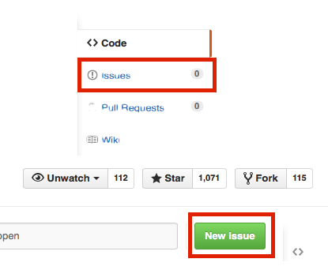

# How to Contribute

I would be very happy about any kind of contributions that help to improve and extend the functionality of mlxtend.

 
 

## Getting Started

- If you don't have a [GitHub](https://github.com) account yet, please create one to contribute to this project.
- Please submit a ticket for your issue to discuss the fix or new feature before too much time and effort is spent for the implementation.

- Fork the `mlxtend` repository from the GitHub web interface.

- Clone the `mlxtend` repository to your local machine
	- `git clone https://github.com/your_username/mlxtend.git`

 
 

## Making Changes

- Please avoid working directly on the master branch but create a new feature branch:
	- `git branch new_feature`
	- `git checkout new_feature`
- When you make changes, please provide meaningful `commit` messages:
	- `git add edited_file` 
	- `git commit -m 'my note'` 
- If it is a new feature, it would be nice (but not necessary) if you could update the documentation.
- Make an entry in the `CHANGELOG.md` file.
- Add tests to the `mlxtend/tests` directory.
- Run all tests (e.g., via `nosetests`  or `pytest`).
- Push your changes to a topic branch:
	- `git push -u origin my_feature`
- Submit a `pull request` from your forked repository via the GitHub web interface.

