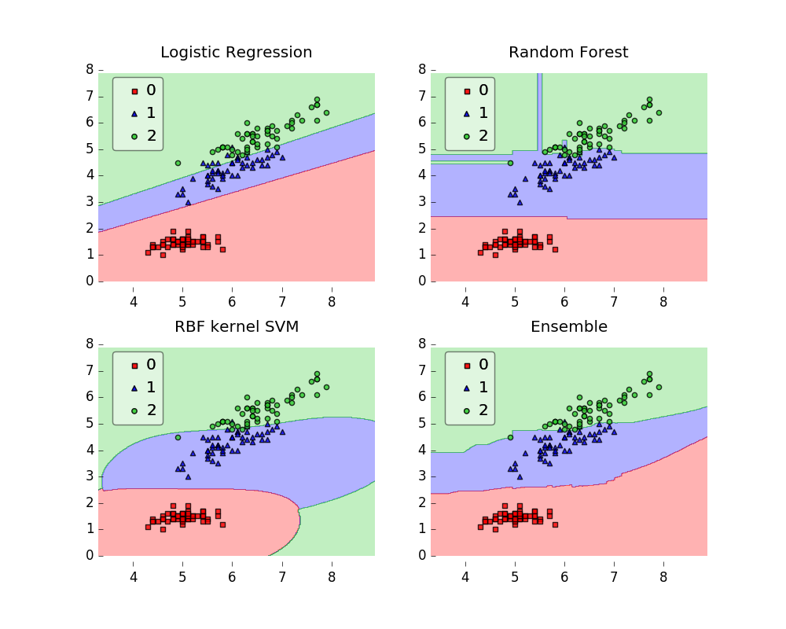

[](https://doi.org/10.21105/joss.00638)
[](https://travis-ci.org/rasbt/mlxtend)
[](https://ci.appveyor.com/project/rasbt/mlxtend/branch/master)
[](https://landscape.io/github/rasbt/mlxtend/master)
[](https://coveralls.io/github/rasbt/mlxtend?branch=master)


[](https://groups.google.com/forum/#!forum/mlxtend)


**Mlxtend (machine learning extensions) is a Python library of useful tools for the day-to-day data science tasks.**


<br>

Sebastian Raschka 2014-2019

<br>


## Links

- **Documentation:** [http://rasbt.github.io/mlxtend](http://rasbt.github.io/mlxtend)
- PyPI: [https://pypi.python.org/pypi/mlxtend](https://pypi.python.org/pypi/mlxtend)
- Changelog: [http://rasbt.github.io/mlxtend/CHANGELOG](http://rasbt.github.io/mlxtend/CHANGELOG)
- Contributing: [http://rasbt.github.io/mlxtend/CONTRIBUTING](http://rasbt.github.io/mlxtend/CONTRIBUTING)
- Questions? Check out the [Google Groups mailing list](https://groups.google.com/forum/#!forum/mlxtend)

<br>
<br>


## Installing mlxtend

#### PyPI

To install mlxtend, just execute  

```bash
pip install mlxtend  
```

Alternatively, you could download the package manually from the Python Package Index [https://pypi.python.org/pypi/mlxtend](https://pypi.python.org/pypi/mlxtend), unzip it, navigate into the package, and use the command:

```bash
python setup.py install
```

#### Conda
If you use conda, to install mlxtend just execute

```bash
conda install -c conda-forge mlxtend 
```

#### Dev Version

The mlxtend version on PyPI may always be one step behind; you can install the latest development version from the GitHub repository by executing

```bash
pip install git+git://github.com/rasbt/mlxtend.git#egg=mlxtend
```

Or, you can fork the GitHub repository from https://github.com/rasbt/mlxtend and install mlxtend from your local drive via

```bash
python setup.py install
```

<br>
<br>


## Examples

```python
import numpy as np
import matplotlib.pyplot as plt
import matplotlib.gridspec as gridspec
import itertools
from sklearn.linear_model import LogisticRegression
from sklearn.svm import SVC
from sklearn.ensemble import RandomForestClassifier
from mlxtend.classifier import EnsembleVoteClassifier
from mlxtend.data import iris_data
from mlxtend.plotting import plot_decision_regions

# Initializing Classifiers
clf1 = LogisticRegression(random_state=0)
clf2 = RandomForestClassifier(random_state=0)
clf3 = SVC(random_state=0, probability=True)
eclf = EnsembleVoteClassifier(clfs=[clf1, clf2, clf3], weights=[2, 1, 1], voting='soft')

# Loading some example data
X, y = iris_data()
X = X[:,[0, 2]]

# Plotting Decision Regions
gs = gridspec.GridSpec(2, 2)
fig = plt.figure(figsize=(10, 8))

for clf, lab, grd in zip([clf1, clf2, clf3, eclf],
                         ['Logistic Regression', 'Random Forest', 'RBF kernel SVM', 'Ensemble'],
                         itertools.product([0, 1], repeat=2)):
    clf.fit(X, y)
    ax = plt.subplot(gs[grd[0], grd[1]])
    fig = plot_decision_regions(X=X, y=y, clf=clf, legend=2)
    plt.title(lab)
plt.show()
```



---

If you use mlxtend as part of your workflow in a scientific publication, please consider citing the mlxtend repository with the following DOI:


```
@article{raschkas_2018_mlxtend,
  author       = {Sebastian Raschka},
  title        = {MLxtend: Providing machine learning and data science 
                  utilities and extensions to Python’s  
                  scientific computing stack},
  journal      = {The Journal of Open Source Software},
  volume       = {3},
  number       = {24},
  month        = apr,
  year         = 2018,
  publisher    = {The Open Journal},
  doi          = {10.21105/joss.00638},
  url          = {http://joss.theoj.org/papers/10.21105/joss.00638}
}
```

- Raschka, Sebastian (2018) MLxtend: Providing machine learning and data science utilities and extensions to Python's scientific computing stack.
J Open Source Softw 3(24).

---

## License

- This project is released under a permissive new BSD open source license ([LICENSE-BSD3.txt](https://github.com/rasbt/mlxtend/blob/master/LICENSE-BSD3.txt)) and commercially usable. There is no warranty; not even for merchantability or fitness for a particular purpose.
- In addition, you may use, copy, modify and redistribute all artistic creative works (figures and images) included in this distribution under the directory
according to the terms and conditions of the Creative Commons Attribution 4.0 International License.  See the file [LICENSE-CC-BY.txt](https://github.com/rasbt/mlxtend/blob/master/LICENSE-CC-BY.txt) for details. (Computer-generated graphics such as the plots produced by matplotlib fall under the BSD license mentioned above).

## Contact

I received a lot of feedback and questions about mlxtend recently, and I thought that it would be worthwhile to set up a public communication channel. Before you write an email with a question about mlxtend, please consider posting it here since it can also be useful to others! Please join the [Google Groups Mailing List](https://groups.google.com/forum/#!forum/mlxtend)!

If Google Groups is not for you, please feel free to write me an [email](mailto:mail@sebastianraschka.com) or consider filing an issue on [GitHub's issue tracker](https://github.com/rasbt/mlxtend/issues) for new feature requests or bug reports. In addition, I setup a [Gitter channel](https://gitter.im/rasbt/mlxtend?utm_source=badge&utm_medium=badge&utm_campaign=pr-badge&utm_content=badge) for live discussions.
