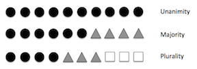
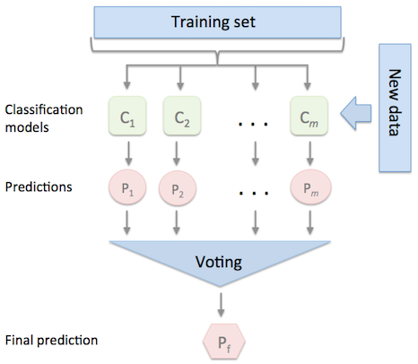

# EnsembleVoteClassifier

Implementation of a majority voting `EnsembleVoteClassifier` for classification.

> from mlxtend.classifier import EnsembleVoteClassifier

# Overview

The `EnsembleVoteClassifier` is a meta-classifier for combining similar or conceptually different machine learning classifiers for classification via majority or plurality voting. (For simplicity, we will refer to both majority and plurality voting as majority voting.)





The `EnsembleVoteClassifier` implements "hard" and "soft" voting. In hard voting, we predict the final class label as the class label that has been predicted most frequently by the classification models. In soft voting, we predict the class labels by averaging the class-probabilities (only recommended if the classifiers are well-calibrated).




**Note**

If you are interested in using the <code>EnsembleVoteClassifier</code>, please note that it is now also available through scikit learn (>0.17) as <a href="http://scikit-learn.org/stable/modules/generated/sklearn.ensemble.VotingClassifier.html"><code>VotingClassifier</code></a>.

### Majority Voting / Hard Voting

Hard voting is the simplest case of majority voting. Here, we predict the class label $\hat{y}$ via majority (plurality) voting of each classifier $C_j$:

$$\hat{y}=mode\{C_1(\mathbf{x}), C_2(\mathbf{x}), ..., C_m(\mathbf{x})\}$$


Assuming that we combine three classifiers that classify a training sample as follows:

- classifier 1 -> class 0
- classifier 2 -> class 0
- classifier 3 -> class 1

$$\hat{y}=mode\{0, 0, 1\} = 0$$

Via majority vote, we would we would classify the sample as "class 0."

### Weighted Majority Vote

In addition to the simple majority vote (hard voting) as described in the previous section, we can compute a weighted majority vote by associating a weight $w_j$ with classifier $C_j$:

$$\hat{y} = \arg \max_i \sum^{m}_{j=1} w_j \chi_A \big(C_j(\mathbf{x})=i\big),$$

where $\chi_A$ is the characteristic function $[C_j(\mathbf{x}) = i \; \in A]$, and $A$ is the set of unique class labels. 

Continuing with the example from the previous section

- classifier 1 -> class 0
- classifier 2 -> class 0
- classifier 3 -> class 1

assigning the weights \{0.2, 0.2, 0.6\} would yield a prediction $\hat{y} = 1$:

$$\arg \max_i [0.2 \times i_0 + 0.2 \times i_0 + 0.6 \times i_1] = 1$$

### Soft Voting

In soft voting, we predict the class labels based on the predicted probabilities $p$ for classifier -- this approach is only recommended if the classifiers are well-calibrated.

$$\hat{y} = \arg \max_i \sum^{m}_{j=1} w_j p_{ij},$$

where $w_j$ is the weight that can be assigned to the $j$th classifier.

Assuming the example in the previous section was a binary classification task with class labels $i \in \{0, 1\}$, our ensemble could make the following prediction:

- $C_1(\mathbf{x}) \rightarrow [0.9, 0.1]$
- $C_2(\mathbf{x}) \rightarrow [0.8, 0.2]$
- $C_3(\mathbf{x}) \rightarrow [0.4, 0.6]$

Using uniform weights, we compute the average probabilities:

$$p(i_0 \mid \mathbf{x}) = \frac{0.9 + 0.8 + 0.4}{3} = 0.7 \\\\
p(i_1 \mid \mathbf{x}) = \frac{0.1 + 0.2 + 0.6}{3} = 0.3$$

$$\hat{y} = \arg \max_i \big[p(i_0 \mid \mathbf{x}), p(i_1 \mid \mathbf{x}) \big] = 0$$

However, assigning the weights \{0.1, 0.1, 0.8\} would yield a prediction $\hat{y} = 1$:
    
$$p(i_0 \mid \mathbf{x}) = {0.1 \times 0.9 + 0.1 \times 0.8 + 0.8 \times  0.4} = 0.49 \\\\
p(i_1 \mid \mathbf{x}) = {0.1 \times 0.1 + 0.2 \times 0.1 + 0.8 \times 0.6} = 0.51$$

$$\hat{y} = \arg \max_i \big[p(i_0 \mid \mathbf{x}), p(i_1 \mid \mathbf{x}) \big] = 1$$

### References


- [1] S. Raschka. [Python Machine Learning](https://github.com/rasbt/python-machine-learning-book). Packt Publishing Ltd., 2015.

## Example 1 -  Classifying Iris Flowers Using Different Classification Models


```python
from sklearn import datasets

iris = datasets.load_iris()
X, y = iris.data[:, 1:3], iris.target
```


```python
from sklearn import model_selection
from sklearn.linear_model import LogisticRegression
from sklearn.naive_bayes import GaussianNB 
from sklearn.ensemble import RandomForestClassifier
import numpy as np

clf1 = LogisticRegression(random_state=1)
clf2 = RandomForestClassifier(random_state=1)
clf3 = GaussianNB()

print('5-fold cross validation:\n')

labels = ['Logistic Regression', 'Random Forest', 'Naive Bayes']

for clf, label in zip([clf1, clf2, clf3], labels):

    scores = model_selection.cross_val_score(clf, X, y, 
                                              cv=5, 
                                              scoring='accuracy')
    print("Accuracy: %0.2f (+/- %0.2f) [%s]"
          % (scores.mean(), scores.std(), label))
```

    5-fold cross validation:
    
    Accuracy: 0.90 (+/- 0.05) [Logistic Regression]
    Accuracy: 0.93 (+/- 0.05) [Random Forest]
    Accuracy: 0.91 (+/- 0.04) [Naive Bayes]


```python
from mlxtend.classifier import EnsembleVoteClassifier

eclf = EnsembleVoteClassifier(clfs=[clf1, clf2, clf3], weights=[1,1,1])

labels = ['Logistic Regression', 'Random Forest', 'Naive Bayes', 'Ensemble']
for clf, label in zip([clf1, clf2, clf3, eclf], labels):

    scores = model_selection.cross_val_score(clf, X, y, 
                                              cv=5, 
                                              scoring='accuracy')
    print("Accuracy: %0.2f (+/- %0.2f) [%s]" 
          % (scores.mean(), scores.std(), label))
```

    Accuracy: 0.90 (+/- 0.05) [Logistic Regression]
    Accuracy: 0.93 (+/- 0.05) [Random Forest]
    Accuracy: 0.91 (+/- 0.04) [Naive Bayes]
    Accuracy: 0.95 (+/- 0.05) [Ensemble]


#### Plotting Decision Regions


```python
import matplotlib.pyplot as plt
from mlxtend.plotting import plot_decision_regions
import matplotlib.gridspec as gridspec
import itertools

gs = gridspec.GridSpec(2, 2)

fig = plt.figure(figsize=(10,8))

labels = ['Logistic Regression', 'Random Forest', 'Naive Bayes', 'Ensemble']
for clf, lab, grd in zip([clf1, clf2, clf3, eclf],
                         labels,
                         itertools.product([0, 1], repeat=2)):

    clf.fit(X, y)
    ax = plt.subplot(gs[grd[0], grd[1]])
    fig = plot_decision_regions(X=X, y=y, clf=clf)
    plt.title(lab)
```


```python
import matplotlib.pyplot as plt
from mlxtend.plotting import plot_decision_regions
import matplotlib.gridspec as gridspec
import itertools

gs = gridspec.GridSpec(2, 2)

fig = plt.figure(figsize=(10,8))

labels = ['Logistic Regression', 'Random Forest', 'Naive Bayes', 'Ensemble']
for clf, lab, grd in zip([clf1, clf2, clf3, eclf],
                         labels,
                         itertools.product([0, 1], repeat=2)):

    clf.fit(X, y)
    ax = plt.subplot(gs[grd[0], grd[1]])
    fig = plot_decision_regions(X=X, y=y, clf=clf)
    plt.title(lab)
```


## Example 2 - Grid Search


```python
from sklearn import datasets

iris = datasets.load_iris()
X, y = iris.data[:, 1:3], iris.target
```


```python
from sklearn.model_selection import GridSearchCV
from sklearn.linear_model import LogisticRegression
from sklearn.naive_bayes import GaussianNB 
from sklearn.ensemble import RandomForestClassifier
from mlxtend.classifier import EnsembleVoteClassifier

clf1 = LogisticRegression(random_state=1)
clf2 = RandomForestClassifier(random_state=1)
clf3 = GaussianNB()
eclf = EnsembleVoteClassifier(clfs=[clf1, clf2, clf3], voting='soft')

params = {'logisticregression__C': [1.0, 100.0],
          'randomforestclassifier__n_estimators': [20, 200],}

grid = GridSearchCV(estimator=eclf, param_grid=params, cv=5)
grid.fit(iris.data, iris.target)
    
cv_keys = ('mean_test_score', 'std_test_score', 'params')

for r, _ in enumerate(grid.cv_results_['mean_test_score']):
    print("%0.3f +/- %0.2f %r"
          % (grid.cv_results_[cv_keys[0]][r],
             grid.cv_results_[cv_keys[1]][r] / 2.0,
             grid.cv_results_[cv_keys[2]][r]))
```

    0.953 +/- 0.01 {'logisticregression__C': 1.0, 'randomforestclassifier__n_estimators': 20}
    0.960 +/- 0.01 {'logisticregression__C': 1.0, 'randomforestclassifier__n_estimators': 200}
    0.960 +/- 0.01 {'logisticregression__C': 100.0, 'randomforestclassifier__n_estimators': 20}
    0.953 +/- 0.02 {'logisticregression__C': 100.0, 'randomforestclassifier__n_estimators': 200}


**Note**: If the `EnsembleClassifier` is initialized with multiple similar estimator objects, the estimator names are modified with consecutive integer indices, for example:


```python
clf1 = LogisticRegression(random_state=1)
clf2 = RandomForestClassifier(random_state=1)
eclf = EnsembleVoteClassifier(clfs=[clf1, clf1, clf2], 
                              voting='soft')

params = {'logisticregression-1__C': [1.0, 100.0],
          'logisticregression-2__C': [1.0, 100.0],
          'randomforestclassifier__n_estimators': [20, 200],}

grid = GridSearchCV(estimator=eclf, param_grid=params, cv=5)
grid = grid.fit(iris.data, iris.target)
```

**Note**

The `EnsembleVoteClass` also enables grid search over the `clfs` argument. However, due to the current implementation of `GridSearchCV` in scikit-learn, it is not possible to search over both, differenct classifiers and classifier parameters at the same time. For instance, while the following parameter dictionary works

    params = {'randomforestclassifier__n_estimators': [1, 100],
    'clfs': [(clf1, clf1, clf1), (clf2, clf3)]}
    
it will use the instance settings of `clf1`, `clf2`, and `clf3` and not overwrite it with the `'n_estimators'` settings from `'randomforestclassifier__n_estimators': [1, 100]`.

## Example 3 - Majority voting with classifiers trained on different feature subsets

Feature selection algorithms implemented in scikit-learn as well as the `SequentialFeatureSelector` implement a `transform` method that passes the reduced feature subset to the next item in a `Pipeline`.

For example, the method

    def transform(self, X):
        return X[:, self.k_feature_idx_]
        
returns the best feature columns, `k_feature_idx_`, given a dataset X.

Thus, we simply need to construct a `Pipeline` consisting of the feature selector and the classifier in order to select different feature subsets for different algorithms. During `fitting`, the optimal feature subsets are automatically determined via the `GridSearchCV` object, and by calling `predict`, the fitted feature selector in the pipeline only passes these columns along, which resulted in the best performance for the respective classifier.


```python
from sklearn import datasets

iris = datasets.load_iris()
X, y = iris.data[:, :], iris.target

from sklearn.model_selection import GridSearchCV
from sklearn.linear_model import LogisticRegression
from sklearn.naive_bayes import GaussianNB 
from sklearn.ensemble import RandomForestClassifier
from mlxtend.classifier import EnsembleVoteClassifier
from sklearn.pipeline import Pipeline
from mlxtend.feature_selection import SequentialFeatureSelector

clf1 = LogisticRegression(random_state=1)
clf2 = RandomForestClassifier(random_state=1)
clf3 = GaussianNB()

# Creating a feature-selection-classifier pipeline

sfs1 = SequentialFeatureSelector(clf1, 
                                 k_features=4,
                                 forward=True, 
                                 floating=False, 
                                 scoring='accuracy',
                                 verbose=0,
                                 cv=0)

clf1_pipe = Pipeline([('sfs', sfs1),
                      ('logreg', clf1)])

eclf = EnsembleVoteClassifier(clfs=[clf1_pipe, clf2, clf3], 
                              voting='soft')


params = {'pipeline__sfs__k_features': [1, 2, 3],
          'pipeline__logreg__C': [1.0, 100.0],
          'randomforestclassifier__n_estimators': [20, 200]}

grid = GridSearchCV(estimator=eclf, param_grid=params, cv=5)
grid.fit(iris.data, iris.target)


cv_keys = ('mean_test_score', 'std_test_score', 'params')

for r, _ in enumerate(grid.cv_results_['mean_test_score']):
    print("%0.3f +/- %0.2f %r"
          % (grid.cv_results_[cv_keys[0]][r],
             grid.cv_results_[cv_keys[1]][r] / 2.0,
             grid.cv_results_[cv_keys[2]][r]))
```

    0.953 +/- 0.01 {'pipeline__logreg__C': 1.0, 'pipeline__sfs__k_features': 1, 'randomforestclassifier__n_estimators': 20}
    0.947 +/- 0.02 {'pipeline__logreg__C': 1.0, 'pipeline__sfs__k_features': 1, 'randomforestclassifier__n_estimators': 200}
    0.953 +/- 0.01 {'pipeline__logreg__C': 1.0, 'pipeline__sfs__k_features': 2, 'randomforestclassifier__n_estimators': 20}
    0.947 +/- 0.02 {'pipeline__logreg__C': 1.0, 'pipeline__sfs__k_features': 2, 'randomforestclassifier__n_estimators': 200}
    0.953 +/- 0.01 {'pipeline__logreg__C': 1.0, 'pipeline__sfs__k_features': 3, 'randomforestclassifier__n_estimators': 20}
    0.953 +/- 0.02 {'pipeline__logreg__C': 1.0, 'pipeline__sfs__k_features': 3, 'randomforestclassifier__n_estimators': 200}
    0.947 +/- 0.02 {'pipeline__logreg__C': 100.0, 'pipeline__sfs__k_features': 1, 'randomforestclassifier__n_estimators': 20}
    0.953 +/- 0.02 {'pipeline__logreg__C': 100.0, 'pipeline__sfs__k_features': 1, 'randomforestclassifier__n_estimators': 200}
    0.947 +/- 0.02 {'pipeline__logreg__C': 100.0, 'pipeline__sfs__k_features': 2, 'randomforestclassifier__n_estimators': 20}
    0.947 +/- 0.02 {'pipeline__logreg__C': 100.0, 'pipeline__sfs__k_features': 2, 'randomforestclassifier__n_estimators': 200}
    0.960 +/- 0.01 {'pipeline__logreg__C': 100.0, 'pipeline__sfs__k_features': 3, 'randomforestclassifier__n_estimators': 20}
    0.953 +/- 0.02 {'pipeline__logreg__C': 100.0, 'pipeline__sfs__k_features': 3, 'randomforestclassifier__n_estimators': 200}


The best parameters determined via GridSearch are:


```python
grid.best_params_
```


    {'pipeline__logreg__C': 100.0,
     'pipeline__sfs__k_features': 3,
     'randomforestclassifier__n_estimators': 20}


Now, we assign these parameters to the ensemble voting classifier, fit the models on the complete training set, and perform a prediction on 3 samples from the Iris dataset.


```python
eclf = eclf.set_params(**grid.best_params_)
eclf.fit(X, y).predict(X[[1, 51, 149]])
```


    array([0, 1, 2])


#### Manual Approach

Alternatively, we can select different columns "manually" using the `ColumnSelector` object. In this example, we select only the first (sepal length) and third (petal length) column for the logistic regression classifier (`clf1`).


```python
from mlxtend.feature_selection import ColumnSelector


col_sel = ColumnSelector(cols=[0, 2])

clf1_pipe = Pipeline([('sel', col_sel),
                      ('logreg', clf1)])

eclf = EnsembleVoteClassifier(clfs=[clf1_pipe, clf2, clf3],
                              voting='soft')
eclf.fit(X, y).predict(X[[1, 51, 149]])
```


    array([0, 1, 2])


Furthermore, we can fit the `SequentialFeatureSelector` separately, outside the grid search hyperparameter optimization pipeline. Here, we determine the best features first, and then we construct a pipeline using these "fixed," best features as seed for the `ColumnSelector`:


```python
sfs1 = SequentialFeatureSelector(clf1, 
                                 k_features=2,
                                 forward=True, 
                                 floating=False, 
                                 scoring='accuracy',
                                 verbose=1,
                                 cv=0)

sfs1.fit(X, y)

print('Best features', sfs1.k_feature_idx_)

col_sel = ColumnSelector(cols=sfs1.k_feature_idx_)

clf1_pipe = Pipeline([('sel', col_sel),
                      ('logreg', clf1)])
```

    [Parallel(n_jobs=1)]: Done   4 out of   4 | elapsed:    0.0s finished
    Features: 1/2[Parallel(n_jobs=1)]: Done   3 out of   3 | elapsed:    0.0s finished
    Features: 2/2

    Best features (0, 2)


```python
eclf = EnsembleVoteClassifier(clfs=[clf1_pipe, clf2, clf3], 
                              voting='soft')
eclf.fit(X, y).predict(X[[1, 51, 149]])
```


    array([0, 1, 2])


## Example 5 - Using Pre-fitted Classifiers


```python
from sklearn import datasets

iris = datasets.load_iris()
X, y = iris.data[:, 1:3], iris.target
```

Assume that we previously fitted our classifiers:


```python
from sklearn import model_selection
from sklearn.linear_model import LogisticRegression
from sklearn.naive_bayes import GaussianNB 
from sklearn.ensemble import RandomForestClassifier
import numpy as np

clf1 = LogisticRegression(random_state=1)
clf2 = RandomForestClassifier(random_state=1)
clf3 = GaussianNB()

for clf in (clf1, clf2, clf3):
    clf.fit(X, y)
```

By setting `refit=False`, the `EnsembleVoteClassifier` will not re-fit these classifers to save computational time:


```python
from mlxtend.classifier import EnsembleVoteClassifier
import copy
eclf = EnsembleVoteClassifier(clfs=[clf1, clf2, clf3], weights=[1,1,1], refit=False)

labels = ['Logistic Regression', 'Random Forest', 'Naive Bayes', 'Ensemble']

eclf.fit(X, y)

print('accuracy:', np.mean(y == eclf.predict(X)))
```

    accuracy: 0.973333333333


However, please note that `refit=False` is incompatible to any form of cross-validation that is done in e.g., `model_selection.cross_val_score` or `model_selection.GridSearchCV`, etc., since it would require the classifiers to be refit to the training folds. Thus, only use `refit=False` if you want to make a prediction directly without cross-validation.

## Example 6 - Ensembles of Classifiers that Operate on Different Feature Subsets

If desired, the different classifiers can be fit to different subsets of features in the training dataset. The following example illustrates how this can be done on a technical level using scikit-learn pipelines and the `ColumnSelector`:


```python
from sklearn.datasets import load_iris
from mlxtend.classifier import EnsembleVoteClassifier
from mlxtend.feature_selection import ColumnSelector
from sklearn.pipeline import make_pipeline
from sklearn.linear_model import LogisticRegression

iris = load_iris()
X = iris.data
y = iris.target

pipe1 = make_pipeline(ColumnSelector(cols=(0, 2)),
                      LogisticRegression())
pipe2 = make_pipeline(ColumnSelector(cols=(1, 2, 3)),
                      LogisticRegression())

eclf = EnsembleVoteClassifier(clfs=[pipe1, pipe2])

eclf.fit(X, y)
```


    EnsembleVoteClassifier(clfs=[Pipeline(memory=None,
         steps=[('columnselector', ColumnSelector(cols=(0, 2), drop_axis=False)), ('logisticregression', LogisticRegression(C=1.0, class_weight=None, dual=False, fit_intercept=True,
              intercept_scaling=1, max_iter=100, multi_class='ovr', n_jobs=1,
              penalty='l...='l2', random_state=None, solver='liblinear', tol=0.0001,
              verbose=0, warm_start=False))])],
                refit=True, verbose=0, voting='hard', weights=None)


## Example 7 - A Note about Scikit-Learn SVMs and Soft Voting

This section provides some additional technical insights in how probabilities are used when `voting='soft'`. 


Note that scikit-learn estimates the probabilities for SVMs (more info here: http://scikit-learn.org/stable/modules/svm.html#scores-probabilities) in a way that these may not be consistent with the class labels that the SVM predicts. This is an extreme example, but let's say we have a dataset with 3 class labels, 0, 1, and 2. For a given training example, the SVM classifier may predict class 2. However, the class-membership probabilities may look as follows:

- class 0: 99%
- class 1: 0.5%
- class 2: 0.5%

A practical example of this scenario is shown below:


```python
import numpy as np
from mlxtend.classifier import EnsembleVoteClassifier
from sklearn.svm import SVC
from sklearn.datasets import load_iris

iris = load_iris()
X, y = iris.data, iris.target

clf2 = SVC(probability=True, random_state=4)
clf2.fit(X, y)
eclf = EnsembleVoteClassifier(clfs=[clf2], voting='soft', refit=False)
eclf.fit(X, y)

for svm_class, e_class, svm_prob, e_prob, in zip(clf2.predict(X),
                                                 eclf.predict(X),
                                                 clf2.predict_proba(X),
                                                 eclf.predict_proba(X)):
    if svm_class != e_class:
        print('============')
        print('Probas from SVM            :', svm_prob)
        print('Class from SVM             :', svm_class)
        print('Probas from SVM in Ensemble:', e_prob)
        print('Class from SVM in Ensemble :', e_class)
        print('============')
```

    ============
    Probas from SVM            : [ 0.01192489  0.47662663  0.51144848]
    Class from SVM             : 1
    Probas from SVM in Ensemble: [ 0.01192489  0.47662663  0.51144848]
    Class from SVM in Ensemble : 2
    ============


Based on the probabilities, we would expect the SVM to predict class 2, because it has the highest probability. Since the `EnsembleVoteClassifier` uses the `argmax` function internally if `voting='soft'`, it would indeed predict class 2 in this case even if the ensemble consists of only one SVM model.

Note that in practice, this minor technical detail does not need to concern you, but it is useful to keep it in mind in case you are wondering about results from a 1-model SVM ensemble compared to that SVM alone -- this is not a bug.

# API


*EnsembleVoteClassifier(clfs, voting='hard', weights=None, verbose=0, refit=True)*

Soft Voting/Majority Rule classifier for scikit-learn estimators.

**Parameters**

- `clfs` : array-like, shape = [n_classifiers]

    A list of classifiers.
    Invoking the `fit` method on the `VotingClassifier` will fit clones
    of those original classifiers that will
    be stored in the class attribute
    `self.clfs_` if `refit=True` (default).

- `voting` : str, {'hard', 'soft'} (default='hard')

    If 'hard', uses predicted class labels for majority rule voting.
    Else if 'soft', predicts the class label based on the argmax of
    the sums of the predicted probalities, which is recommended for
    an ensemble of well-calibrated classifiers.

- `weights` : array-like, shape = [n_classifiers], optional (default=`None`)

    Sequence of weights (`float` or `int`) to weight the occurances of
    predicted class labels (`hard` voting) or class probabilities
    before averaging (`soft` voting). Uses uniform weights if `None`.

- `verbose` : int, optional (default=0)

    Controls the verbosity of the building process.
    - `verbose=0` (default): Prints nothing
    - `verbose=1`: Prints the number & name of the clf being fitted
    - `verbose=2`: Prints info about the parameters of the clf being fitted
    - `verbose>2`: Changes `verbose` param of the underlying clf to
    self.verbose - 2

- `refit` : bool (default: True)

    Refits classifiers in `clfs` if True; uses references to the `clfs`,
    otherwise (assumes that the classifiers were already fit).
    Note: refit=False is incompatible to mist scikit-learn wrappers!
    For instance, if any form of cross-validation is performed
    this would require the re-fitting classifiers to training folds, which
    would raise a NotFitterError if refit=False.
    (New in mlxtend v0.6.)

**Attributes**

- `classes_` : array-like, shape = [n_predictions]


- `clf` : array-like, shape = [n_predictions]

    The unmodified input classifiers

- `clf_` : array-like, shape = [n_predictions]

    Fitted clones of the input classifiers

**Examples**

    >>> import numpy as np
    >>> from sklearn.linear_model import LogisticRegression
    >>> from sklearn.naive_bayes import GaussianNB
    >>> from sklearn.ensemble import RandomForestClassifier
    >>> from mlxtend.sklearn import EnsembleVoteClassifier
    >>> clf1 = LogisticRegression(random_seed=1)
    >>> clf2 = RandomForestClassifier(random_seed=1)
    >>> clf3 = GaussianNB()
    >>> X = np.array([[-1, -1], [-2, -1], [-3, -2], [1, 1], [2, 1], [3, 2]])
    >>> y = np.array([1, 1, 1, 2, 2, 2])
    >>> eclf1 = EnsembleVoteClassifier(clfs=[clf1, clf2, clf3],
    ... voting='hard', verbose=1)
    >>> eclf1 = eclf1.fit(X, y)
    >>> print(eclf1.predict(X))
    [1 1 1 2 2 2]
    >>> eclf2 = EnsembleVoteClassifier(clfs=[clf1, clf2, clf3], voting='soft')
    >>> eclf2 = eclf2.fit(X, y)
    >>> print(eclf2.predict(X))
    [1 1 1 2 2 2]
    >>> eclf3 = EnsembleVoteClassifier(clfs=[clf1, clf2, clf3],
    ...                          voting='soft', weights=[2,1,1])
    >>> eclf3 = eclf3.fit(X, y)
    >>> print(eclf3.predict(X))
    [1 1 1 2 2 2]
    >>>

For more usage examples, please see
[http://rasbt.github.io/mlxtend/user_guide/classifier/EnsembleVoteClassifier/](http://rasbt.github.io/mlxtend/user_guide/classifier/EnsembleVoteClassifier/)

### Methods

<hr>

*fit(X, y, sample_weight=None)*

Learn weight coefficients from training data for each classifier.

**Parameters**

- `X` : {array-like, sparse matrix}, shape = [n_samples, n_features]

    Training vectors, where n_samples is the number of samples and
    n_features is the number of features.


- `y` : array-like, shape = [n_samples]

    Target values.


- `sample_weight` : array-like, shape = [n_samples], optional

    Sample weights passed as sample_weights to each regressor
    in the regressors list as well as the meta_regressor.
    Raises error if some regressor does not support
    sample_weight in the fit() method.

**Returns**

- `self` : object


<hr>

*fit_transform(X, y=None, **fit_params)*

Fit to data, then transform it.

Fits transformer to X and y with optional parameters fit_params
and returns a transformed version of X.

**Parameters**

- `X` : numpy array of shape [n_samples, n_features]

    Training set.


- `y` : numpy array of shape [n_samples]

    Target values.

**Returns**

- `X_new` : numpy array of shape [n_samples, n_features_new]

    Transformed array.

<hr>

*get_params(deep=True)*

Return estimator parameter names for GridSearch support.

<hr>

*predict(X)*

Predict class labels for X.

**Parameters**

- `X` : {array-like, sparse matrix}, shape = [n_samples, n_features]

    Training vectors, where n_samples is the number of samples and
    n_features is the number of features.

**Returns**

- `maj` : array-like, shape = [n_samples]

    Predicted class labels.

<hr>

*predict_proba(X)*

Predict class probabilities for X.

**Parameters**

- `X` : {array-like, sparse matrix}, shape = [n_samples, n_features]

    Training vectors, where n_samples is the number of samples and
    n_features is the number of features.

**Returns**

- `avg` : array-like, shape = [n_samples, n_classes]

    Weighted average probability for each class per sample.

<hr>

*score(X, y, sample_weight=None)*

Returns the mean accuracy on the given test data and labels.

In multi-label classification, this is the subset accuracy
which is a harsh metric since you require for each sample that
each label set be correctly predicted.

**Parameters**

- `X` : array-like, shape = (n_samples, n_features)

    Test samples.


- `y` : array-like, shape = (n_samples) or (n_samples, n_outputs)

    True labels for X.


- `sample_weight` : array-like, shape = [n_samples], optional

    Sample weights.

**Returns**

- `score` : float

    Mean accuracy of self.predict(X) wrt. y.

<hr>

*set_params(**params)*

Set the parameters of this estimator.

The method works on simple estimators as well as on nested objects
(such as pipelines). The latter have parameters of the form
``<component>__<parameter>`` so that it's possible to update each
component of a nested object.

**Returns**

self

<hr>

*transform(X)*

Return class labels or probabilities for X for each estimator.

**Parameters**

- `X` : {array-like, sparse matrix}, shape = [n_samples, n_features]

    Training vectors, where n_samples is the number of samples and
    n_features is the number of features.

**Returns**

- `If `voting='soft'`` : array-like = [n_classifiers, n_samples, n_classes]

    Class probabilties calculated by each classifier.

- `If `voting='hard'`` : array-like = [n_classifiers, n_samples]

    Class labels predicted by each classifier.


