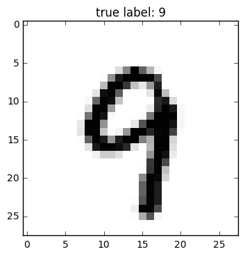

# Neural Network - Multilayer Perceptron

Implementation of a multilayer perceptron, a feedforward artificial neural network.

> from mlxtend.classifier import MultiLayerPerceptron

## Overview

*Although the code is fully working and can be used for common classification tasks, this implementation is not geared towards efficiency but clarity – the original code was written for demonstration purposes.*

### Basic Architecture

  

The neurons $x_0$ and $a_0$ represent the bias units ($x_0=1$, $a_0=1$). 

The $i$th superscript denotes the $i$th layer, and the *j*th subscripts stands for the index of the respective unit. For example, $a_{1}^{(2)}$ refers to the first activation unit **after** the bias unit (i.e., 2nd activation unit) in the 2nd layer (here: the hidden layer)

  \begin{align}
    \mathbf{a^{(2)}} &= \begin{bmatrix}
           a_{0}^{(2)} \\
           a_{1}^{(2)} \\
           \vdots \\
           a_{m}^{(2)}
         \end{bmatrix}.
  \end{align}

Each layer $(l)$ in a multi-layer perceptron, a directed graph, is fully connected to the next layer $(l+1)$. We write the weight coefficient that connects the $k$th unit in the $l$th layer to the $j$th unit in layer $l+1$ as $w^{(l)}_{j, k}$.

For example, the weight coefficient that connects the units

$a_0^{(2)} \rightarrow a_1^{(3)}$

would be written as $w_{1,0}^{(2)}$.

### Activation

In the current implementation, the activations of the hidden layer(s) are computed via the logistic (sigmoid) function $\phi(z) = \frac{1}{1 + e^{-z}}.$


(For more details on the logistic function, please see [`classifier.LogisticRegression`](./LogisticRegression.md); a general overview of different activation function can be found [here](../general_concepts/activation-functions.md).)

Furthermore, the MLP uses the softmax function in the output layer, For more details on the logistic function, please see [`classifier.SoftmaxRegression`](./SoftmaxRegression.md).

### References

- D. R. G. H. R. Williams and G. Hinton. [Learning representations by back-propagating errors](http://lia.disi.unibo.it/Courses/SistInt/articoli/nnet1.pdf). Nature, pages 323–533, 1986.
- C. M. Bishop. [Neural networks for pattern recognition](https://books.google.de/books?hl=en&lr=&id=T0S0BgAAQBAJ&oi=fnd&pg=PP1&dq=Neural+networks+for+pattern+recognition&ots=jL6TqGbBld&sig=fiLrMg-RJx22cgQ7zd2CiwUqNqI&redir_esc=y#v=onepage&q=Neural%20networks%20for%20pattern%20recognition&f=false). Oxford University Press, 1995.
- T. Hastie, J. Friedman, and R. Tibshirani. [The Elements of Statistical Learning](http://statweb.stanford.edu/%7Etibs/ElemStatLearn/), Volume 2. Springer, 2009.

## Example 1 - Classifying Iris Flowers

Load 2 features from Iris (petal length and petal width) for visualization purposes:


```python
from mlxtend.data import iris_data
X, y = iris_data()
X = X[:, [0, 3]]    

# standardize training data
X_std = (X - X.mean(axis=0)) / X.std(axis=0)
```

Train neural network for 3 output flower classes ('Setosa', 'Versicolor', 'Virginica'), regular gradient decent (`minibatches=1`), 30 hidden units, and no regularization.

### Gradient Descent

Setting the `minibatches` to `1` will result in gradient descent training; please see [Gradient Descent vs. Stochastic Gradient Descent](../general_concepts/gradient-optimization.md) for details.


```python
from mlxtend.classifier import MultiLayerPerceptron as MLP

nn1 = MLP(hidden_layers=[50], 
          l2=0.00, 
          l1=0.0, 
          epochs=150, 
          eta=0.05, 
          momentum=0.1,
          decrease_const=0.0,
          minibatches=1, 
          random_seed=1,
          print_progress=3)

nn1 = nn1.fit(X_std, y)
```

    Iteration: 150/150 | Cost 0.06 | Elapsed: 0:00:00 | ETA: 0:00:00


```python
from mlxtend.plotting import plot_decision_regions
import matplotlib.pyplot as plt

fig = plot_decision_regions(X=X_std, y=y, clf=nn1, legend=2)
plt.title('Multi-layer Perceptron w. 1 hidden layer (logistic sigmoid)')
plt.show()
```


```python
import matplotlib.pyplot as plt
plt.plot(range(len(nn1.cost_)), nn1.cost_)
plt.ylabel('Cost')
plt.xlabel('Epochs')
plt.show()
```


```python
print('Accuracy: %.2f%%' % (100 * nn1.score(X_std, y)))
```

    Accuracy: 96.67%


### Stochastic Gradient Descent

Setting `minibatches` to `n_samples` will result in stochastic gradient descent training; please see [Gradient Descent vs. Stochastic Gradient Descent](../general_concepts/gradient-optimization.md) for details.


```python
nn2 = MLP(hidden_layers=[50], 
          l2=0.00, 
          l1=0.0, 
          epochs=5, 
          eta=0.005, 
          momentum=0.1,
          decrease_const=0.0,
          minibatches=len(y), 
          random_seed=1,
          print_progress=3)

nn2.fit(X_std, y)

plt.plot(range(len(nn2.cost_)), nn2.cost_)
plt.ylabel('Cost')
plt.xlabel('Epochs')
plt.show()
```

    Iteration: 5/5 | Cost 0.11 | Elapsed: 00:00:00 | ETA: 00:00:00


Continue the training for 25 epochs...


```python
nn2.epochs = 25
nn2 = nn2.fit(X_std, y)
```

    Iteration: 25/25 | Cost 0.07 | Elapsed: 0:00:00 | ETA: 0:00:00


```python
plt.plot(range(len(nn2.cost_)), nn2.cost_)
plt.ylabel('Cost')
plt.xlabel('Epochs')
plt.show()
```


## Example 2 - Classifying Handwritten Digits from a 10% MNIST Subset

Load a **5000-sample subset** of the [MNIST dataset](http://rasbt.github.io/mlxtend/docs/data/mnist/) (please see [`data.loadlocal_mnist`](../data/loadlocal_mnist.md) if you want to download and read in the complete MNIST dataset).


```python
from mlxtend.data import mnist_data
from mlxtend.preprocessing import shuffle_arrays_unison

X, y = mnist_data()
X, y = shuffle_arrays_unison((X, y), random_seed=1)
X_train, y_train = X[:500], y[:500]
X_test, y_test = X[500:], y[500:]
```

Visualize a sample from the MNIST dataset to check if it was loaded correctly:


```python
import matplotlib.pyplot as plt

def plot_digit(X, y, idx):
    img = X[idx].reshape(28,28)
    plt.imshow(img, cmap='Greys',  interpolation='nearest')
    plt.title('true label: %d' % y[idx])
    plt.show()
    
plot_digit(X, y, 3500)    
```





Standardize pixel values:


```python
import numpy as np
from mlxtend.preprocessing import standardize

X_train_std, params = standardize(X_train, 
                                  columns=range(X_train.shape[1]), 
                                  return_params=True)

X_test_std = standardize(X_test,
                         columns=range(X_test.shape[1]),
                         params=params)
```

Initialize the neural network to recognize the 10 different digits (0-10) using 300 epochs and mini-batch learning.


```python
nn1 = MLP(hidden_layers=[150], 
          l2=0.00, 
          l1=0.0, 
          epochs=100, 
          eta=0.005, 
          momentum=0.0,
          decrease_const=0.0,
          minibatches=100, 
          random_seed=1,
          print_progress=3)
```

Learn the features while printing the progress to get an idea about how long it may take.


```python
import matplotlib.pyplot as plt

nn1.fit(X_train_std, y_train)

plt.plot(range(len(nn1.cost_)), nn1.cost_)
plt.ylabel('Cost')
plt.xlabel('Epochs')
plt.show()
```

    Iteration: 100/100 | Cost 0.01 | Elapsed: 0:00:17 | ETA: 0:00:00


```python
print('Train Accuracy: %.2f%%' % (100 * nn1.score(X_train_std, y_train)))
print('Test Accuracy: %.2f%%' % (100 * nn1.score(X_test_std, y_test)))
```

    Train Accuracy: 100.00%
    Test Accuracy: 84.62%


**Please note** that this neural network has been trained on only 10% of the MNIST data for technical demonstration purposes, hence, the lousy predictive performance.

# API


*MultiLayerPerceptron(eta=0.5, epochs=50, hidden_layers=[50], n_classes=None, momentum=0.0, l1=0.0, l2=0.0, dropout=1.0, decrease_const=0.0, minibatches=1, random_seed=None, print_progress=0)*

Multi-layer perceptron classifier with logistic sigmoid activations

**Parameters**

- `eta` : float (default: 0.5)

    Learning rate (between 0.0 and 1.0)

- `epochs` : int (default: 50)

    Passes over the training dataset.
    Prior to each epoch, the dataset is shuffled
    if `minibatches > 1` to prevent cycles in stochastic gradient descent.

- `hidden_layers` : list (default: [50])

    Number of units per hidden layer. By default 50 units in the
    first hidden layer. At the moment only 1 hidden layer is supported

- `n_classes` : int (default: None)

    A positive integer to declare the number of class labels
    if not all class labels are present in a partial training set.
    Gets the number of class labels automatically if None.

- `l1` : float (default: 0.0)

    L1 regularization strength

- `l2` : float (default: 0.0)

    L2 regularization strength

- `momentum` : float (default: 0.0)

    Momentum constant. Factor multiplied with the
    gradient of the previous epoch t-1 to improve
    learning speed
    w(t) := w(t) - (grad(t) + momentum * grad(t-1))

- `decrease_const` : float (default: 0.0)

    Decrease constant. Shrinks the learning rate
    after each epoch via eta / (1 + epoch*decrease_const)

- `minibatches` : int (default: 1)

    Divide the training data into *k* minibatches
    for accelerated stochastic gradient descent learning.
    Gradient Descent Learning if `minibatches` = 1
    Stochastic Gradient Descent learning if `minibatches` = len(y)
    Minibatch learning if `minibatches` > 1

- `random_seed` : int (default: None)

    Set random state for shuffling and initializing the weights.

- `print_progress` : int (default: 0)

    Prints progress in fitting to stderr.
    0: No output
    1: Epochs elapsed and cost
    2: 1 plus time elapsed
    3: 2 plus estimated time until completion

**Attributes**

- `w_` : 2d-array, shape=[n_features, n_classes]

    Weights after fitting.

- `b_` : 1D-array, shape=[n_classes]

    Bias units after fitting.

- `cost_` : list

    List of floats; the mean categorical cross entropy
    cost after each epoch.

**Examples**

For usage examples, please see
    [http://rasbt.github.io/mlxtend/user_guide/classifier/MultiLayerPerceptron/](http://rasbt.github.io/mlxtend/user_guide/classifier/MultiLayerPerceptron/)

### Methods

<hr>

*fit(X, y, init_params=True)*

Learn model from training data.

**Parameters**

- `X` : {array-like, sparse matrix}, shape = [n_samples, n_features]

    Training vectors, where n_samples is the number of samples and
    n_features is the number of features.

- `y` : array-like, shape = [n_samples]

    Target values.

- `init_params` : bool (default: True)

    Re-initializes model parameters prior to fitting.
    Set False to continue training with weights from
    a previous model fitting.

**Returns**

- `self` : object


<hr>

*predict(X)*

Predict targets from X.

**Parameters**

- `X` : {array-like, sparse matrix}, shape = [n_samples, n_features]

    Training vectors, where n_samples is the number of samples and
    n_features is the number of features.

**Returns**

- `target_values` : array-like, shape = [n_samples]

    Predicted target values.

<hr>

*predict_proba(X)*

Predict class probabilities of X from the net input.

**Parameters**

- `X` : {array-like, sparse matrix}, shape = [n_samples, n_features]

    Training vectors, where n_samples is the number of samples and
    n_features is the number of features.

**Returns**

- `Class probabilties` : array-like, shape= [n_samples, n_classes]


<hr>

*score(X, y)*

Compute the prediction accuracy

**Parameters**

- `X` : {array-like, sparse matrix}, shape = [n_samples, n_features]

    Training vectors, where n_samples is the number of samples and
    n_features is the number of features.

- `y` : array-like, shape = [n_samples]

    Target values (true class labels).

**Returns**

- `acc` : float

    The prediction accuracy as a float
    between 0.0 and 1.0 (perfect score).


