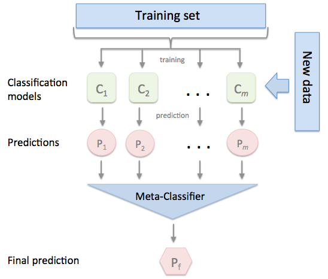
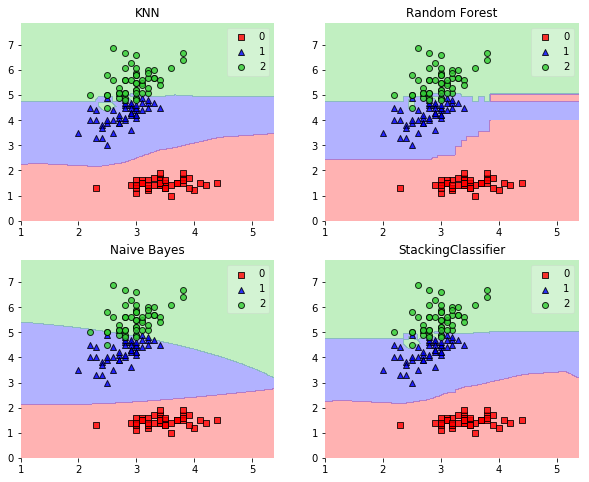

# StackingClassifier

An ensemble-learning meta-classifier for stacking.

> from mlxtend.classifier import StackingClassifier

# Overview

Stacking is an ensemble learning technique to combine multiple classification models via a meta-classifier. The individual classification models are trained based on the complete training set; then, the meta-classifier is fitted based on the outputs -- meta-features -- of the individual classification models in the ensemble.
The meta-classifier can either be trained on the predicted class labels or probabilities from the ensemble.



The algorithm can be summarized as follows (source: [1]):
    


**Please note that this type of Stacking is prone to overfitting due to information leakage. The related [StackingCVClassifier.md](StackingCVClassifier.md) does not derive the predictions for the 2nd-level classifier from the same datast that was used for training the level-1 classifiers and is recommended instead.**

### References


- [1] Tang, J., S. Alelyani, and H. Liu. "[Data Classification: Algorithms and Applications.](https://books.google.com/books?id=nwQZCwAAQBAJ&lpg=PA500&dq=stacking%20classifier%20subsets&pg=PA499#v=onepage&q&f=false)" Data Mining and Knowledge Discovery Series, CRC Press (2015): pp. 498-500.
- [2] Wolpert, David H. "[Stacked generalization.](http://www.sciencedirect.com/science/article/pii/S0893608005800231)" Neural networks 5.2 (1992): 241-259.

## Example 1 - Simple Stacked Classification


```python
from sklearn import datasets

iris = datasets.load_iris()
X, y = iris.data[:, 1:3], iris.target
```


```python
from sklearn import model_selection
from sklearn.linear_model import LogisticRegression
from sklearn.neighbors import KNeighborsClassifier
from sklearn.naive_bayes import GaussianNB 
from sklearn.ensemble import RandomForestClassifier
from mlxtend.classifier import StackingClassifier
import numpy as np

clf1 = KNeighborsClassifier(n_neighbors=1)
clf2 = RandomForestClassifier(random_state=1)
clf3 = GaussianNB()
lr = LogisticRegression()
sclf = StackingClassifier(classifiers=[clf1, clf2, clf3], 
                          meta_classifier=lr)

print('3-fold cross validation:\n')

for clf, label in zip([clf1, clf2, clf3, sclf], 
                      ['KNN', 
                       'Random Forest', 
                       'Naive Bayes',
                       'StackingClassifier']):

    scores = model_selection.cross_val_score(clf, X, y, 
                                              cv=3, scoring='accuracy')
    print("Accuracy: %0.2f (+/- %0.2f) [%s]" 
          % (scores.mean(), scores.std(), label))
```

    3-fold cross validation:
    
    Accuracy: 0.91 (+/- 0.01) [KNN]
    Accuracy: 0.91 (+/- 0.06) [Random Forest]
    Accuracy: 0.92 (+/- 0.03) [Naive Bayes]
    Accuracy: 0.95 (+/- 0.03) [StackingClassifier]


```python
import matplotlib.pyplot as plt
from mlxtend.plotting import plot_decision_regions
import matplotlib.gridspec as gridspec
import itertools

gs = gridspec.GridSpec(2, 2)

fig = plt.figure(figsize=(10,8))

for clf, lab, grd in zip([clf1, clf2, clf3, sclf], 
                         ['KNN', 
                          'Random Forest', 
                          'Naive Bayes',
                          'StackingClassifier'],
                          itertools.product([0, 1], repeat=2)):

    clf.fit(X, y)
    ax = plt.subplot(gs[grd[0], grd[1]])
    fig = plot_decision_regions(X=X, y=y, clf=clf)
    plt.title(lab)
```





## Example 2 - Using Probabilities as Meta-Features

Alternatively, the class-probabilities of the first-level classifiers can be used to train the meta-classifier (2nd-level classifier) by setting `use_probas=True`. If `average_probas=True`, the probabilities of the level-1 classifiers are averaged, if `average_probas=False`, the probabilities are stacked (recommended). For example, in a 3-class setting with 2 level-1 classifiers, these classifiers may make the following "probability" predictions for 1 training sample:

- classifier 1: [0.2, 0.5, 0.3]
- classifier 2: [0.3, 0.4, 0.4]

If `average_probas=True`, the meta-features would be:

- [0.25, 0.45, 0.35]

In contrast, using `average_probas=False` results in k features where, k = [n_classes * n_classifiers], by stacking these level-1 probabilities:

- [0.2, 0.5, 0.3, 0.3, 0.4, 0.4]


```python
clf1 = KNeighborsClassifier(n_neighbors=1)
clf2 = RandomForestClassifier(random_state=1)
clf3 = GaussianNB()
lr = LogisticRegression()
sclf = StackingClassifier(classifiers=[clf1, clf2, clf3],
                          use_probas=True,
                          average_probas=False,
                          meta_classifier=lr)

print('3-fold cross validation:\n')

for clf, label in zip([clf1, clf2, clf3, sclf], 
                      ['KNN', 
                       'Random Forest', 
                       'Naive Bayes',
                       'StackingClassifier']):

    scores = model_selection.cross_val_score(clf, X, y, 
                                              cv=3, scoring='accuracy')
    print("Accuracy: %0.2f (+/- %0.2f) [%s]" 
          % (scores.mean(), scores.std(), label))
```

    3-fold cross validation:
    
    Accuracy: 0.91 (+/- 0.01) [KNN]
    Accuracy: 0.91 (+/- 0.06) [Random Forest]
    Accuracy: 0.92 (+/- 0.03) [Naive Bayes]
    Accuracy: 0.94 (+/- 0.03) [StackingClassifier]


## Example 3 - Stacked Classification and GridSearch

To set up a parameter grid for scikit-learn's `GridSearch`, we simply provide the estimator's names in the parameter grid -- in the special case of the meta-regressor, we append the `'meta-'` prefix.


```python
from sklearn.linear_model import LogisticRegression
from sklearn.neighbors import KNeighborsClassifier
from sklearn.naive_bayes import GaussianNB 
from sklearn.ensemble import RandomForestClassifier
from sklearn.model_selection import GridSearchCV
from mlxtend.classifier import StackingClassifier

# Initializing models

clf1 = KNeighborsClassifier(n_neighbors=1)
clf2 = RandomForestClassifier(random_state=1)
clf3 = GaussianNB()
lr = LogisticRegression()
sclf = StackingClassifier(classifiers=[clf1, clf2, clf3], 
                          meta_classifier=lr)

params = {'kneighborsclassifier__n_neighbors': [1, 5],
          'randomforestclassifier__n_estimators': [10, 50],
          'meta-logisticregression__C': [0.1, 10.0]}

grid = GridSearchCV(estimator=sclf, 
                    param_grid=params, 
                    cv=5,
                    refit=True)
grid.fit(X, y)

cv_keys = ('mean_test_score', 'std_test_score', 'params')

for r, _ in enumerate(grid.cv_results_['mean_test_score']):
    print("%0.3f +/- %0.2f %r"
          % (grid.cv_results_[cv_keys[0]][r],
             grid.cv_results_[cv_keys[1]][r] / 2.0,
             grid.cv_results_[cv_keys[2]][r]))

print('Best parameters: %s' % grid.best_params_)
print('Accuracy: %.2f' % grid.best_score_)
```

    0.667 +/- 0.00 {'kneighborsclassifier__n_neighbors': 1, 'meta-logisticregression__C': 0.1, 'randomforestclassifier__n_estimators': 10}
    0.667 +/- 0.00 {'kneighborsclassifier__n_neighbors': 1, 'meta-logisticregression__C': 0.1, 'randomforestclassifier__n_estimators': 50}
    0.927 +/- 0.02 {'kneighborsclassifier__n_neighbors': 1, 'meta-logisticregression__C': 10.0, 'randomforestclassifier__n_estimators': 10}
    0.913 +/- 0.03 {'kneighborsclassifier__n_neighbors': 1, 'meta-logisticregression__C': 10.0, 'randomforestclassifier__n_estimators': 50}
    0.667 +/- 0.00 {'kneighborsclassifier__n_neighbors': 5, 'meta-logisticregression__C': 0.1, 'randomforestclassifier__n_estimators': 10}
    0.667 +/- 0.00 {'kneighborsclassifier__n_neighbors': 5, 'meta-logisticregression__C': 0.1, 'randomforestclassifier__n_estimators': 50}
    0.933 +/- 0.02 {'kneighborsclassifier__n_neighbors': 5, 'meta-logisticregression__C': 10.0, 'randomforestclassifier__n_estimators': 10}
    0.940 +/- 0.02 {'kneighborsclassifier__n_neighbors': 5, 'meta-logisticregression__C': 10.0, 'randomforestclassifier__n_estimators': 50}
    Best parameters: {'kneighborsclassifier__n_neighbors': 5, 'meta-logisticregression__C': 10.0, 'randomforestclassifier__n_estimators': 50}
    Accuracy: 0.94


In case we are planning to use a regression algorithm multiple times, all we need to do is to add an additional number suffix in the parameter grid as shown below:


```python
from sklearn.model_selection import GridSearchCV

# Initializing models

clf1 = KNeighborsClassifier(n_neighbors=1)
clf2 = RandomForestClassifier(random_state=1)
clf3 = GaussianNB()
lr = LogisticRegression()
sclf = StackingClassifier(classifiers=[clf1, clf1, clf2, clf3], 
                          meta_classifier=lr)

params = {'kneighborsclassifier-1__n_neighbors': [1, 5],
          'kneighborsclassifier-2__n_neighbors': [1, 5],
          'randomforestclassifier__n_estimators': [10, 50],
          'meta-logisticregression__C': [0.1, 10.0]}

grid = GridSearchCV(estimator=sclf, 
                    param_grid=params, 
                    cv=5,
                    refit=True)
grid.fit(X, y)

cv_keys = ('mean_test_score', 'std_test_score', 'params')

for r, _ in enumerate(grid.cv_results_['mean_test_score']):
    print("%0.3f +/- %0.2f %r"
          % (grid.cv_results_[cv_keys[0]][r],
             grid.cv_results_[cv_keys[1]][r] / 2.0,
             grid.cv_results_[cv_keys[2]][r]))

print('Best parameters: %s' % grid.best_params_)
print('Accuracy: %.2f' % grid.best_score_)
```

    0.667 +/- 0.00 {'kneighborsclassifier-1__n_neighbors': 1, 'kneighborsclassifier-2__n_neighbors': 1, 'meta-logisticregression__C': 0.1, 'randomforestclassifier__n_estimators': 10}
    0.667 +/- 0.00 {'kneighborsclassifier-1__n_neighbors': 1, 'kneighborsclassifier-2__n_neighbors': 1, 'meta-logisticregression__C': 0.1, 'randomforestclassifier__n_estimators': 50}
    0.907 +/- 0.03 {'kneighborsclassifier-1__n_neighbors': 1, 'kneighborsclassifier-2__n_neighbors': 1, 'meta-logisticregression__C': 10.0, 'randomforestclassifier__n_estimators': 10}
    0.913 +/- 0.03 {'kneighborsclassifier-1__n_neighbors': 1, 'kneighborsclassifier-2__n_neighbors': 1, 'meta-logisticregression__C': 10.0, 'randomforestclassifier__n_estimators': 50}
    0.667 +/- 0.00 {'kneighborsclassifier-1__n_neighbors': 1, 'kneighborsclassifier-2__n_neighbors': 5, 'meta-logisticregression__C': 0.1, 'randomforestclassifier__n_estimators': 10}
    0.667 +/- 0.00 {'kneighborsclassifier-1__n_neighbors': 1, 'kneighborsclassifier-2__n_neighbors': 5, 'meta-logisticregression__C': 0.1, 'randomforestclassifier__n_estimators': 50}
    0.927 +/- 0.02 {'kneighborsclassifier-1__n_neighbors': 1, 'kneighborsclassifier-2__n_neighbors': 5, 'meta-logisticregression__C': 10.0, 'randomforestclassifier__n_estimators': 10}
    0.913 +/- 0.03 {'kneighborsclassifier-1__n_neighbors': 1, 'kneighborsclassifier-2__n_neighbors': 5, 'meta-logisticregression__C': 10.0, 'randomforestclassifier__n_estimators': 50}
    0.667 +/- 0.00 {'kneighborsclassifier-1__n_neighbors': 5, 'kneighborsclassifier-2__n_neighbors': 1, 'meta-logisticregression__C': 0.1, 'randomforestclassifier__n_estimators': 10}
    0.667 +/- 0.00 {'kneighborsclassifier-1__n_neighbors': 5, 'kneighborsclassifier-2__n_neighbors': 1, 'meta-logisticregression__C': 0.1, 'randomforestclassifier__n_estimators': 50}
    0.927 +/- 0.02 {'kneighborsclassifier-1__n_neighbors': 5, 'kneighborsclassifier-2__n_neighbors': 1, 'meta-logisticregression__C': 10.0, 'randomforestclassifier__n_estimators': 10}
    0.913 +/- 0.03 {'kneighborsclassifier-1__n_neighbors': 5, 'kneighborsclassifier-2__n_neighbors': 1, 'meta-logisticregression__C': 10.0, 'randomforestclassifier__n_estimators': 50}
    0.667 +/- 0.00 {'kneighborsclassifier-1__n_neighbors': 5, 'kneighborsclassifier-2__n_neighbors': 5, 'meta-logisticregression__C': 0.1, 'randomforestclassifier__n_estimators': 10}
    0.667 +/- 0.00 {'kneighborsclassifier-1__n_neighbors': 5, 'kneighborsclassifier-2__n_neighbors': 5, 'meta-logisticregression__C': 0.1, 'randomforestclassifier__n_estimators': 50}
    0.933 +/- 0.02 {'kneighborsclassifier-1__n_neighbors': 5, 'kneighborsclassifier-2__n_neighbors': 5, 'meta-logisticregression__C': 10.0, 'randomforestclassifier__n_estimators': 10}
    0.940 +/- 0.02 {'kneighborsclassifier-1__n_neighbors': 5, 'kneighborsclassifier-2__n_neighbors': 5, 'meta-logisticregression__C': 10.0, 'randomforestclassifier__n_estimators': 50}
    Best parameters: {'kneighborsclassifier-1__n_neighbors': 5, 'kneighborsclassifier-2__n_neighbors': 5, 'meta-logisticregression__C': 10.0, 'randomforestclassifier__n_estimators': 50}
    Accuracy: 0.94


**Note**

The `StackingClassifier` also enables grid search over the `classifiers` argument. However, due to the current implementation of `GridSearchCV` in scikit-learn, it is not possible to search over both, differenct classifiers and classifier parameters at the same time. For instance, while the following parameter dictionary works

    params = {'randomforestclassifier__n_estimators': [1, 100],
    'classifiers': [(clf1, clf1, clf1), (clf2, clf3)]}
    
it will use the instance settings of `clf1`, `clf2`, and `clf3` and not overwrite it with the `'n_estimators'` settings from `'randomforestclassifier__n_estimators': [1, 100]`.

## Example 4 - Stacking of Classifiers that Operate on Different Feature Subsets

The different level-1 classifiers can be fit to different subsets of features in the training dataset. The following example illustrates how this can be done on a technical level using scikit-learn pipelines and the `ColumnSelector`:


```python
from sklearn.datasets import load_iris
from mlxtend.classifier import StackingClassifier
from mlxtend.feature_selection import ColumnSelector
from sklearn.pipeline import make_pipeline
from sklearn.linear_model import LogisticRegression

iris = load_iris()
X = iris.data
y = iris.target

pipe1 = make_pipeline(ColumnSelector(cols=(0, 2)),
                      LogisticRegression())
pipe2 = make_pipeline(ColumnSelector(cols=(1, 2, 3)),
                      LogisticRegression())

sclf = StackingClassifier(classifiers=[pipe1, pipe2], 
                          meta_classifier=LogisticRegression())

sclf.fit(X, y)
```


    StackingClassifier(average_probas=False,
              classifiers=[Pipeline(steps=[('columnselector', ColumnSelector(cols=(0, 2))), ('logisticregression', LogisticRegression(C=1.0, class_weight=None, dual=False, fit_intercept=True,
              intercept_scaling=1, max_iter=100, multi_class='ovr', n_jobs=1,
              penalty='l2', random_state=None, solve...='l2', random_state=None, solver='liblinear', tol=0.0001,
              verbose=0, warm_start=False))])],
              meta_classifier=LogisticRegression(C=1.0, class_weight=None, dual=False, fit_intercept=True,
              intercept_scaling=1, max_iter=100, multi_class='ovr', n_jobs=1,
              penalty='l2', random_state=None, solver='liblinear', tol=0.0001,
              verbose=0, warm_start=False),
              use_features_in_secondary=False, use_probas=False, verbose=0)


# API


*StackingClassifier(classifiers, meta_classifier, use_probas=False, average_probas=False, verbose=0, use_features_in_secondary=False, store_train_meta_features=False, use_clones=True)*

A Stacking classifier for scikit-learn estimators for classification.

**Parameters**

- `classifiers` : array-like, shape = [n_classifiers]

    A list of classifiers.
    Invoking the `fit` method on the `StackingClassifer` will fit clones
    of these original classifiers that will
    be stored in the class attribute
    `self.clfs_`.

- `meta_classifier` : object

    The meta-classifier to be fitted on the ensemble of
    classifiers

- `use_probas` : bool (default: False)

    If True, trains meta-classifier based on predicted probabilities
    instead of class labels.

- `average_probas` : bool (default: False)

    Averages the probabilities as meta features if True.

- `verbose` : int, optional (default=0)

    Controls the verbosity of the building process.
    - `verbose=0` (default): Prints nothing
    - `verbose=1`: Prints the number & name of the regressor being fitted
    - `verbose=2`: Prints info about the parameters of the
    regressor being fitted
    - `verbose>2`: Changes `verbose` param of the underlying regressor to
    self.verbose - 2

- `use_features_in_secondary` : bool (default: False)

    If True, the meta-classifier will be trained both on the predictions
    of the original classifiers and the original dataset.
    If False, the meta-classifier will be trained only on the predictions
    of the original classifiers.

- `store_train_meta_features` : bool (default: False)

    If True, the meta-features computed from the training data used
    for fitting the meta-classifier stored in the
    `self.train_meta_features_` array, which can be
    accessed after calling `fit`.

- `use_clones` : bool (default: True)

    Clones the classifiers for stacking classification if True (default)
    or else uses the original ones, which will be refitted on the dataset
    upon calling the `fit` method. Hence, if use_clones=True, the original
    input classifiers will remain unmodified upon using the
    StackingClassifier's `fit` method.
    Setting `use_clones=False` is
    recommended if you are working with estimators that are supporting
    the scikit-learn fit/predict API interface but are not compatible
    to scikit-learn's `clone` function.

**Attributes**

- `clfs_` : list, shape=[n_classifiers]

    Fitted classifiers (clones of the original classifiers)

- `meta_clf_` : estimator

    Fitted meta-classifier (clone of the original meta-estimator)

- `train_meta_features` : numpy array, shape = [n_samples, n_classifiers]

    meta-features for training data, where n_samples is the
    number of samples
    in training data and n_classifiers is the number of classfiers.

**Examples**

For usage examples, please see
    [http://rasbt.github.io/mlxtend/user_guide/classifier/StackingClassifier/](http://rasbt.github.io/mlxtend/user_guide/classifier/StackingClassifier/)

### Methods

<hr>

*fit(X, y, sample_weight=None)*

Fit ensemble classifers and the meta-classifier.

**Parameters**

- `X` : {array-like, sparse matrix}, shape = [n_samples, n_features]

    Training vectors, where n_samples is the number of samples and
    n_features is the number of features.

- `y` : array-like, shape = [n_samples] or [n_samples, n_outputs]

    Target values.

- `sample_weight` : array-like, shape = [n_samples], optional

    Sample weights passed as sample_weights to each regressor
    in the regressors list as well as the meta_regressor.
    Raises error if some regressor does not support
    sample_weight in the fit() method.

**Returns**

- `self` : object


<hr>

*fit_transform(X, y=None, **fit_params)*

Fit to data, then transform it.

Fits transformer to X and y with optional parameters fit_params
and returns a transformed version of X.

**Parameters**

- `X` : numpy array of shape [n_samples, n_features]

    Training set.


- `y` : numpy array of shape [n_samples]

    Target values.

**Returns**

- `X_new` : numpy array of shape [n_samples, n_features_new]

    Transformed array.

<hr>

*get_params(deep=True)*

Return estimator parameter names for GridSearch support.

<hr>

*predict(X)*

Predict target values for X.

**Parameters**

- `X` : {array-like, sparse matrix}, shape = [n_samples, n_features]

    Training vectors, where n_samples is the number of samples and
    n_features is the number of features.

**Returns**

- `labels` : array-like, shape = [n_samples] or [n_samples, n_outputs]

    Predicted class labels.

<hr>

*predict_meta_features(X)*

Get meta-features of test-data.

**Parameters**

- `X` : numpy array, shape = [n_samples, n_features]

    Test vectors, where n_samples is the number of samples and
    n_features is the number of features.

**Returns**

- `meta-features` : numpy array, shape = [n_samples, n_classifiers]

    Returns the meta-features for test data.

<hr>

*predict_proba(X)*

Predict class probabilities for X.

**Parameters**

- `X` : {array-like, sparse matrix}, shape = [n_samples, n_features]

    Training vectors, where n_samples is the number of samples and
    n_features is the number of features.

**Returns**

- `proba` : array-like, shape = [n_samples, n_classes] or a list of                 n_outputs of such arrays if n_outputs > 1.

    Probability for each class per sample.

<hr>

*score(X, y, sample_weight=None)*

Returns the mean accuracy on the given test data and labels.

In multi-label classification, this is the subset accuracy
which is a harsh metric since you require for each sample that
each label set be correctly predicted.

**Parameters**

- `X` : array-like, shape = (n_samples, n_features)

    Test samples.


- `y` : array-like, shape = (n_samples) or (n_samples, n_outputs)

    True labels for X.


- `sample_weight` : array-like, shape = [n_samples], optional

    Sample weights.

**Returns**

- `score` : float

    Mean accuracy of self.predict(X) wrt. y.

<hr>

*set_params(**params)*

Set the parameters of this estimator.

The method works on simple estimators as well as on nested objects
(such as pipelines). The latter have parameters of the form
``<component>__<parameter>`` so that it's possible to update each
component of a nested object.

**Returns**

self


