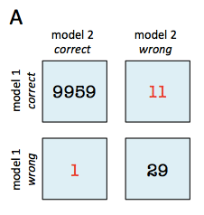

# McNemar's Test

McNemar's test for paired nominal data

> `from mlxtend.evaluate import mcnemar`    

## Overview

McNemar's Test [1] (sometimes also called "within-subjects chi-squared test") is a statistical test for paired nominal data. In context of machine learning (or statistical) models, we can use McNemar's Test to compare the predictive accuracy of two models. McNemar's test is based on a 2 times 2 contigency table of the two model's predictions.

###  McNemar's Test Statistic

In McNemar's Test, we formulate the null hypothesis that the probabilities $p(b)$ and $p(c)$ are the same, or in simplified terms: None of the two models performs better than the other. Thus, the alternative hypothesis is that the performances of the two models are not equal.


The McNemar test statistic ("chi-squared") can be computed as follows:

$$\chi^2 = \frac{(b - c)^2}{(b + c)},$$

If the sum of cell c and b is sufficiently large, the $\chi^2$ value follows a chi-squared distribution with one degree of freedom. After setting a significance threshold, e.g,. $\alpha=0.05$ we can compute the p-value -- assuming that the null hypothesis is true, the p-value is the probability of observing this empirical (or a larger) chi-squared value. If the p-value is lower than our chosen significance level, we can reject the null hypothesis that the two model's performances are equal.

### Continuity Correction

Approximately 1 year after Quinn McNemar published the McNemar Test [1], Edwards [2] proposed a continuity corrected version, which is the more commonly used variant today:

$$\chi^2 = \frac{( \mid b - c \mid - 1)^2}{(b + c)}.$$

### Exact p-values

As mentioned earlier, an exact binomial test is recommended for small sample sizes ($b + c < 25$ [3]), since the chi-squared value is may not be well-approximated by the chi-squared distribution. The exact p-value can be computed as follows:

$$p = 2 \sum^{n}_{i=b} \binom{n}{i} 0.5^i (1 - 0.5)^{n-i},$$

where $n = b + c$, and the factor $2$ is used to compute the two-sided p-value.

### Example

For instance, given that 2 models have a accuracy of with a 99.7% and 99.6% a 2x2 contigency table can provide further insights for model selection.


In both subfigure A and B, the predictive accuracies of the two models are as follows:

- model 1 accuracy: 9,960 / 10,000 = 99.6%
- model 2 accuracy: 9,970 / 10,000 = 99.7%

Now, in subfigure A, we can see that model 2 got 11 predictions right that model 1 got wrong. Vice versa, model 2 got 1 prediction right that model 2 got wrong. Thus, based on this 11:1 ratio, we may conclude that model 2 performs substantially better than model 1. However, in subfigure B, the ratio is 25:15, which is less conclusive about which model is the better one to choose.

In the following coding examples, we will use these 2 scenarios A and B to illustrate McNemar's test.

### References

- [1] McNemar, Quinn, 1947. "[Note on the sampling error of the difference between correlated proportions or percentages](http://link.springer.com/article/10.1007%2FBF02295996)". Psychometrika. 12 (2): 153–157.
- [2] Edwards AL: Note on the “correction for continuity” in testing the significance of the difference between correlated proportions. Psychometrika. 1948, 13 (3): 185-187. 10.1007/BF02289261.
- [3] https://en.wikipedia.org/wiki/McNemar%27s_test

## Example 1 - Creating 2x2 Contigency tables

The `mcnemar` funtion expects a 2x2 contingency table as a NumPy array that is formatted as follows:
    


Such a contigency matrix can be created by using the `mcnemar_table` function from `mlxtend.evaluate`. For example:


```python
import numpy as np
from mlxtend.evaluate import mcnemar_table

# The correct target (class) labels
y_target = np.array([0, 0, 0, 0, 0, 1, 1, 1, 1, 1])

# Class labels predicted by model 1
y_model1 = np.array([0, 1, 0, 0, 0, 1, 1, 0, 0, 0])

# Class labels predicted by model 2
y_model2 = np.array([0, 0, 1, 1, 0, 1, 1, 0, 0, 0])

tb = mcnemar_table(y_target=y_target, 
                   y_model1=y_model1, 
                   y_model2=y_model2)

print(tb)
```

    [[4 1]
     [2 3]]


## Example 2 - McNemar's Test for Scenario B

No, let us continue with the example mentioned in the overview section and assume that we already computed the 2x2 contigency table:


```python
import numpy as np

tb_b = np.array([[9945, 25],
                 [15, 15]])
```

To test the null hypothesis that the predictive performance of two models are equal (using a significance level of $\alpha=0.05$), we can conduct a corrected McNemar Test for computing the chi-squared and p-value as follows:


```python
from mlxtend.evaluate import mcnemar

chi2, p = mcnemar(ary=tb_b, corrected=True)
print('chi-squared:', chi2)
print('p-value:', p)
```

    chi-squared: 2.025
    p-value: 0.154728923485


Since the p-value is larger than our assumed significance threshold ($\alpha=0.05$), we cannot reject our null hypothesis and assume that there is no significant difference between the two predictive models.

## Example 3 - McNemar's Test for Scenario A

In contrast to scenario B (Example 2), the sample size in scenario A is relatively small (b + c = 11  + 1 = 12) and smaller than the recommended 25 [3] to approximate the computed chi-square value by the chi-square distribution well.



In this case, we need to compute the exact p-value from the binomial distribution:


```python
from mlxtend.evaluate import mcnemar
import numpy as np

tb_a = np.array([[9959, 11],
                 [1, 29]])

chi2, p = mcnemar(ary=tb_a, exact=True)

print('chi-squared:', chi2)
print('p-value:', p)
```

    chi-squared: None
    p-value: 0.005859375


Assuming that we conducted this test also with a significance level of $\alpha=0.05$, we can reject the null-hypothesis that both models perform equally well on this dataset, since the p-value ($p \approx 0.006$) is smaller than $\alpha$.

## API


*mcnemar(ary, corrected=True, exact=False)*

McNemar test for paired nominal data

**Parameters**

- `ary` : array-like, shape=[2, 2]

    2 x 2 contigency table (as returned by evaluate.mcnemar_table),
    where
    a: ary[0, 0]: # of samples that both models predicted correctly
    b: ary[0, 1]: # of samples that model 1 got right and model 2 got wrong
    c: ary[1, 0]: # of samples that model 2 got right and model 1 got wrong
    d: aryCell [1, 1]: # of samples that both models predicted incorrectly

- `corrected` : array-like, shape=[n_samples] (default: True)

    Uses Edward's continuity correction for chi-squared if `True`

- `exact` : bool, (default: False)

    If `True`, uses an exact binomial test comparing b to
    a binomial distribution with n = b + c and p = 0.5.
    It is highly recommended to use `exact=True` for sample sizes < 25
    since chi-squared is not well-approximated
    by the chi-squared distribution!

**Returns**

- `chi2, p` : float or None, float

    Returns the chi-squared value and the p-value;
    if `exact=True` (default: `False`), `chi2` is `None`

**Examples**

    For usage examples, please see
    [http://rasbt.github.io/mlxtend/user_guide/evaluate/mcnemar/](http://rasbt.github.io/mlxtend/user_guide/evaluate/mcnemar/)


