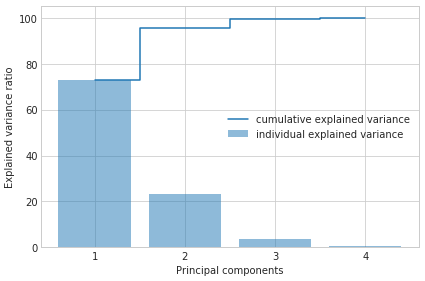
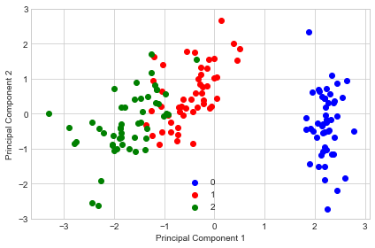
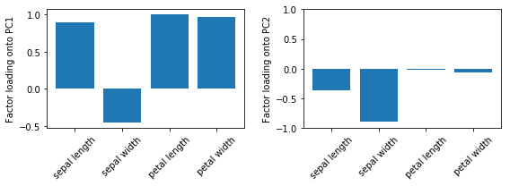
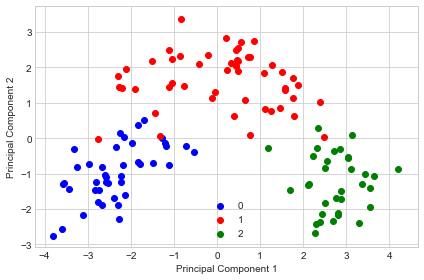
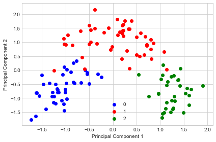

# Principal Component Analysis

Implementation of Principal Component Analysis for dimensionality reduction

> from mlxtend.feature_extraction import PrincipalComponentAnalysis

## Overview

The sheer size of data in the modern age is not only a challenge for computer hardware but also a main bottleneck for the performance of many machine learning algorithms. The main goal of a PCA analysis is to identify patterns in data; PCA aims to detect the correlation between variables. If a strong correlation between variables exists, the attempt to reduce the dimensionality only makes sense. In a nutshell, this is what PCA is all about: Finding the directions of maximum variance in high-dimensional data and project it onto a smaller dimensional subspace while retaining most of the information.

### PCA and Dimensionality Reduction

Often, the desired goal is to reduce the dimensions of a $d$-dimensional dataset by projecting it onto a $(k)$-dimensional subspace (where $k\;<\;d$) in order to increase the computational efficiency while retaining most of the information. An important question is "what is the size of $k$ that represents the data 'well'?"

Later, we will compute eigenvectors (the principal components) of a dataset and collect them in a projection matrix. Each of those eigenvectors is associated with an eigenvalue which can be interpreted as the "length" or "magnitude" of the corresponding eigenvector. If some eigenvalues have a significantly larger magnitude than others that the reduction of the dataset via PCA onto a smaller dimensional subspace by dropping the "less informative" eigenpairs is reasonable.

### A Summary of the PCA Approach

-  Standardize the data.
-  Obtain the Eigenvectors and Eigenvalues from the covariance matrix or correlation matrix, or perform Singular Vector Decomposition.
-  Sort eigenvalues in descending order and choose the $k$ eigenvectors that correspond to the $k$ largest eigenvalues where $k$ is the number of dimensions of the new feature subspace ($k \le d$).
-  Construct the projection matrix $\mathbf{W}$ from the selected $k$ eigenvectors.
-  Transform the original dataset $\mathbf{X}$ via $\mathbf{W}$ to obtain a $k$-dimensional feature subspace $\mathbf{Y}$.


### References

- Pearson, Karl. "LIII. [On lines and planes of closest fit to systems of points in space.](http://www.tandfonline.com/doi/abs/10.1080/14786440109462720?journalCode=tphm17)" The London, Edinburgh, and Dublin Philosophical Magazine and Journal of Science 2.11 (1901): 559-572.

## Example 1 - PCA on Iris


```python
from mlxtend.data import iris_data
from mlxtend.preprocessing import standardize
from mlxtend.feature_extraction import PrincipalComponentAnalysis

X, y = iris_data()
X = standardize(X)

pca = PrincipalComponentAnalysis(n_components=2)
pca.fit(X)
X_pca = pca.transform(X)
```


```python
import matplotlib.pyplot as plt

with plt.style.context('seaborn-whitegrid'):
    plt.figure(figsize=(6, 4))
    for lab, col in zip((0, 1, 2),
                        ('blue', 'red', 'green')):
        plt.scatter(X_pca[y==lab, 0],
                    X_pca[y==lab, 1],
                    label=lab,
                    c=col)
    plt.xlabel('Principal Component 1')
    plt.ylabel('Principal Component 2')
    plt.legend(loc='lower center')
    plt.tight_layout()
    plt.show()
```


## Example 2 - Plotting the Variance Explained Ratio


```python
from mlxtend.data import iris_data
from mlxtend.preprocessing import standardize

X, y = iris_data()
X = standardize(X)

pca = PrincipalComponentAnalysis(n_components=None)
pca.fit(X)
X_pca = pca.transform(X)
```


```python
import numpy as np

tot = sum(pca.e_vals_)
var_exp = [(i / tot)*100 for i in sorted(pca.e_vals_, reverse=True)]
cum_var_exp = np.cumsum(var_exp)
```


```python
with plt.style.context('seaborn-whitegrid'):
    fig, ax = plt.subplots(figsize=(6, 4))
    plt.bar(range(4), var_exp, alpha=0.5, align='center',
            label='individual explained variance')
    plt.step(range(4), cum_var_exp, where='mid',
             label='cumulative explained variance')
    plt.ylabel('Explained variance ratio')
    plt.xlabel('Principal components')
    plt.xticks(range(4))
    ax.set_xticklabels(np.arange(1, X.shape[1] + 1))
    plt.legend(loc='best')
    plt.tight_layout()
```





## Example 3 - PCA via SVD

While the eigendecomposition of the covariance or correlation matrix may be more intuitiuve, most PCA implementations perform a Singular Vector Decomposition (SVD) to improve the computational efficiency. Another advantage of using SVD is that the results tend to be more numerically stable, since we can decompose the input matrix directly without the additional covariance-matrix step.


```python
from mlxtend.data import iris_data
from mlxtend.preprocessing import standardize
from mlxtend.feature_extraction import PrincipalComponentAnalysis

X, y = iris_data()
X = standardize(X)

pca = PrincipalComponentAnalysis(n_components=2,
                                 solver='svd')
pca.fit(X)
X_pca = pca.transform(X)
```


```python
import matplotlib.pyplot as plt

with plt.style.context('seaborn-whitegrid'):
    plt.figure(figsize=(6, 4))
    for lab, col in zip((0, 1, 2),
                        ('blue', 'red', 'green')):
        plt.scatter(X_pca[y==lab, 0],
                    X_pca[y==lab, 1],
                    label=lab,
                    c=col)
    plt.xlabel('Principal Component 1')
    plt.ylabel('Principal Component 2')
    plt.legend(loc='lower center')
    plt.tight_layout()
    plt.show()
```





If we compare this PCA projection to the previous plot in example 1, we notice that they are mirror images of each other. Note that this is not due to an error in any of those two implementations, but the reason for this difference is that, depending on the eigensolver, eigenvectors can have either negative or positive signs.

For instance, if $v$ is an eigenvector of a matrix $\Sigma$, we have

$$\Sigma v = \lambda v,$$

where $\lambda$ is our eigenvalue

then $-v$ is also an eigenvector that has the same eigenvalue, since

$$\Sigma(-v) = -\Sigma v = -\lambda v = \lambda(-v).$$

## Example 4 - Factor Loadings

After evoking the `fit` method, the factor loadings are available via the `loadings_` attribute. In simple terms, the loadings are the unstandardized values of the eigenvectors. Or in other words, we can interpret the loadings as the covariances (or correlation in case we standardized the input features) between the input features and the principal components (or eigenvectors), which have been scaled to unit length.

By having the loadings scaled, they become comparable by magnitude and we can assess how much variance in a component is attributed to the input features (as the components are  just a weighted linear combination of the input features).


```python
from mlxtend.data import iris_data
from mlxtend.preprocessing import standardize
from mlxtend.feature_extraction import PrincipalComponentAnalysis
import matplotlib.pyplot as plt

X, y = iris_data()
X = standardize(X)

pca = PrincipalComponentAnalysis(n_components=2,
                                 solver='eigen')
pca.fit(X);
```


```python
xlabels = ['sepal length', 'sepal width', 'petal length', 'petal width']

fig, ax = plt.subplots(1, 2, figsize=(8, 3))

ax[0].bar(range(4), pca.loadings_[:, 0], align='center')
ax[1].bar(range(4), pca.loadings_[:, 1], align='center')

ax[0].set_ylabel('Factor loading onto PC1')
ax[1].set_ylabel('Factor loading onto PC2')

ax[0].set_xticks(range(4))
ax[1].set_xticks(range(4))
ax[0].set_xticklabels(xlabels, rotation=45)
ax[1].set_xticklabels(xlabels, rotation=45)
plt.ylim([-1, 1])
plt.tight_layout()
```





For instance, we may say that most of the variance in the first component is attributed to the petal features (although the loading of sepal length on PC1 is also not much less in magnitude). In contrast, the remaining variance captured by PC2 is mostly due to the sepal width. Note that we know from Example 2 that PC1 explains most of the variance, and based on the information from the loading plots, we may say that petal features combined with sepal length may explain most of the spread in the data.

## Example 5 - Feature Extraction Pipeline


```python
from sklearn.pipeline import make_pipeline
from sklearn.neighbors import KNeighborsClassifier
from sklearn.preprocessing import StandardScaler
from sklearn.model_selection import train_test_split
from mlxtend.data import wine_data

X, y = wine_data()
X_train, X_test, y_train, y_test = train_test_split(X, y, random_state=123, test_size=0.3, stratify=y)
```


```python
pipe_pca = make_pipeline(StandardScaler(),
                         PrincipalComponentAnalysis(n_components=3),
                         KNeighborsClassifier(n_neighbors=5))

pipe_pca.fit(X_train, y_train)


print('Transf. training accyracy: %.2f%%' % (pipe_pca.score(X_train, y_train)*100))
print('Transf. test accyracy: %.2f%%' % (pipe_pca.score(X_test, y_test)*100))
```

    Transf. training accyracy: 96.77%
    Transf. test accyracy: 96.30%


## Example 6 - Whitening

Certain algorithms require the data to be whitened. This means that the features have unit variance and the off-diagonals are all zero (i.e., the features are uncorrelated). PCA already ensures that the features are uncorrelated, hence, we only need to apply a simple scaling to whiten the transformed data.

For instance, for a given transformed feature $X'_i$, we divide it by the square-root of the corresponding eigenvalue $\lambda_i$:

$$X'_{\text{whitened}} = \frac{X'_i}{\sqrt{\lambda_i}}.$$

The whitening via the `PrincipalComponentAnalysis` can be achieved by setting `whitening=True` during initialization. Let's demonstrate that with an example.


```python
from sklearn.preprocessing import StandardScaler
from sklearn.model_selection import train_test_split
from mlxtend.data import wine_data

X, y = wine_data()
X_train, X_test, y_train, y_test = train_test_split(X, y, random_state=123, test_size=0.3, stratify=y)
```

### Regular PCA


```python
sc = StandardScaler()

pca1 = PrincipalComponentAnalysis(n_components=2)

X_train_scaled = sc.fit_transform(X_train)
X_train_transf = pca1.fit(X_train_scaled).transform(X_train_scaled)


with plt.style.context('seaborn-whitegrid'):
    plt.figure(figsize=(6, 4))
    for lab, col in zip((0, 1, 2),
                        ('blue', 'red', 'green')):
        plt.scatter(X_train_transf[y_train==lab, 0],
                    X_train_transf[y_train==lab, 1],
                    label=lab,
                    c=col)
    plt.xlabel('Principal Component 1')
    plt.ylabel('Principal Component 2')
    plt.legend(loc='lower center')
    plt.tight_layout()
    plt.show()
```





```python
np.set_printoptions(precision=1, suppress=True)

print('Covariance matrix:\n')
np.cov(X_train_transf.T)
```

    Covariance matrix:
    


    array([[4.9, 0. ],
           [0. , 2.5]])


As we can see, the features are uncorrelated after transformation but don't have unit variance.

### PCA with Whitening


```python
sc = StandardScaler()

pca1 = PrincipalComponentAnalysis(n_components=2, whitening=True)

X_train_scaled = sc.fit_transform(X_train)
X_train_transf = pca1.fit(X_train_scaled).transform(X_train_scaled)


with plt.style.context('seaborn-whitegrid'):
    plt.figure(figsize=(6, 4))
    for lab, col in zip((0, 1, 2),
                        ('blue', 'red', 'green')):
        plt.scatter(X_train_transf[y_train==lab, 0],
                    X_train_transf[y_train==lab, 1],
                    label=lab,
                    c=col)
    plt.xlabel('Principal Component 1')
    plt.ylabel('Principal Component 2')
    plt.legend(loc='lower center')
    plt.tight_layout()
    plt.show()
```





```python
np.set_printoptions(precision=1, suppress=True)

print('Covariance matrix:\n')
np.cov(X_train_transf.T)
```

    Covariance matrix:
    


    array([[1., 0.],
           [0., 1.]])


As we can see above, the whitening achieves that all features now have unit variance. I.e., the covariance matrix of the transformed features becomes the identity matrix.

## API


*PrincipalComponentAnalysis(n_components=None, solver='svd', whitening=False)*

Principal Component Analysis Class

**Parameters**

- `n_components` : int (default: None)

    The number of principal components for transformation.
    Keeps the original dimensions of the dataset if `None`.

- `solver` : str (default: 'svd')

    Method for performing the matrix decomposition.
    {'eigen', 'svd'}

- `whitening` : bool (default: False)

    Performs whitening such that the covariance matrix of
    the transformed data will be the identity matrix.

**Attributes**

- `w_` : array-like, shape=[n_features, n_components]

    Projection matrix

- `e_vals_` : array-like, shape=[n_features]

    Eigenvalues in sorted order.

- `e_vecs_` : array-like, shape=[n_features]

    Eigenvectors in sorted order.

- `loadings_` : array_like, shape=[n_features, n_features]

    The factor loadings of the original variables onto
    the principal components. The columns are the principal
    components, and the rows are the features loadings.
    For instance, the first column contains the loadings onto
    the first principal component. Note that the signs may
    be flipped depending on whether you use the 'eigen' or
    'svd' solver; this does not affect the interpretation
    of the loadings though.

**Examples**

For usage examples, please see
    [http://rasbt.github.io/mlxtend/user_guide/feature_extraction/PrincipalComponentAnalysis/](http://rasbt.github.io/mlxtend/user_guide/feature_extraction/PrincipalComponentAnalysis/)

### Methods

<hr>

*fit(X, y=None)*

Learn model from training data.

**Parameters**

- `X` : {array-like, sparse matrix}, shape = [n_samples, n_features]

    Training vectors, where n_samples is the number of samples and
    n_features is the number of features.

**Returns**

- `self` : object


<hr>

*get_params(deep=True)*

Get parameters for this estimator.

**Parameters**

- `deep` : boolean, optional

    If True, will return the parameters for this estimator and
    contained subobjects that are estimators.

**Returns**

- `params` : mapping of string to any

    Parameter names mapped to their values.'

    adapted from
    https://github.com/scikit-learn/scikit-learn/blob/master/sklearn/base.py
    # Author: Gael Varoquaux <gael.varoquaux@normalesup.org>
    # License: BSD 3 clause

<hr>

*set_params(**params)*

Set the parameters of this estimator.
The method works on simple estimators as well as on nested objects
(such as pipelines). The latter have parameters of the form
``<component>__<parameter>`` so that it's possible to update each
component of a nested object.

**Returns**

self

adapted from
https://github.com/scikit-learn/scikit-learn/blob/master/sklearn/base.py
# Author: Gael Varoquaux <gael.varoquaux@normalesup.org>
# License: BSD 3 clause

<hr>

*transform(X)*

Apply the linear transformation on X.

**Parameters**

- `X` : {array-like, sparse matrix}, shape = [n_samples, n_features]

    Training vectors, where n_samples is the number of samples and
    n_features is the number of features.

**Returns**

- `X_projected` : np.ndarray, shape = [n_samples, n_components]

    Projected training vectors.


