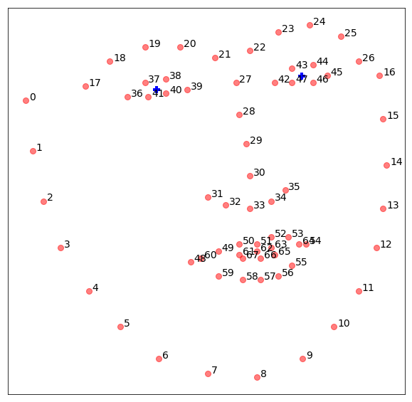

# Extract Face Landmarks

A function extract facial landmarks.

> from mlxtend.image import extract_face_landmarks

## Overview

The `extract_face_landmarks` function detects the faces in a given image, and then it will return the face landmark points (also known as face shape) for the first found face in the image based on dlib's face landmark detection code (http://dlib.net/face_landmark_detection_ex.cpp.html):

> The face detector we use is made using the classic Histogram of Oriented
    Gradients (HOG) feature combined with a linear classifier, an image pyramid,
    and sliding window detection scheme.  The pose estimator was created by
    using dlib's implementation of the paper:
       One Millisecond Face Alignment with an Ensemble of Regression Trees by
       Vahid Kazemi and Josephine Sullivan, CVPR 2014
    and was trained on the iBUG 300-W face landmark dataset (see
    https://ibug.doc.ic.ac.uk/resources/facial-point-annotations/):  
       C. Sagonas, E. Antonakos, G, Tzimiropoulos, S. Zafeiriou, M. Pantic. 
       300 faces In-the-wild challenge: Database and results. 
       Image and Vision Computing (IMAVIS), Special Issue on Facial Landmark Localisation "In-The-Wild". 2016.
    You can get the trained model file from:
    http://dlib.net/files/shape_predictor_68_face_landmarks.dat.bz2.
    Note that the license for the iBUG 300-W dataset excludes commercial use.
    So you should contact Imperial College London to find out if it's OK for
    you to use this model file in a commercial product.

### References

- Kazemi, Vahid, and Josephine Sullivan. "One millisecond face alignment with an ensemble of regression trees." Proceedings of the IEEE Conference on Computer Vision and Pattern Recognition. 2014.

## Example 1 


```python
import imageio
import matplotlib.pyplot as plt


from mlxtend.image import extract_face_landmarks

img = imageio.imread('test-face.png')
landmarks = extract_face_landmarks(img)
print(landmarks.shape)
print('\n\nFirst 10 landmarks:\n', landmarks[:10])
```

    (68, 2)
    
    
    First 10 landmarks:
     [[132 159]
     [134 173]
     [137 187]
     [142 200]
     [150 212]
     [159 222]
     [170 231]
     [184 235]
     [198 236]
     [211 231]]


Visualization of the landmarks:


```python
fig = plt.figure(figsize=(15, 5))
ax = fig.add_subplot(1, 3, 1)
ax.imshow(img)
ax = fig.add_subplot(1, 3, 2)
ax.scatter(landmarks[:, 0], -landmarks[:, 1], alpha=0.8)
ax = fig.add_subplot(1, 3, 3)
img2 = img.copy()
for p in landmarks:
    img2[p[1]-3:p[1]+3,p[0]-3:p[0]+3,:] = (255, 255, 255)
ax.imshow(img2)
plt.show()
```


## Display the index of landmark popints


```python
# left and right eyes indexes
import numpy as np

left = np.array([36, 37, 38, 39, 40, 41])
right = np.array([42, 43, 44, 45, 46, 47])
```


```python
import matplotlib.pyplot as plt
%matplotlib inline


fig = plt.figure(figsize=(10,10))
plt.plot(landmarks[:,0], -landmarks[:,1], 'ro', markersize=8, alpha = 0.5)
for i in range(landmarks.shape[0]):
    plt.text(landmarks[i,0]+1, -landmarks[i,1], str(i), size=14)


left_eye = np.mean(landmarks[left], axis=0)
right_eye = np.mean(landmarks[right], axis=0)
print('Coordinates of the Left Eye: ', left_eye)
print('Coordinates of the Right Eye: ', right_eye)
plt.plot([left_eye[0]], [-left_eye[1]], 
            marker='+', color='blue', markersize=10, mew=4)

plt.plot([right_eye[0]], [-right_eye[1]], 
            marker='+', color='blue', markersize=10, mew=4)

plt.xticks([])
plt.yticks([])

plt.show()
```

    Coordinates of the Left Eye:  [169.33333333 156.        ]
    Coordinates of the Right Eye:  [210.83333333 152.16666667]





## API


*extract_face_landmarks(img, return_dtype=<class 'numpy.int32'>)*

Function to extract face landmarks.

Note that this function requires an installation of
the Python version of the library "dlib": http://dlib.net

**Parameters**

- `img` : array, shape = [h, w, ?]

    numpy array of a face image.
    Supported shapes are
    - 3D tensors with 1
    or more color channels, for example,
    RGB: [h, w, 3]
    - 2D tensors without color channel, for example,
    Grayscale: [h, w]
    return_dtype: the return data-type of the array,
    default: np.int32.

**Returns**

- `landmarks` : numpy.ndarray, shape = [68, 2]

    A numpy array, where each row contains a landmark/point x-y coordinates.
    Return None if no face is detected by Dlib.

**Examples**

For usage examples, please see
    [http://rasbt.github.io/mlxtend/user_guide/sources/image/extract_face_landmarks.ipynb](http://rasbt.github.io/mlxtend/user_guide/sources/image/extract_face_landmarks.ipynb)


