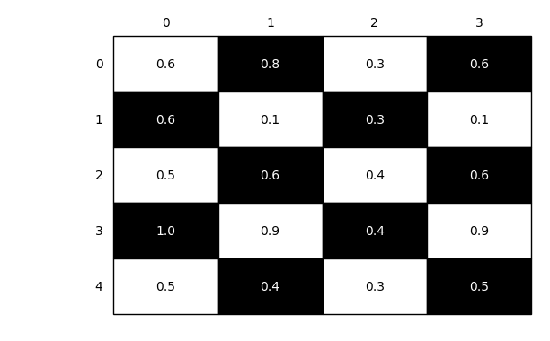

# Checkerboard Plot

Function to plot a checkerboard plot / heat map via matplotlib

> `from mlxtend.plotting import checkerboard plot`

## Overview

Function to plot a checkerboard plot / heat map via matplotlib.

### References

- -

## Example 1 - Default


```python
from mlxtend.plotting import checkerboard_plot
import matplotlib.pyplot as plt
import numpy as np

ary = np.random.random((5, 4))

brd = checkerboard_plot(ary)
plt.show()
```





## Example 2 - Changing colors and labels


```python
from mlxtend.plotting import checkerboard_plot
import matplotlib.pyplot as plt
import numpy as np

checkerboard_plot(ary, 
                  col_labels=['abc', 'def', 'ghi', 'jkl'],
                  row_labels=['sample %d' % i for i in range(1, 6)],
                  cell_colors=['skyblue', 'whitesmoke'],
                  font_colors=['black', 'black'],
                  figsize=(4.5, 5))
plt.show()
```


## API


*checkerboard_plot(ary, cell_colors=('white', 'black'), font_colors=('black', 'white'), fmt='%.1f', figsize=None, row_labels=None, col_labels=None, fontsize=None)*

Plot a checkerboard table / heatmap via matplotlib.

**Parameters**

- `ary` : array-like, shape = [n, m]

    A 2D Nnumpy array.

- `cell_colors` : tuple or list (default: ('white', 'black'))

    Tuple or list containing the two colors of the
    checkerboard pattern.

- `font_colors` : tuple or list (default: ('black', 'white'))

    Font colors corresponding to the cell colors.

- `figsize` : tuple (default: (2.5, 2.5))

    Height and width of the figure

- `fmt` : str (default: '%.1f')

    Python string formatter for cell values.
    The default '%.1f' results in floats with 1 digit after
    the decimal point. Use '%d' to show numbers as integers.

- `row_labels` : list (default: None)

    List of the row labels. Uses the array row
    indices 0 to n by default.

- `col_labels` : list (default: None)

    List of the column labels. Uses the array column
    indices 0 to m by default.

- `fontsize` : int (default: None)

    Specifies the font size of the checkerboard table.
    Uses matplotlib's default if None.

**Returns**

- `fig` : matplotlib Figure object.


**Examples**

For usage examples, please see
    [http://rasbt.github.io/mlxtend/user_guide/plotting/checkerboard_plot/](http://rasbt.github.io/mlxtend/user_guide/plotting/checkerboard_plot/)


