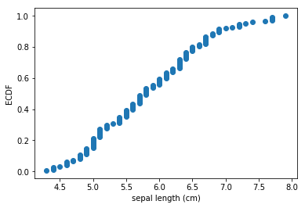

# Empirical Cumulative Distribution Function Plot

A function to conveniently plot an empirical cumulative distribution function. 

> from mlxtend.ecdf import ecdf

## Overview

A function to conveniently plot an empirical cumulative distribution function (ECDF) and adding percentile thresholds for exploratory data analysis.

### References

- -

## Example 1 - ECDF


```python
from mlxtend.data import iris_data
from mlxtend.plotting import ecdf
import matplotlib.pyplot as plt

X, y = iris_data()

ax, _, _ = ecdf(x=X[:, 0], x_label='sepal length (cm)')
plt.show()
```





## Example 2 - Multiple ECDFs


```python
from mlxtend.data import iris_data
from mlxtend.plotting import ecdf
import matplotlib.pyplot as plt

X, y = iris_data()

# first ecdf
x1 = X[:, 0]
ax, _, _ = ecdf(x1, x_label='cm')

# second ecdf
x2 = X[:, 1]
ax, _, _ = ecdf(x2, ax=ax)

plt.legend(['sepal length', 'sepal width'])
plt.show()
```


## Example 3 - ECDF with Percentile Thresholds


```python
from mlxtend.data import iris_data
from mlxtend.plotting import ecdf
import matplotlib.pyplot as plt

X, y = iris_data()

ax, threshold, count = ecdf(x=X[:, 0], 
                            x_label='sepal length (cm)',
                            percentile=0.8)

plt.show()

print('Feature threshold at the 80th percentile:', threshold)
print('Number of samples below the threshold:', count)
```


    Feature threshold at the 80th percentile: 6.5
    Number of samples below the threshold: 120


## API


*ecdf(x, y_label='ECDF', x_label=None, ax=None, percentile=None, ecdf_color=None, ecdf_marker='o', percentile_color='black', percentile_linestyle='--')*

Plots an Empirical Cumulative Distribution Function

**Parameters**

- `x` : array or list, shape=[n_samples,]

    Array-like object containing the feature values

- `y_label` : str (default='ECDF')

    Text label for the y-axis

- `x_label` : str (default=None)

    Text label for the x-axis

- `ax` : matplotlib.axes.Axes (default: None)

    An existing matplotlib Axes. Creates
    one if ax=None

- `percentile` : float (default=None)

    Float between 0 and 1 for plotting a percentile
    threshold line

- `ecdf_color` : matplotlib color (default=None)

    Color for the ECDF plot; uses matplotlib defaults
    if None

- `ecdf_marker` : matplotlib marker (default='o')

    Marker style for the ECDF plot

- `percentile_color` : matplotlib color (default='black')

    Color for the percentile threshold if percentile is not None

- `percentile_linestyle` : matplotlib linestyle (default='--')

    Line style for the percentile threshold if percentile is not None

**Returns**

- `ax` : matplotlib.axes.Axes object


- `percentile_threshold` : float

    Feature threshold at the percentile or None if `percentile=None`

- `percentile_count` : Number of if percentile is not None

    Number of samples that have a feature less or equal than
    the feature threshold at a percentile threshold
    or None if `percentile=None`

**Examples**

For usage examples, please see
    [http://rasbt.github.io/mlxtend/user_guide/plotting/ecdf/](http://rasbt.github.io/mlxtend/user_guide/plotting/ecdf/)


