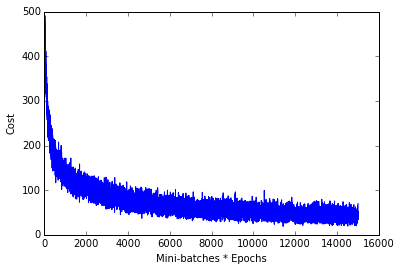
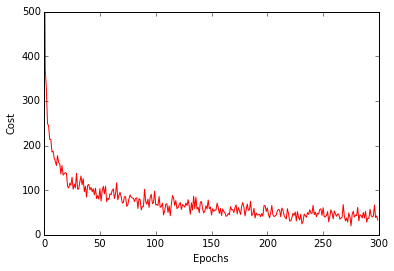

mlxtend
Sebastian Raschka, last updated: 06/24/2015

# Neural Network - Multilayer Perceptron

> from mlxtend.classifier import NeuralNetMLP

Implementation of a feedforward artificial neural network (multilayer perceptron, MLP).
Although the code is fully working and can be used for common classification tasks, this implementation is not geared towards efficiency but clarity -- the original code was written for demonstration purposes.

**A fact sheet of the current implementation:**

- Binary and multi-class classification
- 1 input layer, 1 hidden layer, 1 output layer
- logistic (sigmoid) activation functions (see the activation function [cheatsheet](http://nbviewer.ipython.org/github/rasbt/pattern_classification/blob/master/machine_learning/neural_networks/ipynb/activation_functions.ipynb))
- learning via batch gradient descent or mini-batch gradient descent using the [backpropagation](https://en.wikipedia.org/?title=Backpropagation) algorithm
- optional L1 and/or L2 regularization (penalty)
- Currently only constant learning rate 

**For more details, please see the [source code](https://github.com/rasbt/mlxtend/blob/master/mlxtend/classifier/neuralnet_mlp.py).**

 
 

### Example 1 - Classify Iris

Load 2 features from Iris (petal length and petal width) for visualization purposes.

    from mlxtend.data import iris_data
    X, y = iris_data()
    X = X[:, 2:]
    
Train neural network for 3 output flower classes ('Setosa', 'Versicolor', 'Virginica'), regular gradient decent (minibatches=1), 30 hidden units, and no regularization.

    >>> from mlxtend.classifier import NeuralNetMLP
    >>> import numpy as np
    >>> nn1 = NeuralNetMLP(n_output=3, 
         ... n_features=X.shape[1], 
         ... n_hidden=30, 
         ... l2=0.0, 
         ... l1=0.0, 
         ... epochs=5000, 
         ... eta=0.001, 
         ... minibatches=1, 
         ... shuffle=True,
         ... random_state=1)
    >>> nn1.fit(X, y)
    >>> y_pred = nn1.predict(X)
    >>> acc = np.sum(y == y_pred, axis=0) / X.shape[0]
    >>> print('Accuracy: %.2f%%' % (acc * 100))
    Accuracy: 96.00%
    
Now, check if the gradient descent converged after 5000 epochs, and choose smaller learning rate (`eta`) otherwise.

    >>> import matplotlib.pyplot as plt
    >>> plt.plot(range(len(nn1.cost_)), nn1.cost_)
    >>> plt.ylim([0, 300])
    >>> plt.ylabel('Cost')
    >>> plt.xlabel('Epochs')
    >>> plt.show()

**Note:** In practice, it is recommended to standardize the features for faster and smoother convergence.
    
    >>> X_std = np.copy(X)
    >>> for i in range(2):
        >>> X_std[:,i] = (X[:,i] - X[:,i].mean()) / X[:,i].std()

Visualize the decision regions:

    >>> from mlxtend.evaluate import plot_decision_regions
    >>> plot_decision_regions(X, y, clf=nn1)
    >>> plt.xlabel('petal length [cm]')
    >>> plt.ylabel('petal width [cm]')
    >>> plt.show()
    

 
 

### Example 2 - Classify handwritten digits from MNIST

Load a 5000-sample subset of the [MNIST dataset](http://rasbt.github.io/mlxtend/docs/data/mnist/) (please see [this tutorial](http://nbviewer.ipython.org/github/rasbt/pattern_classification/blob/master/data_collecting/reading_mnist.ipynb) if you want to download and read in the complete MNIST dataset).

    >>> from mlxtend.data import mnist_data
    >>> X, y = mnist_data()

Visualize a sample from the MNIST dataset to check if it was loaded correctly.

    >>> def plot_digit(X, y, idx):
    ...     img = X[idx].reshape(28,28)
    ...     plt.imshow(img, cmap='Greys',  interpolation='nearest')
    ...     plt.title('true label: %d' % y[idx])
    ...     plt.show()
    >>> plot_digit(X, y, 4)    

Initialize the neural network to recognize the 10 different digits (0-10) using 300 epochs and mini-batch learning.

    >>> nn = NeuralNetMLP(n_output=10, n_features=X.shape[1], 
    ...         n_hidden=100, 
    ...         l2=0.0, 
    ...         l1=0.0, 
    ...         epochs=300, 
    ...         eta=0.0005, 
    ...         minibatches=50, 
    ...         random_state=1)

Learn the features while printing the progress to get an idea about how long it may take.

    >>> nn.fit(X, y, print_progress=True)
    Epoch: 300/300
    >>> y_pred = nn.predict(X)
    >>> print('Accuracy: %.2f%%' % (acc * 100))
    ... Accuracy: 94.86%

Check for convergence.

    >>> plt.plot(range(len(nn.cost_)), nn.cost_)
    >>> plt.ylim([0, 500])
    >>> plt.ylabel('Cost')
    >>> plt.xlabel('Mini-batches * Epochs')
    >>> plt.show()

    >>> plt.plot(range(len(nn.cost_)//50), nn.cost_[::50], color='red')
    >>> plt.ylim([0, 500])
    >>> plt.ylabel('Cost')
    >>> plt.xlabel('Epochs')
    >>> plt.show()

 
 

### Default Parameters

<pre>class NeuralNetMLP(object):
    """ Feedforward neural network / Multi-layer perceptron classifier.

    Parameters
    ------------
    n_output : int
      Number of output units, should be equal to the
      number of unique class labels.

    n_features : int
      Number of features (dimensions) in the target dataset.
      Should be equal to the number of columns in the X array.

    n_hidden : int (default: 30)
      Number of hidden units.

    l1 : float (default: 0.0)
      Lambda value for L1-regularization.
      No regularization if l1=0.0 (default)

    l2 : float (default: 0.0)
      Lambda value for L2-regularization.
      No regularization if l2=0.0 (default)

    epochs : int (default: 500)
      Number of passes over the training set.

    eta : float (default: 0.01)
      Learning rate.

    shuffle : bool (default: False)
      Shuffles training data every epoch if True to prevent circles.

    minibatches : int (default: 1)
      Divides training data into k minibatches for efficiency.
      Normal gradient descent learning if k=1 (default).

    random_state : int (default: None)
      Set random state for shuffling and initializing the weights.

    Attributes
    -----------
    cost_ : list
      Sum of squared errors after each epoch.

    """</pre>

### Methods

<pre>def fit(self, X, y, print_progress=False):
    """ Learn weights from training data.

    Parameters
    -----------
    X : array, shape = [n_samples, n_features]
      Input layer with original features.

    y : array, shape = [n_samples]
      Target class labels.

    print_progress : bool (default: False)
      Prints progress as the number of epochs
      to stderr.

    Returns:
    ----------
    self

    """</pre>

<pre>def predict(self, X):
    """Predict class labels

    Parameters
    -----------
    X : array, shape = [n_samples, n_features]
      Input layer with original features.

    Returns:
    ----------
    y_pred : array, shape = [n_samples]
      Predicted class labels.

    """</pre>

