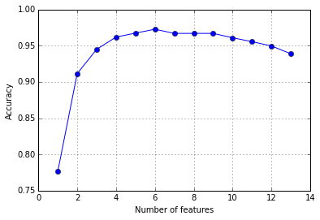

mlxtend  
Sebastian Raschka, last updated: 10/11/2015

# Sequential Forward Selection

> from mlxtend.feature_selection import SFS

Sequential Forward Selection (SFS) is a classic feature selection algorithm -- a greedy search algorithm -- that has been developed as a suboptimal solution to the computationally often not feasible exhaustive search. In a nutshell, SFS adds one feature from the original feature set at the time, based on the classifier performance, until a feature subset of the desired size *k* is reached.

*Related topics:*

- [Sequential Backward Selection](./sequential_backward_selection.md)
- [Sequential Floating Forward Selection](./sequential_floating_forward_selection.md)
- [Sequential Floating Backward Selection](./sequential_floating_backward_selection.md)

---

### The SFS Algorithm

**Input:** $Y = \{y_1, y_2, ..., y_d\}$  

- The ***SFS*** algorithm takes the whole $d$-dimensional feature set as input.

**Output:** $X_k = \{x_j \; | \;j = 1, 2, ..., k; \; x_j \in Y\}$, where $k = (0, 1, 2, ..., d)$

- SFS returns a subset of features; the number of selected features $k$, where $k < d$, has to be specified *a priori*.

**Initialization:** $X_0 = \emptyset$, $k = 0$

- We initialize the algorithm with an empty set $\emptyset$ ("null set") so that $k = 0$ (where $k$ is the size of the subset).

**Step 1 (Inclusion):**  

  $x^+ = \text{ arg max } J(x_k + x), \text{ where }  x \in Y - X_k$  
  $X_k+1 = X_k + x^+$  
  $k = k + 1$    
*Go to Step 1*

- in this step, we add an additional feature, $x^+$, to our feature subset $X_k$.
- $x^+$ is the feature that maximizes our criterion function, that is, the feature that is associated with the best classifier performance if it is added to $X_k$.
- we repeat this procedure until the termination criterion is satisfied.

**Termination:** $k = p$

- We add features from the feature subset $X_k$ until the feature subset of size $k$ contains the number of desired features $p$ that we specified *a priori*.

---

### Example

Input:

    from mlxtend.feature_selection import SFS
    from sklearn.neighbors import KNeighborsClassifier
    from sklearn.datasets import load_iris

    iris = load_iris()
    X = iris.data
    y = iris.target

    knn = KNeighborsClassifier(n_neighbors=4)

    sfs = SFS(knn, k_features=2, scoring='accuracy', cv=5)
    sfs.fit(X, y)

    print('Indices of selected features:', sfs.indices_)
    print('CV score of selected subset:', sfs.k_score_)
    print('New feature subset:')
    sfs.transform(X)[0:5]

Output:

    Indices of selected features: (2, 3)
    CV score of selected subset: 0.966666666667
    New feature subset:
    Out[9]:
    array([[ 1.4,  0.2],
           [ 1.4,  0.2],
           [ 1.3,  0.2],
           [ 1.5,  0.2],
           [ 1.4,  0.2]])

 
 

As demonstrated below, the SFS algorithm can be a useful alternative to dimensionality reduction techniques to reduce overfitting and when the original features need to be preserved:

    import matplotlib.pyplot as plt
    from sklearn.preprocessing import StandardScaler

    scr = StandardScaler()
    X_std = scr.fit_transform(X)

    knn = KNeighborsClassifier(n_neighbors=4)

    # selecting features
    sfs = SFS(knn, k_features=1, scoring='accuracy', cv=5)
    sfs.fit(X_std, y)

    # plotting performance of feature subsets
    k_feat = [len(k) for k in sfs.subsets_]

    plt.plot(k_feat, sfs.scores_, marker='o')
    plt.ylabel('Accuracy')
    plt.xlabel('Number of features')
    plt.show()

## Gridsearch Example 1

Selecting the number of features in a pipeline.

	import pandas as pd
	from sklearn.pipeline import Pipeline
	from sklearn.grid_search import GridSearchCV
	from mlxtend.sklearn import SFS
	from sklearn.neighbors import KNeighborsClassifier
	from sklearn.preprocessing import StandardScaler
	from sklearn.datasets import load_iris

	##########################
	### Loading data
	##########################

	iris = load_iris()
	X = iris.data
	y = iris.target

	##########################
	### Setting up pipeline
	##########################
	knn = KNeighborsClassifier(n_neighbors=4)

	sfs = SFS(estimator=knn, k_features=2, scoring='accuracy', cv=5)

	pipeline = Pipeline([
	            ('scr', StandardScaler()),
	            ('sel', sfs),
	            ('clf', knn)])

	parameters = {'sel__k_features': [1,2,3,4]}

	grid_search = GridSearchCV(pipeline, parameters, n_jobs=1, verbose=1)

	##########################
	### Running GridSearch
	##########################
	grid_search.fit(X, y)

	print("Best score: %0.3f" % grid_search.best_score_)
	print("Best parameters set:")
	best_parameters = grid_search.best_estimator_.get_params()
	for param_name in sorted(parameters.keys()):
	    print("\t%s: %r" % (param_name, best_parameters[param_name]))

Output:

    [Parallel(n_jobs=1)]: Done   1 jobs       | elapsed:    0.1s
    [Parallel(n_jobs=1)]: Done  12 out of  12 | elapsed:    0.8s finished
    Fitting 3 folds for each of 4 candidates, totalling 12 fits
    Best score: 0.960
    Best parameters set:
    	sel__k_features: 1

## Gridsearch Example 2

	import pandas as pd
	from sklearn.pipeline import Pipeline
	from sklearn.grid_search import GridSearchCV
	from mlxtend.sklearn import SFS
	from sklearn.neighbors import KNeighborsClassifier
	from sklearn.preprocessing import StandardScaler
	from sklearn.datasets import load_iris

	##########################
	### Loading data
	##########################

	iris = load_iris()
	X = iris.data
	y = iris.target

	##########################
	### Setting up pipeline
	##########################
	knn = KNeighborsClassifier(n_neighbors=4)

	sfs = SFS(estimator=knn, k_features=2, scoring='accuracy', cv=5)

	pipeline = Pipeline([
	            ('scr', StandardScaler()),
	            ('sel', sfs),
	            ('clf', knn)])

	parameters = {'sel__k_features': [1, 2, 3, 4],
	              'sel__estimator__n_neighbors': [4, 5, 6],
	              'clf__n_neighbors': [4, 5, 6]}

	grid_search = GridSearchCV(pipeline, parameters, n_jobs=1, verbose=1)

	##########################
	### Running GridSearch
	##########################
	grid_search.fit(X, y)

	print("Best score: %0.3f" % grid_search.best_score_)
	print("Best parameters set:")
	best_parameters = grid_search.best_estimator_.get_params()
	for param_name in sorted(parameters.keys()):
	    print("\t%s: %r" % (param_name, best_parameters[param_name]))

Output:

    [Parallel(n_jobs=1)]: Done   1 jobs       | elapsed:    0.1s
    [Parallel(n_jobs=1)]: Done  50 jobs       | elapsed:    4.0s
    Fitting 3 folds for each of 36 candidates, totalling 108 fits
    Best score: 0.973
    Best parameters set:
    	clf__n_neighbors: 5
    	sel__estimator__n_neighbors: 5
    	sel__k_features: 2

The final feature subset can then be obtained as follows:

	print('Best feature subset:')
	grid_search.best_estimator_.steps[1][1].indices_

Output:

    Best feature subset:
    (2, 3)

## Default Parameters

<pre>class SFS(BaseEstimator, MetaEstimatorMixin):
    """ Sequential Forward Selection for feature selection.

    Parameters
    ----------
    estimator : scikit-learn estimator object

    k_features : int
      Number of features to select where k_features.

    scoring : str, (default='accuracy')
      Scoring metric for the cross validation scorer.

    cv : int (default: 5)
      Number of folds in StratifiedKFold.

    n_jobs : int (default: 1)
      The number of CPUs to use for cross validation. -1 means 'all CPUs'.

    Attributes
    ----------
    indices_ : array-like, shape = [n_predictions]
      Indices of the selected subsets.

    k_score_ : float
      Cross validation mean scores of the selected subset

    subsets_ : list of tuples
      Indices of the sequentially selected subsets.

    scores_ : list
      Cross validation mean scores of the sequentially selected subsets.

    Examples
    --------
    >>> from sklearn.neighbors import KNeighborsClassifier
    >>> from sklearn.datasets import load_iris
    >>> iris = load_iris()
    >>> X = iris.data
    >>> y = iris.target
    >>> knn = KNeighborsClassifier(n_neighbors=4)
    >>> sfs = SFS(knn, k_features=2, scoring='accuracy', cv=5)
    >>> sfs = sfs.fit(X, y)
    >>> sfs.indices_
    (0, 3)
    >>> sfs.k_score_
    0.96
    >>> sfs.transform(X)
    array([[ 5.1,  0.2],
       [ 4.9,  0.2],
       [ 4.7,  0.2],
       [ 4.6,  0.2],
       [ 5. ,  0.2]])

    """</pre>
