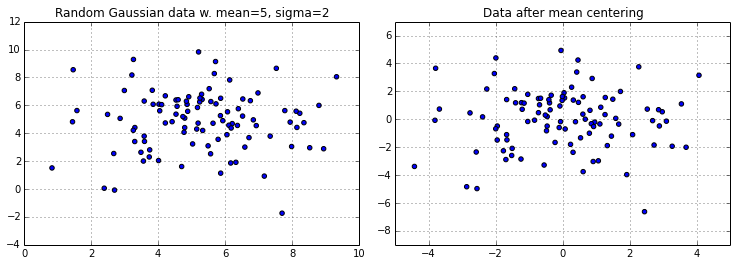

mlxtend  
Sebastian Raschka, last updated: 05/14/2015

# MeanCenterer

> from mlxtend.preprocessing import MeanCenterer

A transformer class that performs column-based mean centering on a NumPy array.

##Example

Use the `fit` method to fit the column means of a dataset (e.g., the training dataset) to a new `MeanCenterer` object. Then, call the `transform` method on the same dataset to center it at the sample mean.

	>>> from mlxtend.preprocessing import MeanCenterer
	>>> X_train
	array([[1, 2, 3],
       [4, 5, 6],
       [7, 8, 9]])
    >>> mc = MeanCenterer().fit(X_train)
	>>> mc.transform(X_train)
    array([[-3, -3, -3],
       [ 0,  0,  0],
       [ 3,  3,  3]])

 

To use the same parameters that were used to center the training dataset, simply call the `transform` method of the `MeanCenterer` instance on a new dataset (e.g., test dataset).
    
    >>> X_test 
    array([[1, 1, 1],
       [1, 1, 1],
       [1, 1, 1]])
    >>> mc.transform(X_test)  
    array([[-3, -4, -5],
       [-3, -4, -5],
       [-3, -4, -5]])

 

The `MeanCenterer` also supports Python list objects, and the `fit_transform` method allows you to directly fit and center the dataset.

	>>> Z
	[1, 2, 3]
	>>> MeanCenterer().fit_transform(Z)
	array([-1,  0,  1])

 

	import matplotlib.pyplot as plt
	import numpy as np

	X = 2 * np.random.randn(100,2) + 5

	plt.scatter(X[:,0], X[:,1])
	plt.grid()
	plt.title('Random Gaussian data w. mean=5, sigma=2')
	plt.show()

	Y = MeanCenterer.fit_transform(X)
	plt.scatter(Y[:,0], Y[:,1])
	plt.grid()
	plt.title('Data after mean centering')
	plt.show()

## Default Parameters

<pre>class MeanCenterer(TransformerObj):
    """
    Class for column centering of vectors and matrices.
    
    Keyword arguments:
        X: NumPy array object where each attribute/variable is
           stored in an individual column. 
           Also accepts 1-dimensional Python list objects.
    
    Class methods:
        fit: Fits column means to MeanCenterer object.
        transform: Uses column means from `fit` for mean centering.
        fit_transform: Fits column means and performs mean centering.
    
    The class methods `transform` and `fit_transform` return a new numpy array
    object where the attributes are centered at the column means.
    
    """</pre>