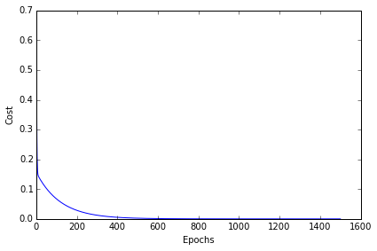

mlxtend
Sebastian Raschka, last updated: 06/18/2015

# Linear Regression

> from mlxtend.regression import LinearRegression

Implementation of a linear regression model for performing ordinary least squares regression using one of the following three approaches:

- normal equation (closed-form solution)
- gradient descent
- stochastic gradient descent 

For more usage examples please see the [IPython Notebook](http://nbviewer.ipython.org/github/rasbt/mlxtend/blob/master/docs/examples/regression__linear_regression.ipynb).

 
### Example 1 - Normal Equation

The closed-form solution should be preferred for "smaller" datasets where calculating (a "costly") is not a concern. For very large datasets, or datasets where the inverse of [**X**^T **X**] may not exist (the matrix is non-invertible or singular, e.g., in case of perfect multicollinearity), the gradient descent or stochastic gradient descent approaches are to be preferred.

The linear function (linear regression model) is defined as:

where *y* is the response variable, ***x*** is an *m*-dimensional sample vector, and ***w*** is the weight vector (vector of coefficients). Note that *w_0* represents the y-axis intercept of the model and therefore *x_0*=1.  

Using the closed-form solution (normal equation), we can calculate the weights of the model as follows:
	

	
where ***X*** is the matrix of the data samples. After obtaining the weight, the intercept (w_0) can be calculated from the difference of the true and predicted average responses: 

    >>> import numpy as np
	>>> X = np.array([ 1, 2, 3, 4, 5])[:, np.newaxis]
	>>> y = np.array([ 1, 2, 3, 4, 5])

	>>> import matplotlib.pyplot as plt
	>>> def lin_regplot(X, y, model):
    ... 	plt.scatter(X, y, c='blue')
    ... 	plt.plot(X, model.predict(X), color='red')    
    ... 	return
    	
    >>> ne_lr = LinearRegression(solver='normal_equation')
    >>> ne_lr.fit(X, y)
    >>> print('Intercept: %.2f' % ne_lr.w_[0])
    Intercept: 0.00
    >>> print('Slope: %.2f' % ne_lr.w_[1])
    Slope: 1.00
    
    lin_regplot(X, y, ne_lr)
    plt.show()
    

 

### Example 2 - Gradient Descent

Using the gradient decent optimization algorithm, the weights are updated incrementally after each epoch (= pass over the training dataset).

    >>> gd_lr = LinearRegression(solver='gd', eta=0.005, epochs=1500, random_seed=0)
    >>> gd_lr.fit(X, y)
    >>> print('Intercept: %.2f' % gd_lr.w_[0])
    Intercept: 0.00
    >>> print('Slope: %.2f' % gd_lr.w_[1])
    Slope: 1.00
    
Visualizing the cost to check for convergence and plotting the linear model:

    >>> plt.plot(range(1, gd_lr.epochs+1), gd_lr.cost_)
    >>> plt.xlabel('Epochs')
    >>> plt.ylabel('Cost')
    >>> plt.tight_layout()
    >>> plt.show()    
 
 
 
    >>>  lin_regplot(X, y, gd_lr)
    >>>  plt.show()
    
 
 
 
 **Tip**: I you are using gradient descent, consider standardizing the variables for better convergence of the algorithm.
 
    >>> X_std = (X - np.mean(X)) / X.std()
    >>> y_std = (y - np.mean(y)) / y.std()
    
    >>> gd_lr = LinearRegression(solver='gd', eta=0.1, epochs=10, random_seed=0)
    >>> gd_lr.fit(X_std, y_std)
    >>> print('Intercept: %.2f' % gd_lr.w_[0])
    Intercept: 0.00
    >>> print('Slope: %.2f' % gd_lr.w_[1])
    Slope: 1.00
    
    
 
 
 
 
### Example 3 - Stochastic Gradient Descent
 
Example 2 explained "batch" gradient descent learning. The "batch" updates refers to the fact that the cost function is minimized based on the complete training data set. In contrast, stochastic gradient descent performs the weight update incrementally after each individual training sample.

The process of incrementally updating the weights is also called "stochastic" gradient descent since it approximates the minimization of the cost function. Although the stochastic gradient descent approach might sound inferior to gradient descent due its "stochastic" nature and the "approximated" direction (gradient), it can have certain advantages in practice. Often, stochastic gradient descent converges much faster than gradient descent since the updates are applied immediately after each training sample; stochastic gradient descent is computationally more efficient, especially for very large datasets. 

    >>> sgd_lr = LinearRegression(solver='sgd', eta=0.1, epochs=10, random_seed=0)
    >>> sgd_lr.fit(X_std, y_std)
    >>> print('Intercept: %.2f' % sgd_lr.w_[0])
    Intercept: 0.00
    >>> print('Slope: %.2f' % sgd_lr.w_[1])
    Slope: 1.00
 
    >>> plt.plot(range(1, sgd_lr.epochs+1), sgd_lr.cost_)
    >>> plt.xlabel('Epochs')
    >>> plt.ylabel('Cost')
    >>> plt.tight_layout()
    >>> plt.show()

 

    >>> plt.plot(range(1, sgd_lr.epochs+1), sgd_lr.cost_)
    >>> plt.xlabel('Epochs')
    >>> plt.ylabel('Cost')
    >>> plt.tight_layout()
    >>> plt.show()    
    
    
   

### Default Parameters

<pre>    class LinearRegression(object):
        """ Ordinary least squares linear regression.

        Parameters
        ------------
    
        solver : {'gd', 'sgd', 'normal_equation'} (default: 'normal_equation')
          Method for solving the cost function. 'gd' for gradient descent, 
          'sgd' for stochastic gradient descent, or 'normal_equation' (default)
          to solve the cost function analytically.
    
        eta : float (default: 0.1)
          Learning rate (between 0.0 and 1.0); 
          ignored if solver='normal_equation'.

        epochs : int (default: 50)
          Passes over the training dataset; 
          ignored if solver='normal_equation'.

        shuffle : bool (default: False)
            Shuffles training data every epoch if True to prevent circles;
            ignored if solver='normal_equation'.

        random_seed : int (default: None)
            Set random state for shuffling and initializing the weights;
            ignored if solver='normal_equation'.

        zero_init_weight : bool (default: False)
            If True, weights are initialized to zero instead of small random
            numbers in the interval [0,1];
            ignored if solver='normal_equation'

        Attributes
        -----------
        w_ : 1d-array
          Weights after fitting.

        cost_ : list
          Sum of squared errors after each epoch;
          ignored if solver='normal_equation'

        """</pre>

### Methods

<pre>    def fit(self, X, y, init_weights=True):
        """ Fit training data.

        Parameters
        ----------
        X : {array-like, sparse matrix}, shape = [n_samples, n_features]
            Training vectors, where n_samples is the number of samples and
            n_features is the number of features.

        y : array-like, shape = [n_samples]
            Target values.

        init_weights : bool (default: True)
            (Re)initializes weights to small random floats if True.

        Returns
        -------
        self : object
        """</pre>

<pre>    def predict(self, X):
        """
        Predict target values for X.

        Parameters
        ----------
        X : {array-like, sparse matrix}, shape = [n_samples, n_features]
            Training vectors, where n_samples is the number of samples and
            n_features is the number of features.

        Returns
        ----------
        float : Predicted target value.

        """</pre>

