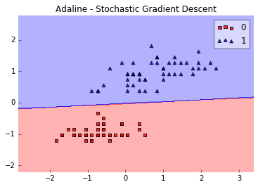
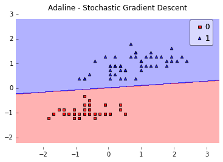

# Adaptive Linear Neuron -- Adaline

An implementation of the ADAptive LInear NEuron, Adaline, for binary classification tasks.

> from mlxtend.classifier import Adaline

# Overview

An illustration of the ADAptive LInear NEuron (Adaline) -- a single-layer artificial linear neuron with a threshold unit:
    


The Adaline classifier is closely related to the Ordinary Least Squares (OLS) Linear Regression algorithm; in OLS regression we find the line (or hyperplane) that minimizes the vertical offsets. Or in other words, we define the best-fitting line as the line that minimizes the sum of squared errors (SSE) or mean squared error (MSE) between our target variable (y) and our predicted output over all samples $i$ in our dataset of size $n$.

$$ SSE =  \sum_i (\text{target}^{(i)} - \text{output}^{(i)})^2$$

$$MSE = \frac{1}{n} \times SSE$$


[`LinearRegression`](../regressor/LinearRegression.md) implements a linear regression model for performing ordinary least squares regression, and in Adaline, we add a threshold function $g(\cdot)$ to convert the continuous outcome to a categorical class label:

$$y = g({z}) = \left\{
    \begin{array}{l}
    1 & \text{if z $\ge$ 0}\\
    -1 & \text{otherwise}.
    \end{array}
    \\  
  \right.$$

An Adaline model can be trained by one of the following three approaches:

- Normal Equations
- Gradient Descent
- Stochastic Gradient Descent

### Normal Equations (closed-form solution)

The closed-form solution should be preferred for "smaller" datasets where calculating (a "costly") matrix inverse is not a concern. For very large datasets, or datasets where the inverse of $[X^T X]$ may not exist (the matrix is non-invertible or singular, e.g., in case of perfect multicollinearity), the gradient descent or stochastic gradient descent approaches are to be preferred.

The linear function (linear regression model) is defined as:

$$z = w_0x_0 + w_1x_1 + ... + w_mx_m = \sum_{j=1}^{m} w_j x_j = \mathbf{w}^T\mathbf{x}$$

where $y$ is the response variable, $\mathbf{x}$ is an $m$-dimensional sample vector, and $\mathbf{w}$ is the weight vector (vector of coefficients). Note that $w_0$ represents the y-axis intercept of the model and therefore $x_0=1$.  

Using the closed-form solution (normal equation), we compute the weights of the model as follows:

$$ \mathbf{w} = (\mathbf{X}^T\mathbf{X})^{-1}\mathbf{X}^Ty$$

### Gradient Descent (GD)  and Stochastic Gradient Descent (SGD) 

In the current implementation, the Adaline model is learned via Gradient Descent or Stochastic Gradient Descent.

See [Gradient Descent and Stochastic Gradient Descent](../general_concepts/gradient-optimization.html) and [Deriving the Gradient Descent Rule for Linear Regression and Adaline](../general_concepts/linear-gradient-derivative.md) for details.

Random shuffling is implemented as:

- for one or more epochs
    - randomly shuffle samples in the training set
        - for training sample *i*
            - compute gradients and perform weight updates

### References


- B. Widrow, M. E. Hoff, et al. [Adaptive switching circuits](http://www.rob.uni-luebeck.de/index.php?id=267). 1960.

# Examples

## Example 1 - Closed Form Solution


```python
from mlxtend.data import iris_data
from mlxtend.evaluate import plot_decision_regions
from mlxtend.classifier import Adaline
import matplotlib.pyplot as plt

# Loading Data

X, y = iris_data()
X = X[:, [0, 3]] # sepal length and petal width
X = X[0:100] # class 0 and class 1
y = y[0:100] # class 0 and class 1

# standardize
X[:,0] = (X[:,0] - X[:,0].mean()) / X[:,0].std()
X[:,1] = (X[:,1] - X[:,1].mean()) / X[:,1].std()


ada = Adaline(epochs=30, eta=0.01, solver='normal equation', random_seed=1)
ada.fit(X, y)
plot_decision_regions(X, y, clf=ada)
plt.title('Adaline - Stochastic Gradient Descent')

plt.show()
```


## Example 2 - Gradient Descent


```python
from mlxtend.data import iris_data
from mlxtend.evaluate import plot_decision_regions
from mlxtend.classifier import Adaline
import matplotlib.pyplot as plt

# Loading Data

X, y = iris_data()
X = X[:, [0, 3]] # sepal length and petal width
X = X[0:100] # class 0 and class 1
y = y[0:100] # class 0 and class 1

# standardize
X[:,0] = (X[:,0] - X[:,0].mean()) / X[:,0].std()
X[:,1] = (X[:,1] - X[:,1].mean()) / X[:,1].std()


ada = Adaline(epochs=30, eta=0.01, solver='gd', random_seed=1)
ada.fit(X, y)
plot_decision_regions(X, y, clf=ada)
plt.title('Adaline - Stochastic Gradient Descent')
plt.show()

plt.plot(range(len(ada.cost_)), ada.cost_, marker='o')
plt.xlabel('Iterations')
plt.ylabel('Cost')
```


    <matplotlib.text.Text at 0x1095e0a90>


## Example 3 - Stochastic Gradient Descent


```python
from mlxtend.data import iris_data
from mlxtend.evaluate import plot_decision_regions
from mlxtend.classifier import Adaline
import matplotlib.pyplot as plt

# Loading Data

X, y = iris_data()
X = X[:, [0, 3]] # sepal length and petal width
X = X[0:100] # class 0 and class 1
y = y[0:100] # class 0 and class 1

# standardize
X[:,0] = (X[:,0] - X[:,0].mean()) / X[:,0].std()
X[:,1] = (X[:,1] - X[:,1].mean()) / X[:,1].std()


ada = Adaline(epochs=15, eta=0.01, solver='sgd', random_seed=1)
ada.fit(X, y)
plot_decision_regions(X, y, clf=ada)
plt.title('Adaline - Stochastic Gradient Descent')
plt.show()

plt.plot(range(len(ada.cost_)), ada.cost_, marker='o')
plt.xlabel('Iterations')
plt.ylabel('Cost')
plt.show()
```








# API


*Adaline(eta=0.01, epochs=50, solver='sgd', random_seed=None, shuffle=False, zero_init_weight=False)*

ADAptive LInear NEuron classifier.

**Parameters**

- `eta` : float (default: 0.01)

    solver rate (between 0.0 and 1.0)

- `epochs` : int (default: 50)

    Passes over the training dataset.

- `solver` : {'gd', 'sgd', 'normal equation'} (default: 'sgd')

    Method for solving the cost function. 'gd' for gradient descent,
    'sgd' for stochastic gradient descent, or 'normal equation' (default)
    to solve the cost function analytically.

- `shuffle` : bool (default: False)

    Shuffles training data every epoch if True to prevent circles.

- `random_seed` : int (default: None)

    Set random state for shuffling and initializing the weights.

- `zero_init_weight` : bool (default: False)

    If True, weights are initialized to zero instead of small random
    numbers in the interval [-0.1, 0.1];
    ignored if solver='normal equation'

**Attributes**

- `w_` : 1d-array

    Weights after fitting.

- `cost_` : list

    Sum of squared errors after each epoch.

### Methods

<hr>

*activation(X)*

Compute the linear activation from the net input.

<hr>

*fit(X, y, init_weights=True)*

Learn weight coefficients from training data.

**Parameters**

- `X` : {array-like, sparse matrix}, shape = [n_samples, n_features]

    Training vectors, where n_samples is the number of samples and
    n_features is the number of features.

- `y` : array-like, shape = [n_samples]

    Target values.

- `init_weights` : bool (default: True)

    Re-initializes weights prior to fitting. Set False to continue
    training with weights from a previous fitting.

**Returns**

- `self` : object


<hr>

*net_input(X)*

Compute the linear net input.

<hr>

*predict(X)*

Predict class labels of X.

**Parameters**

- `X` : {array-like, sparse matrix}, shape = [n_samples, n_features]

    Training vectors, where n_samples is the number of samples and
    n_features is the number of features.

**Returns**

- `class` : int

    Predicted class label.


