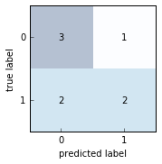

# Confusion Matrix

Functions for generating confusion matrices.

> `from mlxtend.evaluate import confusion_matrix`    
> `from mlxtend.evaluate import plot_confusion_matrix`

# Overview

## Confusion Matrix

The *confusion matrix* (or *error matrix*) is one way to summarize the performance of a classifier for binary classification tasks. This square matrix consists of columns and rows that list the number of instances as absolute or relative "actual class" vs. "predicted class" ratios.


Let $P$ be the label of class 1 and $N$ be the label of a second class or the label of all classes that are *not class 1* in a multi-class setting.


### References

- -

### Related Topics

- [Scoring Metrics](./scoring)

# Examples

## Example 1 -- Binary classification


```python
from mlxtend.evaluate import confusion_matrix

y_target =    [0, 0, 1, 0, 0, 1, 1, 1]
y_predicted = [1, 0, 1, 0, 0, 0, 0, 1]

cm = confusion_matrix(y_target=y_target, y_predicted=y_predicted)
cm
```


    array([[3, 1],
           [2, 2]])


```python
import matplotlib.pyplot as plt
from mlxtend.evaluate import plot_confusion_matrix

fig, ax = plot_confusion_matrix(conf_mat=cm)
plt.show()
```





## Example 2 -- Multi-class classification


```python
from mlxtend.evaluate import confusion_matrix

y_target =    [1, 1, 1, 0, 0, 2, 0, 3]
y_predicted = [1, 0, 1, 0, 0, 2, 1, 3]

cm = confusion_matrix(y_target=y_target, y_predicted=y_predicted, binary=False)
cm
```


    array([[2, 1, 0, 0],
           [1, 2, 0, 0],
           [0, 0, 1, 0],
           [0, 0, 0, 1]])


```python
import matplotlib.pyplot as plt
from mlxtend.evaluate import confusion_matrix

fig, ax = plot_confusion_matrix(conf_mat=cm)
plt.show()
```


## Example 3 -- Multi-class to binary

By setting `binary=True`, all class labels that are not the positive class label are being summarized to class 0. The positive class label becomes class 1.


```python
import matplotlib.pyplot as plt
from mlxtend.evaluate import confusion_matrix

y_target =    [1, 1, 1, 0, 0, 2, 0, 3]
y_predicted = [1, 0, 1, 0, 0, 2, 1, 3]

cm = confusion_matrix(y_target=y_target, y_predicted=y_predicted, binary=True, positive_label=1)
cm
```


    array([[4, 1],
           [1, 2]])


```python
from mlxtend.evaluate import plot_confusion_matrix

fig, ax = plot_confusion_matrix(conf_mat=cm)
plt.show()
```


# API


*confusion_matrix(y_target, y_predicted, binary=False, positive_label=1)*

Compute a confusion matrix/contingency table.

**Parameters**

- `y_target` : array-like, shape=[n_samples]

    True class labels.

- `y_predicted` : array-like, shape=[n_samples]

    Predicted class labels.

- `binary` : bool (default: True)

    Maps a multi-class problem onto a
    binary confusion matrix, where
    the positive class is 1 and
    all other classes are 0.

- `positive_label` : int (default: 1)

    Class label of the positive class.

<br><br>
*plot_confusion_matrix(conf_mat, hide_spines=False, hide_ticks=False, figsize=(2.5, 2.5), cmap=None, alpha=0.3)*

Plot a confusion matrix via matplotlib.

**Parameters**

- `conf_mat` : array-like, shape = [n_classes, n_classes]

    Confusion matrix from evaluate.confusion matrix.

- `hide_spines` : bool (default: False)

    Hides axis spines if True.

- `hide_ticks` : bool (default: False)

    Hides axis ticks if True

- `figsize` : tuple (default: (2.5, 2.5))

    Height and width of the figure

- `cmap` : matplotlib colormap (default: `None`)

    Uses matplotlib.pyplot.cm.Blues if `None`

**Returns**

- `fig, ax` : matplotlib.pyplot subplot objects

    Figure and axis elements of the subplot.


