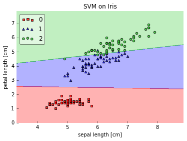
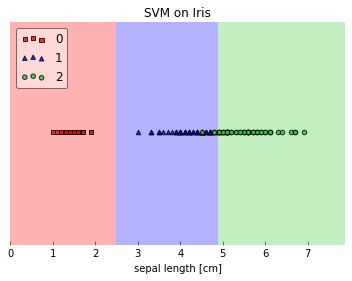
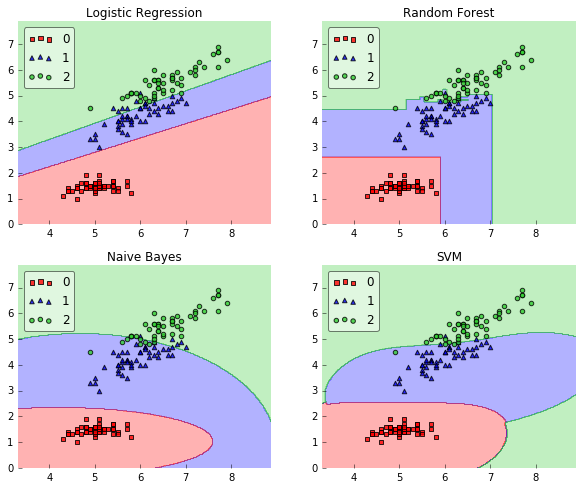
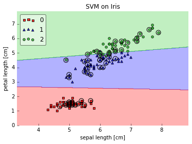
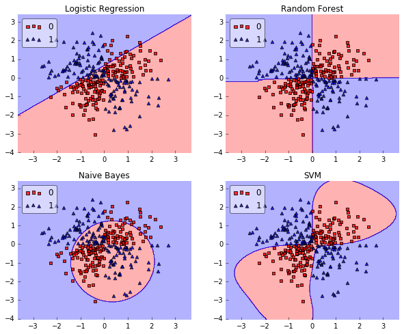
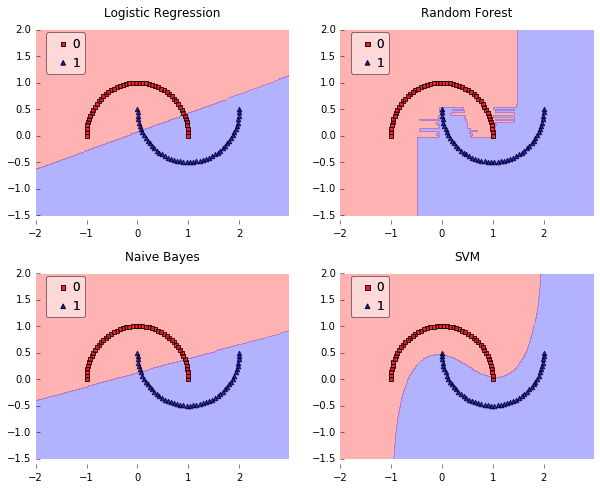
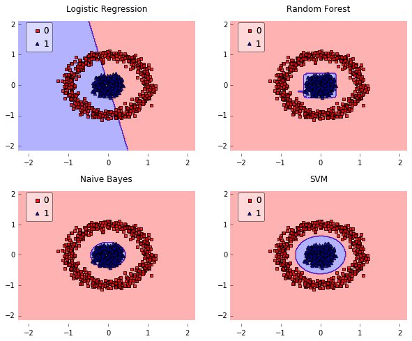

# Plotting Decision Regions

A function for plotting decision regions of classifiers in 1 or 2 dimensions.

> from mlxtend.evaluate import plot_decision_regions

### References

- 

# Examples

## Example 1 - Decision regions in 2D


```python
from mlxtend.evaluate import plot_decision_regions
import matplotlib.pyplot as plt
from sklearn import datasets
from sklearn.svm import SVC

# Loading some example data
iris = datasets.load_iris()
X = iris.data[:, [0,2]]
y = iris.target

# Training a classifier
svm = SVC(C=0.5, kernel='linear')
svm.fit(X,y)

# Plotting decision regions
plot_decision_regions(X, y, clf=svm, res=0.02, legend=2)

# Adding axes annotations
plt.xlabel('sepal length [cm]')
plt.ylabel('petal length [cm]')
plt.title('SVM on Iris')
plt.show()
```





## Example 2 - Decision regions in 1D


```python
from mlxtend.evaluate import plot_decision_regions
import matplotlib.pyplot as plt
from sklearn import datasets
from sklearn.svm import SVC

# Loading some example data
iris = datasets.load_iris()
X = iris.data[:, 2]
X = X[:, None]
y = iris.target

# Training a classifier
svm = SVC(C=0.5, kernel='linear')
svm.fit(X,y)

# Plotting decision regions
plot_decision_regions(X, y, clf=svm, res=0.02, legend=2)

# Adding axes annotations
plt.xlabel('sepal length [cm]')
plt.title('SVM on Iris')

plt.show()
```





## Example 3 - Decision Region Grids


```python
from sklearn.linear_model import LogisticRegression
from sklearn.naive_bayes import GaussianNB 
from sklearn.ensemble import RandomForestClassifier
from sklearn.svm import SVC
from sklearn import datasets
import numpy as np

# Initializing Classifiers
clf1 = LogisticRegression(random_state=1)
clf2 = RandomForestClassifier(random_state=1)
clf3 = GaussianNB()
clf4 = SVC()

# Loading some example data
iris = datasets.load_iris()
X = iris.data[:, [0,2]]
y = iris.target
```


```python
import matplotlib.pyplot as plt
from mlxtend.evaluate import plot_decision_regions
import matplotlib.gridspec as gridspec
import itertools
gs = gridspec.GridSpec(2, 2)

fig = plt.figure(figsize=(10,8))

for clf, lab, grd in zip([clf1, clf2, clf3, clf4],
                         ['Logistic Regression', 'Random Forest', 'Naive Bayes', 'SVM'],
                         itertools.product([0, 1], repeat=2)):

    clf.fit(X, y)
    ax = plt.subplot(gs[grd[0], grd[1]])
    fig = plot_decision_regions(X=X, y=y, clf=clf, legend=2)
    plt.title(lab)
    
plt.show()
```





## Example 4 - Highlighting Test Data Points


```python
from mlxtend.evaluate import plot_decision_regions
from mlxtend.preprocessing import shuffle_arrays_unison
import matplotlib.pyplot as plt
from sklearn import datasets
from sklearn.svm import SVC


# Loading some example data
iris = datasets.load_iris()
X, y = iris.data[:, [0,2]], iris.target
X, y = shuffle_arrays_unison(arrays=[X, y], random_seed=3)

X_train, y_train = X[:100], y[:100]
X_test, y_test = X[100:], y[100:]

# Training a classifier
svm = SVC(C=0.5, kernel='linear')
svm.fit(X_train, y_train)

# Plotting decision regions
plot_decision_regions(X, y, clf=svm, res=0.02, legend=2, X_highlight=X_test)

# Adding axes annotations
plt.xlabel('sepal length [cm]')
plt.ylabel('petal length [cm]')
plt.title('SVM on Iris')
plt.show()
```





## Example 5 - Evaluating Classifier Behavior on Non-Linear Problems


```python
from sklearn.linear_model import LogisticRegression
from sklearn.naive_bayes import GaussianNB 
from sklearn.ensemble import RandomForestClassifier
from sklearn.svm import SVC

# Initializing Classifiers
clf1 = LogisticRegression(random_state=1)
clf2 = RandomForestClassifier(n_estimators=100, random_state=1)
clf3 = GaussianNB()
clf4 = SVC()
```


```python
# Loading Plotting Utilities
import matplotlib.pyplot as plt
import matplotlib.gridspec as gridspec
import itertools
#from mlxtend.evaluate import plot_decision_regions
import numpy as np
```

### XOR


```python
xx, yy = np.meshgrid(np.linspace(-3, 3, 50),
                     np.linspace(-3, 3, 50))
rng = np.random.RandomState(0)
X = rng.randn(300, 2)
y = np.array(np.logical_xor(X[:, 0] > 0, X[:, 1] > 0), dtype=int)
```


```python
gs = gridspec.GridSpec(2, 2)

fig = plt.figure(figsize=(10,8))

for clf, lab, grd in zip([clf1, clf2, clf3, clf4],
                         ['Logistic Regression', 'Random Forest', 'Naive Bayes', 'SVM'],
                         itertools.product([0, 1], repeat=2)):

    clf.fit(X, y)
    ax = plt.subplot(gs[grd[0], grd[1]])
    fig = plot_decision_regions(X=X, y=y, clf=clf, legend=2)
    plt.title(lab)

plt.show()
```





### Half-Moons


```python
from sklearn.datasets import make_moons
X, y = make_moons(n_samples=100, random_state=123)

gs = gridspec.GridSpec(2, 2)

fig = plt.figure(figsize=(10,8))

for clf, lab, grd in zip([clf1, clf2, clf3, clf4],
                         ['Logistic Regression', 'Random Forest', 'Naive Bayes', 'SVM'],
                         itertools.product([0, 1], repeat=2)):

    clf.fit(X, y)
    ax = plt.subplot(gs[grd[0], grd[1]])
    fig = plot_decision_regions(X=X, y=y, clf=clf, legend=2)
    plt.title(lab)

plt.show()
```





### Concentric Circles


```python
from sklearn.datasets import make_circles
X, y = make_circles(n_samples=1000, random_state=123, noise=0.1, factor=0.2)

gs = gridspec.GridSpec(2, 2)

fig = plt.figure(figsize=(10,8))

for clf, lab, grd in zip([clf1, clf2, clf3, clf4],
                         ['Logistic Regression', 'Random Forest', 'Naive Bayes', 'SVM'],
                         itertools.product([0, 1], repeat=2)):

    clf.fit(X, y)
    ax = plt.subplot(gs[grd[0], grd[1]])
    fig = plot_decision_regions(X=X, y=y, clf=clf, legend=2)
    plt.title(lab)

plt.show()
```





# API


*plot_decision_regions(X, y, clf, ax=None, X_highlight=None, res=0.02, legend=1, hide_spines=True, markers='s^oxv<>', colors='red,blue,limegreen,gray,cyan')*

Plot decision regions of a classifier.

**Parameters**

- `X` : array-like, shape = [n_samples, n_features]

    Feature Matrix.

- `y` : array-like, shape = [n_samples]

    True class labels.

- `clf` : Classifier object.

    Must have a .predict method.

- `ax` : matplotlib.axes.Axes (default: None)

    An existing matplotlib Axes. Creates
    one if ax=None.

- `X_highlight` : array-like, shape = [n_samples, n_features] (default: None)

    An array with data points that are used to highlight samples in `X`.

- `res` : float (default: 0.02)

    Grid width. Lower values increase the resolution but
    slow down the plotting.

- `hide_spines` : bool (default: True)

    Hide axis spines if True.

- `legend` : int (default: 1)

    Integer to specify the legend location.
    No legend if legend is 0.

- `markers` : list

    Scatterplot markers.

- `colors` : str (default 'red,blue,limegreen,gray,cyan')

    Comma separated list of colors.

**Returns**

- `ax` : matplotlib.axes.Axes object


