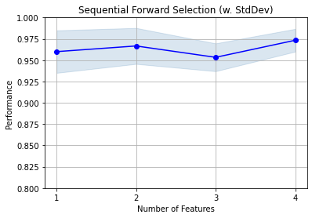

# Sequential Feature Selector

Implementation of *sequential feature algorithms* (SFAs) -- greedy search algorithms -- that have been developed as a suboptimal solution to the computationally often not feasible exhaustive search.

> from mlxtend.feature_selection import SequentialFeatureSelector

# Overview

In a nutshell, SFAs remove or add one feature at the time based on the classifier performance until a feature subset of the desired size k is reached. There are 4 different flavors of SFAs available via the `SequentialFeatureSelector`:

1. Sequential Forward Selection (SFS)
2. Sequential Backward Selection (SBS)
3. Sequential Floating Forward Selection (SFFS)
4. Sequential Floating Backward Selection (SFBS)

The ***floating*** variants, SFFS and SFBS can be considered as extensions to the simpler SFS and SBS algorithms. The floating algorithms have an additional exclusion or inclusion step to remove features once they were included (or excluded), so that a larger number of feature subset combinations can be sampled. It is important to emphasize that this step is conditional and only occurs if the resulting feature subset is assessed as "better" by the criterion function after removal (or addition) of a particular feature. Furthermore, I added an optional check to skip the conditional exclusion steps if the algorithm gets stuck in cycles.  
The algorithms are outlined in pseudo code below:

## Sequential Forward Selection (SFS)


**Input:** $Y = \{y_1, y_2, ..., y_d\}$  

- The ***SFS*** algorithm takes the whole $d$-dimensional feature set as input.


**Output:** $X_k = \{x_j \; | \;j = 1, 2, ..., k; \; x_j \in Y\}$, where $k = (0, 1, 2, ..., d)$

- SFS returns a subset of features; the number of selected features $k$, where $k < d$, has to be specified *a priori*.

**Initialization:** $X_0 = \emptyset$, $k = 0$

- We initialize the algorithm with an empty set $\emptyset$ ("null set") so that $k = 0$ (where $k$ is the size of the subset).

**Step 1 (Inclusion):**  

  $x^+ = \text{ arg max } J(x_k + x), \text{ where }  x \in Y - X_k$  
  $X_k+1 = X_k + x^+$  
  $k = k + 1$    
*Go to Step 2*

- in this step, we add an additional feature, $x^+$, to our feature subset $X_k$.
- $x^+$ is the feature that maximizes our criterion function, that is, the feature that is associated with the best classifier performance if it is added to $X_k$.

**Step 2 (Conditional Exclusion):**  

$x^- = \text{ arg max } J(x_k - x), \text{ where } x \in X_k$  
$if \; J(x_k - x) > J(x_k - x)$:    
&nbsp;&nbsp;&nbsp;&nbsp; $X_k-1 = X_k - x^-$  
&nbsp;&nbsp;&nbsp;&nbsp; $k = k - 1$    
*Go to Step 1*  

- In Step 2, we only remove a feature if the resulting subset would gain an increase in performance. We go back to Step 1.  
- Steps 1 and 2 are reapeated until the **Termination** criterion is reached.

**Termination:** $k = p$

- We add features from the feature subset $X_k$ until the feature subset of size $k$ contains the number of desired features $p$ that we specified *a priori*.

## Sequential Floating Backward (SBS)

**Input:** the set of all features, $Y = \{y_1, y_2, ..., y_d\}$  

- The SBS algorithm takes the whole feature set as input.

**Output:** $X_k = \{x_j \; | \;j = 1, 2, ..., k; \; x_j \in Y\}$, where $k = (0, 1, 2, ..., d)$

- SBS returns a subset of features; the number of selected features $k$, where $k < d$, has to be specified *a priori*.

**Initialization:** $X_0 = Y$, $k = d$

- We initialize the algorithm with the given feature set so that the $k = d$.


**Step 1 (Exclusion):**  

$x^- = \text{ arg max } J(x_k - x), \text{  where } x \in X_k$  
$X_k-1 = X_k - x^-$  
$k = k - 1$  
*Go to Step 1*  

- In this step, we remove a feature, $x^-$ from our feature subset $X_k$.
- $x^-$ is the feature that maximizes our criterion function upon re,oval, that is, the feature that is associated with the best classifier performance if it is removed from $X_k$.
- We repeat this procedure until the termination criterion is satisfied.


**Termination:** $k = p$

- We add features from the feature subset $X_k$ until the feature subset of size $k$ contains the number of desired features $p$ that we specified *a priori*.


## Sequential Floating Backward Selection (SFBS)

**Input:** the set of all features, $Y = \{y_1, y_2, ..., y_d\}$  

- The SFBS algorithm takes the whole feature set as input.

**Output:** $X_k = \{x_j \; | \;j = 1, 2, ..., k; \; x_j \in Y\}$, where $k = (0, 1, 2, ..., d)$

- SFBS returns a subset of features; the number of selected features $k$, where $k < d$, has to be specified *a priori*.

**Initialization:** $X_0 = Y$, $k = d$

- We initialize the algorithm with the given feature set so that the $k = d$.

**Step 1 (Exclusion):**  

$x^- = \text{ arg max } J(x_k - x), \text{  where } x \in X_k$  
$X_k-1 = X_k - x^-$  
$k = k - 1$  
*Go to Step 2*  

- In this step, we remove a feature, $x^-$ from our feature subset $X_k$.
- $x^-$ is the feature that maximizes our criterion function upon re,oval, that is, the feature that is associated with the best classifier performance if it is removed from $X_k$.


**Step 2 (Conditional Inclusion):**  
<br>
$x^+ = \text{ arg max } J(x_k + x), \text{ where } x \in Y - X_k$  
*if J(x_k + x) > J(x_k + x)*:    
&nbsp;&nbsp;&nbsp;&nbsp; $X_k+1 = X_k + x^+$  
&nbsp;&nbsp;&nbsp;&nbsp; $k = k + 1$  
*Go to Step 1*  

- In Step 2, we search for features that improve the classifier performance if they are added back to the feature subset. If such features exist, we add the feature $x^+$ for which the perfomance improvement is max.
- Steps 1 and 2 are reapeated until the **Termination** criterion is reached.

**Termination:** $k = p$

- We add features from the feature subset $X_k$ until the feature subset of size $k$ contains the number of desired features $p$ that we specified *a priori*.


## Sequential Floating Forward Selection (SFFS)

**Input:** the set of all features, $Y = \{y_1, y_2, ..., y_d\}$  

- The ***SFFS*** algorithm takes the whole feature set as input, if our feature space consists of, e.g. 10, if our feature space consists of 10 dimensions (***d = 10***).
<br><br>

**Output:** a subset of features, $X_k = \{x_j \; | \;j = 1, 2, ..., k; \; x_j \in Y\}$, where $k = (0, 1, 2, ..., d)$

- The returned output of the algorithm is a subset of the feature space of a specified size. E.g., a subset of 5 features from a 10-dimensional feature space (***k = 5, d = 10***).
<br><br>

**Initialization:** $X_0 = Y$, $k = d$

- We initialize the algorithm with an empty set ("null set") so that the ***k = 0*** (where ***k*** is the size of the subset)
<br><br>

**Step 1 (Inclusion):**  
<br>
&nbsp;&nbsp;&nbsp;&nbsp; $x^+ = \text{ arg max } J(x_k + x), \text{ where }  x \in Y - X_k$  
&nbsp;&nbsp;&nbsp;&nbsp; $X_k+1 = X_k + x^+$  
&nbsp;&nbsp;&nbsp;&nbsp; $k = k + 1$    
&nbsp;&nbsp;&nbsp;&nbsp;*Go to Step 2*  
<br> <br>
**Step 2 (Conditional Exclusion):**  
<br>
&nbsp;&nbsp;&nbsp;&nbsp; $x^- = \text{ arg max } J(x_k - x), \text{ where } x \in X_k$  
&nbsp;&nbsp;&nbsp;&nbsp;$if \; J(x_k - x) > J(x_k - x)$:    
&nbsp;&nbsp;&nbsp;&nbsp;&nbsp;&nbsp;&nbsp;&nbsp; $X_k-1 = X_k - x^- $  
&nbsp;&nbsp;&nbsp;&nbsp;&nbsp;&nbsp;&nbsp;&nbsp; $k = k - 1$    
&nbsp;&nbsp;&nbsp;&nbsp;*Go to Step 1*  

- In step 1, we include the feature from the ***feature space*** that leads to the best performance increase for our ***feature subset*** (assessed by the ***criterion function***). Then, we go over to step 2
- In step 2, we only remove a feature if the resulting subset would gain an increase in performance. We go back to step 1.  
- Steps 1 and 2 are reapeated until the **Termination** criterion is reached.
<br><br>

**Termination:** stop when ***k*** equals the number of desired features


### References

- Ferri, F., et al. [*"Comparative study of techniques for large-scale feature selection."*](https://books.google.com/books?hl=en&lr=&id=sbajBQAAQBAJ&oi=fnd&pg=PA403&dq=comparative+study+of+techniques+for+large+scale&ots=KdIOYpA8wj&sig=hdOsBP1HX4hcDjx4RLg_chheojc#v=onepage&q=comparative%20study%20of%20techniques%20for%20large%20scale&f=false) Pattern Recognition in Practice IV (1994): 403-413.

# Examples

## Example 1 - A simple Sequential Forward Selection example

Initializing a simple classifier from scikit-learn:


```python
from sklearn.neighbors import KNeighborsClassifier
from sklearn.datasets import load_iris
iris = load_iris()
X = iris.data
y = iris.target
knn = KNeighborsClassifier(n_neighbors=4)
```

We start by selection the "best" 3 features from the Iris dataset via Sequential Forward Selection (SFS). Here, we set `forward=True` and `floating=False`. By choosing `cv=0`, we don't perform any cross-validation, therefore, the performance (here: `'accuracy'`) is computed entirely on the training set. 


```python
from mlxtend.feature_selection import SequentialFeatureSelector as SFS

sfs1 = SFS(knn, 
           k_features=3, 
           forward=True, 
           floating=False, 
           scoring='accuracy',
           cv=0)
sfs1 = sfs1.fit(X, y)
```

    Features: 3/3

Via the `subsets_` attribute, we can take a look at the selected feature indices at each step:


```python
sfs1.subsets_
```


    {1: {'avg_score': 0.95999999999999996,
      'cv_scores': array([ 0.96]),
      'feature_idx': (3,)},
     2: {'avg_score': 0.97333333333333338,
      'cv_scores': array([ 0.97333333]),
      'feature_idx': (2, 3)},
     3: {'avg_score': 0.97333333333333338,
      'cv_scores': array([ 0.97333333]),
      'feature_idx': (1, 2, 3)}}


Furthermore, we can access the indices of the 3 best features directly via the `k_feature_idx_` attribute:


```python
sfs1.k_feature_idx_
```


    (1, 2, 3)


Finally, the prediction score for these 3 features can be accesses via `k_score_`:


```python
sfs1.k_score_
```


    0.97333333333333338


## Example 2 - Toggling between SFS, SBS, SFFS, and SFBS

Using the `forward` and `floating` parameters, we can toggle between SFS, SBS, SFFS, and SFBS as shown below. Note that we are performing (stratified) 4-fold cross-validation for more robust estimates in contrast to Example 1. Via `n_jobs=-1`, we choose to run the cross-validation on all our available CPU cores.


```python
# Sequential Forward Selection
sfs = SFS(knn, 
          k_features=3, 
          forward=True, 
          floating=False, 
          scoring='accuracy',
          print_progress=False,
          cv=4,
          n_jobs=-1)
sfs = sfs.fit(X, y)

print('\nSequential Forward Selection (k=3):')
print(sfs.k_feature_idx_)
print('CV Score:')
print(sfs.k_score_)

###################################################

# Sequential Backward Selection
sbs = SFS(knn, 
          k_features=3, 
          forward=False, 
          floating=False, 
          scoring='accuracy',
          print_progress=False,
          cv=4,
          n_jobs=-1)
sbs = sbs.fit(X, y)

print('\nSequential Backward Selection (k=3):')
print(sbs.k_feature_idx_)
print('CV Score:')
print(sbs.k_score_)

###################################################

# Sequential Floating Forward Selection
sffs = SFS(knn, 
           k_features=3, 
           forward=True, 
           floating=True, 
           scoring='accuracy',
           print_progress=False,
           cv=4,
           n_jobs=-1)
sffs = sffs.fit(X, y)

print('\nSequential Floating Forward Selection (k=3):')
print(sffs.k_feature_idx_)
print('CV Score:')
print(sffs.k_score_)

###################################################

# Sequential Floating Backward Selection
sfbs = SFS(knn, 
           k_features=3, 
           forward=False, 
           floating=True, 
           scoring='accuracy',
           print_progress=False,
           cv=4,
           n_jobs=-1)
sfbs = sfbs.fit(X, y)

print('\nSequential Floating Backward Selection (k=3):')
print(sfbs.k_feature_idx_)
print('CV Score:')
print(sfbs.k_score_)
```

    
    Sequential Forward Selection (k=3):
    (1, 2, 3)
    CV Score:
    0.972756410256
    
    Sequential Backward Selection (k=3):
    (1, 2, 3)
    CV Score:
    0.972756410256
    
    Sequential Floating Forward Selection (k=3):
    (1, 2, 3)
    CV Score:
    0.972756410256
    
    Sequential Floating Backward Selection (k=3):
    (1, 2, 3)
    CV Score:
    0.972756410256


In this simple scenario, selecting the best 3 features out of the 4 available features in the Iris set, we end up with similar results regardless of which sequential selection algorithms we used.

## Example 3 - Visualizing the results in DataFrames

 For our convenience, we can visualize the output from the feature selection in a pandas DataFrame format using the `get_metric_dict` method of the SequentialFeatureSelector object. The columns `std_dev` and `std_err` represent the standard deviation and standard errors of the cross-validation scores, respectively.

Below, we see the DataFrame of the Sequential Forward Selector from Example 2:


```python
import pandas as pd
pd.DataFrame.from_dict(sfs.get_metric_dict()).T
```


<div>
<table border="1" class="dataframe">
  <thead>
    <tr style="text-align: right;">
      <th></th>
      <th>avg_score</th>
      <th>ci_bound</th>
      <th>cv_scores</th>
      <th>feature_idx</th>
      <th>std_dev</th>
      <th>std_err</th>
    </tr>
  </thead>
  <tbody>
    <tr>
      <th>1</th>
      <td>0.952991</td>
      <td>0.0660624</td>
      <td>[0.974358974359, 0.948717948718, 0.88888888888...</td>
      <td>(3,)</td>
      <td>0.0412122</td>
      <td>0.0237939</td>
    </tr>
    <tr>
      <th>2</th>
      <td>0.959936</td>
      <td>0.0494801</td>
      <td>[0.974358974359, 0.948717948718, 0.91666666666...</td>
      <td>(2, 3)</td>
      <td>0.0308676</td>
      <td>0.0178214</td>
    </tr>
    <tr>
      <th>3</th>
      <td>0.972756</td>
      <td>0.0315204</td>
      <td>[0.974358974359, 1.0, 0.944444444444, 0.972222...</td>
      <td>(1, 2, 3)</td>
      <td>0.0196636</td>
      <td>0.0113528</td>
    </tr>
  </tbody>
</table>
</div>


Now, let's compare it to the Sequential Backward Selector:


```python
pd.DataFrame.from_dict(sbs.get_metric_dict()).T
```


<div>
<table border="1" class="dataframe">
  <thead>
    <tr style="text-align: right;">
      <th></th>
      <th>avg_score</th>
      <th>ci_bound</th>
      <th>cv_scores</th>
      <th>feature_idx</th>
      <th>std_dev</th>
      <th>std_err</th>
    </tr>
  </thead>
  <tbody>
    <tr>
      <th>3</th>
      <td>0.972756</td>
      <td>0.0315204</td>
      <td>[0.974358974359, 1.0, 0.944444444444, 0.972222...</td>
      <td>(1, 2, 3)</td>
      <td>0.0196636</td>
      <td>0.0113528</td>
    </tr>
    <tr>
      <th>4</th>
      <td>0.952991</td>
      <td>0.0372857</td>
      <td>[0.974358974359, 0.948717948718, 0.91666666666...</td>
      <td>(0, 1, 2, 3)</td>
      <td>0.0232602</td>
      <td>0.0134293</td>
    </tr>
  </tbody>
</table>
</div>


We can see that both SFS and SFBS found the same "best" 3 features, however, the intermediate steps where obviously different.

The `ci_bound` column in the DataFrames above represents the confidence interval around the computed cross-validation scores. By default, a confidence interval of 95% is used, but we can use different confidence bounds via the `confidence_interval` parameter. E.g., the confidence bounds for a 90% confidence interval can be obtained as follows:


```python
pd.DataFrame.from_dict(sbs.get_metric_dict(confidence_interval=0.90)).T
```


<div>
<table border="1" class="dataframe">
  <thead>
    <tr style="text-align: right;">
      <th></th>
      <th>avg_score</th>
      <th>ci_bound</th>
      <th>cv_scores</th>
      <th>feature_idx</th>
      <th>std_dev</th>
      <th>std_err</th>
    </tr>
  </thead>
  <tbody>
    <tr>
      <th>3</th>
      <td>0.972756</td>
      <td>0.0242024</td>
      <td>[0.974358974359, 1.0, 0.944444444444, 0.972222...</td>
      <td>(1, 2, 3)</td>
      <td>0.0196636</td>
      <td>0.0113528</td>
    </tr>
    <tr>
      <th>4</th>
      <td>0.952991</td>
      <td>0.0286292</td>
      <td>[0.974358974359, 0.948717948718, 0.91666666666...</td>
      <td>(0, 1, 2, 3)</td>
      <td>0.0232602</td>
      <td>0.0134293</td>
    </tr>
  </tbody>
</table>
</div>


## Example 4 - Plotting the results

After importing the little helper function `plot_sequential_feature_selection`, we can also visualize the results using matplotlib figures.


```python
from mlxtend.feature_selection import plot_sequential_feature_selection as plot_sfs
import matplotlib.pyplot as plt

sfs = SFS(knn, 
          k_features=4, 
          forward=True, 
          floating=False, 
          scoring='accuracy',
          cv=5)

sfs = sfs.fit(X, y)

fig1 = plot_sfs(sfs.get_metric_dict(), kind='std_dev')

plt.ylim([0.8, 1])
plt.title('Sequential Forward Selection (w. StdDev)')
plt.grid()
plt.show()
```

    Features: 4/4


## Example 5 - Sequential Feature Selection for Regression

Similar to the classification examples above, the `SequentialFeatureSelector` also supports scikit-learn's estimators
for regression.


```python
from sklearn.linear_model import LinearRegression
from sklearn.datasets import load_boston

boston = load_boston()
X, y = boston.data, boston.target

lr = LinearRegression()

sfs = SFS(lr, 
          k_features=13, 
          forward=True, 
          floating=False, 
          scoring='mean_squared_error',
          cv=10)

sfs = sfs.fit(X, y)
fig = plot_sfs(sfs.get_metric_dict(), kind='std_err')

plt.title('Sequential Forward Selection (w. StdDev)')
plt.grid()
plt.show()
```

    Features: 13/13





# API


*SequentialFeatureSelector(estimator, k_features, forward=True, floating=False, print_progress=True, scoring='accuracy', cv=5, skip_if_stuck=True, n_jobs=1, pre_dispatch='2*n_jobs')*

Sequential Feature Selection for Classification and Regression.

**Parameters**

- `estimator` : scikit-learn classifier or regressor


- `k_features` : int

    Number of features to select,
    where k_features < the full feature set.

- `forward` : bool (default: True)

    Forward selection if True,
    backward selection otherwise

- `floating` : bool (default: False)

    Adds a conditional exclusion/inclusion if True.

- `print_progress` : bool (default: True)

    Prints progress as the number of epochs
    to stderr.

- `scoring` : str, (default='accuracy')

    Scoring metric in {accuracy, f1, precision, recall, roc_auc}
    for classifiers,
    {'mean_absolute_error', 'mean_squared_error',
    'median_absolute_error', 'r2'} for regressors,
    or a callable object or function with
    signature ``scorer(estimator, X, y)``.

- `cv` : int (default: 5)

    Scikit-learn cross-validation generator or `int`.
    If estimator is a classifier (or y consists of integer class labels),
    stratified k-fold is performed, and regular k-fold cross-validation
    otherwise.
    No cross-validation if cv is None, False, or 0.
    skip_if_stuck: bool (default: True)
    Set to True to skip conditional
    exlusion/inclusion if floating=True and
    algorithm gets stuck in cycles.

- `n_jobs` : int (default: 1)

    The number of CPUs to use for cross validation. -1 means 'all CPUs'.

- `pre_dispatch` : int, or string

    Controls the number of jobs that get dispatched
    during parallel execution in cross_val_score.
    Reducing this number can be useful to avoid an explosion of
    memory consumption when more jobs get dispatched than CPUs can process.
    This parameter can be:
    None, in which case all the jobs are immediately created and spawned.
    Use this for lightweight and fast-running jobs,
    to avoid delays due to on-demand spawning of the jobs
    An int, giving the exact number of total jobs that are spawned
    A string, giving an expression as a function
    of n_jobs, as in `2*n_jobs`

**Attributes**

- `k_feature_idx_` : array-like, shape = [n_predictions]

    Feature Indices of the selected feature subsets.

- `k_score_` : float

    Cross validation average score of the selected subset.

- `subsets_` : dict

    A dictionary of selected feature subsets during the
    sequential selection, where the dictionary keys are
    the lenghts k of these feature subsets. The dictionary
    values are dictionaries themselves with the following
    keys: 'feature_idx' (tuple of indices of the feature subset)
    'cv_scores' (list individual cross-validation scores)
    'avg_score' (average cross-validation score)

### Methods

<hr>

*fit(X, y)*

None

<hr>

*fit_transform(X, y)*

None

<hr>

*get_metric_dict(confidence_interval=0.95)*

None

<hr>

*get_params(deep=True)*

Get parameters for this estimator.

**Parameters**

deep: boolean, optional
    If True, will return the parameters for this estimator and
    contained subobjects that are estimators.

**Returns**

- `params` : mapping of string to any

    Parameter names mapped to their values.

<hr>

*set_params(**params)*

Set the parameters of this estimator.

    The method works on simple estimators as well as on nested objects
    (such as pipelines). The former have parameters of the form
    ``<component>__<parameter>`` so that it's possible to update each
    component of a nested object.

**Returns**

self

<hr>

*transform(X)*

None

<br><br>
*plot_sequential_feature_selection(metric_dict, kind='std_dev', color='blue', bcolor='steelblue', marker='o', alpha=0.2, ylabel='Performance', confidence_interval=0.95)*

Plot sequential feature selection.

**Parameters**

- `metric_dict` : mlxtend.SequentialFeatureSelector.get_metric_dict() object


- `kind` : str (default: "std_dev")

    The kind of error bar or confidence interval in
    {'std_dev', 'std_err', 'ci', None}.

- `color` : str (default: "blue")

    Color of the lineplot (accepts any matplotlib color name)

- `bcolor` : str (default: "steelblue").

    Color of the error bars / confidence intervals
    (accepts any matplotlib color name).

- `marker` : str (default: "o")

    Marker of the line plot
    (accepts any matplotlib marker name).

- `alpha` : float in [0, 1] (default: 0.2)

    Transparency of the error bars / confidence intervals.

- `ylabel` : str (default: "Performance")

    Y-axis label.

- `confidence_interval` : float (default: 0.95)

    Confidence level if `kind='ci'`.

**Returns**

- `fig` : matplotlib.pyplot.figure() object


