### Welcome to mlxtend's documentation!

**Mlxtend (machine learning extensions) is a Python library of useful tools for the day-to-day data science tasks.**


<hr>

## Links

- Documentation:
    - html: [http://rasbt.github.io/mlxtend/](http://rasbt.github.io/mlxtend/)
    - pdf: [http://sebastianraschka.com/pdf/software/mlxtend-latest.pdf](http://sebastianraschka.com/pdf/software/mlxtend-latest.pdf)
- Source code repository: [https://github.com/rasbt/mlxtend](https://github.com/rasbt/mlxtend)
- PyPI: [https://pypi.python.org/pypi/mlxtend](https://pypi.python.org/pypi/mlxtend)
- Questions? Check out the [Google Groups mailing list](https://groups.google.com/forum/#!forum/mlxtend)

<hr>


## Examples

```python
import numpy as np
import matplotlib.pyplot as plt
import matplotlib.gridspec as gridspec
import itertools
from sklearn.linear_model import LogisticRegression
from sklearn.svm import SVC
from sklearn.ensemble import RandomForestClassifier
from mlxtend.classifier import EnsembleVoteClassifier
from mlxtend.data import iris_data
from mlxtend.plotting import plot_decision_regions

# Initializing Classifiers
clf1 = LogisticRegression(random_state=0)
clf2 = RandomForestClassifier(random_state=0)
clf3 = SVC(random_state=0, probability=True)
eclf = EnsembleVoteClassifier(clfs=[clf1, clf2, clf3],
                              weights=[2, 1, 1], voting='soft')

# Loading some example data
X, y = iris_data()
X = X[:,[0, 2]]

# Plotting Decision Regions

gs = gridspec.GridSpec(2, 2)
fig = plt.figure(figsize=(10, 8))

labels = ['Logistic Regression',
          'Random Forest',
          'RBF kernel SVM',
          'Ensemble']

for clf, lab, grd in zip([clf1, clf2, clf3, eclf],
                         labels,
                         itertools.product([0, 1],
                         repeat=2)):
    clf.fit(X, y)
    ax = plt.subplot(gs[grd[0], grd[1]])
    fig = plot_decision_regions(X=X, y=y,
                                clf=clf, legend=2)
    plt.title(lab)

plt.show()
```

---


If you use mlxtend as part of your workflow in a scientific publication, please consider citing the mlxtend repository with the following DOI:


```
@misc{raschkas_2016_594432,
  author       = {Raschka, Sebastian},
  title        = {Mlxtend},
  month        = apr,
  year         = 2016,
  doi          = {10.5281/zenodo.594432},
  url          = {http://dx.doi.org/10.5281/zenodo.594432}
}
```


## License

- This project is released under a permissive new BSD open source license ([LICENSE-BSD3.txt](https://github.com/rasbt/mlxtend/blob/master/LICENSE-BSD3.txt)) and commercially usable. There is no warranty; not even for merchantability or fitness for a particular purpose.
- In addition, you may use, copy, modify and redistribute all artistic creative works (figures and images) included in this distribution under the directory
according to the terms and conditions of the Creative Commons Attribution 4.0 International License.  See the file [LICENSE-CC-BY.txt](https://github.com/rasbt/mlxtend/blob/master/LICENSE-CC-BY.txt) for details. (Computer-generated graphics such as the plots produced by matplotlib fall under the BSD license mentioned above).

## Contact

I received a lot of feedback and questions about mlxtend recently, and I thought that it would be worthwhile to set up a public communication channel. Before you write an email with a question about mlxtend, please consider posting it here since it can also be useful to others! Please join the [Google Groups Mailing List](https://groups.google.com/forum/#!forum/mlxtend)!

If Google Groups is not for you, please feel free to write me an [email](mailto:mail@sebastianraschka.com) or consider filing an issue on [GitHub's issue tracker](https://github.com/rasbt/mlxtend/issues) for new feature requests or bug reports. In addition, I setup a [Gitter channel](https://gitter.im/rasbt/mlxtend?utm_source=badge&utm_medium=badge&utm_campaign=pr-badge&utm_content=badge) for live discussions.


# `frequent_patterns.apriori`
## Frequent Itemsets via Apriori Algorithm

Apriori function to extract frequent itemsets for association rule mining

> from mlxtend.frequent_patterns import apriori

## Overview

Apriori is a popular algorithm [1] for extracting frequent itemsets with applications in association rule learning. The apriori algorithm has been designed to operate on databases containing transactions, such as purchases by customers of a store. A itemset is considered as "frequent" if it meets a user-specified support threshold. For instance, if the support threshold is set to 0.5 (50%), a frequent itemset is defined as a set of items that occur togehter in at least 50% of all transactions in the database.

## References

[1] Agrawal, Rakesh, and Ramakrishnan Srikant. "[Fast algorithms for mining association rules](https://www.it.uu.se/edu/course/homepage/infoutv/ht08/vldb94_rj.pdf)." Proc. 20th int. conf. very large data bases, VLDB. Vol. 1215. 1994.

## Example 1

The `apriori` function expects data in a one-hot encoded pandas DataFrame.
Suppose we have the following transaction data:


```python
dataset = [['Milk', 'Onion', 'Nutmeg', 'Kidney Beans', 'Eggs', 'Yogurt'],
           ['Dill', 'Onion', 'Nutmeg', 'Kidney Beans', 'Eggs', 'Yogurt'],
           ['Milk', 'Apple', 'Kidney Beans', 'Eggs'],
           ['Milk', 'Unicorn', 'Corn', 'Kidney Beans', 'Yogurt'],
           ['Corn', 'Onion', 'Onion', 'Kidney Beans', 'Ice cream', 'Eggs']]
```

We can transform it into the right format via the `OnehotTransactions` encoder as follows:


```python
import pandas as pd
from mlxtend.preprocessing import OnehotTransactions

oht = OnehotTransactions()
oht_ary = oht.fit(dataset).transform(dataset)
df = pd.DataFrame(oht_ary, columns=oht.columns_)
df
```


<div>
<table border="1" class="dataframe">
  <thead>
    <tr style="text-align: right;">
      <th></th>
      <th>Apple</th>
      <th>Corn</th>
      <th>Dill</th>
      <th>Eggs</th>
      <th>Ice cream</th>
      <th>Kidney Beans</th>
      <th>Milk</th>
      <th>Nutmeg</th>
      <th>Onion</th>
      <th>Unicorn</th>
      <th>Yogurt</th>
    </tr>
  </thead>
  <tbody>
    <tr>
      <th>0</th>
      <td>0</td>
      <td>0</td>
      <td>0</td>
      <td>1</td>
      <td>0</td>
      <td>1</td>
      <td>1</td>
      <td>1</td>
      <td>1</td>
      <td>0</td>
      <td>1</td>
    </tr>
    <tr>
      <th>1</th>
      <td>0</td>
      <td>0</td>
      <td>1</td>
      <td>1</td>
      <td>0</td>
      <td>1</td>
      <td>0</td>
      <td>1</td>
      <td>1</td>
      <td>0</td>
      <td>1</td>
    </tr>
    <tr>
      <th>2</th>
      <td>1</td>
      <td>0</td>
      <td>0</td>
      <td>1</td>
      <td>0</td>
      <td>1</td>
      <td>1</td>
      <td>0</td>
      <td>0</td>
      <td>0</td>
      <td>0</td>
    </tr>
    <tr>
      <th>3</th>
      <td>0</td>
      <td>1</td>
      <td>0</td>
      <td>0</td>
      <td>0</td>
      <td>1</td>
      <td>1</td>
      <td>0</td>
      <td>0</td>
      <td>1</td>
      <td>1</td>
    </tr>
    <tr>
      <th>4</th>
      <td>0</td>
      <td>1</td>
      <td>0</td>
      <td>1</td>
      <td>1</td>
      <td>1</td>
      <td>0</td>
      <td>0</td>
      <td>1</td>
      <td>0</td>
      <td>0</td>
    </tr>
  </tbody>
</table>
</div>


Now, let us return the items and itemsets with at least 60% support:


```python
from mlxtend.frequent_patterns import apriori

apriori(df, min_support=0.6)
```


<div>
<table border="1" class="dataframe">
  <thead>
    <tr style="text-align: right;">
      <th></th>
      <th>support</th>
      <th>itemsets</th>
    </tr>
  </thead>
  <tbody>
    <tr>
      <th>0</th>
      <td>0.8</td>
      <td>[3]</td>
    </tr>
    <tr>
      <th>1</th>
      <td>1.0</td>
      <td>[5]</td>
    </tr>
    <tr>
      <th>2</th>
      <td>0.6</td>
      <td>[6]</td>
    </tr>
    <tr>
      <th>3</th>
      <td>0.6</td>
      <td>[8]</td>
    </tr>
    <tr>
      <th>4</th>
      <td>0.6</td>
      <td>[10]</td>
    </tr>
    <tr>
      <th>5</th>
      <td>0.8</td>
      <td>[3, 5]</td>
    </tr>
    <tr>
      <th>6</th>
      <td>0.6</td>
      <td>[3, 8]</td>
    </tr>
    <tr>
      <th>7</th>
      <td>0.6</td>
      <td>[5, 6]</td>
    </tr>
    <tr>
      <th>8</th>
      <td>0.6</td>
      <td>[5, 8]</td>
    </tr>
    <tr>
      <th>9</th>
      <td>0.6</td>
      <td>[5, 10]</td>
    </tr>
    <tr>
      <th>10</th>
      <td>0.6</td>
      <td>[3, 5, 8]</td>
    </tr>
  </tbody>
</table>
</div>


By default, `apriori` returns the column indices of the items, which may be useful in downstream operations such as association rule mining. For better readability, we can set `use_colnames=True` to convert these integer values into the respective item names: 


```python
apriori(df, min_support=0.6, use_colnames=True)
```


<div>
<table border="1" class="dataframe">
  <thead>
    <tr style="text-align: right;">
      <th></th>
      <th>support</th>
      <th>itemsets</th>
    </tr>
  </thead>
  <tbody>
    <tr>
      <th>0</th>
      <td>0.8</td>
      <td>[Eggs]</td>
    </tr>
    <tr>
      <th>1</th>
      <td>1.0</td>
      <td>[Kidney Beans]</td>
    </tr>
    <tr>
      <th>2</th>
      <td>0.6</td>
      <td>[Milk]</td>
    </tr>
    <tr>
      <th>3</th>
      <td>0.6</td>
      <td>[Onion]</td>
    </tr>
    <tr>
      <th>4</th>
      <td>0.6</td>
      <td>[Yogurt]</td>
    </tr>
    <tr>
      <th>5</th>
      <td>0.8</td>
      <td>[Eggs, Kidney Beans]</td>
    </tr>
    <tr>
      <th>6</th>
      <td>0.6</td>
      <td>[Eggs, Onion]</td>
    </tr>
    <tr>
      <th>7</th>
      <td>0.6</td>
      <td>[Kidney Beans, Milk]</td>
    </tr>
    <tr>
      <th>8</th>
      <td>0.6</td>
      <td>[Kidney Beans, Onion]</td>
    </tr>
    <tr>
      <th>9</th>
      <td>0.6</td>
      <td>[Kidney Beans, Yogurt]</td>
    </tr>
    <tr>
      <th>10</th>
      <td>0.6</td>
      <td>[Eggs, Kidney Beans, Onion]</td>
    </tr>
  </tbody>
</table>
</div>


## Example 2

The advantage of working with pandas `DataFrames` is that we can use its convenient features to filter the results. For instance, let's assume we are only interested in itemsets of length 2 that have a support of at least 80 percent. First, we create the frequent itemsets via `apriori` and add a new column that stores the length of each itemset:


```python
frequent_itemsets = apriori(df, min_support=0.6, use_colnames=True)
frequent_itemsets['length'] = frequent_itemsets['itemsets'].apply(lambda x: len(x))
frequent_itemsets
```


<div>
<table border="1" class="dataframe">
  <thead>
    <tr style="text-align: right;">
      <th></th>
      <th>support</th>
      <th>itemsets</th>
      <th>length</th>
    </tr>
  </thead>
  <tbody>
    <tr>
      <th>0</th>
      <td>0.8</td>
      <td>[Eggs]</td>
      <td>1</td>
    </tr>
    <tr>
      <th>1</th>
      <td>1.0</td>
      <td>[Kidney Beans]</td>
      <td>1</td>
    </tr>
    <tr>
      <th>2</th>
      <td>0.6</td>
      <td>[Milk]</td>
      <td>1</td>
    </tr>
    <tr>
      <th>3</th>
      <td>0.6</td>
      <td>[Onion]</td>
      <td>1</td>
    </tr>
    <tr>
      <th>4</th>
      <td>0.6</td>
      <td>[Yogurt]</td>
      <td>1</td>
    </tr>
    <tr>
      <th>5</th>
      <td>0.8</td>
      <td>[Eggs, Kidney Beans]</td>
      <td>2</td>
    </tr>
    <tr>
      <th>6</th>
      <td>0.6</td>
      <td>[Eggs, Onion]</td>
      <td>2</td>
    </tr>
    <tr>
      <th>7</th>
      <td>0.6</td>
      <td>[Kidney Beans, Milk]</td>
      <td>2</td>
    </tr>
    <tr>
      <th>8</th>
      <td>0.6</td>
      <td>[Kidney Beans, Onion]</td>
      <td>2</td>
    </tr>
    <tr>
      <th>9</th>
      <td>0.6</td>
      <td>[Kidney Beans, Yogurt]</td>
      <td>2</td>
    </tr>
    <tr>
      <th>10</th>
      <td>0.6</td>
      <td>[Eggs, Kidney Beans, Onion]</td>
      <td>3</td>
    </tr>
  </tbody>
</table>
</div>


Then, we can select the results that satisfy our desired criteria as follows:


```python
frequent_itemsets[ (frequent_itemsets['length'] == 2) &
                   (frequent_itemsets['support'] >= 0.8) ]
```


<div>
<table border="1" class="dataframe">
  <thead>
    <tr style="text-align: right;">
      <th></th>
      <th>support</th>
      <th>itemsets</th>
      <th>length</th>
    </tr>
  </thead>
  <tbody>
    <tr>
      <th>5</th>
      <td>0.8</td>
      <td>[Eggs, Kidney Beans]</td>
      <td>2</td>
    </tr>
  </tbody>
</table>
</div>


## API


*apriori(df, min_support=0.5, use_colnames=False)*

Get frequent itemsets from a one-hot DataFrame
**Parameters**

- `df` : pandas DataFrame

    pandas DataFrame in one-hot encoded format. For example
    Apple  Bananas  Beer  Chicken  Milk  Rice
    0      1        0     1        1     0     1
    1      1        0     1        0     0     1
    2      1        0     1        0     0     0
    3      1        1     0        0     0     0
    4      0        0     1        1     1     1
    5      0        0     1        0     1     1
    6      0        0     1        0     1     0
    7      1        1     0        0     0     0

- `min_support` : float (default: 0.5)

    A float between 0 and 1 for minumum support of the itemsets returned.
    The support is computed as the fraction
    transactions_where_item(s)_occur / total_transactions.

- `use_colnames` : bool (default: False)

    If true, uses the DataFrames' column names in the returned DataFrame
    instead of column indices.
**Returns**

pandas DataFrame with columns ['support', 'itemsets'] of all itemsets
    that are >= min_support.


# `frequent_patterns.association_rules`
## Association Rules Generation from Frequent Itemsets

Function to generate association rules from frequent itemsets

> from mlxtend.frequent_patterns import association_rules

## Overview

Rule generation is a common task in the mining of frequent patterns. _An association rule is an implication expression of the form $X \rightarrow Y$, where $X$ and $Y$ are disjoint itemsets_ [1]. A more concrete example based on consumer behaviour would be  $\{Diapers\} \rightarrow \{Beer\}$ suggesting that people who buy diapers are also likely to buy beer. To evaluate the "interest" of such an association rule, different metrics have been developed. The current implementation make use of the `confidence` and `lift` metrics. 

## References


[1] Tan, Steinbach, Kumar. Introduction to Data Mining. Pearson New International Edition. Harlow: Pearson Education Ltd., 2014. (pp. 327-414).

## Example 1

The `generate_rules` takes dataframes of frequent itemsets as produced by the `apriori` function in *mlxtend.association*. To demonstrate the usage of the `generate_rules` method, we first create a pandas `DataFrame` of frequent itemsets as generated by the [`apriori`](./apriori.md) function:


```python
import pandas as pd
from mlxtend.preprocessing import OnehotTransactions
from mlxtend.frequent_patterns import apriori


dataset = [['Milk', 'Onion', 'Nutmeg', 'Kidney Beans', 'Eggs', 'Yogurt'],
           ['Dill', 'Onion', 'Nutmeg', 'Kidney Beans', 'Eggs', 'Yogurt'],
           ['Milk', 'Apple', 'Kidney Beans', 'Eggs'],
           ['Milk', 'Unicorn', 'Corn', 'Kidney Beans', 'Yogurt'],
           ['Corn', 'Onion', 'Onion', 'Kidney Beans', 'Ice cream', 'Eggs']]

oht = OnehotTransactions()
oht_ary = oht.fit(dataset).transform(dataset)
df = pd.DataFrame(oht_ary, columns=oht.columns_)
frequent_itemsets = apriori(df, min_support=0.6, use_colnames=True)

frequent_itemsets
```


<div>
<table border="1" class="dataframe">
  <thead>
    <tr style="text-align: right;">
      <th></th>
      <th>support</th>
      <th>itemsets</th>
    </tr>
  </thead>
  <tbody>
    <tr>
      <th>0</th>
      <td>0.8</td>
      <td>[Eggs]</td>
    </tr>
    <tr>
      <th>1</th>
      <td>1.0</td>
      <td>[Kidney Beans]</td>
    </tr>
    <tr>
      <th>2</th>
      <td>0.6</td>
      <td>[Milk]</td>
    </tr>
    <tr>
      <th>3</th>
      <td>0.6</td>
      <td>[Onion]</td>
    </tr>
    <tr>
      <th>4</th>
      <td>0.6</td>
      <td>[Yogurt]</td>
    </tr>
    <tr>
      <th>5</th>
      <td>0.8</td>
      <td>[Eggs, Kidney Beans]</td>
    </tr>
    <tr>
      <th>6</th>
      <td>0.6</td>
      <td>[Eggs, Onion]</td>
    </tr>
    <tr>
      <th>7</th>
      <td>0.6</td>
      <td>[Kidney Beans, Milk]</td>
    </tr>
    <tr>
      <th>8</th>
      <td>0.6</td>
      <td>[Kidney Beans, Onion]</td>
    </tr>
    <tr>
      <th>9</th>
      <td>0.6</td>
      <td>[Kidney Beans, Yogurt]</td>
    </tr>
    <tr>
      <th>10</th>
      <td>0.6</td>
      <td>[Eggs, Kidney Beans, Onion]</td>
    </tr>
  </tbody>
</table>
</div>


The `generate_rules()` function allows you to (1) specify your metric of interest and (2) the according threshold. Currently implemented measures are **confidence** and **lift**. Let's say you are interesting in rules derived from the frequent itemsets only if the level of confidence is above the 90 percent threshold (`min_threshold=0.9`):


```python
from mlxtend.frequent_patterns import association_rules

association_rules(frequent_itemsets, metric="confidence", min_threshold=0.9)
```


<div>
<table border="1" class="dataframe">
  <thead>
    <tr style="text-align: right;">
      <th></th>
      <th>antecedants</th>
      <th>consequents</th>
      <th>support</th>
      <th>confidence</th>
      <th>lift</th>
    </tr>
  </thead>
  <tbody>
    <tr>
      <th>0</th>
      <td>(Eggs)</td>
      <td>(Kidney Beans)</td>
      <td>0.8</td>
      <td>1.0</td>
      <td>1.00</td>
    </tr>
    <tr>
      <th>1</th>
      <td>(Onion)</td>
      <td>(Eggs)</td>
      <td>0.6</td>
      <td>1.0</td>
      <td>1.25</td>
    </tr>
    <tr>
      <th>2</th>
      <td>(Milk)</td>
      <td>(Kidney Beans)</td>
      <td>0.6</td>
      <td>1.0</td>
      <td>1.00</td>
    </tr>
    <tr>
      <th>3</th>
      <td>(Onion)</td>
      <td>(Kidney Beans)</td>
      <td>0.6</td>
      <td>1.0</td>
      <td>1.00</td>
    </tr>
    <tr>
      <th>4</th>
      <td>(Yogurt)</td>
      <td>(Kidney Beans)</td>
      <td>0.6</td>
      <td>1.0</td>
      <td>1.00</td>
    </tr>
    <tr>
      <th>5</th>
      <td>(Eggs, Onion)</td>
      <td>(Kidney Beans)</td>
      <td>0.6</td>
      <td>1.0</td>
      <td>1.00</td>
    </tr>
    <tr>
      <th>6</th>
      <td>(Kidney Beans, Onion)</td>
      <td>(Eggs)</td>
      <td>0.6</td>
      <td>1.0</td>
      <td>1.25</td>
    </tr>
    <tr>
      <th>7</th>
      <td>(Onion)</td>
      <td>(Eggs, Kidney Beans)</td>
      <td>0.6</td>
      <td>1.0</td>
      <td>1.25</td>
    </tr>
  </tbody>
</table>
</div>


## Example 2

If you are interested in rules fulfilling a different interest metric, you can simply adjust the parameters. E.g. if you are interested only in rules that have a lift score of >= 1.2, you would do the following:


```python
rules = association_rules(frequent_itemsets, metric="lift", min_threshold=1.2)
rules
```


<div>
<table border="1" class="dataframe">
  <thead>
    <tr style="text-align: right;">
      <th></th>
      <th>antecedants</th>
      <th>consequents</th>
      <th>support</th>
      <th>confidence</th>
      <th>lift</th>
    </tr>
  </thead>
  <tbody>
    <tr>
      <th>0</th>
      <td>(Eggs)</td>
      <td>(Onion)</td>
      <td>0.8</td>
      <td>0.75</td>
      <td>1.25</td>
    </tr>
    <tr>
      <th>1</th>
      <td>(Onion)</td>
      <td>(Eggs)</td>
      <td>0.6</td>
      <td>1.00</td>
      <td>1.25</td>
    </tr>
    <tr>
      <th>2</th>
      <td>(Eggs, Kidney Beans)</td>
      <td>(Onion)</td>
      <td>0.8</td>
      <td>0.75</td>
      <td>1.25</td>
    </tr>
    <tr>
      <th>3</th>
      <td>(Kidney Beans, Onion)</td>
      <td>(Eggs)</td>
      <td>0.6</td>
      <td>1.00</td>
      <td>1.25</td>
    </tr>
    <tr>
      <th>4</th>
      <td>(Eggs)</td>
      <td>(Kidney Beans, Onion)</td>
      <td>0.8</td>
      <td>0.75</td>
      <td>1.25</td>
    </tr>
    <tr>
      <th>5</th>
      <td>(Onion)</td>
      <td>(Eggs, Kidney Beans)</td>
      <td>0.6</td>
      <td>1.00</td>
      <td>1.25</td>
    </tr>
  </tbody>
</table>
</div>


Pandas `DataFrames` make it easy to filter the results further. Let's say we are ony interested in rules that satisfy the following criteria:

1. at least 2 antecedants
2. a confidence > 0.75
3. a lift score > 1.2

We could compute the antecedent length as follows:


```python
rules["antecedant_len"] = rules["antecedants"].apply(lambda x: len(x))
rules
```


<div>
<table border="1" class="dataframe">
  <thead>
    <tr style="text-align: right;">
      <th></th>
      <th>antecedants</th>
      <th>consequents</th>
      <th>support</th>
      <th>confidence</th>
      <th>lift</th>
      <th>antecedant_len</th>
    </tr>
  </thead>
  <tbody>
    <tr>
      <th>0</th>
      <td>(Eggs)</td>
      <td>(Onion)</td>
      <td>0.8</td>
      <td>0.75</td>
      <td>1.25</td>
      <td>1</td>
    </tr>
    <tr>
      <th>1</th>
      <td>(Onion)</td>
      <td>(Eggs)</td>
      <td>0.6</td>
      <td>1.00</td>
      <td>1.25</td>
      <td>1</td>
    </tr>
    <tr>
      <th>2</th>
      <td>(Eggs, Kidney Beans)</td>
      <td>(Onion)</td>
      <td>0.8</td>
      <td>0.75</td>
      <td>1.25</td>
      <td>2</td>
    </tr>
    <tr>
      <th>3</th>
      <td>(Kidney Beans, Onion)</td>
      <td>(Eggs)</td>
      <td>0.6</td>
      <td>1.00</td>
      <td>1.25</td>
      <td>2</td>
    </tr>
    <tr>
      <th>4</th>
      <td>(Eggs)</td>
      <td>(Kidney Beans, Onion)</td>
      <td>0.8</td>
      <td>0.75</td>
      <td>1.25</td>
      <td>1</td>
    </tr>
    <tr>
      <th>5</th>
      <td>(Onion)</td>
      <td>(Eggs, Kidney Beans)</td>
      <td>0.6</td>
      <td>1.00</td>
      <td>1.25</td>
      <td>1</td>
    </tr>
  </tbody>
</table>
</div>


Then, we can use pandas' selection syntax as shown below:


```python
rules[ (rules['antecedant_len'] >= 2) &
       (rules['confidence'] > 0.75) &
       (rules['lift'] > 1.2) ]
```


<div>
<table border="1" class="dataframe">
  <thead>
    <tr style="text-align: right;">
      <th></th>
      <th>antecedants</th>
      <th>consequents</th>
      <th>support</th>
      <th>confidence</th>
      <th>lift</th>
      <th>antecedant_len</th>
    </tr>
  </thead>
  <tbody>
    <tr>
      <th>3</th>
      <td>(Kidney Beans, Onion)</td>
      <td>(Eggs)</td>
      <td>0.6</td>
      <td>1.0</td>
      <td>1.25</td>
      <td>2</td>
    </tr>
  </tbody>
</table>
</div>


## API


*association_rules(df, metric='confidence', min_threshold=0.8)*

Generates a DataFrame of association rules including the
metrics 'score', 'confidence', and 'lift'

**Parameters**

- `df` : pandas DataFrame

    pandas DataFrame of frequent itemsets
    with columns ['support', 'itemsets']

- `metric` : string (default: 'confidence')

    Metric to evaluate if a rule is of interest.
    Supported metrics are 'confidence' and 'lift'

- `min_threshold` : float (default: 0.8)

    Minimal threshold for the evaluation metric
    to decide whether a candidate rule is of interest.

**Returns**

pandas DataFrame with columns ['antecedants', 'consequents',
    'support', 'lift', 'confidence'] of all rules for which
    metric(rule) >= min_threshold.


# `classifier.EnsembleVoteClassifier`

Implementation of a majority voting `EnsembleVoteClassifier` for classification.

> from mlxtend.classifier import EnsembleVoteClassifier

# Overview

The `EnsembleVoteClassifier` is a meta-classifier for combining similar or conceptually different machine learning classifiers for classification via majority or plurality voting. (For simplicity, we will refer to both majority and plurality voting as majority voting.)


The `EnsembleVoteClassifier` implements "hard" and "soft" voting. In hard voting, we predict the final class label as the class label that has been predicted most frequently by the classification models. In soft voting, we predict the class labels by averaging the class-probabilities (only recommended if the classifiers are well-calibrated).


**Note**

If you are interested in using the <code>EnsembleVoteClassifier</code>, please note that it is now also available through scikit learn (>0.17) as <a href="http://scikit-learn.org/stable/modules/generated/sklearn.ensemble.VotingClassifier.html"><code>VotingClassifier</code></a>.

### Majority Voting / Hard Voting

Hard voting is the simplest case of majority voting. Here, we predict the class label $\hat{y}$ via majority (plurality) voting of each classifier $C_j$:

$$\hat{y}=mode\{C_1(\mathbf{x}), C_2(\mathbf{x}), ..., C_m(\mathbf{x})\}$$


Assuming that we combine three classifiers that classify a training sample as follows:

- classifier 1 -> class 0
- classifier 2 -> class 0
- classifier 3 -> class 1

$$\hat{y}=mode\{0, 0, 1\} = 0$$

Via majority vote, we would we would classify the sample as "class 0."

### Weighted Majority Vote

In addition to the simple majority vote (hard voting) as described in the previous section, we can compute a weighted majority vote by associating a weight $w_j$ with classifier $C_j$:

$$\hat{y} = \arg \max_i \sum^{m}_{j=1} w_j \chi_A \big(C_j(\mathbf{x})=i\big),$$

where $\chi_A$ is the characteristic function $[C_j(\mathbf{x}) = i \; \in A]$, and $A$ is the set of unique class labels. 

Continuing with the example from the previous section

- classifier 1 -> class 0
- classifier 2 -> class 0
- classifier 3 -> class 1

assigning the weights \{0.2, 0.2, 0.6\} would yield a prediction $\hat{y} = 1$:

$$\arg \max_i [0.2 \times i_0 + 0.2 \times i_0 + 0.6 \times i_1] = 1$$

### Soft Voting

In soft voting, we predict the class labels based on the predicted probabilities $p$ for classifier -- this approach is only recommended if the classifiers are well-calibrated.

$$\hat{y} = \arg \max_i \sum^{m}_{j=1} w_j p_{ij},$$

where $w_j$ is the weight that can be assigned to the $j$th classifier.

Assuming the example in the previous section was a binary classification task with class labels $i \in \{0, 1\}$, our ensemble could make the following prediction:

- $C_1(\mathbf{x}) \rightarrow [0.9, 0.1]$
- $C_2(\mathbf{x}) \rightarrow [0.8, 0.2]$
- $C_3(\mathbf{x}) \rightarrow [0.4, 0.6]$

Using uniform weights, we compute the average probabilities:

$$p(i_0 \mid \mathbf{x}) = \frac{0.9 + 0.8 + 0.4}{3} = 0.7 \\\\
p(i_1 \mid \mathbf{x}) = \frac{0.1 + 0.2 + 0.6}{3} = 0.3$$

$$\hat{y} = \arg \max_i \big[p(i_0 \mid \mathbf{x}), p(i_1 \mid \mathbf{x}) \big] = 0$$

However, assigning the weights \{0.1, 0.1, 0.8\} would yield a prediction $\hat{y} = 1$:
    
$$p(i_0 \mid \mathbf{x}) = {0.1 \times 0.9 + 0.1 \times 0.8 + 0.8 \times  0.4} = 0.49 \\\\
p(i_1 \mid \mathbf{x}) = {0.1 \times 0.1 + 0.2 \times 0.1 + 0.8 \times 0.6} = 0.51$$

$$\hat{y} = \arg \max_i \big[p(i_0 \mid \mathbf{x}), p(i_1 \mid \mathbf{x}) \big] = 1$$

### References


- [1] S. Raschka. [Python Machine Learning](https://github.com/rasbt/python-machine-learning-book). Packt Publishing Ltd., 2015.

## Example 1 -  Classifying Iris Flowers Using Different Classification Models


```python
from sklearn import datasets

iris = datasets.load_iris()
X, y = iris.data[:, 1:3], iris.target
```


```python
from sklearn import model_selection
from sklearn.linear_model import LogisticRegression
from sklearn.naive_bayes import GaussianNB 
from sklearn.ensemble import RandomForestClassifier
import numpy as np

clf1 = LogisticRegression(random_state=1)
clf2 = RandomForestClassifier(random_state=1)
clf3 = GaussianNB()

print('5-fold cross validation:\n')

labels = ['Logistic Regression', 'Random Forest', 'Naive Bayes']

for clf, label in zip([clf1, clf2, clf3], labels):

    scores = model_selection.cross_val_score(clf, X, y, 
                                              cv=5, 
                                              scoring='accuracy')
    print("Accuracy: %0.2f (+/- %0.2f) [%s]"
          % (scores.mean(), scores.std(), label))
```

    5-fold cross validation:
    
    Accuracy: 0.90 (+/- 0.05) [Logistic Regression]
    Accuracy: 0.93 (+/- 0.05) [Random Forest]
    Accuracy: 0.91 (+/- 0.04) [Naive Bayes]


```python
from mlxtend.classifier import EnsembleVoteClassifier

eclf = EnsembleVoteClassifier(clfs=[clf1, clf2, clf3], weights=[1,1,1])

labels = ['Logistic Regression', 'Random Forest', 'Naive Bayes', 'Ensemble']
for clf, label in zip([clf1, clf2, clf3, eclf], labels):

    scores = model_selection.cross_val_score(clf, X, y, 
                                              cv=5, 
                                              scoring='accuracy')
    print("Accuracy: %0.2f (+/- %0.2f) [%s]" 
          % (scores.mean(), scores.std(), label))
```

    Accuracy: 0.90 (+/- 0.05) [Logistic Regression]
    Accuracy: 0.93 (+/- 0.05) [Random Forest]
    Accuracy: 0.91 (+/- 0.04) [Naive Bayes]
    Accuracy: 0.95 (+/- 0.05) [Ensemble]


#### Plotting Decision Regions


```python
import matplotlib.pyplot as plt
from mlxtend.plotting import plot_decision_regions
import matplotlib.gridspec as gridspec
import itertools

gs = gridspec.GridSpec(2, 2)

fig = plt.figure(figsize=(10,8))

labels = ['Logistic Regression', 'Random Forest', 'Naive Bayes', 'Ensemble']
for clf, lab, grd in zip([clf1, clf2, clf3, eclf],
                         labels,
                         itertools.product([0, 1], repeat=2)):

    clf.fit(X, y)
    ax = plt.subplot(gs[grd[0], grd[1]])
    fig = plot_decision_regions(X=X, y=y, clf=clf)
    plt.title(lab)
```


```python
import matplotlib.pyplot as plt
from mlxtend.plotting import plot_decision_regions
import matplotlib.gridspec as gridspec
import itertools

gs = gridspec.GridSpec(2, 2)

fig = plt.figure(figsize=(10,8))

labels = ['Logistic Regression', 'Random Forest', 'Naive Bayes', 'Ensemble']
for clf, lab, grd in zip([clf1, clf2, clf3, eclf],
                         labels,
                         itertools.product([0, 1], repeat=2)):

    clf.fit(X, y)
    ax = plt.subplot(gs[grd[0], grd[1]])
    fig = plot_decision_regions(X=X, y=y, clf=clf)
    plt.title(lab)
```


## Example 2 - Grid Search


```python
from sklearn import datasets

iris = datasets.load_iris()
X, y = iris.data[:, 1:3], iris.target
```


```python
from sklearn.model_selection import GridSearchCV
from sklearn.linear_model import LogisticRegression
from sklearn.naive_bayes import GaussianNB 
from sklearn.ensemble import RandomForestClassifier
from mlxtend.classifier import EnsembleVoteClassifier

clf1 = LogisticRegression(random_state=1)
clf2 = RandomForestClassifier(random_state=1)
clf3 = GaussianNB()
eclf = EnsembleVoteClassifier(clfs=[clf1, clf2, clf3], voting='soft')

params = {'logisticregression__C': [1.0, 100.0],
          'randomforestclassifier__n_estimators': [20, 200],}

grid = GridSearchCV(estimator=eclf, param_grid=params, cv=5)
grid.fit(iris.data, iris.target)
    
cv_keys = ('mean_test_score', 'std_test_score', 'params')

for r, _ in enumerate(grid.cv_results_['mean_test_score']):
    print("%0.3f +/- %0.2f %r"
          % (grid.cv_results_[cv_keys[0]][r],
             grid.cv_results_[cv_keys[1]][r] / 2.0,
             grid.cv_results_[cv_keys[2]][r]))
```

    0.953 +/- 0.01 {'logisticregression__C': 1.0, 'randomforestclassifier__n_estimators': 20}
    0.960 +/- 0.01 {'logisticregression__C': 1.0, 'randomforestclassifier__n_estimators': 200}
    0.960 +/- 0.01 {'logisticregression__C': 100.0, 'randomforestclassifier__n_estimators': 20}
    0.953 +/- 0.02 {'logisticregression__C': 100.0, 'randomforestclassifier__n_estimators': 200}


**Note**: If the `EnsembleClassifier` is initialized with multiple similar estimator objects, the estimator names are modified with consecutive integer indices, for example:


```python
clf1 = LogisticRegression(random_state=1)
clf2 = RandomForestClassifier(random_state=1)
eclf = EnsembleVoteClassifier(clfs=[clf1, clf1, clf2], 
                              voting='soft')

params = {'logisticregression-1__C': [1.0, 100.0],
          'logisticregression-2__C': [1.0, 100.0],
          'randomforestclassifier__n_estimators': [20, 200],}

grid = GridSearchCV(estimator=eclf, param_grid=params, cv=5)
grid = grid.fit(iris.data, iris.target)
```

## Example 3 - Majority voting with classifiers trained on different feature subsets

Feature selection algorithms implemented in scikit-learn as well as the `SequentialFeatureSelector` implement a `transform` method that passes the reduced feature subset to the next item in a `Pipeline`.

For example, the method

    def transform(self, X):
        return X[:, self.k_feature_idx_]
        
returns the best feature columns, `k_feature_idx_`, given a dataset X.

Thus, we simply need to construct a `Pipeline` consisting of the feature selector and the classifier in order to select different feature subsets for different algorithms. During `fitting`, the optimal feature subsets are automatically determined via the `GridSearchCV` object, and by calling `predict`, the fitted feature selector in the pipeline only passes these columns along, which resulted in the best performance for the respective classifier.


```python
from sklearn import datasets

iris = datasets.load_iris()
X, y = iris.data[:, :], iris.target

from sklearn.model_selection import GridSearchCV
from sklearn.linear_model import LogisticRegression
from sklearn.naive_bayes import GaussianNB 
from sklearn.ensemble import RandomForestClassifier
from mlxtend.classifier import EnsembleVoteClassifier
from sklearn.pipeline import Pipeline
from mlxtend.feature_selection import SequentialFeatureSelector

clf1 = LogisticRegression(random_state=1)
clf2 = RandomForestClassifier(random_state=1)
clf3 = GaussianNB()

# Creating a feature-selection-classifier pipeline

sfs1 = SequentialFeatureSelector(clf1, 
                                 k_features=4,
                                 forward=True, 
                                 floating=False, 
                                 scoring='accuracy',
                                 verbose=0,
                                 cv=0)

clf1_pipe = Pipeline([('sfs', sfs1),
                      ('logreg', clf1)])

eclf = EnsembleVoteClassifier(clfs=[clf1_pipe, clf2, clf3], 
                              voting='soft')


params = {'pipeline__sfs__k_features': [1, 2, 3],
          'pipeline__logreg__C': [1.0, 100.0],
          'randomforestclassifier__n_estimators': [20, 200]}

grid = GridSearchCV(estimator=eclf, param_grid=params, cv=5)
grid.fit(iris.data, iris.target)


cv_keys = ('mean_test_score', 'std_test_score', 'params')

for r, _ in enumerate(grid.cv_results_['mean_test_score']):
    print("%0.3f +/- %0.2f %r"
          % (grid.cv_results_[cv_keys[0]][r],
             grid.cv_results_[cv_keys[1]][r] / 2.0,
             grid.cv_results_[cv_keys[2]][r]))
```

    0.953 +/- 0.01 {'pipeline__sfs__k_features': 1, 'pipeline__logreg__C': 1.0, 'randomforestclassifier__n_estimators': 20}
    0.947 +/- 0.02 {'pipeline__sfs__k_features': 1, 'pipeline__logreg__C': 1.0, 'randomforestclassifier__n_estimators': 200}
    0.953 +/- 0.01 {'pipeline__sfs__k_features': 2, 'pipeline__logreg__C': 1.0, 'randomforestclassifier__n_estimators': 20}
    0.947 +/- 0.02 {'pipeline__sfs__k_features': 2, 'pipeline__logreg__C': 1.0, 'randomforestclassifier__n_estimators': 200}
    0.953 +/- 0.01 {'pipeline__sfs__k_features': 3, 'pipeline__logreg__C': 1.0, 'randomforestclassifier__n_estimators': 20}
    0.953 +/- 0.02 {'pipeline__sfs__k_features': 3, 'pipeline__logreg__C': 1.0, 'randomforestclassifier__n_estimators': 200}
    0.947 +/- 0.02 {'pipeline__sfs__k_features': 1, 'pipeline__logreg__C': 100.0, 'randomforestclassifier__n_estimators': 20}
    0.953 +/- 0.02 {'pipeline__sfs__k_features': 1, 'pipeline__logreg__C': 100.0, 'randomforestclassifier__n_estimators': 200}
    0.947 +/- 0.02 {'pipeline__sfs__k_features': 2, 'pipeline__logreg__C': 100.0, 'randomforestclassifier__n_estimators': 20}
    0.947 +/- 0.02 {'pipeline__sfs__k_features': 2, 'pipeline__logreg__C': 100.0, 'randomforestclassifier__n_estimators': 200}
    0.960 +/- 0.01 {'pipeline__sfs__k_features': 3, 'pipeline__logreg__C': 100.0, 'randomforestclassifier__n_estimators': 20}
    0.953 +/- 0.02 {'pipeline__sfs__k_features': 3, 'pipeline__logreg__C': 100.0, 'randomforestclassifier__n_estimators': 200}


The best parameters determined via GridSearch are:


```python
grid.best_params_
```


    {'pipeline__logreg__C': 100.0,
     'pipeline__sfs__k_features': 3,
     'randomforestclassifier__n_estimators': 20}


Now, we assign these parameters to the ensemble voting classifier, fit the models on the complete training set, and perform a prediction on 3 samples from the Iris dataset.


```python
eclf = eclf.set_params(**grid.best_params_)
eclf.fit(X, y).predict(X[[1, 51, 149]])
```


    array([0, 1, 2])


#### Manual Approach

Alternatively, we can select different columns "manually" using the `ColumnSelector` object. In this example, we select only the first (sepal length) and third (petal length) column for the logistic regression classifier (`clf1`).


```python
from mlxtend.feature_selection import ColumnSelector


col_sel = ColumnSelector(cols=[0, 2])

clf1_pipe = Pipeline([('sel', col_sel),
                      ('logreg', clf1)])

eclf = EnsembleVoteClassifier(clfs=[clf1_pipe, clf2, clf3],
                              voting='soft')
eclf.fit(X, y).predict(X[[1, 51, 149]])
```


    array([0, 1, 2])


Furthermore, we can fit the `SequentialFeatureSelector` separately, outside the grid search hyperparameter optimization pipeline. Here, we determine the best features first, and then we construct a pipeline using these "fixed," best features as seed for the `ColumnSelector`:


```python
sfs1 = SequentialFeatureSelector(clf1, 
                                 k_features=2,
                                 forward=True, 
                                 floating=False, 
                                 scoring='accuracy',
                                 verbose=1,
                                 cv=0)

sfs1.fit(X, y)

print('Best features', sfs1.k_feature_idx_)

col_sel = ColumnSelector(cols=sfs1.k_feature_idx_)

clf1_pipe = Pipeline([('sel', col_sel),
                      ('logreg', clf1)])
```

    Features: 2/2

    Best features (0, 2)


```python
eclf = EnsembleVoteClassifier(clfs=[clf1_pipe, clf2, clf3], 
                              voting='soft')
eclf.fit(X, y).predict(X[[1, 51, 149]])
```


    array([0, 1, 2])


## Example 5 - Using Pre-fitted Classifiers


```python
from sklearn import datasets

iris = datasets.load_iris()
X, y = iris.data[:, 1:3], iris.target
```

Assume that we previously fitted our classifiers:


```python
from sklearn import model_selection
from sklearn.linear_model import LogisticRegression
from sklearn.naive_bayes import GaussianNB 
from sklearn.ensemble import RandomForestClassifier
import numpy as np

clf1 = LogisticRegression(random_state=1)
clf2 = RandomForestClassifier(random_state=1)
clf3 = GaussianNB()

for clf in (clf1, clf2, clf3):
    clf.fit(X, y)
```

By setting `refit=False`, the `EnsembleVoteClassifier` will not re-fit these classifers to save computational time:


```python
from mlxtend.classifier import EnsembleVoteClassifier
import copy
eclf = EnsembleVoteClassifier(clfs=[clf1, clf2, clf3], weights=[1,1,1], refit=False)

labels = ['Logistic Regression', 'Random Forest', 'Naive Bayes', 'Ensemble']

eclf.fit(X, y)

print('accuracy:', np.mean(y == eclf.predict(X)))
```

    accuracy: 0.973333333333


However, please note that `refit=False` is incompatible to any form of cross-validation that is done in e.g., `model_selection.cross_val_score` or `model_selection.GridSearchCV`, etc., since it would require the classifiers to be refit to the training folds. Thus, only use `refit=False` if you want to make a prediction directly without cross-validation.

# API


*EnsembleVoteClassifier(clfs, voting='hard', weights=None, verbose=0, refit=True)*

Soft Voting/Majority Rule classifier for scikit-learn estimators.

**Parameters**

- `clfs` : array-like, shape = [n_classifiers]

    A list of classifiers.
    Invoking the `fit` method on the `VotingClassifier` will fit clones
    of those original classifiers that will
    be stored in the class attribute
    `self.clfs_` if `refit=True` (default).

- `voting` : str, {'hard', 'soft'} (default='hard')

    If 'hard', uses predicted class labels for majority rule voting.
    Else if 'soft', predicts the class label based on the argmax of
    the sums of the predicted probalities, which is recommended for
    an ensemble of well-calibrated classifiers.

- `weights` : array-like, shape = [n_classifiers], optional (default=`None`)

    Sequence of weights (`float` or `int`) to weight the occurances of
    predicted class labels (`hard` voting) or class probabilities
    before averaging (`soft` voting). Uses uniform weights if `None`.

- `verbose` : int, optional (default=0)

    Controls the verbosity of the building process.
    - `verbose=0` (default): Prints nothing
    - `verbose=1`: Prints the number & name of the clf being fitted
    - `verbose=2`: Prints info about the parameters of the clf being fitted
    - `verbose>2`: Changes `verbose` param of the underlying clf to
    self.verbose - 2

- `refit` : bool (default: True)

    Refits classifiers in `clfs` if True; uses references to the `clfs`,
    otherwise (assumes that the classifiers were already fit).
    Note: refit=False is incompatible to mist scikit-learn wrappers!
    For instance, if any form of cross-validation is performed
    this would require the re-fitting classifiers to training folds, which
    would raise a NotFitterError if refit=False.
    (New in mlxtend v0.6.)

**Attributes**

- `classes_` : array-like, shape = [n_predictions]


- `clf` : array-like, shape = [n_predictions]

    The unmodified input classifiers

- `clf_` : array-like, shape = [n_predictions]

    Fitted clones of the input classifiers

**Examples**

    >>> import numpy as np
    >>> from sklearn.linear_model import LogisticRegression
    >>> from sklearn.naive_bayes import GaussianNB
    >>> from sklearn.ensemble import RandomForestClassifier
    >>> from mlxtend.sklearn import EnsembleVoteClassifier
    >>> clf1 = LogisticRegression(random_seed=1)
    >>> clf2 = RandomForestClassifier(random_seed=1)
    >>> clf3 = GaussianNB()
    >>> X = np.array([[-1, -1], [-2, -1], [-3, -2], [1, 1], [2, 1], [3, 2]])
    >>> y = np.array([1, 1, 1, 2, 2, 2])
    >>> eclf1 = EnsembleVoteClassifier(clfs=[clf1, clf2, clf3],
    ... voting='hard', verbose=1)
    >>> eclf1 = eclf1.fit(X, y)
    >>> print(eclf1.predict(X))
    [1 1 1 2 2 2]
    >>> eclf2 = EnsembleVoteClassifier(clfs=[clf1, clf2, clf3], voting='soft')
    >>> eclf2 = eclf2.fit(X, y)
    >>> print(eclf2.predict(X))
    [1 1 1 2 2 2]
    >>> eclf3 = EnsembleVoteClassifier(clfs=[clf1, clf2, clf3],
    ...                          voting='soft', weights=[2,1,1])
    >>> eclf3 = eclf3.fit(X, y)
    >>> print(eclf3.predict(X))
    [1 1 1 2 2 2]
    >>>

### Methods

<hr>

*fit(X, y)*

Learn weight coefficients from training data for each classifier.

**Parameters**

- `X` : {array-like, sparse matrix}, shape = [n_samples, n_features]

    Training vectors, where n_samples is the number of samples and
    n_features is the number of features.


- `y` : array-like, shape = [n_samples]

    Target values.

**Returns**

- `self` : object


<hr>

*fit_transform(X, y=None, **fit_params)*

Fit to data, then transform it.

Fits transformer to X and y with optional parameters fit_params
and returns a transformed version of X.

**Parameters**

- `X` : numpy array of shape [n_samples, n_features]

    Training set.


- `y` : numpy array of shape [n_samples]

    Target values.

**Returns**

- `X_new` : numpy array of shape [n_samples, n_features_new]

    Transformed array.

<hr>

*get_params(deep=True)*

Return estimator parameter names for GridSearch support.

<hr>

*predict(X)*

Predict class labels for X.

**Parameters**

- `X` : {array-like, sparse matrix}, shape = [n_samples, n_features]

    Training vectors, where n_samples is the number of samples and
    n_features is the number of features.

**Returns**

- `maj` : array-like, shape = [n_samples]

    Predicted class labels.

<hr>

*predict_proba(X)*

Predict class probabilities for X.

**Parameters**

- `X` : {array-like, sparse matrix}, shape = [n_samples, n_features]

    Training vectors, where n_samples is the number of samples and
    n_features is the number of features.

**Returns**

- `avg` : array-like, shape = [n_samples, n_classes]

    Weighted average probability for each class per sample.

<hr>

*score(X, y, sample_weight=None)*

Returns the mean accuracy on the given test data and labels.

In multi-label classification, this is the subset accuracy
which is a harsh metric since you require for each sample that
each label set be correctly predicted.

**Parameters**

- `X` : array-like, shape = (n_samples, n_features)

    Test samples.


- `y` : array-like, shape = (n_samples) or (n_samples, n_outputs)

    True labels for X.


- `sample_weight` : array-like, shape = [n_samples], optional

    Sample weights.

**Returns**

- `score` : float

    Mean accuracy of self.predict(X) wrt. y.

<hr>

*set_params(**params)*

Set the parameters of this estimator.

The method works on simple estimators as well as on nested objects
(such as pipelines). The latter have parameters of the form
``<component>__<parameter>`` so that it's possible to update each
component of a nested object.

**Returns**

self

<hr>

*transform(X)*

Return class labels or probabilities for X for each estimator.

**Parameters**

- `X` : {array-like, sparse matrix}, shape = [n_samples, n_features]

    Training vectors, where n_samples is the number of samples and
    n_features is the number of features.

**Returns**

- `If `voting='soft'`` : array-like = [n_classifiers, n_samples, n_classes]

    Class probabilties calculated by each classifier.

- `If `voting='hard'`` : array-like = [n_classifiers, n_samples]

    Class labels predicted by each classifier.


# `classifier.StackingClassifier`

An ensemble-learning meta-classifier for stacking.

> from mlxtend.classifier import StackingClassifier

# Overview

Stacking is an ensemble learning technique to combine multiple classification models via a meta-classifier. The individual classification models are trained based on the complete training set; then, the meta-classifier is fitted based on the outputs -- meta-features -- of the individual classification models in the ensemble.
The meta-classifier can either be trained on the predicted class labels or probabilities from the ensemble.


The algorithm can be summarized as follows (source: [1]):
    


### References


- [1] Tang, J., S. Alelyani, and H. Liu. "[Data Classification: Algorithms and Applications.](https://books.google.com/books?id=nwQZCwAAQBAJ&lpg=PA500&dq=stacking%20classifier%20subsets&pg=PA499#v=onepage&q&f=false)" Data Mining and Knowledge Discovery Series, CRC Press (2015): pp. 498-500.
- [2] Wolpert, David H. "[Stacked generalization.](http://www.sciencedirect.com/science/article/pii/S0893608005800231)" Neural networks 5.2 (1992): 241-259.

## Example 1 - Simple Stacked Classification


```python
from sklearn import datasets

iris = datasets.load_iris()
X, y = iris.data[:, 1:3], iris.target
```


```python
from sklearn import model_selection
from sklearn.linear_model import LogisticRegression
from sklearn.neighbors import KNeighborsClassifier
from sklearn.naive_bayes import GaussianNB 
from sklearn.ensemble import RandomForestClassifier
from mlxtend.classifier import StackingClassifier
import numpy as np

clf1 = KNeighborsClassifier(n_neighbors=1)
clf2 = RandomForestClassifier(random_state=1)
clf3 = GaussianNB()
lr = LogisticRegression()
sclf = StackingClassifier(classifiers=[clf1, clf2, clf3], 
                          meta_classifier=lr)

print('3-fold cross validation:\n')

for clf, label in zip([clf1, clf2, clf3, sclf], 
                      ['KNN', 
                       'Random Forest', 
                       'Naive Bayes',
                       'StackingClassifier']):

    scores = model_selection.cross_val_score(clf, X, y, 
                                              cv=3, scoring='accuracy')
    print("Accuracy: %0.2f (+/- %0.2f) [%s]" 
          % (scores.mean(), scores.std(), label))
```

    3-fold cross validation:
    
    Accuracy: 0.91 (+/- 0.01) [KNN]
    Accuracy: 0.91 (+/- 0.06) [Random Forest]
    Accuracy: 0.92 (+/- 0.03) [Naive Bayes]
    Accuracy: 0.95 (+/- 0.03) [StackingClassifier]


```python
import matplotlib.pyplot as plt
from mlxtend.plotting import plot_decision_regions
import matplotlib.gridspec as gridspec
import itertools

gs = gridspec.GridSpec(2, 2)

fig = plt.figure(figsize=(10,8))

for clf, lab, grd in zip([clf1, clf2, clf3, sclf], 
                         ['KNN', 
                          'Random Forest', 
                          'Naive Bayes',
                          'StackingClassifier'],
                          itertools.product([0, 1], repeat=2)):

    clf.fit(X, y)
    ax = plt.subplot(gs[grd[0], grd[1]])
    fig = plot_decision_regions(X=X, y=y, clf=clf)
    plt.title(lab)
```


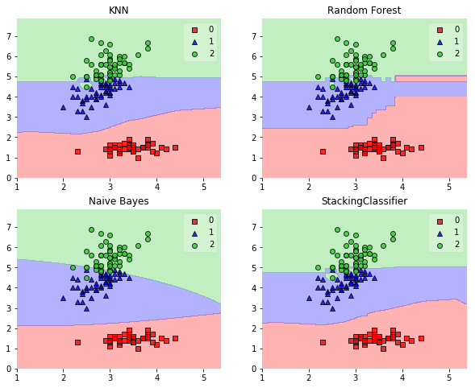


## Example 2 - Using Probabilities as Meta-Features

Alternatively, the class-probabilities of the first-level classifiers can be used to train the meta-classifier (2nd-level classifier) by setting `use_probas=True`. If `average_probas=True`, the probabilities of the level-1 classifiers are averaged, if `average_probas=False`, the probabilities are stacked (recommended). For example, in a 3-class setting with 2 level-1 classifiers, these classifiers may make the following "probability" predictions for 1 training sample:

- classifier 1: [0.2, 0.5, 0.3]
- classifier 2: [0.3, 0.4, 0.4]

If `average_probas=True`, the meta-features would be:

- [0.25, 0.45, 0.35]

In contrast, using `average_probas=False` results in k features where, k = [n_classes * n_classifiers], by stacking these level-1 probabilities:

- [0.2, 0.5, 0.3, 0.3, 0.4, 0.4]


```python
clf1 = KNeighborsClassifier(n_neighbors=1)
clf2 = RandomForestClassifier(random_state=1)
clf3 = GaussianNB()
lr = LogisticRegression()
sclf = StackingClassifier(classifiers=[clf1, clf2, clf3],
                          use_probas=True,
                          average_probas=False,
                          meta_classifier=lr)

print('3-fold cross validation:\n')

for clf, label in zip([clf1, clf2, clf3, sclf], 
                      ['KNN', 
                       'Random Forest', 
                       'Naive Bayes',
                       'StackingClassifier']):

    scores = model_selection.cross_val_score(clf, X, y, 
                                              cv=3, scoring='accuracy')
    print("Accuracy: %0.2f (+/- %0.2f) [%s]" 
          % (scores.mean(), scores.std(), label))
```

    3-fold cross validation:
    
    Accuracy: 0.91 (+/- 0.01) [KNN]
    Accuracy: 0.91 (+/- 0.06) [Random Forest]
    Accuracy: 0.92 (+/- 0.03) [Naive Bayes]
    Accuracy: 0.94 (+/- 0.03) [StackingClassifier]


## Example 3 - Stacked Classification and GridSearch

To set up a parameter grid for scikit-learn's `GridSearch`, we simply provide the estimator's names in the parameter grid -- in the special case of the meta-regressor, we append the `'meta-'` prefix.


```python
from sklearn.linear_model import LogisticRegression
from sklearn.neighbors import KNeighborsClassifier
from sklearn.naive_bayes import GaussianNB 
from sklearn.ensemble import RandomForestClassifier
from sklearn.model_selection import GridSearchCV
from mlxtend.classifier import StackingClassifier

# Initializing models

clf1 = KNeighborsClassifier(n_neighbors=1)
clf2 = RandomForestClassifier(random_state=1)
clf3 = GaussianNB()
lr = LogisticRegression()
sclf = StackingClassifier(classifiers=[clf1, clf2, clf3], 
                          meta_classifier=lr)

params = {'kneighborsclassifier__n_neighbors': [1, 5],
          'randomforestclassifier__n_estimators': [10, 50],
          'meta-logisticregression__C': [0.1, 10.0]}

grid = GridSearchCV(estimator=sclf, 
                    param_grid=params, 
                    cv=5,
                    refit=True)
grid.fit(X, y)

cv_keys = ('mean_test_score', 'std_test_score', 'params')

for r, _ in enumerate(grid.cv_results_['mean_test_score']):
    print("%0.3f +/- %0.2f %r"
          % (grid.cv_results_[cv_keys[0]][r],
             grid.cv_results_[cv_keys[1]][r] / 2.0,
             grid.cv_results_[cv_keys[2]][r]))

print('Best parameters: %s' % grid.best_params_)
print('Accuracy: %.2f' % grid.best_score_)
```

    0.667 +/- 0.00 {'kneighborsclassifier__n_neighbors': 1, 'meta-logisticregression__C': 0.1, 'randomforestclassifier__n_estimators': 10}
    0.667 +/- 0.00 {'kneighborsclassifier__n_neighbors': 1, 'meta-logisticregression__C': 0.1, 'randomforestclassifier__n_estimators': 50}
    0.927 +/- 0.02 {'kneighborsclassifier__n_neighbors': 1, 'meta-logisticregression__C': 10.0, 'randomforestclassifier__n_estimators': 10}
    0.913 +/- 0.03 {'kneighborsclassifier__n_neighbors': 1, 'meta-logisticregression__C': 10.0, 'randomforestclassifier__n_estimators': 50}
    0.667 +/- 0.00 {'kneighborsclassifier__n_neighbors': 5, 'meta-logisticregression__C': 0.1, 'randomforestclassifier__n_estimators': 10}
    0.667 +/- 0.00 {'kneighborsclassifier__n_neighbors': 5, 'meta-logisticregression__C': 0.1, 'randomforestclassifier__n_estimators': 50}
    0.933 +/- 0.02 {'kneighborsclassifier__n_neighbors': 5, 'meta-logisticregression__C': 10.0, 'randomforestclassifier__n_estimators': 10}
    0.940 +/- 0.02 {'kneighborsclassifier__n_neighbors': 5, 'meta-logisticregression__C': 10.0, 'randomforestclassifier__n_estimators': 50}
    Best parameters: {'kneighborsclassifier__n_neighbors': 5, 'meta-logisticregression__C': 10.0, 'randomforestclassifier__n_estimators': 50}
    Accuracy: 0.94


In case we are planning to use a regression algorithm multiple times, all we need to do is to add an additional number suffix in the parameter grid as shown below:


```python
from sklearn.model_selection import GridSearchCV

# Initializing models

clf1 = KNeighborsClassifier(n_neighbors=1)
clf2 = RandomForestClassifier(random_state=1)
clf3 = GaussianNB()
lr = LogisticRegression()
sclf = StackingClassifier(classifiers=[clf1, clf1, clf2, clf3], 
                          meta_classifier=lr)

params = {'kneighborsclassifier-1__n_neighbors': [1, 5],
          'kneighborsclassifier-2__n_neighbors': [1, 5],
          'randomforestclassifier__n_estimators': [10, 50],
          'meta-logisticregression__C': [0.1, 10.0]}

grid = GridSearchCV(estimator=sclf, 
                    param_grid=params, 
                    cv=5,
                    refit=True)
grid.fit(X, y)

cv_keys = ('mean_test_score', 'std_test_score', 'params')

for r, _ in enumerate(grid.cv_results_['mean_test_score']):
    print("%0.3f +/- %0.2f %r"
          % (grid.cv_results_[cv_keys[0]][r],
             grid.cv_results_[cv_keys[1]][r] / 2.0,
             grid.cv_results_[cv_keys[2]][r]))

print('Best parameters: %s' % grid.best_params_)
print('Accuracy: %.2f' % grid.best_score_)
```

    0.667 +/- 0.00 {'kneighborsclassifier-1__n_neighbors': 1, 'kneighborsclassifier-2__n_neighbors': 1, 'meta-logisticregression__C': 0.1, 'randomforestclassifier__n_estimators': 10}
    0.667 +/- 0.00 {'kneighborsclassifier-1__n_neighbors': 1, 'kneighborsclassifier-2__n_neighbors': 1, 'meta-logisticregression__C': 0.1, 'randomforestclassifier__n_estimators': 50}
    0.907 +/- 0.03 {'kneighborsclassifier-1__n_neighbors': 1, 'kneighborsclassifier-2__n_neighbors': 1, 'meta-logisticregression__C': 10.0, 'randomforestclassifier__n_estimators': 10}
    0.913 +/- 0.03 {'kneighborsclassifier-1__n_neighbors': 1, 'kneighborsclassifier-2__n_neighbors': 1, 'meta-logisticregression__C': 10.0, 'randomforestclassifier__n_estimators': 50}
    0.667 +/- 0.00 {'kneighborsclassifier-1__n_neighbors': 1, 'kneighborsclassifier-2__n_neighbors': 5, 'meta-logisticregression__C': 0.1, 'randomforestclassifier__n_estimators': 10}
    0.667 +/- 0.00 {'kneighborsclassifier-1__n_neighbors': 1, 'kneighborsclassifier-2__n_neighbors': 5, 'meta-logisticregression__C': 0.1, 'randomforestclassifier__n_estimators': 50}
    0.927 +/- 0.02 {'kneighborsclassifier-1__n_neighbors': 1, 'kneighborsclassifier-2__n_neighbors': 5, 'meta-logisticregression__C': 10.0, 'randomforestclassifier__n_estimators': 10}
    0.913 +/- 0.03 {'kneighborsclassifier-1__n_neighbors': 1, 'kneighborsclassifier-2__n_neighbors': 5, 'meta-logisticregression__C': 10.0, 'randomforestclassifier__n_estimators': 50}
    0.667 +/- 0.00 {'kneighborsclassifier-1__n_neighbors': 5, 'kneighborsclassifier-2__n_neighbors': 1, 'meta-logisticregression__C': 0.1, 'randomforestclassifier__n_estimators': 10}
    0.667 +/- 0.00 {'kneighborsclassifier-1__n_neighbors': 5, 'kneighborsclassifier-2__n_neighbors': 1, 'meta-logisticregression__C': 0.1, 'randomforestclassifier__n_estimators': 50}
    0.927 +/- 0.02 {'kneighborsclassifier-1__n_neighbors': 5, 'kneighborsclassifier-2__n_neighbors': 1, 'meta-logisticregression__C': 10.0, 'randomforestclassifier__n_estimators': 10}
    0.913 +/- 0.03 {'kneighborsclassifier-1__n_neighbors': 5, 'kneighborsclassifier-2__n_neighbors': 1, 'meta-logisticregression__C': 10.0, 'randomforestclassifier__n_estimators': 50}
    0.667 +/- 0.00 {'kneighborsclassifier-1__n_neighbors': 5, 'kneighborsclassifier-2__n_neighbors': 5, 'meta-logisticregression__C': 0.1, 'randomforestclassifier__n_estimators': 10}
    0.667 +/- 0.00 {'kneighborsclassifier-1__n_neighbors': 5, 'kneighborsclassifier-2__n_neighbors': 5, 'meta-logisticregression__C': 0.1, 'randomforestclassifier__n_estimators': 50}
    0.933 +/- 0.02 {'kneighborsclassifier-1__n_neighbors': 5, 'kneighborsclassifier-2__n_neighbors': 5, 'meta-logisticregression__C': 10.0, 'randomforestclassifier__n_estimators': 10}
    0.940 +/- 0.02 {'kneighborsclassifier-1__n_neighbors': 5, 'kneighborsclassifier-2__n_neighbors': 5, 'meta-logisticregression__C': 10.0, 'randomforestclassifier__n_estimators': 50}
    Best parameters: {'kneighborsclassifier-1__n_neighbors': 5, 'kneighborsclassifier-2__n_neighbors': 5, 'meta-logisticregression__C': 10.0, 'randomforestclassifier__n_estimators': 50}
    Accuracy: 0.94


# API


*StackingClassifier(classifiers, meta_classifier, use_probas=False, average_probas=False, verbose=0, use_features_in_secondary=False)*

A Stacking classifier for scikit-learn estimators for classification.

**Parameters**

- `classifiers` : array-like, shape = [n_classifiers]

    A list of classifiers.
    Invoking the `fit` method on the `StackingClassifer` will fit clones
    of these original classifiers that will
    be stored in the class attribute
    `self.clfs_`.

- `meta_classifier` : object

    The meta-classifier to be fitted on the ensemble of
    classifiers

- `use_probas` : bool (default: False)

    If True, trains meta-classifier based on predicted probabilities
    instead of class labels.

- `average_probas` : bool (default: False)

    Averages the probabilities as meta features if True.

- `verbose` : int, optional (default=0)

    Controls the verbosity of the building process.
    - `verbose=0` (default): Prints nothing
    - `verbose=1`: Prints the number & name of the regressor being fitted
    - `verbose=2`: Prints info about the parameters of the
    regressor being fitted
    - `verbose>2`: Changes `verbose` param of the underlying regressor to
    self.verbose - 2

- `use_features_in_secondary` : bool (default: False)

    If True, the meta-classifier will be trained both on the predictions
    of the original classifiers and the original dataset.
    If False, the meta-classifier will be trained only on the predictions
    of the original classifiers.

**Attributes**

- `clfs_` : list, shape=[n_classifiers]

    Fitted classifiers (clones of the original classifiers)

- `meta_clf_` : estimator

    Fitted meta-classifier (clone of the original meta-estimator)

### Methods

<hr>

*fit(X, y)*

Fit ensemble classifers and the meta-classifier.

**Parameters**

- `X` : {array-like, sparse matrix}, shape = [n_samples, n_features]

    Training vectors, where n_samples is the number of samples and
    n_features is the number of features.

- `y` : array-like, shape = [n_samples] or [n_samples, n_outputs]

    Target values.

**Returns**

- `self` : object


<hr>

*fit_transform(X, y=None, **fit_params)*

Fit to data, then transform it.

Fits transformer to X and y with optional parameters fit_params
and returns a transformed version of X.

**Parameters**

- `X` : numpy array of shape [n_samples, n_features]

    Training set.


- `y` : numpy array of shape [n_samples]

    Target values.

**Returns**

- `X_new` : numpy array of shape [n_samples, n_features_new]

    Transformed array.

<hr>

*get_params(deep=True)*

Return estimator parameter names for GridSearch support.

<hr>

*predict(X)*

Predict target values for X.

**Parameters**

- `X` : {array-like, sparse matrix}, shape = [n_samples, n_features]

    Training vectors, where n_samples is the number of samples and
    n_features is the number of features.

**Returns**

- `labels` : array-like, shape = [n_samples] or [n_samples, n_outputs]

    Predicted class labels.

<hr>

*predict_proba(X)*

Predict class probabilities for X.

**Parameters**

- `X` : {array-like, sparse matrix}, shape = [n_samples, n_features]

    Training vectors, where n_samples is the number of samples and
    n_features is the number of features.

**Returns**

- `proba` : array-like, shape = [n_samples, n_classes] or a list of                 n_outputs of such arrays if n_outputs > 1.

    Probability for each class per sample.

<hr>

*score(X, y, sample_weight=None)*

Returns the mean accuracy on the given test data and labels.

In multi-label classification, this is the subset accuracy
which is a harsh metric since you require for each sample that
each label set be correctly predicted.

**Parameters**

- `X` : array-like, shape = (n_samples, n_features)

    Test samples.


- `y` : array-like, shape = (n_samples) or (n_samples, n_outputs)

    True labels for X.


- `sample_weight` : array-like, shape = [n_samples], optional

    Sample weights.

**Returns**

- `score` : float

    Mean accuracy of self.predict(X) wrt. y.

<hr>

*set_params(**params)*

Set the parameters of this estimator.

The method works on simple estimators as well as on nested objects
(such as pipelines). The latter have parameters of the form
``<component>__<parameter>`` so that it's possible to update each
component of a nested object.

**Returns**

self


# `classifier.StackingCVClassifier`

An ensemble-learning meta-classifier for stacking using cross-validation to prepare the inputs for the level-2 classifier to prevent overfitting.

> from mlxtend.classifier import StackingCVClassifier

# Overview

Stacking is an ensemble learning technique to combine multiple classification models via a meta-classifier. The `StackingCVClassifier` extends the standard stacking algorithm (implemented as [`StackingClassifier`](StackingClassifier.md)) using cross-validation to prepare the input data for the level-2 classifier. 

In the standard stacking procedure, the first-level classifiers are fit to the same training set that is used prepare the inputs for the second-level classifier, which may lead to overfitting. The `StackingCVClassifier`, however, uses the concept of cross-validation: the dataset is split into *k* folds, and in *k* successive rounds, *k-1* folds are used to fit the first level classifier; in each round, the first-level classifiers are then applied to the remaining 1 subset that was not used for model fitting in each iteration. The resulting predictions are then stacked and provided -- as input data -- to the second-level classifier. After the training of the `StackingCVClassifier`, the first-level classifiers are fit to the entire dataset as illustrated in the figure below.


More formally, the Stacking Cross-Validation algorithm can be summarized as follows (source: [1]):
    


### References


- [1] Tang, J., S. Alelyani, and H. Liu. "[Data Classification: Algorithms and Applications.](https://books.google.com/books?id=nwQZCwAAQBAJ&lpg=PA500&dq=stacking%20classifier%20subsets&pg=PA499#v=onepage&q&f=false)" Data Mining and Knowledge Discovery Series, CRC Press (2015): pp. 498-500.
- [2] Wolpert, David H. "[Stacked generalization.](http://www.sciencedirect.com/science/article/pii/S0893608005800231)" Neural networks 5.2 (1992): 241-259.

## Example 1 - Simple Stacking CV Classification


```python
from sklearn import datasets

iris = datasets.load_iris()
X, y = iris.data[:, 1:3], iris.target
```


```python
from sklearn import model_selection
from sklearn.linear_model import LogisticRegression
from sklearn.neighbors import KNeighborsClassifier
from sklearn.naive_bayes import GaussianNB 
from sklearn.ensemble import RandomForestClassifier
from mlxtend.classifier import StackingCVClassifier
import numpy as np

RANDOM_SEED = 42

clf1 = KNeighborsClassifier(n_neighbors=1)
clf2 = RandomForestClassifier(random_state=RANDOM_SEED)
clf3 = GaussianNB()
lr = LogisticRegression()

# The StackingCVClassifier uses scikit-learn's check_cv
# internally, which doesn't support a random seed. Thus
# NumPy's random seed need to be specified explicitely for
# deterministic behavior
np.random.seed(RANDOM_SEED)
sclf = StackingCVClassifier(classifiers=[clf1, clf2, clf3], 
                            meta_classifier=lr)

print('3-fold cross validation:\n')

for clf, label in zip([clf1, clf2, clf3, sclf], 
                      ['KNN', 
                       'Random Forest', 
                       'Naive Bayes',
                       'StackingClassifier']):

    scores = model_selection.cross_val_score(clf, X, y, 
                                              cv=3, scoring='accuracy')
    print("Accuracy: %0.2f (+/- %0.2f) [%s]" 
          % (scores.mean(), scores.std(), label))
```

    3-fold cross validation:
    
    Accuracy: 0.91 (+/- 0.01) [KNN]
    Accuracy: 0.90 (+/- 0.03) [Random Forest]
    Accuracy: 0.92 (+/- 0.03) [Naive Bayes]
    Accuracy: 0.93 (+/- 0.02) [StackingClassifier]


```python
import matplotlib.pyplot as plt
from mlxtend.plotting import plot_decision_regions
import matplotlib.gridspec as gridspec
import itertools

gs = gridspec.GridSpec(2, 2)

fig = plt.figure(figsize=(10,8))

for clf, lab, grd in zip([clf1, clf2, clf3, sclf], 
                         ['KNN', 
                          'Random Forest', 
                          'Naive Bayes',
                          'StackingCVClassifier'],
                          itertools.product([0, 1], repeat=2)):

    clf.fit(X, y)
    ax = plt.subplot(gs[grd[0], grd[1]])
    fig = plot_decision_regions(X=X, y=y, clf=clf)
    plt.title(lab)
plt.show()
```


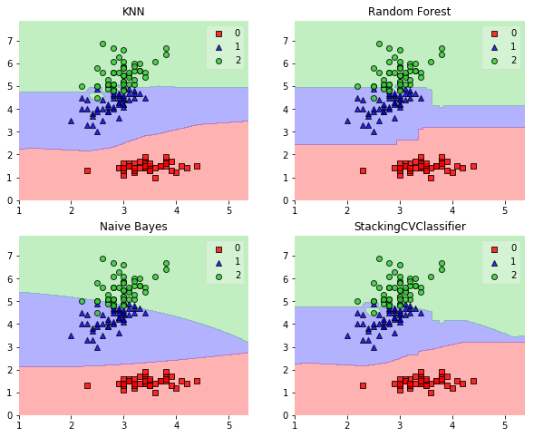


## Example 2 - Using Probabilities as Meta-Features

Alternatively, the class-probabilities of the first-level classifiers can be used to train the meta-classifier (2nd-level classifier) by setting `use_probas=True`. For example, in a 3-class setting with 2 level-1 classifiers, these classifiers may make the following "probability" predictions for 1 training sample:

- classifier 1: [0.2, 0.5, 0.3]
- classifier 2: [0.3, 0.4, 0.4]

This results in *k* features, where *k* = [n_classes * n_classifiers], by stacking these level-1 probabilities:

- [0.2, 0.5, 0.3, 0.3, 0.4, 0.4]


```python
clf1 = KNeighborsClassifier(n_neighbors=1)
clf2 = RandomForestClassifier(random_state=1)
clf3 = GaussianNB()
lr = LogisticRegression()

# The StackingCVClassifier uses scikit-learn's check_cv
# internally, which doesn't support a random seed. Thus
# NumPy's random seed need to be specified explicitely for
# deterministic behavior
np.random.seed(RANDOM_SEED)
sclf = StackingCVClassifier(classifiers=[clf1, clf2, clf3],
                            use_probas=True,
                            meta_classifier=lr)

print('3-fold cross validation:\n')

for clf, label in zip([clf1, clf2, clf3, sclf], 
                      ['KNN', 
                       'Random Forest', 
                       'Naive Bayes',
                       'StackingClassifier']):

    scores = model_selection.cross_val_score(clf, X, y, 
                                              cv=3, scoring='accuracy')
    print("Accuracy: %0.2f (+/- %0.2f) [%s]" 
          % (scores.mean(), scores.std(), label))
```

    3-fold cross validation:
    
    Accuracy: 0.91 (+/- 0.01) [KNN]
    Accuracy: 0.91 (+/- 0.06) [Random Forest]
    Accuracy: 0.92 (+/- 0.03) [Naive Bayes]
    Accuracy: 0.95 (+/- 0.04) [StackingClassifier]


## Example 3 - Stacked CV Classification and GridSearch

To set up a parameter grid for scikit-learn's `GridSearch`, we simply provide the estimator's names in the parameter grid -- in the special case of the meta-regressor, we append the `'meta-'` prefix.


```python
from sklearn.linear_model import LogisticRegression
from sklearn.neighbors import KNeighborsClassifier
from sklearn.naive_bayes import GaussianNB 
from sklearn.ensemble import RandomForestClassifier
from sklearn.model_selection import GridSearchCV
from mlxtend.classifier import StackingCVClassifier

# Initializing models

clf1 = KNeighborsClassifier(n_neighbors=1)
clf2 = RandomForestClassifier(random_state=RANDOM_SEED)
clf3 = GaussianNB()
lr = LogisticRegression()

# The StackingCVClassifier uses scikit-learn's check_cv
# internally, which doesn't support a random seed. Thus
# NumPy's random seed need to be specified explicitely for
# deterministic behavior
np.random.seed(RANDOM_SEED)
sclf = StackingCVClassifier(classifiers=[clf1, clf2, clf3], 
                            meta_classifier=lr)

params = {'kneighborsclassifier__n_neighbors': [1, 5],
          'randomforestclassifier__n_estimators': [10, 50],
          'meta-logisticregression__C': [0.1, 10.0]}

grid = GridSearchCV(estimator=sclf, 
                    param_grid=params, 
                    cv=5,
                    refit=True)
grid.fit(X, y)

cv_keys = ('mean_test_score', 'std_test_score', 'params')

for r, _ in enumerate(grid.cv_results_['mean_test_score']):
    print("%0.3f +/- %0.2f %r"
          % (grid.cv_results_[cv_keys[0]][r],
             grid.cv_results_[cv_keys[1]][r] / 2.0,
             grid.cv_results_[cv_keys[2]][r]))

print('Best parameters: %s' % grid.best_params_)
print('Accuracy: %.2f' % grid.best_score_)
```

    0.673 +/- 0.01 {'kneighborsclassifier__n_neighbors': 1, 'meta-logisticregression__C': 0.1, 'randomforestclassifier__n_estimators': 10}
    0.667 +/- 0.00 {'kneighborsclassifier__n_neighbors': 1, 'meta-logisticregression__C': 0.1, 'randomforestclassifier__n_estimators': 50}
    0.920 +/- 0.02 {'kneighborsclassifier__n_neighbors': 1, 'meta-logisticregression__C': 10.0, 'randomforestclassifier__n_estimators': 10}
    0.893 +/- 0.02 {'kneighborsclassifier__n_neighbors': 1, 'meta-logisticregression__C': 10.0, 'randomforestclassifier__n_estimators': 50}
    0.667 +/- 0.00 {'kneighborsclassifier__n_neighbors': 5, 'meta-logisticregression__C': 0.1, 'randomforestclassifier__n_estimators': 10}
    0.667 +/- 0.00 {'kneighborsclassifier__n_neighbors': 5, 'meta-logisticregression__C': 0.1, 'randomforestclassifier__n_estimators': 50}
    0.947 +/- 0.02 {'kneighborsclassifier__n_neighbors': 5, 'meta-logisticregression__C': 10.0, 'randomforestclassifier__n_estimators': 10}
    0.947 +/- 0.02 {'kneighborsclassifier__n_neighbors': 5, 'meta-logisticregression__C': 10.0, 'randomforestclassifier__n_estimators': 50}
    Best parameters: {'kneighborsclassifier__n_neighbors': 5, 'meta-logisticregression__C': 10.0, 'randomforestclassifier__n_estimators': 10}
    Accuracy: 0.95


In case we are planning to use a regression algorithm multiple times, all we need to do is to add an additional number suffix in the parameter grid as shown below:


```python
from sklearn.model_selection import GridSearchCV

# Initializing models

clf1 = KNeighborsClassifier(n_neighbors=1)
clf2 = RandomForestClassifier(random_state=RANDOM_SEED)
clf3 = GaussianNB()
lr = LogisticRegression()

# The StackingCVClassifier uses scikit-learn's check_cv
# internally, which doesn't support a random seed. Thus
# NumPy's random seed need to be specified explicitely for
# deterministic behavior
np.random.seed(RANDOM_SEED)
sclf = StackingCVClassifier(classifiers=[clf1, clf1, clf2, clf3], 
                            meta_classifier=lr)

params = {'kneighborsclassifier-1__n_neighbors': [1, 5],
          'kneighborsclassifier-2__n_neighbors': [1, 5],
          'randomforestclassifier__n_estimators': [10, 50],
          'meta-logisticregression__C': [0.1, 10.0]}

grid = GridSearchCV(estimator=sclf, 
                    param_grid=params, 
                    cv=5,
                    refit=True)
grid.fit(X, y)

cv_keys = ('mean_test_score', 'std_test_score', 'params')

for r, _ in enumerate(grid.cv_results_['mean_test_score']):
    print("%0.3f +/- %0.2f %r"
          % (grid.cv_results_[cv_keys[0]][r],
             grid.cv_results_[cv_keys[1]][r] / 2.0,
             grid.cv_results_[cv_keys[2]][r]))

print('Best parameters: %s' % grid.best_params_)
print('Accuracy: %.2f' % grid.best_score_)
```

    0.673 +/- 0.01 {'kneighborsclassifier-1__n_neighbors': 1, 'kneighborsclassifier-2__n_neighbors': 1, 'meta-logisticregression__C': 0.1, 'randomforestclassifier__n_estimators': 10}
    0.667 +/- 0.00 {'kneighborsclassifier-1__n_neighbors': 1, 'kneighborsclassifier-2__n_neighbors': 1, 'meta-logisticregression__C': 0.1, 'randomforestclassifier__n_estimators': 50}
    0.920 +/- 0.02 {'kneighborsclassifier-1__n_neighbors': 1, 'kneighborsclassifier-2__n_neighbors': 1, 'meta-logisticregression__C': 10.0, 'randomforestclassifier__n_estimators': 10}
    0.893 +/- 0.02 {'kneighborsclassifier-1__n_neighbors': 1, 'kneighborsclassifier-2__n_neighbors': 1, 'meta-logisticregression__C': 10.0, 'randomforestclassifier__n_estimators': 50}
    0.667 +/- 0.00 {'kneighborsclassifier-1__n_neighbors': 1, 'kneighborsclassifier-2__n_neighbors': 5, 'meta-logisticregression__C': 0.1, 'randomforestclassifier__n_estimators': 10}
    0.667 +/- 0.00 {'kneighborsclassifier-1__n_neighbors': 1, 'kneighborsclassifier-2__n_neighbors': 5, 'meta-logisticregression__C': 0.1, 'randomforestclassifier__n_estimators': 50}
    0.947 +/- 0.02 {'kneighborsclassifier-1__n_neighbors': 1, 'kneighborsclassifier-2__n_neighbors': 5, 'meta-logisticregression__C': 10.0, 'randomforestclassifier__n_estimators': 10}
    0.940 +/- 0.02 {'kneighborsclassifier-1__n_neighbors': 1, 'kneighborsclassifier-2__n_neighbors': 5, 'meta-logisticregression__C': 10.0, 'randomforestclassifier__n_estimators': 50}
    0.667 +/- 0.00 {'kneighborsclassifier-1__n_neighbors': 5, 'kneighborsclassifier-2__n_neighbors': 1, 'meta-logisticregression__C': 0.1, 'randomforestclassifier__n_estimators': 10}
    0.667 +/- 0.00 {'kneighborsclassifier-1__n_neighbors': 5, 'kneighborsclassifier-2__n_neighbors': 1, 'meta-logisticregression__C': 0.1, 'randomforestclassifier__n_estimators': 50}
    0.953 +/- 0.02 {'kneighborsclassifier-1__n_neighbors': 5, 'kneighborsclassifier-2__n_neighbors': 1, 'meta-logisticregression__C': 10.0, 'randomforestclassifier__n_estimators': 10}
    0.927 +/- 0.03 {'kneighborsclassifier-1__n_neighbors': 5, 'kneighborsclassifier-2__n_neighbors': 1, 'meta-logisticregression__C': 10.0, 'randomforestclassifier__n_estimators': 50}
    0.667 +/- 0.00 {'kneighborsclassifier-1__n_neighbors': 5, 'kneighborsclassifier-2__n_neighbors': 5, 'meta-logisticregression__C': 0.1, 'randomforestclassifier__n_estimators': 10}
    0.667 +/- 0.00 {'kneighborsclassifier-1__n_neighbors': 5, 'kneighborsclassifier-2__n_neighbors': 5, 'meta-logisticregression__C': 0.1, 'randomforestclassifier__n_estimators': 50}
    0.940 +/- 0.03 {'kneighborsclassifier-1__n_neighbors': 5, 'kneighborsclassifier-2__n_neighbors': 5, 'meta-logisticregression__C': 10.0, 'randomforestclassifier__n_estimators': 10}
    0.940 +/- 0.03 {'kneighborsclassifier-1__n_neighbors': 5, 'kneighborsclassifier-2__n_neighbors': 5, 'meta-logisticregression__C': 10.0, 'randomforestclassifier__n_estimators': 50}
    Best parameters: {'kneighborsclassifier-1__n_neighbors': 5, 'kneighborsclassifier-2__n_neighbors': 1, 'meta-logisticregression__C': 10.0, 'randomforestclassifier__n_estimators': 10}
    Accuracy: 0.95


# API


*StackingCVClassifier(classifiers, meta_classifier, use_probas=False, cv=2, use_features_in_secondary=False, stratify=True, shuffle=True, verbose=0)*

A 'Stacking Cross-Validation' classifier for scikit-learn estimators.

New in mlxtend v0.4.3

**Notes**

The StackingCVClassifier uses scikit-learn's check_cv
internally, which doesn't support a random seed. Thus
NumPy's random seed need to be specified explicitely for
deterministic behavior, for instance, by setting
np.random.seed(RANDOM_SEED)
prior to fitting the StackingCVClassifier

**Parameters**

- `classifiers` : array-like, shape = [n_classifiers]

    A list of classifiers.
    Invoking the `fit` method on the `StackingCVClassifer` will fit clones
    of these original classifiers that will
    be stored in the class attribute `self.clfs_`.

- `meta_classifier` : object

    The meta-classifier to be fitted on the ensemble of
    classifiers

- `use_probas` : bool (default: False)

    If True, trains meta-classifier based on predicted probabilities
    instead of class labels.

- `cv` : int, cross-validation generator or an iterable, optional (default: 2)

    Determines the cross-validation splitting strategy.
    Possible inputs for cv are:
    - None, to use the default 2-fold cross validation,
    - integer, to specify the number of folds in a `(Stratified)KFold`,
    - An object to be used as a cross-validation generator.
    - An iterable yielding train, test splits.
    For integer/None inputs, it will use either a `KFold` or
    `StratifiedKFold` cross validation depending the value of `stratify`
    argument.

- `use_features_in_secondary` : bool (default: False)

    If True, the meta-classifier will be trained both on the predictions
    of the original classifiers and the original dataset.
    If False, the meta-classifier will be trained only on the predictions
    of the original classifiers.

- `stratify` : bool (default: True)

    If True, and the `cv` argument is integer it will follow a stratified
    K-Fold cross validation technique. If the `cv` argument is a specific
    cross validation technique, this argument is omitted.

- `shuffle` : bool (default: True)

    If True,  and the `cv` argument is integer, the training data will be
    shuffled at fitting stage prior to cross-validation. If the `cv`
    argument is a specific cross validation technique, this argument is
    omitted.

- `verbose` : int, optional (default=0)

    Controls the verbosity of the building process.
    - `verbose=0` (default): Prints nothing
    - `verbose=1`: Prints the number & name of the regressor being fitted
    and which fold is currently being used for fitting
    - `verbose=2`: Prints info about the parameters of the
    regressor being fitted
    - `verbose>2`: Changes `verbose` param of the underlying regressor to
    self.verbose - 2

**Attributes**

- `clfs_` : list, shape=[n_classifiers]

    Fitted classifiers (clones of the original classifiers)

- `meta_clf_` : estimator

    Fitted meta-classifier (clone of the original meta-estimator)

### Methods

<hr>

*fit(X, y, groups=None)*

Fit ensemble classifers and the meta-classifier.

**Parameters**

- `X` : numpy array, shape = [n_samples, n_features]

    Training vectors, where n_samples is the number of samples and
    n_features is the number of features.


- `y` : numpy array, shape = [n_samples]

    Target values.


- `groups` : numpy array/None, shape = [n_samples]

    The group that each sample belongs to. This is used by specific
    folding strategies such as GroupKFold()

**Returns**

- `self` : object


<hr>

*fit_transform(X, y=None, **fit_params)*

Fit to data, then transform it.

Fits transformer to X and y with optional parameters fit_params
and returns a transformed version of X.

**Parameters**

- `X` : numpy array of shape [n_samples, n_features]

    Training set.


- `y` : numpy array of shape [n_samples]

    Target values.

**Returns**

- `X_new` : numpy array of shape [n_samples, n_features_new]

    Transformed array.

<hr>

*get_params(deep=True)*

Return estimator parameter names for GridSearch support.

<hr>

*predict(X)*

Predict target values for X.

**Parameters**

- `X` : numpy array, shape = [n_samples, n_features]

    Training vectors, where n_samples is the number of samples and
    n_features is the number of features.

**Returns**

- `labels` : array-like, shape = [n_samples]

    Predicted class labels.

<hr>

*predict_proba(X)*

Predict class probabilities for X.

**Parameters**

- `X` : numpy array, shape = [n_samples, n_features]

    Training vectors, where n_samples is the number of samples and
    n_features is the number of features.

**Returns**

- `proba` : array-like, shape = [n_samples, n_classes]

    Probability for each class per sample.

<hr>

*score(X, y, sample_weight=None)*

Returns the mean accuracy on the given test data and labels.

In multi-label classification, this is the subset accuracy
which is a harsh metric since you require for each sample that
each label set be correctly predicted.

**Parameters**

- `X` : array-like, shape = (n_samples, n_features)

    Test samples.


- `y` : array-like, shape = (n_samples) or (n_samples, n_outputs)

    True labels for X.


- `sample_weight` : array-like, shape = [n_samples], optional

    Sample weights.

**Returns**

- `score` : float

    Mean accuracy of self.predict(X) wrt. y.

<hr>

*set_params(**params)*

Set the parameters of this estimator.

The method works on simple estimators as well as on nested objects
(such as pipelines). The latter have parameters of the form
``<component>__<parameter>`` so that it's possible to update each
component of a nested object.

**Returns**

self


# `classifier.Perceptron`

Implementation of a Perceptron learning algorithm for classification.

> from mlxtend.classifier import Perceptron

## Overview

The idea behind this "thresholded" perceptron was to mimic how a single neuron in the brain works: It either "fires" or not. 
A perceptron receives multiple input signals, and if the sum of the input signals exceed a certain threshold it either returns a signal or remains "silent" otherwise. What made this a "machine learning" algorithm was Frank Rosenblatt's idea of the perceptron learning rule: The perceptron algorithm is about learning the weights for the input signals in order to draw linear decision boundary that allows us to discriminate between the two linearly separable classes +1 and -1.


#### Basic Notation

Before we dive deeper into the algorithm(s) for learning the weights of the perceptron classifier, let us take a brief look at the basic notation. In the following sections, we will label the *positive* and *negative* class in our binary classification setting as "1" and "-1", respectively. Next, we define an activation function $g(\mathbf{z})$ that takes a linear combination of the input values $\mathbf{x}$ and weights $\mathbf{w}$ as input ($\mathbf{z} = w_1x_{1} + \dots + w_mx_{m}$), and if $g(\mathbf{z})$ is greater than a defined threshold $\theta$ we predict 1 and -1 otherwise; in this case, this activation function $g$ is a simple "unit step function," which is sometimes also called "Heaviside step function." 

$$
 g(z) =\begin{cases}
    1 & \text{if $z \ge \theta$}\\
    -1 & \text{otherwise}.
  \end{cases}
$$

where

$$z =  w_1x_{1} + \dots + w_mx_{m} = \sum_{j=1}^{m} x_{j}w_{j} \\ = \mathbf{w}^T\mathbf{x}$$

$\mathbf{w}$ is the feature vector, and $\mathbf{x}$ is an $m$-dimensional sample from the training dataset:

$$ 
\mathbf{w} = \begin{bmatrix}
    w_{1}  \\
    \vdots \\
    w_{m}
\end{bmatrix}
\quad  \mathbf{x} = \begin{bmatrix}
    x_{1}  \\
    \vdots \\
    x_{m}
\end{bmatrix}$$

In order to simplify the notation, we bring $\theta$ to the left side of the equation and define $w_0 = -\theta  \text{ and } x_0=1$ 

so that 

$$
 g({z}) =\begin{cases}
    1 & \text{if $z \ge 0$}\\
    -1 & \text{otherwise}.
  \end{cases}
$$

and


$$z = w_0x_{0} + w_1x_{1} + \dots + w_mx_{m} = \sum_{j=0}^{m} x_{j}w_{j} \\ = \mathbf{w}^T\mathbf{x}.$$


#### Perceptron Rule

Rosenblatt's initial perceptron rule is fairly simple and can be summarized by the following steps: 

1. Initialize the weights to 0 or small random numbers.
2. For each training sample $\mathbf{x^{(i)}}$:
    2. Calculate the *output* value.
    2. Update the weights.

The output value is the class label predicted by the unit step function that we defined earlier (output $=g(\mathbf{z})$) and the weight update can be written more formally as  $w_j := w_j + \Delta w_j$.

The value for updating the weights at each increment is calculated by the learning rule

$\Delta w_j = \eta \; (\text{target}^{(i)} - \text{output}^{(i)})\;x^{(i)}_{j}$

where $\eta$ is the learning rate (a constant between 0.0 and 1.0), "target" is the true class label, and the "output" is the predicted class label.

aIt is important to note that all weights in the weight vector are being updated simultaneously. Concretely, for a 2-dimensional dataset, we would write the update as:

$\Delta w_0 = \eta(\text{target}^{(i)} - \text{output}^{(i)})$  
$\Delta w_1 = \eta(\text{target}^{(i)} - \text{output}^{(i)})\;x^{(i)}_{1}$  
$\Delta w_2 = \eta(\text{target}^{(i)} - \text{output}^{(i)})\;x^{(i)}_{2}$  

Before we implement the perceptron rule in Python, let us make a simple thought experiment to illustrate how beautifully simple this learning rule really is. In the two scenarios where the perceptron predicts the class label correctly, the weights remain unchanged:

- $\Delta w_j = \eta(-1^{(i)} - -1^{(i)})\;x^{(i)}_{j} = 0$ 
- $\Delta w_j = \eta(1^{(i)} - 1^{(i)})\;x^{(i)}_{j} = 0$ 

However, in case of a wrong prediction, the weights are being "pushed" towards the direction of the positive or negative target class, respectively:

- $\Delta w_j = \eta(1^{(i)} - -1^{(i)})\;x^{(i)}_{j} = \eta(2)\;x^{(i)}_{j}$ 
- $\Delta w_j = \eta(-1^{(i)} - 1^{(i)})\;x^{(i)}_{j} = \eta(-2)\;x^{(i)}_{j}$ 


It is important to note that the convergence of the perceptron is only guaranteed if the two classes are linearly separable. If the two classes can't be separated by a linear decision boundary, we can set a maximum number of passes over the training dataset ("epochs") and/or a threshold for the number of tolerated misclassifications.

### References


- F. Rosenblatt. The perceptron, a perceiving and recognizing automaton Project Para. Cornell Aeronautical Laboratory, 1957.

## Example 1 - Classification of Iris Flowers


```python
from mlxtend.data import iris_data
from mlxtend.plotting import plot_decision_regions
from mlxtend.classifier import Perceptron
import matplotlib.pyplot as plt

# Loading Data

X, y = iris_data()
X = X[:, [0, 3]] # sepal length and petal width
X = X[0:100] # class 0 and class 1
y = y[0:100] # class 0 and class 1

# standardize
X[:,0] = (X[:,0] - X[:,0].mean()) / X[:,0].std()
X[:,1] = (X[:,1] - X[:,1].mean()) / X[:,1].std()


# Rosenblatt Perceptron

ppn = Perceptron(epochs=5, 
                 eta=0.05, 
                 random_seed=0,
                 print_progress=3)
ppn.fit(X, y)

plot_decision_regions(X, y, clf=ppn)
plt.title('Perceptron - Rosenblatt Perceptron Rule')
plt.show()

print('Bias & Weights: %s' % ppn.w_)

plt.plot(range(len(ppn.cost_)), ppn.cost_)
plt.xlabel('Iterations')
plt.ylabel('Missclassifications')
plt.show()
```

    Iteration: 5/5 | Elapsed: 00:00:00 | ETA: 00:00:00


    Bias & Weights: [[-0.04500809]
     [ 0.11048855]]


## API


*Perceptron(eta=0.1, epochs=50, random_seed=None, print_progress=0)*

Perceptron classifier.

Note that this implementation of the Perceptron expects binary class labels
in {0, 1}.

**Parameters**

- `eta` : float (default: 0.1)

    Learning rate (between 0.0 and 1.0)

- `epochs` : int (default: 50)

    Number of passes over the training dataset.
    Prior to each epoch, the dataset is shuffled to prevent cycles.

- `random_seed` : int

    Random state for initializing random weights and shuffling.

- `print_progress` : int (default: 0)

    Prints progress in fitting to stderr.
    0: No output
    1: Epochs elapsed and cost
    2: 1 plus time elapsed
    3: 2 plus estimated time until completion

**Attributes**

- `w_` : 2d-array, shape={n_features, 1}

    Model weights after fitting.

- `b_` : 1d-array, shape={1,}

    Bias unit after fitting.

- `cost_` : list

    Number of misclassifications in every epoch.

### Methods

<hr>

*fit(X, y, init_params=True)*

Learn model from training data.

**Parameters**

- `X` : {array-like, sparse matrix}, shape = [n_samples, n_features]

    Training vectors, where n_samples is the number of samples and
    n_features is the number of features.

- `y` : array-like, shape = [n_samples]

    Target values.

- `init_params` : bool (default: True)

    Re-initializes model parameters prior to fitting.
    Set False to continue training with weights from
    a previous model fitting.

**Returns**

- `self` : object


<hr>

*predict(X)*

Predict targets from X.

**Parameters**

- `X` : {array-like, sparse matrix}, shape = [n_samples, n_features]

    Training vectors, where n_samples is the number of samples and
    n_features is the number of features.

**Returns**

- `target_values` : array-like, shape = [n_samples]

    Predicted target values.

<hr>

*score(X, y)*

Compute the prediction accuracy

**Parameters**

- `X` : {array-like, sparse matrix}, shape = [n_samples, n_features]

    Training vectors, where n_samples is the number of samples and
    n_features is the number of features.

- `y` : array-like, shape = [n_samples]

    Target values (true class labels).

**Returns**

- `acc` : float

    The prediction accuracy as a float
    between 0.0 and 1.0 (perfect score).


# `classifier.Adaline`

An implementation of the ADAptive LInear NEuron, Adaline, for binary classification tasks.

> from mlxtend.classifier import Adaline

## Overview

An illustration of the ADAptive LInear NEuron (Adaline) -- a single-layer artificial linear neuron with a threshold unit:
    


The Adaline classifier is closely related to the Ordinary Least Squares (OLS) Linear Regression algorithm; in OLS regression we find the line (or hyperplane) that minimizes the vertical offsets. Or in other words, we define the best-fitting line as the line that minimizes the sum of squared errors (SSE) or mean squared error (MSE) between our target variable (y) and our predicted output over all samples $i$ in our dataset of size $n$.

$$ SSE =  \sum_i (\text{target}^{(i)} - \text{output}^{(i)})^2$$

$$MSE = \frac{1}{n} \times SSE$$


[`LinearRegression`](../regressor/LinearRegression.md) implements a linear regression model for performing ordinary least squares regression, and in Adaline, we add a threshold function $g(\cdot)$ to convert the continuous outcome to a categorical class label:

$$y = g({z}) =
\begin{cases}
1 & \text{if z $\ge$ 0}\\
-1 & \text{otherwise}.
\end{cases}
$$

An Adaline model can be trained by one of the following three approaches:

- Normal Equations
- Gradient Descent
- Stochastic Gradient Descent

### Normal Equations (closed-form solution)

The closed-form solution should be preferred for "smaller" datasets where calculating (a "costly") matrix inverse is not a concern. For very large datasets, or datasets where the inverse of $[X^T X]$ may not exist (the matrix is non-invertible or singular, e.g., in case of perfect multicollinearity), the gradient descent or stochastic gradient descent approaches are to be preferred.

The linear function (linear regression model) is defined as:

$$z = w_0x_0 + w_1x_1 + ... + w_mx_m = \sum_{j=0}^{m} w_j x_j = \mathbf{w}^T\mathbf{x}$$

where $y$ is the response variable, $\mathbf{x}$ is an $m$-dimensional sample vector, and $\mathbf{w}$ is the weight vector (vector of coefficients). Note that $w_0$ represents the y-axis intercept of the model and therefore $x_0=1$.  

Using the closed-form solution (normal equation), we compute the weights of the model as follows:

$$ \mathbf{w} = (\mathbf{X}^T\mathbf{X})^{-1}\mathbf{X}^Ty$$

### Gradient Descent (GD)  and Stochastic Gradient Descent (SGD) 

In the current implementation, the Adaline model is learned via Gradient Descent or Stochastic Gradient Descent.

See [Gradient Descent and Stochastic Gradient Descent](../general_concepts/gradient-optimization.md) and [Deriving the Gradient Descent Rule for Linear Regression and Adaline](../general_concepts/linear-gradient-derivative.md) for details.

Random shuffling is implemented as:

- for one or more epochs
    - randomly shuffle samples in the training set
        - for training sample *i*
            - compute gradients and perform weight updates

### References


- B. Widrow, M. E. Hoff, et al. [Adaptive switching circuits](http://www.rob.uni-luebeck.de/index.php?id=267). 1960.

## Example 1 - Closed Form Solution


```python
from mlxtend.data import iris_data
from mlxtend.plotting import plot_decision_regions
from mlxtend.classifier import Adaline
import matplotlib.pyplot as plt

# Loading Data

X, y = iris_data()
X = X[:, [0, 3]] # sepal length and petal width
X = X[0:100] # class 0 and class 1
y = y[0:100] # class 0 and class 1

# standardize
X[:,0] = (X[:,0] - X[:,0].mean()) / X[:,0].std()
X[:,1] = (X[:,1] - X[:,1].mean()) / X[:,1].std()


ada = Adaline(epochs=30, 
              eta=0.01, 
              minibatches=None, 
              random_seed=1)
ada.fit(X, y)
plot_decision_regions(X, y, clf=ada)
plt.title('Adaline - Stochastic Gradient Descent')

plt.show()
```


## Example 2 - Gradient Descent


```python
from mlxtend.data import iris_data
from mlxtend.plotting import plot_decision_regions
from mlxtend.classifier import Adaline
import matplotlib.pyplot as plt

# Loading Data

X, y = iris_data()
X = X[:, [0, 3]] # sepal length and petal width
X = X[0:100] # class 0 and class 1
y = y[0:100] # class 0 and class 1

# standardize
X[:,0] = (X[:,0] - X[:,0].mean()) / X[:,0].std()
X[:,1] = (X[:,1] - X[:,1].mean()) / X[:,1].std()


ada = Adaline(epochs=30, 
              eta=0.01, 
              minibatches=1, # for Gradient Descent Learning
              random_seed=1,
              print_progress=3)

ada.fit(X, y)
plot_decision_regions(X, y, clf=ada)
plt.title('Adaline - Stochastic Gradient Descent')
plt.show()

plt.plot(range(len(ada.cost_)), ada.cost_)
plt.xlabel('Iterations')
plt.ylabel('Cost')
```

    Iteration: 30/30 | Cost 3.79 | Elapsed: 0:00:00 | ETA: 0:00:00


    <matplotlib.text.Text at 0x10eb32908>


## Example 3 - Stochastic Gradient Descent


```python
from mlxtend.data import iris_data
from mlxtend.plotting import plot_decision_regions
from mlxtend.classifier import Adaline
import matplotlib.pyplot as plt

# Loading Data

X, y = iris_data()
X = X[:, [0, 3]] # sepal length and petal width
X = X[0:100] # class 0 and class 1
y = y[0:100] # class 0 and class 1

# standardize
X[:,0] = (X[:,0] - X[:,0].mean()) / X[:,0].std()
X[:,1] = (X[:,1] - X[:,1].mean()) / X[:,1].std()


ada = Adaline(epochs=15, 
              eta=0.02, 
              minibatches=len(y), # for SGD learning 
              random_seed=1,
              print_progress=3)

ada.fit(X, y)
plot_decision_regions(X, y, clf=ada)
plt.title('Adaline - Stochastic Gradient Descent')
plt.show()

plt.plot(range(len(ada.cost_)), ada.cost_)
plt.xlabel('Iterations')
plt.ylabel('Cost')
plt.show()
```

    Iteration: 15/15 | Cost 3.81 | Elapsed: 0:00:00 | ETA: 0:00:00


## Example 4 - Stochastic Gradient Descent with Minibatches


```python
from mlxtend.data import iris_data
from mlxtend.plotting import plot_decision_regions
from mlxtend.classifier import Adaline
import matplotlib.pyplot as plt

# Loading Data

X, y = iris_data()
X = X[:, [0, 3]] # sepal length and petal width
X = X[0:100] # class 0 and class 1
y = y[0:100] # class 0 and class 1

# standardize
X[:,0] = (X[:,0] - X[:,0].mean()) / X[:,0].std()
X[:,1] = (X[:,1] - X[:,1].mean()) / X[:,1].std()


ada = Adaline(epochs=15, 
              eta=0.02, 
              minibatches=5, # for SGD learning w. minibatch size 20
              random_seed=1,
              print_progress=3)

ada.fit(X, y)
plot_decision_regions(X, y, clf=ada)
plt.title('Adaline - Stochastic Gradient Descent')
plt.show()

plt.plot(range(len(ada.cost_)), ada.cost_)
plt.xlabel('Iterations')
plt.ylabel('Cost')
plt.show()
```

    Iteration: 15/15 | Cost 3.87 | Elapsed: 0:00:00 | ETA: 0:00:00


# API


*Adaline(eta=0.01, epochs=50, minibatches=None, random_seed=None, print_progress=0)*

ADAptive LInear NEuron classifier.

Note that this implementation of Adaline expects binary class labels
in {0, 1}.

**Parameters**

- `eta` : float (default: 0.01)

    solver rate (between 0.0 and 1.0)

- `epochs` : int (default: 50)

    Passes over the training dataset.
    Prior to each epoch, the dataset is shuffled
    if `minibatches > 1` to prevent cycles in stochastic gradient descent.

- `minibatches` : int (default: None)

    The number of minibatches for gradient-based optimization.
    If None: Normal Equations (closed-form solution)
    If 1: Gradient Descent learning
    If len(y): Stochastic Gradient Descent (SGD) online learning
    If 1 < minibatches < len(y): SGD Minibatch learning

- `random_seed` : int (default: None)

    Set random state for shuffling and initializing the weights.

- `print_progress` : int (default: 0)

    Prints progress in fitting to stderr if not solver='normal equation'
    0: No output
    1: Epochs elapsed and cost
    2: 1 plus time elapsed
    3: 2 plus estimated time until completion

**Attributes**

- `w_` : 2d-array, shape={n_features, 1}

    Model weights after fitting.

- `b_` : 1d-array, shape={1,}

    Bias unit after fitting.

- `cost_` : list

    Sum of squared errors after each epoch.

### Methods

<hr>

*fit(X, y, init_params=True)*

Learn model from training data.

**Parameters**

- `X` : {array-like, sparse matrix}, shape = [n_samples, n_features]

    Training vectors, where n_samples is the number of samples and
    n_features is the number of features.

- `y` : array-like, shape = [n_samples]

    Target values.

- `init_params` : bool (default: True)

    Re-initializes model parameters prior to fitting.
    Set False to continue training with weights from
    a previous model fitting.

**Returns**

- `self` : object


<hr>

*predict(X)*

Predict targets from X.

**Parameters**

- `X` : {array-like, sparse matrix}, shape = [n_samples, n_features]

    Training vectors, where n_samples is the number of samples and
    n_features is the number of features.

**Returns**

- `target_values` : array-like, shape = [n_samples]

    Predicted target values.

<hr>

*score(X, y)*

Compute the prediction accuracy

**Parameters**

- `X` : {array-like, sparse matrix}, shape = [n_samples, n_features]

    Training vectors, where n_samples is the number of samples and
    n_features is the number of features.

- `y` : array-like, shape = [n_samples]

    Target values (true class labels).

**Returns**

- `acc` : float

    The prediction accuracy as a float
    between 0.0 and 1.0 (perfect score).


# `classifier.LogisticRegression`

A logistic regression class for binary classification tasks.

> from mlxtend.classifier import LogisticRegression

## Overview


Related to the [`Perceptron`](./Perceptron.md) and ['Adaline'](./Adaline.md), a Logistic Regression model is a linear model for binary classification. However, instead of minimizing a linear cost function such as the sum of squared errors (SSE) in Adaline, we minimize a sigmoid function, i.e., the logistic function:

$$\phi(z) = \frac{1}{1 + e^{-z}},$$

where $z$ is defined as the net input

$$z = w_0x_0 + w_1x_1 + ... + w_mx_m = \sum_{j=0}^{m} w_j x_j= \mathbf{w}^T\mathbf{x}.$$ 

The net input is in turn based on the logit function

$$logit(p(y=1 \mid \mathbf{x})) = z.$$

Here, $p(y=1 \mid \mathbf{x})$ is the conditional probability that a particular sample belongs to class 1 given its features $\mathbf{x}$. The logit function takes inputs in the range [0, 1] and transform them to values over the entire real number range. In contrast, the logistic function takes input values over the entire real number range and transforms them to values in the range [0, 1]. In other words, the logistic function is the inverse of the logit function, and it lets us predict the conditional probability that a certain sample belongs to class 1 (or class 0).


After model fitting, the conditional probability $p(y=1 \mid \mathbf{x})$ is converted to a binary class label via a threshold function $g(\cdot)$:

$$y = g({z}) = 
 \begin{cases}
  1 & \text{if $\phi(z) \ge 0.5$}\\
  0 & \text{otherwise.}
   \end{cases}
$$

or equivalently:


$$y = g({z}) = 
\begin{cases}
1 & \text{if z $\ge$ 0}\\
0 & \text{otherwise}.
\end{cases}
$$

### Objective Function -- Log-Likelihood

In order to parameterize a logistic regression model, we maximize the likelihood $L(\cdot)$ (or minimize the logistic cost function).

We write the likelihood as 

$$L(\mathbf{w}) = P(\mathbf{y} \mid \mathbf{x};\mathbf{w}) = \prod_{i=1}^{n} P\big(y^{(i)} \mid x^{(i)}; \mathbf{w}\big) = \prod^{n}_{i=1}\bigg(\phi\big(z^{(i)}\big)\bigg)^{y^{(i)}} \bigg(1-\phi\big(z^{(i)}\big)\bigg)^{1-y^{(i)}},$$

under the assumption that the training samples are independent of each other.

In practice, it is easier to maximize the (natural) log of this equation, which is called
the log-likelihood function:

$$l(\mathbf{w}) = \log L(\mathbf{w}) = \sum^{n}_{i=1} y^{(i)} \log \bigg(\phi\big(z^{(i)}\big)\bigg) + \big( 1 - y^{(i)}\big) \log \big(1-\phi\big(z^{(i)}\big)\big)$$

One advantage of taking the log is to avoid numeric underflow (and challenges with floating point math) for very small likelihoods. Another advantage is that we can obtain the derivative more easily, using the addition trick to rewrite the product of factors as a summation term, which we can then maximize using optimization algorithms such as gradient ascent.

### Objective Function -- Logistic Cost Function

An alternative to maximizing the log-likelihood, we can define a cost function $J(\cdot)$ to be minimized; we rewrite the log-likelihood as:

$$J(\mathbf{w}) = \sum_{i=1}^{m} - y^{(i)} log \bigg( \phi\big(z^{(i)}\big) \bigg) - \big(1 - y^{(i)}\big) log\bigg(1-\phi\big(z^{(i)}\big)\bigg)$$

$$
 J\big(\phi(z), y; \mathbf{w}\big) =\begin{cases}
    -log\big(\phi(z) \big) & \text{if $y = 1$}\\
    -log\big(1- \phi(z) \big) & \text{if $y = 0$}
  \end{cases}
$$


As we can see in the figure above, we penalize wrong predictions with an increasingly larger cost.

### Gradient Descent (GD)  and Stochastic Gradient Descent (SGD) Optimization

#### Gradient Ascent and the log-likelihood

To learn the weight coefficient of a logistic regression model via gradient-based optimization, we compute the partial derivative of the log-likelihood function -- w.r.t. the *j*th weight -- as follows:

$$\frac{\partial}{\partial w_j} l(\mathbf{w}) = \bigg(y \frac{1}{\phi(z)} - (1-y) \frac{1}{1-\phi{(z)}} \bigg) \frac{\partial}{\partial w_j}\phi(z)$$

As an intermediate step, we compute the partial derivative of the sigmoid function, which will come in handy later:

\begin{align}
&\frac{\partial}{\partial z} \phi(z) = \frac{\partial}{{\partial z}} \frac{1}{1+e^{-z}} \\\\
&= \frac{1}{(1 + e^{-z})^{2}} e^{-z}\\\\
&= \frac{1}{1+e^{-z}} \bigg(1 - \frac{1}{1+e^{-z}} \bigg)\\\\
&= \phi(z)\big(1-\phi(z)\big)
\end{align}

Now, we re-substitute $$\frac{\partial}{\partial z} \phi(z) = \phi(z) \big(1 - \phi(z)\big)$$ back into in the log-likelihood partial derivative equation and obtain the equation shown below:

\begin{align}
& \bigg(y \frac{1}{\phi{(z)}} - (1 - y) \frac{1}{1 - \phi(z)} \bigg) \frac{\partial}{\partial w_j} \phi(z) \\\\
&= \bigg(y \frac{1}{\phi{(z)}} - (1 - y) \frac{1}{1 - \phi(z)} \bigg) \phi(z) \big(1 - \phi(z)\big) \frac{\partial}{\partial w_j}z\\\\
&= \big(y(1-\phi(z)\big) - (1 - y) \phi(z)\big)x_j\\\\
&=\big(y - \phi(z)\big)x_j
\end{align}

Now, in order to find the weights of the model, we take a step proportional to the positive direction of the gradient to maximize the log-likelihood. Futhermore, we add a coefficient, the learning rate $\eta$ to the weight update:

\begin{align}
& w_j := w_j + \eta \frac{\partial}{\partial w_j} l(\mathbf{w})\\\\
& w_j := w_j + \eta \sum^{n}_{i=1} \big( y^{(i)} - \phi\big(z^{(i)}\big)\big)x_j^{(i)}
\end{align}

Note that the gradient (and weight update) is computed from all samples in the training set in gradient ascent/descent in contrast to stochastic gradient ascent/descent. For more information about the differences between gradient descent and stochastic gradient descent, please see the related article [Gradient Descent and Stochastic Gradient Descent](../general_concepts/gradient-optimization.md).

The previous equation shows the weight update for a single weight $j$. In gradient-based optimization, all weight coefficients are updated simultaneously; the weight update can be written more compactly as 

$$\mathbf{w} := \mathbf{w} + \Delta\mathbf{w},$$
where

$$\Delta{\mathbf{w}} = \eta \nabla l(\mathbf{w})$$

#### Gradient Descent and the logistic cost function

In the previous section, we derived the gradient of the log-likelihood function, which can be optimized via gradient ascent. Similarly, we can obtain the cost gradient of the logistic cost function $J(\cdot)$ and minimize it via gradient descent in order to learn the logistic regression model.

The update rule for a single weight:

\begin{align}
& \Delta{w_j} = -\eta \frac{\partial J}{\partial w_j} \\
& = - \eta \sum_{i=1}^{n}\big(y^{(i)} - \phi\big(z^{(i)}\big) x^{(i)} \big)
\end{align}

The simultaneous weight update:

$$\mathbf{w} := \mathbf{w} + \Delta\mathbf{w}$$

where

$$\Delta{\mathbf{w}} = - \eta \nabla J(\mathbf{w}).$$

#### Shuffling

Random shuffling is implemented as:

- for one or more epochs
    - randomly shuffle samples in the training set
        - for training sample *i*
            - compute gradients and perform weight updates

### Regularization

As a way to tackle overfitting, we can add additional bias to the logistic regression model via a regularization terms. Via the L2 regularization term, we reduce the complexity of the model by penalizing large weight coefficients:


$$L2: \frac{\lambda}{2}\lVert \mathbf{w} \lVert_2 = \frac{\lambda}{2} \sum_{j=1}^{m} w_j^2$$

In order to apply regularization, we just need to add the regularization term to the cost function that we defined for logistic regression to shrink the weights:

$$J(\mathbf{w}) =  \sum_{i=1}^{m} \Bigg[ - y^{(i)} log \bigg( \phi\big(z^{(i)}\big) \bigg) - \big(1 - y^{(i)}\big) log\bigg(1-\phi\big(z^{(i)}\big)\bigg) \Bigg] + \frac{\lambda}{2} \sum_{j=1}^{m} w_j^2$$

The update rule for a single weight:

\begin{align}
& \Delta{w_j} = -\eta \bigg( \frac{\partial J}{\partial w_j} + \lambda w_j\bigg)\\
& = - \eta \sum_{i=1}^{n}\big(y^{(i)} - \phi\big(z^{(i)}\big) x^{(i)} \big) - \eta \lambda w_j
\end{align}

The simultaneous weight update:

$$\mathbf{w} := \mathbf{w} + \Delta\mathbf{w}$$

where

$$\Delta{\mathbf{w}} = - \eta \big( \nabla J(\mathbf{w}) + \lambda \mathbf{w}\big).$$

For more information on regularization, please see [Regularization of Generalized Linear Models](../general_concepts/regularization-linear.md).

### References


- Bishop, Christopher M. [*Pattern recognition and machine learning*](http://www.springer.com/br/book/9780387310732). Springer, 2006. pp. 203-213

## Example 1 - Gradient Descent


```python
from mlxtend.data import iris_data
from mlxtend.plotting import plot_decision_regions
from mlxtend.classifier import LogisticRegression
import matplotlib.pyplot as plt

# Loading Data

X, y = iris_data()
X = X[:, [0, 3]] # sepal length and petal width
X = X[0:100] # class 0 and class 1
y = y[0:100] # class 0 and class 1

# standardize
X[:,0] = (X[:,0] - X[:,0].mean()) / X[:,0].std()
X[:,1] = (X[:,1] - X[:,1].mean()) / X[:,1].std()

lr = LogisticRegression(eta=0.1, 
                        l2_lambda=0.0, 
                        epochs=100,
                        minibatches=1, # for Gradient Descent
                        random_seed=1,
                        print_progress=3)
lr.fit(X, y)

plot_decision_regions(X, y, clf=lr)
plt.title('Logistic Regression - Gradient Descent')
plt.show()

plt.plot(range(len(lr.cost_)), lr.cost_)
plt.xlabel('Iterations')
plt.ylabel('Cost')
plt.show()
```

    Iteration: 100/100 | Cost 0.32 | Elapsed: 0:00:00 | ETA: 0:00:00


### Predicting Class Labels


```python
y_pred = lr.predict(X)
print('Last 3 Class Labels: %s' % y_pred[-3:])
```

    Last 3 Class Labels: [1 1 1]


### Predicting Class Probabilities


```python
y_pred = lr.predict_proba(X)
print('Last 3 Class Labels: %s' % y_pred[-3:])
```

    Last 3 Class Labels: [ 0.99997968  0.99339873  0.99992707]


## Example 2 - Stochastic Gradient Descent


```python
from mlxtend.data import iris_data
from mlxtend.plotting import plot_decision_regions
from mlxtend.classifier import LogisticRegression
import matplotlib.pyplot as plt

# Loading Data

X, y = iris_data()
X = X[:, [0, 3]] # sepal length and petal width
X = X[0:100] # class 0 and class 1
y = y[0:100] # class 0 and class 1

# standardize
X[:,0] = (X[:,0] - X[:,0].mean()) / X[:,0].std()
X[:,1] = (X[:,1] - X[:,1].mean()) / X[:,1].std()

lr = LogisticRegression(eta=0.5, 
                        epochs=30, 
                        l2_lambda=0.0, 
                        minibatches=len(y), # for SGD learning 
                        random_seed=1,
                        print_progress=3)
lr.fit(X, y)

plot_decision_regions(X, y, clf=lr)
plt.title('Logistic Regression - Stochastic Gradient Descent')
plt.show()

plt.plot(range(len(lr.cost_)), lr.cost_)
plt.xlabel('Iterations')
plt.ylabel('Cost')
plt.show()
```

    Iteration: 30/30 | Cost 0.27 | Elapsed: 0:00:00 | ETA: 0:00:00


## Example 3 - Stochastic Gradient Descent w. Minibatches

Here, we set `minibatches` to 5, which will result in Minibatch Learning with a batch size of 20 samples (since 100 Iris samples divided by 5 minibatches equals 20).


```python
from mlxtend.data import iris_data
from mlxtend.plotting import plot_decision_regions
from mlxtend.classifier import LogisticRegression
import matplotlib.pyplot as plt

# Loading Data

X, y = iris_data()
X = X[:, [0, 3]] # sepal length and petal width
X = X[0:100] # class 0 and class 1
y = y[0:100] # class 0 and class 1

# standardize
X[:,0] = (X[:,0] - X[:,0].mean()) / X[:,0].std()
X[:,1] = (X[:,1] - X[:,1].mean()) / X[:,1].std()

lr = LogisticRegression(eta=0.5, 
                        epochs=30, 
                        l2_lambda=0.0, 
                        minibatches=5, # 100/5 = 20 -> minibatch-s 
                        random_seed=1,
                        print_progress=3)
lr.fit(X, y)

plot_decision_regions(X, y, clf=lr)
plt.title('Logistic Regression - Stochastic Gradient Descent')
plt.show()

plt.plot(range(len(lr.cost_)), lr.cost_)
plt.xlabel('Iterations')
plt.ylabel('Cost')
plt.show()
```

    Iteration: 30/30 | Cost 0.25 | Elapsed: 0:00:00 | ETA: 0:00:00


# API


*LogisticRegression(eta=0.01, epochs=50, l2_lambda=0.0, minibatches=1, random_seed=None, print_progress=0)*

Logistic regression classifier.

Note that this implementation of Logistic Regression
expects binary class labels in {0, 1}.

**Parameters**

- `eta` : float (default: 0.01)

    Learning rate (between 0.0 and 1.0)

- `epochs` : int (default: 50)

    Passes over the training dataset.
    Prior to each epoch, the dataset is shuffled
    if `minibatches > 1` to prevent cycles in stochastic gradient descent.

- `l2_lambda` : float

    Regularization parameter for L2 regularization.
    No regularization if l2_lambda=0.0.

- `minibatches` : int (default: 1)

    The number of minibatches for gradient-based optimization.
    If 1: Gradient Descent learning
    If len(y): Stochastic Gradient Descent (SGD) online learning
    If 1 < minibatches < len(y): SGD Minibatch learning

- `random_seed` : int (default: None)

    Set random state for shuffling and initializing the weights.

- `print_progress` : int (default: 0)

    Prints progress in fitting to stderr.
    0: No output
    1: Epochs elapsed and cost
    2: 1 plus time elapsed
    3: 2 plus estimated time until completion

**Attributes**

- `w_` : 2d-array, shape={n_features, 1}

    Model weights after fitting.

- `b_` : 1d-array, shape={1,}

    Bias unit after fitting.

- `cost_` : list

    List of floats with cross_entropy cost (sgd or gd) for every
    epoch.

### Methods

<hr>

*fit(X, y, init_params=True)*

Learn model from training data.

**Parameters**

- `X` : {array-like, sparse matrix}, shape = [n_samples, n_features]

    Training vectors, where n_samples is the number of samples and
    n_features is the number of features.

- `y` : array-like, shape = [n_samples]

    Target values.

- `init_params` : bool (default: True)

    Re-initializes model parameters prior to fitting.
    Set False to continue training with weights from
    a previous model fitting.

**Returns**

- `self` : object


<hr>

*predict(X)*

Predict targets from X.

**Parameters**

- `X` : {array-like, sparse matrix}, shape = [n_samples, n_features]

    Training vectors, where n_samples is the number of samples and
    n_features is the number of features.

**Returns**

- `target_values` : array-like, shape = [n_samples]

    Predicted target values.

<hr>

*predict_proba(X)*

Predict class probabilities of X from the net input.

**Parameters**

- `X` : {array-like, sparse matrix}, shape = [n_samples, n_features]

    Training vectors, where n_samples is the number of samples and
    n_features is the number of features.

**Returns**

- `Class 1 probability` : float


<hr>

*score(X, y)*

Compute the prediction accuracy

**Parameters**

- `X` : {array-like, sparse matrix}, shape = [n_samples, n_features]

    Training vectors, where n_samples is the number of samples and
    n_features is the number of features.

- `y` : array-like, shape = [n_samples]

    Target values (true class labels).

**Returns**

- `acc` : float

    The prediction accuracy as a float
    between 0.0 and 1.0 (perfect score).


# `classifier.SoftmaxRegression`

A logistic regression class for multi-class classification tasks.

> from mlxtend.classifier import SoftmaxRegression

## Overview

*Softmax Regression* (synonyms: *Multinomial Logistic*, *Maximum Entropy Classifier*, or just *Multi-class Logistic Regression*) is a generalization of logistic regression that we can use for multi-class classification (under the assumption that the classes are  mutually exclusive). In contrast, we use the (standard) *Logistic Regression* model in binary classification tasks.

Below is a schematic of a *Logistic Regression* model, for more details, please see the [`LogisticRegression` manual](./LogisticRegression.md).


In *Softmax Regression* (SMR), we replace the sigmoid logistic function by the so-called *softmax* function $\phi_{softmax}(\cdot)$.

$$P(y=j \mid z^{(i)}) = \phi_{softmax}(z^{(i)}) = \frac{e^{z^{(i)}}}{\sum_{j=0}^{k} e^{z_{k}^{(i)}}},$$

where we define the net input *z* as 

$$z = w_1x_1 + ... + w_mx_m  + b= \sum_{l=0}^{m} w_l x_l + b= \mathbf{w}^T\mathbf{x} + b.$$ 

(**w** is the weight vector, $\mathbf{x}$ is the feature vector of 1 training sample, and $b$ is the bias unit.)   
Now, this softmax function computes the probability that this training sample $\mathbf{x}^{(i)}$ belongs to class $j$ given the weight and net input $z^{(i)}$. So, we compute the probability $p(y = j \mid \mathbf{x^{(i)}; w}_j)$ for each class label in  $j = 1, \ldots, k.$. Note the normalization term in the denominator which causes these class probabilities to sum up to one.


To illustrate the concept of softmax, let us walk through a concrete example. Let's assume we have a training set consisting of 4 samples from 3 different classes (0, 1, and 2)

- $x_0 \rightarrow \text{class }0$
- $x_1 \rightarrow \text{class }1$
- $x_2 \rightarrow \text{class }2$
- $x_3 \rightarrow \text{class }2$


```python
import numpy as np

y = np.array([0, 1, 2, 2])
```

First, we want to encode the class labels into a format that we can more easily work with; we apply one-hot encoding:


```python
y_enc = (np.arange(np.max(y) + 1) == y[:, None]).astype(float)

print('one-hot encoding:\n', y_enc)
```

    one-hot encoding:
     [[ 1.  0.  0.]
     [ 0.  1.  0.]
     [ 0.  0.  1.]
     [ 0.  0.  1.]]


A sample that belongs to class 0 (the first row) has a 1 in the first cell, a sample that belongs to class 2 has a 1 in the second cell of its row, and so forth.

Next, let us define the feature matrix of our 4 training samples. Here, we assume that our dataset consists of 2 features; thus, we create a 4x2 dimensional matrix of our samples and features.
Similarly, we create a 2x3 dimensional weight matrix (one row per feature and one column for each class).


```python
X = np.array([[0.1, 0.5],
              [1.1, 2.3],
              [-1.1, -2.3],
              [-1.5, -2.5]])

W = np.array([[0.1, 0.2, 0.3],
              [0.1, 0.2, 0.3]])

bias = np.array([0.01, 0.1, 0.1])

print('Inputs X:\n', X)
print('\nWeights W:\n', W)
print('\nbias:\n', bias)
```

    Inputs X:
     [[ 0.1  0.5]
     [ 1.1  2.3]
     [-1.1 -2.3]
     [-1.5 -2.5]]
    
    Weights W:
     [[ 0.1  0.2  0.3]
     [ 0.1  0.2  0.3]]
    
    bias:
     [ 0.01  0.1   0.1 ]


To compute the net input, we multiply the 4x2 matrix feature matrix `X` with the 2x3 (n_features x n_classes) weight matrix `W`, which yields a 4x3 output matrix (n_samples x n_classes) to which we then add the bias unit: 

$$\mathbf{Z} = \mathbf{X}\mathbf{W} + \mathbf{b}.$$


```python
X = np.array([[0.1, 0.5],
              [1.1, 2.3],
              [-1.1, -2.3],
              [-1.5, -2.5]])

W = np.array([[0.1, 0.2, 0.3],
              [0.1, 0.2, 0.3]])

bias = np.array([0.01, 0.1, 0.1])

print('Inputs X:\n', X)
print('\nWeights W:\n', W)
print('\nbias:\n', bias)
```

    Inputs X:
     [[ 0.1  0.5]
     [ 1.1  2.3]
     [-1.1 -2.3]
     [-1.5 -2.5]]
    
    Weights W:
     [[ 0.1  0.2  0.3]
     [ 0.1  0.2  0.3]]
    
    bias:
     [ 0.01  0.1   0.1 ]


```python
def net_input(X, W, b):
    return (X.dot(W) + b)

net_in = net_input(X, W, bias)
print('net input:\n', net_in)
```

    net input:
     [[ 0.07  0.22  0.28]
     [ 0.35  0.78  1.12]
     [-0.33 -0.58 -0.92]
     [-0.39 -0.7  -1.1 ]]


Now, it's time to compute the softmax activation that we discussed earlier:

$$P(y=j \mid z^{(i)}) = \phi_{softmax}(z^{(i)}) = \frac{e^{z^{(i)}}}{\sum_{j=0}^{k} e^{z_{k}^{(i)}}}.$$


```python
def softmax(z):
    return (np.exp(z.T) / np.sum(np.exp(z), axis=1)).T

smax = softmax(net_in)
print('softmax:\n', smax)
```

    softmax:
     [[ 0.29450637  0.34216758  0.36332605]
     [ 0.21290077  0.32728332  0.45981591]
     [ 0.42860913  0.33380113  0.23758974]
     [ 0.44941979  0.32962558  0.22095463]]


As we can see, the values for each sample (row) nicely sum up to 1 now. E.g., we can say that the first sample   
`[ 0.29450637  0.34216758  0.36332605]` has a 29.45% probability to belong to class 0.


Now, in order to turn these probabilities back into class labels, we could simply take the argmax-index position of each row:

[[ 0.29450637  0.34216758  **0.36332605**] -> 2   
[ 0.21290077  0.32728332  **0.45981591**]  -> 2  
[ **0.42860913**  0.33380113  0.23758974]  -> 0  
[ **0.44941979**  0.32962558  0.22095463]] -> 0  


```python
def to_classlabel(z):
    return z.argmax(axis=1)

print('predicted class labels: ', to_classlabel(smax))
```

    predicted class labels:  [2 2 0 0]


As we can see, our predictions are terribly wrong, since the correct class labels are `[0, 1, 2, 2]`. Now, in order to train our logistic model (e.g., via an optimization algorithm such as gradient descent), we need to define a cost function $J(\cdot)$ that we want to minimize:

$$J(\mathbf{W}; \mathbf{b}) = \frac{1}{n} \sum_{i=1}^{n} H(T_i, O_i),$$

which is the average of all cross-entropies over our $n$ training samples. The cross-entropy  function is defined as

$$H(T_i, O_i) = -\sum_m T_i \cdot log(O_i).$$

Here the $T$ stands for "target" (i.e., the *true* class labels) and the $O$ stands for output -- the computed *probability* via softmax; **not** the predicted class label.


```python
def cross_entropy(output, y_target):
    return - np.sum(np.log(output) * (y_target), axis=1)

xent = cross_entropy(smax, y_enc)
print('Cross Entropy:', xent)
```

    Cross Entropy: [ 1.22245465  1.11692907  1.43720989  1.50979788]


```python
def cost(output, y_target):
    return np.mean(cross_entropy(output, y_target))

J_cost = cost(smax, y_enc)
print('Cost: ', J_cost)
```

    Cost:  1.32159787159


In order to learn our softmax model -- determining the weight coefficients -- via gradient descent, we then need to compute the derivative 

$$\nabla \mathbf{w}_j \, J(\mathbf{W}; \mathbf{b}).$$

I don't want to walk through the tedious details here, but this cost derivative turns out to be simply:

$$\nabla \mathbf{w}_j \, J(\mathbf{W}; \mathbf{b}) = \frac{1}{n} \sum^{n}_{i=0} \big[\mathbf{x}^{(i)}\ \big(O_i - T_i \big) \big]$$

We can then use the cost derivate to update the weights in opposite direction of the cost gradient with learning rate $\eta$:

$$\mathbf{w}_j := \mathbf{w}_j - \eta \nabla \mathbf{w}_j \, J(\mathbf{W}; \mathbf{b})$$ 

for each class $$j \in \{0, 1, ..., k\}$$

(note that $\mathbf{w}_j$ is the weight vector for the class $y=j$), and we update the bias units


$$\mathbf{b}_j := \mathbf{b}_j   - \eta \bigg[ \frac{1}{n} \sum^{n}_{i=0} \big(O_i - T_i  \big) \bigg].$$ 
 


As a penalty against complexity, an approach to reduce the variance of our model and decrease the degree of overfitting by adding additional bias, we can further add a regularization term such as the L2 term with the regularization parameter $\lambda$:
    
L2:        $\frac{\lambda}{2} ||\mathbf{w}||_{2}^{2}$, 

where 

$$||\mathbf{w}||_{2}^{2} = \sum^{m}_{l=0} \sum^{k}_{j=0} w_{i, j}$$

so that our cost function becomes

$$J(\mathbf{W}; \mathbf{b}) = \frac{1}{n} \sum_{i=1}^{n} H(T_i, O_i) + \frac{\lambda}{2} ||\mathbf{w}||_{2}^{2}$$

and we define the "regularized" weight update as

$$\mathbf{w}_j := \mathbf{w}_j -  \eta \big[\nabla \mathbf{w}_j \, J(\mathbf{W}) + \lambda \mathbf{w}_j \big].$$

(Please note that we don't regularize the bias term.)

## Example 1 - Gradient Descent


```python
from mlxtend.data import iris_data
from mlxtend.plotting import plot_decision_regions
from mlxtend.classifier import SoftmaxRegression
import matplotlib.pyplot as plt

# Loading Data

X, y = iris_data()
X = X[:, [0, 3]] # sepal length and petal width

# standardize
X[:,0] = (X[:,0] - X[:,0].mean()) / X[:,0].std()
X[:,1] = (X[:,1] - X[:,1].mean()) / X[:,1].std()

lr = SoftmaxRegression(eta=0.01, 
                       epochs=500, 
                       minibatches=1, 
                       random_seed=1,
                       print_progress=3)
lr.fit(X, y)

plot_decision_regions(X, y, clf=lr)
plt.title('Softmax Regression - Gradient Descent')
plt.show()

plt.plot(range(len(lr.cost_)), lr.cost_)
plt.xlabel('Iterations')
plt.ylabel('Cost')
plt.show()
```

    Iteration: 500/500 | Cost 0.06 | Elapsed: 0:00:00 | ETA: 0:00:00


#### Predicting Class Labels


```python
y_pred = lr.predict(X)
print('Last 3 Class Labels: %s' % y_pred[-3:])
```

    Last 3 Class Labels: [2 2 2]


#### Predicting Class Probabilities


```python
y_pred = lr.predict_proba(X)
print('Last 3 Class Labels:\n %s' % y_pred[-3:])
```

    Last 3 Class Labels:
     [[  9.18728149e-09   1.68894679e-02   9.83110523e-01]
     [  2.97052325e-11   7.26356627e-04   9.99273643e-01]
     [  1.57464093e-06   1.57779528e-01   8.42218897e-01]]


## Example 2 - Stochastic Gradient Descent


```python
from mlxtend.data import iris_data
from mlxtend.plotting import plot_decision_regions
from mlxtend.classifier import SoftmaxRegression
import matplotlib.pyplot as plt

# Loading Data

X, y = iris_data()
X = X[:, [0, 3]] # sepal length and petal width

# standardize
X[:,0] = (X[:,0] - X[:,0].mean()) / X[:,0].std()
X[:,1] = (X[:,1] - X[:,1].mean()) / X[:,1].std()

lr = SoftmaxRegression(eta=0.01, epochs=300, minibatches=len(y), random_seed=1)
lr.fit(X, y)

plot_decision_regions(X, y, clf=lr)
plt.title('Softmax Regression - Stochastic Gradient Descent')
plt.show()

plt.plot(range(len(lr.cost_)), lr.cost_)
plt.xlabel('Iterations')
plt.ylabel('Cost')
plt.show()
```


# API


*SoftmaxRegression(eta=0.01, epochs=50, l2=0.0, minibatches=1, n_classes=None, random_seed=None, print_progress=0)*

Softmax regression classifier.

**Parameters**

- `eta` : float (default: 0.01)

    Learning rate (between 0.0 and 1.0)

- `epochs` : int (default: 50)

    Passes over the training dataset.
    Prior to each epoch, the dataset is shuffled
    if `minibatches > 1` to prevent cycles in stochastic gradient descent.

- `l2` : float

    Regularization parameter for L2 regularization.
    No regularization if l2=0.0.

- `minibatches` : int (default: 1)

    The number of minibatches for gradient-based optimization.
    If 1: Gradient Descent learning
    If len(y): Stochastic Gradient Descent (SGD) online learning
    If 1 < minibatches < len(y): SGD Minibatch learning

- `n_classes` : int (default: None)

    A positive integer to declare the number of class labels
    if not all class labels are present in a partial training set.
    Gets the number of class labels automatically if None.

- `random_seed` : int (default: None)

    Set random state for shuffling and initializing the weights.

- `print_progress` : int (default: 0)

    Prints progress in fitting to stderr.
    0: No output
    1: Epochs elapsed and cost
    2: 1 plus time elapsed
    3: 2 plus estimated time until completion

**Attributes**

- `w_` : 2d-array, shape={n_features, 1}

    Model weights after fitting.

- `b_` : 1d-array, shape={1,}

    Bias unit after fitting.

- `cost_` : list

    List of floats, the average cross_entropy for each epoch.

### Methods

<hr>

*fit(X, y, init_params=True)*

Learn model from training data.

**Parameters**

- `X` : {array-like, sparse matrix}, shape = [n_samples, n_features]

    Training vectors, where n_samples is the number of samples and
    n_features is the number of features.

- `y` : array-like, shape = [n_samples]

    Target values.

- `init_params` : bool (default: True)

    Re-initializes model parameters prior to fitting.
    Set False to continue training with weights from
    a previous model fitting.

**Returns**

- `self` : object


<hr>

*predict(X)*

Predict targets from X.

**Parameters**

- `X` : {array-like, sparse matrix}, shape = [n_samples, n_features]

    Training vectors, where n_samples is the number of samples and
    n_features is the number of features.

**Returns**

- `target_values` : array-like, shape = [n_samples]

    Predicted target values.

<hr>

*predict_proba(X)*

Predict class probabilities of X from the net input.

**Parameters**

- `X` : {array-like, sparse matrix}, shape = [n_samples, n_features]

    Training vectors, where n_samples is the number of samples and
    n_features is the number of features.

**Returns**

- `Class probabilties` : array-like, shape= [n_samples, n_classes]


<hr>

*score(X, y)*

Compute the prediction accuracy

**Parameters**

- `X` : {array-like, sparse matrix}, shape = [n_samples, n_features]

    Training vectors, where n_samples is the number of samples and
    n_features is the number of features.

- `y` : array-like, shape = [n_samples]

    Target values (true class labels).

**Returns**

- `acc` : float

    The prediction accuracy as a float
    between 0.0 and 1.0 (perfect score).


# `classifier.MultiLayerPerceptron`

Implementation of a multilayer perceptron, a feedforward artificial neural network.

> from mlxtend.classifier import MultiLayerPerceptron

## Overview

*Although the code is fully working and can be used for common classification tasks, this implementation is not geared towards efficiency but clarity  the original code was written for demonstration purposes.*

### Basic Architecture


The neurons $x_0$ and $a_0$ represent the bias units ($x_0=1$, $a_0=1$). 

The $i$th superscript denotes the $i$th layer, and the *j*th subscripts stands for the index of the respective unit. For example, $a_{1}^{(2)}$ refers to the first activation unit **after** the bias unit (i.e., 2nd activation unit) in the 2nd layer (here: the hidden layer)

  \begin{align}
    \mathbf{a^{(2)}} &= \begin{bmatrix}
           a_{0}^{(2)} \\
           a_{1}^{(2)} \\
           \vdots \\
           a_{m}^{(2)}
         \end{bmatrix}.
  \end{align}

Each layer $(l)$ in a multi-layer perceptron, a directed graph, is fully connected to the next layer $(l+1)$. We write the weight coefficient that connects the $k$th unit in the $l$th layer to the $j$th unit in layer $l+1$ as $w^{(l)}_{j, k}$.

For example, the weight coefficient that connects the units

$a_0^{(2)} \rightarrow a_1^{(3)}$

would be written as $w_{1,0}^{(2)}$.

### Activation

In the current implementation, the activations of the hidden layer(s) are computed via the logistic (sigmoid) function $\phi(z) = \frac{1}{1 + e^{-z}}.$


(For more details on the logistic function, please see [`classifier.LogisticRegression`](./LogisticRegression.md); a general overview of different activation function can be found [here](../general_concepts/activation-functions.md).)

Furthermore, the MLP uses the softmax function in the output layer, For more details on the logistic function, please see [`classifier.SoftmaxRegression`](./SoftmaxRegression.md).

### References

- D. R. G. H. R. Williams and G. Hinton. [Learning representations by back-propagating errors](http://lia.disi.unibo.it/Courses/SistInt/articoli/nnet1.pdf). Nature, pages 323533, 1986.
- C. M. Bishop. [Neural networks for pattern recognition](https://books.google.de/books?hl=en&lr=&id=T0S0BgAAQBAJ&oi=fnd&pg=PP1&dq=Neural+networks+for+pattern+recognition&ots=jL6TqGbBld&sig=fiLrMg-RJx22cgQ7zd2CiwUqNqI&redir_esc=y#v=onepage&q=Neural%20networks%20for%20pattern%20recognition&f=false). Oxford University Press, 1995.
- T. Hastie, J. Friedman, and R. Tibshirani. [The Elements of Statistical Learning](http://statweb.stanford.edu/%7Etibs/ElemStatLearn/), Volume 2. Springer, 2009.

## Example 1 - Classifying Iris Flowers

Load 2 features from Iris (petal length and petal width) for visualization purposes:


```python
from mlxtend.data import iris_data
X, y = iris_data()
X = X[:, [0, 3]]    

# standardize training data
X_std = (X - X.mean(axis=0)) / X.std(axis=0)
```

Train neural network for 3 output flower classes ('Setosa', 'Versicolor', 'Virginica'), regular gradient decent (`minibatches=1`), 30 hidden units, and no regularization.

### Gradient Descent

Setting the `minibatches` to `1` will result in gradient descent training; please see [Gradient Descent vs. Stochastic Gradient Descent](../general_concepts/gradient-optimization.md) for details.


```python
from mlxtend.classifier import MultiLayerPerceptron as MLP

nn1 = MLP(hidden_layers=[50], 
          l2=0.00, 
          l1=0.0, 
          epochs=150, 
          eta=0.05, 
          momentum=0.1,
          decrease_const=0.0,
          minibatches=1, 
          random_seed=1,
          print_progress=3)

nn1 = nn1.fit(X_std, y)
```

    Iteration: 150/150 | Cost 0.06 | Elapsed: 0:00:00 | ETA: 0:00:00


```python
from mlxtend.plotting import plot_decision_regions
import matplotlib.pyplot as plt

fig = plot_decision_regions(X=X_std, y=y, clf=nn1, legend=2)
plt.title('Multi-layer Perceptron w. 1 hidden layer (logistic sigmoid)')
plt.show()
```


```python
import matplotlib.pyplot as plt
plt.plot(range(len(nn1.cost_)), nn1.cost_)
plt.ylabel('Cost')
plt.xlabel('Epochs')
plt.show()
```


```python
print('Accuracy: %.2f%%' % (100 * nn1.score(X_std, y)))
```

    Accuracy: 96.67%


### Stochastic Gradient Descent

Setting `minibatches` to `n_samples` will result in stochastic gradient descent training; please see [Gradient Descent vs. Stochastic Gradient Descent](../general_concepts/gradient-optimization.md) for details.


```python
nn2 = MLP(hidden_layers=[50], 
          l2=0.00, 
          l1=0.0, 
          epochs=5, 
          eta=0.005, 
          momentum=0.1,
          decrease_const=0.0,
          minibatches=len(y), 
          random_seed=1,
          print_progress=3)

nn2.fit(X_std, y)

plt.plot(range(len(nn2.cost_)), nn2.cost_)
plt.ylabel('Cost')
plt.xlabel('Epochs')
plt.show()
```

    Iteration: 5/5 | Cost 0.11 | Elapsed: 00:00:00 | ETA: 00:00:00


Continue the training for 25 epochs...


```python
nn2.epochs = 25
nn2 = nn2.fit(X_std, y)
```

    Iteration: 25/25 | Cost 0.07 | Elapsed: 0:00:00 | ETA: 0:00:00


```python
plt.plot(range(len(nn2.cost_)), nn2.cost_)
plt.ylabel('Cost')
plt.xlabel('Epochs')
plt.show()
```


## Example 2 - Classifying Handwritten Digits from a 10% MNIST Subset

Load a **5000-sample subset** of the [MNIST dataset](http://rasbt.github.io/mlxtend/docs/data/mnist/) (please see [`data.loadlocal_mnist`](../data/loadlocal_mnist.md) if you want to download and read in the complete MNIST dataset).


```python
from mlxtend.data import mnist_data
from mlxtend.preprocessing import shuffle_arrays_unison

X, y = mnist_data()
X, y = shuffle_arrays_unison((X, y), random_seed=1)
X_train, y_train = X[:500], y[:500]
X_test, y_test = X[500:], y[500:]
```

Visualize a sample from the MNIST dataset to check if it was loaded correctly:


```python
import matplotlib.pyplot as plt

def plot_digit(X, y, idx):
    img = X[idx].reshape(28,28)
    plt.imshow(img, cmap='Greys',  interpolation='nearest')
    plt.title('true label: %d' % y[idx])
    plt.show()
    
plot_digit(X, y, 3500)    
```


Standardize pixel values:


```python
import numpy as np
from mlxtend.preprocessing import standardize

X_train_std, params = standardize(X_train, 
                                  columns=range(X_train.shape[1]), 
                                  return_params=True)

X_test_std = standardize(X_test,
                         columns=range(X_test.shape[1]),
                         params=params)
```

Initialize the neural network to recognize the 10 different digits (0-10) using 300 epochs and mini-batch learning.


```python
nn1 = MLP(hidden_layers=[150], 
          l2=0.00, 
          l1=0.0, 
          epochs=100, 
          eta=0.005, 
          momentum=0.0,
          decrease_const=0.0,
          minibatches=100, 
          random_seed=1,
          print_progress=3)
```

Learn the features while printing the progress to get an idea about how long it may take.


```python
import matplotlib.pyplot as plt

nn1.fit(X_train_std, y_train)

plt.plot(range(len(nn1.cost_)), nn1.cost_)
plt.ylabel('Cost')
plt.xlabel('Epochs')
plt.show()
```

    Iteration: 100/100 | Cost 0.01 | Elapsed: 0:00:17 | ETA: 0:00:00


```python
print('Train Accuracy: %.2f%%' % (100 * nn1.score(X_train_std, y_train)))
print('Test Accuracy: %.2f%%' % (100 * nn1.score(X_test_std, y_test)))
```

    Train Accuracy: 100.00%
    Test Accuracy: 84.62%


**Please note** that this neural network has been trained on only 10% of the MNIST data for technical demonstration purposes, hence, the lousy predictive performance.

# API


*MultiLayerPerceptron(eta=0.5, epochs=50, hidden_layers=[50], n_classes=None, momentum=0.0, l1=0.0, l2=0.0, dropout=1.0, decrease_const=0.0, minibatches=1, random_seed=None, print_progress=0)*

Multi-layer perceptron classifier with logistic sigmoid activations

**Parameters**

- `eta` : float (default: 0.5)

    Learning rate (between 0.0 and 1.0)

- `epochs` : int (default: 50)

    Passes over the training dataset.
    Prior to each epoch, the dataset is shuffled
    if `minibatches > 1` to prevent cycles in stochastic gradient descent.

- `hidden_layers` : list (default: [50])

    Number of units per hidden layer. By default 50 units in the
    first hidden layer. At the moment only 1 hidden layer is supported

- `n_classes` : int (default: None)

    A positive integer to declare the number of class labels
    if not all class labels are present in a partial training set.
    Gets the number of class labels automatically if None.

- `l1` : float (default: 0.0)

    L1 regularization strength

- `l2` : float (default: 0.0)

    L2 regularization strength

- `momentum` : float (default: 0.0)

    Momentum constant. Factor multiplied with the
    gradient of the previous epoch t-1 to improve
    learning speed
    w(t) := w(t) - (grad(t) + momentum * grad(t-1))

- `decrease_const` : float (default: 0.0)

    Decrease constant. Shrinks the learning rate
    after each epoch via eta / (1 + epoch*decrease_const)

- `minibatches` : int (default: 1)

    Divide the training data into *k* minibatches
    for accelerated stochastic gradient descent learning.
    Gradient Descent Learning if `minibatches` = 1
    Stochastic Gradient Descent learning if `minibatches` = len(y)
    Minibatch learning if `minibatches` > 1

- `random_seed` : int (default: None)

    Set random state for shuffling and initializing the weights.

- `print_progress` : int (default: 0)

    Prints progress in fitting to stderr.
    0: No output
    1: Epochs elapsed and cost
    2: 1 plus time elapsed
    3: 2 plus estimated time until completion

**Attributes**

- `w_` : 2d-array, shape=[n_features, n_classes]

    Weights after fitting.

- `b_` : 1D-array, shape=[n_classes]

    Bias units after fitting.

- `cost_` : list

    List of floats; the mean categorical cross entropy
    cost after each epoch.

### Methods

<hr>

*fit(X, y, init_params=True)*

Learn model from training data.

**Parameters**

- `X` : {array-like, sparse matrix}, shape = [n_samples, n_features]

    Training vectors, where n_samples is the number of samples and
    n_features is the number of features.

- `y` : array-like, shape = [n_samples]

    Target values.

- `init_params` : bool (default: True)

    Re-initializes model parameters prior to fitting.
    Set False to continue training with weights from
    a previous model fitting.

**Returns**

- `self` : object


<hr>

*predict(X)*

Predict targets from X.

**Parameters**

- `X` : {array-like, sparse matrix}, shape = [n_samples, n_features]

    Training vectors, where n_samples is the number of samples and
    n_features is the number of features.

**Returns**

- `target_values` : array-like, shape = [n_samples]

    Predicted target values.

<hr>

*predict_proba(X)*

Predict class probabilities of X from the net input.

**Parameters**

- `X` : {array-like, sparse matrix}, shape = [n_samples, n_features]

    Training vectors, where n_samples is the number of samples and
    n_features is the number of features.

**Returns**

- `Class probabilties` : array-like, shape= [n_samples, n_classes]


<hr>

*score(X, y)*

Compute the prediction accuracy

**Parameters**

- `X` : {array-like, sparse matrix}, shape = [n_samples, n_features]

    Training vectors, where n_samples is the number of samples and
    n_features is the number of features.

- `y` : array-like, shape = [n_samples]

    Target values (true class labels).

**Returns**

- `acc` : float

    The prediction accuracy as a float
    between 0.0 and 1.0 (perfect score).


# `regressor.LinearRegression`

A implementation of Ordinary Least Squares simple and multiple linear regression.

> from mlxtend.regressor import LinearRegression

## Overview

Illustration of a simple linear regression model:
    


In Ordinary Least Squares (OLS) Linear Regression, our goal is to find the line (or hyperplane) that minimizes the vertical offsets. Or in other words, we define the best-fitting line as the line that minimizes the sum of squared errors (SSE) or mean squared error (MSE) between our target variable (y) and our predicted output over all samples $i$ in our dataset of size $n$.

$$SSE =  \sum_i \big(\text{target}^{(i)} - \text{output}^{(i)}\big)^2$$

$$MSE = \frac{1}{n} \times SSE$$


Now, `LinearRegression` implements a linear regression model for performing ordinary least squares regression using one of the following three approaches:

- Normal Equations
- Gradient Descent
- Stochastic Gradient Descent


### Normal Equations (closed-form solution)

The closed-form solution should be preferred for "smaller" datasets where calculating (a "costly") matrix inverse is not a concern. For very large datasets, or datasets where the inverse of $[X^T X]$ may not exist (the matrix is non-invertible or singular, e.g., in case of perfect multicollinearity), the gradient descent or stochastic gradient descent approaches are to be preferred.

The linear function (linear regression model) is defined as:

$$y = w_0x_0 + w_1x_1 + ... + w_mx_m = \sum_{i=0}^{n} = \mathbf{w}^T\mathbf{x}$$

where $y$ is the response variable, $\mathbf{x}$ is an $m$-dimensional sample vector, and $\mathbf{w}$ is the weight vector (vector of coefficients). Note that $w_0$ represents the y-axis intercept of the model and therefore $x_0=1$.  

Using the closed-form solution (normal equation), we compute the weights of the model as follows:

$$ \mathbf{w} = (\mathbf{X}^T\mathbf{X})^{-1}\mathbf{X}^Ty$$

### Gradient Descent (GD)  and Stochastic Gradient Descent (SGD) 

See [Gradient Descent and Stochastic Gradient Descent](../general_concepts/gradient-optimization.md) and [Deriving the Gradient Descent Rule for Linear Regression and Adaline](../general_concepts/linear-gradient-derivative.md) for details.

Random shuffling is implemented as:

- for one or more epochs
    - randomly shuffle samples in the training set
        - for training sample *i*
            - compute gradients and perform weight updates

### References


- F. Galton. [Regression towards mediocrity in hereditary stature](http://www.jstor.org/stable/2841583). Journal of the Anthropological Institute of Great Britain and Ireland, pages 246263, 1886.
- A. I. Khuri. [Introduction to linear regression analysis](http://onlinelibrary.wiley.com/doi/10.1111/insr.12020_10/abstract), by Douglas C. Montgomery, Elizabeth A. Peck, G. Geoffrey Vining. International Statistical Review, 81(2):318319, 2013.
- D. S. G. Pollock. [The Classical Linear Regression Model](http://www.le.ac.uk/users/dsgp1/COURSES/MESOMET/ECMETXT/06mesmet.pdf).

## Example 1 - Closed Form Solution


```python
import numpy as np
import matplotlib.pyplot as plt
from mlxtend.regressor import LinearRegression

X = np.array([ 1.0, 2.1, 3.6, 4.2, 6])[:, np.newaxis]
y = np.array([ 1.0, 2.0, 3.0, 4.0, 5.0])

ne_lr = LinearRegression(minibatches=None)
ne_lr.fit(X, y)

print('Intercept: %.2f' % ne_lr.b_)
print('Slope: %.2f' % ne_lr.w_[0])

def lin_regplot(X, y, model):
    plt.scatter(X, y, c='blue')
    plt.plot(X, model.predict(X), color='red')    
    return

lin_regplot(X, y, ne_lr)
plt.show()
```

    Intercept: 0.25
    Slope: 0.81


## Example 2 - Gradient Descent


```python
import numpy as np
import matplotlib.pyplot as plt
from mlxtend.regressor import LinearRegression

X = np.array([ 1.0, 2.1, 3.6, 4.2, 6])[:, np.newaxis]
y = np.array([ 1.0, 2.0, 3.0, 4.0, 5.0])

gd_lr = LinearRegression(eta=0.005, 
                         epochs=100,
                         minibatches=1,
                         random_seed=123,
                         print_progress=3)
gd_lr.fit(X, y)

print('Intercept: %.2f' % gd_lr.w_)
print('Slope: %.2f' % gd_lr.b_)

def lin_regplot(X, y, model):
    plt.scatter(X, y, c='blue')
    plt.plot(X, model.predict(X), color='red')    
    return

lin_regplot(X, y, gd_lr)
plt.show()
```

    Iteration: 100/100 | Cost 0.08 | Elapsed: 0:00:00 | ETA: 0:00:00

    Intercept: 0.82
    Slope: 0.22


```python
# Visualizing the cost to check for convergence and plotting the linear model:

plt.plot(range(1, gd_lr.epochs+1), gd_lr.cost_)
plt.xlabel('Epochs')
plt.ylabel('Cost')
plt.ylim([0, 0.2])
plt.tight_layout()
plt.show()    
```


## Example 3 - Stochastic Gradient Descent


```python
import numpy as np
import matplotlib.pyplot as plt
from mlxtend.regressor import LinearRegression

X = np.array([ 1.0, 2.1, 3.6, 4.2, 6])[:, np.newaxis]
y = np.array([ 1.0, 2.0, 3.0, 4.0, 5.0])

sgd_lr = LinearRegression(eta=0.01, 
                          epochs=100, 
                          random_seed=0, 
                          minibatches=len(y))
sgd_lr.fit(X, y)

print('Intercept: %.2f' % sgd_lr.b_)
print('Slope: %.2f' % sgd_lr.w_)

def lin_regplot(X, y, model):
    plt.scatter(X, y, c='blue')
    plt.plot(X, model.predict(X), color='red')    
    return

lin_regplot(X, y, sgd_lr)
plt.show()
```

    Intercept: 0.24
    Slope: 0.82


```python
plt.plot(range(1, sgd_lr.epochs+1), sgd_lr.cost_)
plt.xlabel('Epochs')
plt.ylabel('Cost')
plt.ylim([0, 0.2])
plt.tight_layout()
plt.show()  
```


## Example 3 - Stochastic Gradient Descent with Minibatches


```python
import numpy as np
import matplotlib.pyplot as plt
from mlxtend.regressor import LinearRegression

X = np.array([ 1.0, 2.1, 3.6, 4.2, 6])[:, np.newaxis]
y = np.array([ 1.0, 2.0, 3.0, 4.0, 5.0])

sgd_lr = LinearRegression(eta=0.01, 
                          epochs=100, 
                          random_seed=0, 
                          minibatches=3)
sgd_lr.fit(X, y)

print('Intercept: %.2f' % sgd_lr.b_)
print('Slope: %.2f' % sgd_lr.w_)

def lin_regplot(X, y, model):
    plt.scatter(X, y, c='blue')
    plt.plot(X, model.predict(X), color='red')    
    return

lin_regplot(X, y, sgd_lr)
plt.show()
```

    Intercept: 0.24
    Slope: 0.82


```python
plt.plot(range(1, sgd_lr.epochs+1), sgd_lr.cost_)
plt.xlabel('Epochs')
plt.ylabel('Cost')
plt.ylim([0, 0.2])
plt.tight_layout()
plt.show()  
```


## API


*LinearRegression(eta=0.01, epochs=50, minibatches=None, random_seed=None, print_progress=0)*

Ordinary least squares linear regression.

**Parameters**

- `eta` : float (default: 0.01)

    solver rate (between 0.0 and 1.0)

- `epochs` : int (default: 50)

    Passes over the training dataset.
    Prior to each epoch, the dataset is shuffled
    if `minibatches > 1` to prevent cycles in stochastic gradient descent.

- `minibatches` : int (default: None)

    The number of minibatches for gradient-based optimization.
    If None: Normal Equations (closed-form solution)
    If 1: Gradient Descent learning
    If len(y): Stochastic Gradient Descent learning
    If 1 < minibatches < len(y): Minibatch learning

- `random_seed` : int (default: None)

    Set random state for shuffling and initializing the weights.

- `print_progress` : int (default: 0)

    Prints progress in fitting to stderr if not solver='normal equation'
    0: No output
    1: Epochs elapsed and cost
    2: 1 plus time elapsed
    3: 2 plus estimated time until completion

**Attributes**

- `w_` : 2d-array, shape={n_features, 1}

    Model weights after fitting.

- `b_` : 1d-array, shape={1,}

    Bias unit after fitting.

- `cost_` : list

    Sum of squared errors after each epoch;
    ignored if solver='normal equation'

### Methods

<hr>

*fit(X, y, init_params=True)*

Learn model from training data.

**Parameters**

- `X` : {array-like, sparse matrix}, shape = [n_samples, n_features]

    Training vectors, where n_samples is the number of samples and
    n_features is the number of features.

- `y` : array-like, shape = [n_samples]

    Target values.

- `init_params` : bool (default: True)

    Re-initializes model parameters prior to fitting.
    Set False to continue training with weights from
    a previous model fitting.

**Returns**

- `self` : object


<hr>

*predict(X)*

Predict targets from X.

**Parameters**

- `X` : {array-like, sparse matrix}, shape = [n_samples, n_features]

    Training vectors, where n_samples is the number of samples and
    n_features is the number of features.

**Returns**

- `target_values` : array-like, shape = [n_samples]

    Predicted target values.


# `regressor.StackingRegressor`

An ensemble-learning meta-regressor for stacking regression

> from mlxtend.regressor import StackingRegressor

## Overview

Stacking regression is an ensemble learning technique to combine multiple regression models via a meta-regressor. The individual regression models are trained based on the complete training set; then, the meta-regressor is fitted based on the outputs -- meta-features -- of the individual regression models in the ensemble.


### References


- Breiman, Leo. "[Stacked regressions.](http://link.springer.com/article/10.1023/A:1018046112532#page-1)" Machine learning 24.1 (1996): 49-64.

## Example 1 - Simple Stacked Regression


```python
from mlxtend.regressor import StackingRegressor
from mlxtend.data import boston_housing_data
from sklearn.linear_model import LinearRegression
from sklearn.linear_model import Ridge
from sklearn.svm import SVR
import matplotlib.pyplot as plt
import numpy as np

# Generating a sample dataset
np.random.seed(1)
X = np.sort(5 * np.random.rand(40, 1), axis=0)
y = np.sin(X).ravel()
y[::5] += 3 * (0.5 - np.random.rand(8))
```


```python
# Initializing models

lr = LinearRegression()
svr_lin = SVR(kernel='linear')
ridge = Ridge(random_state=1)
svr_rbf = SVR(kernel='rbf')

stregr = StackingRegressor(regressors=[svr_lin, lr, ridge], 
                           meta_regressor=svr_rbf)

# Training the stacking classifier

stregr.fit(X, y)
stregr.predict(X)

# Evaluate and visualize the fit

print("Mean Squared Error: %.4f"
      % np.mean((stregr.predict(X) - y) ** 2))
print('Variance Score: %.4f' % stregr.score(X, y))

with plt.style.context(('seaborn-whitegrid')):
    plt.scatter(X, y, c='lightgray')
    plt.plot(X, stregr.predict(X), c='darkgreen', lw=2)

plt.show()
```

    Mean Squared Error: 0.2039
    Variance Score: 0.7049


```python
stregr
```


    StackingRegressor(meta_regressor=SVR(C=1.0, cache_size=200, coef0=0.0, degree=3, epsilon=0.1, gamma='auto',
      kernel='rbf', max_iter=-1, shrinking=True, tol=0.001, verbose=False),
             regressors=[SVR(C=1.0, cache_size=200, coef0=0.0, degree=3, epsilon=0.1, gamma='auto',
      kernel='linear', max_iter=-1, shrinking=True, tol=0.001, verbose=False), LinearRegression(copy_X=True, fit_intercept=True, n_jobs=1, normalize=False), Ridge(alpha=1.0, copy_X=True, fit_intercept=True, max_iter=None,
       normalize=False, random_state=1, solver='auto', tol=0.001)],
             verbose=0)


## Example 2 - Stacked Regression and GridSearch

To set up a parameter grid for scikit-learn's `GridSearch`, we simply provide the estimator's names in the parameter grid -- in the special case of the meta-regressor, we append the `'meta-'` prefix.


```python
from sklearn.model_selection import GridSearchCV
from sklearn.linear_model import Lasso

# Initializing models

lr = LinearRegression()
svr_lin = SVR(kernel='linear')
ridge = Ridge(random_state=1)
lasso = Lasso(random_state=1)
svr_rbf = SVR(kernel='rbf')
regressors = [svr_lin, lr, ridge, lasso]
stregr = StackingRegressor(regressors=regressors, 
                           meta_regressor=svr_rbf)

params = {'lasso__alpha': [0.1, 1.0, 10.0],
          'ridge__alpha': [0.1, 1.0, 10.0],
          'svr__C': [0.1, 1.0, 10.0],
          'meta-svr__C': [0.1, 1.0, 10.0, 100.0],
          'meta-svr__gamma': [0.1, 1.0, 10.0]}

grid = GridSearchCV(estimator=stregr, 
                    param_grid=params, 
                    cv=5,
                    refit=True)
grid.fit(X, y)

for params, mean_score, scores in grid.grid_scores_:
        print("%0.3f +/- %0.2f %r"
              % (mean_score, scores.std() / 2.0, params))
```

    -9.810 +/- 6.86 {'lasso__alpha': 0.1, 'svr__C': 0.1, 'ridge__alpha': 0.1, 'meta-svr__C': 0.1, 'meta-svr__gamma': 0.1}
    -9.591 +/- 6.67 {'lasso__alpha': 0.1, 'svr__C': 1.0, 'ridge__alpha': 0.1, 'meta-svr__C': 0.1, 'meta-svr__gamma': 0.1}
    -9.591 +/- 6.67 {'lasso__alpha': 0.1, 'svr__C': 10.0, 'ridge__alpha': 0.1, 'meta-svr__C': 0.1, 'meta-svr__gamma': 0.1}
    -9.819 +/- 6.87 {'lasso__alpha': 0.1, 'svr__C': 0.1, 'ridge__alpha': 1.0, 'meta-svr__C': 0.1, 'meta-svr__gamma': 0.1}
    -9.600 +/- 6.68 {'lasso__alpha': 0.1, 'svr__C': 1.0, 'ridge__alpha': 1.0, 'meta-svr__C': 0.1, 'meta-svr__gamma': 0.1}
    -9.600 +/- 6.68 {'lasso__alpha': 0.1, 'svr__C': 10.0, 'ridge__alpha': 1.0, 'meta-svr__C': 0.1, 'meta-svr__gamma': 0.1}
    -9.878 +/- 6.91 {'lasso__alpha': 0.1, 'svr__C': 0.1, 'ridge__alpha': 10.0, 'meta-svr__C': 0.1, 'meta-svr__gamma': 0.1}
    -9.665 +/- 6.71 {'lasso__alpha': 0.1, 'svr__C': 1.0, 'ridge__alpha': 10.0, 'meta-svr__C': 0.1, 'meta-svr__gamma': 0.1}
    -9.665 +/- 6.71 {'lasso__alpha': 0.1, 'svr__C': 10.0, 'ridge__alpha': 10.0, 'meta-svr__C': 0.1, 'meta-svr__gamma': 0.1}
    -4.839 +/- 3.98 {'lasso__alpha': 0.1, 'svr__C': 0.1, 'ridge__alpha': 0.1, 'meta-svr__C': 0.1, 'meta-svr__gamma': 1.0}
    -3.986 +/- 3.16 {'lasso__alpha': 0.1, 'svr__C': 1.0, 'ridge__alpha': 0.1, 'meta-svr__C': 0.1, 'meta-svr__gamma': 1.0}
    -3.986 +/- 3.16 {'lasso__alpha': 0.1, 'svr__C': 10.0, 'ridge__alpha': 0.1, 'meta-svr__C': 0.1, 'meta-svr__gamma': 1.0}
    -4.875 +/- 4.01 {'lasso__alpha': 0.1, 'svr__C': 0.1, 'ridge__alpha': 1.0, 'meta-svr__C': 0.1, 'meta-svr__gamma': 1.0}
    -4.005 +/- 3.17 {'lasso__alpha': 0.1, 'svr__C': 1.0, 'ridge__alpha': 1.0, 'meta-svr__C': 0.1, 'meta-svr__gamma': 1.0}
    -4.005 +/- 3.17 {'lasso__alpha': 0.1, 'svr__C': 10.0, 'ridge__alpha': 1.0, 'meta-svr__C': 0.1, 'meta-svr__gamma': 1.0}
    -5.162 +/- 4.27 {'lasso__alpha': 0.1, 'svr__C': 0.1, 'ridge__alpha': 10.0, 'meta-svr__C': 0.1, 'meta-svr__gamma': 1.0}
    -4.166 +/- 3.31 {'lasso__alpha': 0.1, 'svr__C': 1.0, 'ridge__alpha': 10.0, 'meta-svr__C': 0.1, 'meta-svr__gamma': 1.0}
    -4.166 +/- 3.31 {'lasso__alpha': 0.1, 'svr__C': 10.0, 'ridge__alpha': 10.0, 'meta-svr__C': 0.1, 'meta-svr__gamma': 1.0}
    -4.872 +/- 3.05 {'lasso__alpha': 0.1, 'svr__C': 0.1, 'ridge__alpha': 0.1, 'meta-svr__C': 0.1, 'meta-svr__gamma': 10.0}
    -5.566 +/- 3.72 {'lasso__alpha': 0.1, 'svr__C': 1.0, 'ridge__alpha': 0.1, 'meta-svr__C': 0.1, 'meta-svr__gamma': 10.0}
    -5.566 +/- 3.72 {'lasso__alpha': 0.1, 'svr__C': 10.0, 'ridge__alpha': 0.1, 'meta-svr__C': 0.1, 'meta-svr__gamma': 10.0}
    -4.848 +/- 3.03 {'lasso__alpha': 0.1, 'svr__C': 0.1, 'ridge__alpha': 1.0, 'meta-svr__C': 0.1, 'meta-svr__gamma': 10.0}
    -5.550 +/- 3.70 {'lasso__alpha': 0.1, 'svr__C': 1.0, 'ridge__alpha': 1.0, 'meta-svr__C': 0.1, 'meta-svr__gamma': 10.0}
    -5.550 +/- 3.70 {'lasso__alpha': 0.1, 'svr__C': 10.0, 'ridge__alpha': 1.0, 'meta-svr__C': 0.1, 'meta-svr__gamma': 10.0}
    -4.674 +/- 2.87 {'lasso__alpha': 0.1, 'svr__C': 0.1, 'ridge__alpha': 10.0, 'meta-svr__C': 0.1, 'meta-svr__gamma': 10.0}
    -5.387 +/- 3.55 {'lasso__alpha': 0.1, 'svr__C': 1.0, 'ridge__alpha': 10.0, 'meta-svr__C': 0.1, 'meta-svr__gamma': 10.0}
    -5.387 +/- 3.55 {'lasso__alpha': 0.1, 'svr__C': 10.0, 'ridge__alpha': 10.0, 'meta-svr__C': 0.1, 'meta-svr__gamma': 10.0}
    -5.857 +/- 4.32 {'lasso__alpha': 0.1, 'svr__C': 0.1, 'ridge__alpha': 0.1, 'meta-svr__C': 1.0, 'meta-svr__gamma': 0.1}
    -5.105 +/- 3.69 {'lasso__alpha': 0.1, 'svr__C': 1.0, 'ridge__alpha': 0.1, 'meta-svr__C': 1.0, 'meta-svr__gamma': 0.1}
    -5.081 +/- 3.69 {'lasso__alpha': 0.1, 'svr__C': 10.0, 'ridge__alpha': 0.1, 'meta-svr__C': 1.0, 'meta-svr__gamma': 0.1}
    -5.866 +/- 4.33 {'lasso__alpha': 0.1, 'svr__C': 0.1, 'ridge__alpha': 1.0, 'meta-svr__C': 1.0, 'meta-svr__gamma': 0.1}
    -5.144 +/- 3.71 {'lasso__alpha': 0.1, 'svr__C': 1.0, 'ridge__alpha': 1.0, 'meta-svr__C': 1.0, 'meta-svr__gamma': 0.1}
    -5.144 +/- 3.71 {'lasso__alpha': 0.1, 'svr__C': 10.0, 'ridge__alpha': 1.0, 'meta-svr__C': 1.0, 'meta-svr__gamma': 0.1}
    -5.952 +/- 4.37 {'lasso__alpha': 0.1, 'svr__C': 0.1, 'ridge__alpha': 10.0, 'meta-svr__C': 1.0, 'meta-svr__gamma': 0.1}
    -5.452 +/- 3.94 {'lasso__alpha': 0.1, 'svr__C': 1.0, 'ridge__alpha': 10.0, 'meta-svr__C': 1.0, 'meta-svr__gamma': 0.1}
    -5.452 +/- 3.94 {'lasso__alpha': 0.1, 'svr__C': 10.0, 'ridge__alpha': 10.0, 'meta-svr__C': 1.0, 'meta-svr__gamma': 0.1}
    -0.240 +/- 0.18 {'lasso__alpha': 0.1, 'svr__C': 0.1, 'ridge__alpha': 0.1, 'meta-svr__C': 1.0, 'meta-svr__gamma': 1.0}
    -0.083 +/- 0.12 {'lasso__alpha': 0.1, 'svr__C': 1.0, 'ridge__alpha': 0.1, 'meta-svr__C': 1.0, 'meta-svr__gamma': 1.0}
    -0.083 +/- 0.12 {'lasso__alpha': 0.1, 'svr__C': 10.0, 'ridge__alpha': 0.1, 'meta-svr__C': 1.0, 'meta-svr__gamma': 1.0}
    -0.251 +/- 0.19 {'lasso__alpha': 0.1, 'svr__C': 0.1, 'ridge__alpha': 1.0, 'meta-svr__C': 1.0, 'meta-svr__gamma': 1.0}
    -0.086 +/- 0.12 {'lasso__alpha': 0.1, 'svr__C': 1.0, 'ridge__alpha': 1.0, 'meta-svr__C': 1.0, 'meta-svr__gamma': 1.0}
    -0.086 +/- 0.12 {'lasso__alpha': 0.1, 'svr__C': 10.0, 'ridge__alpha': 1.0, 'meta-svr__C': 1.0, 'meta-svr__gamma': 1.0}
    -0.270 +/- 0.20 {'lasso__alpha': 0.1, 'svr__C': 0.1, 'ridge__alpha': 10.0, 'meta-svr__C': 1.0, 'meta-svr__gamma': 1.0}
    -0.107 +/- 0.12 {'lasso__alpha': 0.1, 'svr__C': 1.0, 'ridge__alpha': 10.0, 'meta-svr__C': 1.0, 'meta-svr__gamma': 1.0}
    -0.107 +/- 0.12 {'lasso__alpha': 0.1, 'svr__C': 10.0, 'ridge__alpha': 10.0, 'meta-svr__C': 1.0, 'meta-svr__gamma': 1.0}
    -1.639 +/- 1.12 {'lasso__alpha': 0.1, 'svr__C': 0.1, 'ridge__alpha': 0.1, 'meta-svr__C': 1.0, 'meta-svr__gamma': 10.0}
    -2.256 +/- 1.70 {'lasso__alpha': 0.1, 'svr__C': 1.0, 'ridge__alpha': 0.1, 'meta-svr__C': 1.0, 'meta-svr__gamma': 10.0}
    -2.256 +/- 1.70 {'lasso__alpha': 0.1, 'svr__C': 10.0, 'ridge__alpha': 0.1, 'meta-svr__C': 1.0, 'meta-svr__gamma': 10.0}
    -1.616 +/- 1.10 {'lasso__alpha': 0.1, 'svr__C': 0.1, 'ridge__alpha': 1.0, 'meta-svr__C': 1.0, 'meta-svr__gamma': 10.0}
    -2.237 +/- 1.68 {'lasso__alpha': 0.1, 'svr__C': 1.0, 'ridge__alpha': 1.0, 'meta-svr__C': 1.0, 'meta-svr__gamma': 10.0}
    -2.237 +/- 1.68 {'lasso__alpha': 0.1, 'svr__C': 10.0, 'ridge__alpha': 1.0, 'meta-svr__C': 1.0, 'meta-svr__gamma': 10.0}
    -1.437 +/- 0.95 {'lasso__alpha': 0.1, 'svr__C': 0.1, 'ridge__alpha': 10.0, 'meta-svr__C': 1.0, 'meta-svr__gamma': 10.0}
    -2.096 +/- 1.57 {'lasso__alpha': 0.1, 'svr__C': 1.0, 'ridge__alpha': 10.0, 'meta-svr__C': 1.0, 'meta-svr__gamma': 10.0}
    -2.096 +/- 1.57 {'lasso__alpha': 0.1, 'svr__C': 10.0, 'ridge__alpha': 10.0, 'meta-svr__C': 1.0, 'meta-svr__gamma': 10.0}
    -1.362 +/- 0.87 {'lasso__alpha': 0.1, 'svr__C': 0.1, 'ridge__alpha': 0.1, 'meta-svr__C': 10.0, 'meta-svr__gamma': 0.1}
    -0.671 +/- 0.22 {'lasso__alpha': 0.1, 'svr__C': 1.0, 'ridge__alpha': 0.1, 'meta-svr__C': 10.0, 'meta-svr__gamma': 0.1}
    -0.670 +/- 0.22 {'lasso__alpha': 0.1, 'svr__C': 10.0, 'ridge__alpha': 0.1, 'meta-svr__C': 10.0, 'meta-svr__gamma': 0.1}
    -1.404 +/- 0.91 {'lasso__alpha': 0.1, 'svr__C': 0.1, 'ridge__alpha': 1.0, 'meta-svr__C': 10.0, 'meta-svr__gamma': 0.1}
    -0.682 +/- 0.23 {'lasso__alpha': 0.1, 'svr__C': 1.0, 'ridge__alpha': 1.0, 'meta-svr__C': 10.0, 'meta-svr__gamma': 0.1}
    -0.682 +/- 0.23 {'lasso__alpha': 0.1, 'svr__C': 10.0, 'ridge__alpha': 1.0, 'meta-svr__C': 10.0, 'meta-svr__gamma': 0.1}
    -1.692 +/- 1.16 {'lasso__alpha': 0.1, 'svr__C': 0.1, 'ridge__alpha': 10.0, 'meta-svr__C': 10.0, 'meta-svr__gamma': 0.1}
    -0.819 +/- 0.34 {'lasso__alpha': 0.1, 'svr__C': 1.0, 'ridge__alpha': 10.0, 'meta-svr__C': 10.0, 'meta-svr__gamma': 0.1}
    -0.819 +/- 0.34 {'lasso__alpha': 0.1, 'svr__C': 10.0, 'ridge__alpha': 10.0, 'meta-svr__C': 10.0, 'meta-svr__gamma': 0.1}
    -1.159 +/- 1.13 {'lasso__alpha': 0.1, 'svr__C': 0.1, 'ridge__alpha': 0.1, 'meta-svr__C': 10.0, 'meta-svr__gamma': 1.0}
    -0.734 +/- 0.72 {'lasso__alpha': 0.1, 'svr__C': 1.0, 'ridge__alpha': 0.1, 'meta-svr__C': 10.0, 'meta-svr__gamma': 1.0}
    -0.734 +/- 0.72 {'lasso__alpha': 0.1, 'svr__C': 10.0, 'ridge__alpha': 0.1, 'meta-svr__C': 10.0, 'meta-svr__gamma': 1.0}
    -1.200 +/- 1.17 {'lasso__alpha': 0.1, 'svr__C': 0.1, 'ridge__alpha': 1.0, 'meta-svr__C': 10.0, 'meta-svr__gamma': 1.0}
    -0.751 +/- 0.74 {'lasso__alpha': 0.1, 'svr__C': 1.0, 'ridge__alpha': 1.0, 'meta-svr__C': 10.0, 'meta-svr__gamma': 1.0}
    -0.750 +/- 0.73 {'lasso__alpha': 0.1, 'svr__C': 10.0, 'ridge__alpha': 1.0, 'meta-svr__C': 10.0, 'meta-svr__gamma': 1.0}
    -1.239 +/- 1.21 {'lasso__alpha': 0.1, 'svr__C': 0.1, 'ridge__alpha': 10.0, 'meta-svr__C': 10.0, 'meta-svr__gamma': 1.0}
    -0.890 +/- 0.87 {'lasso__alpha': 0.1, 'svr__C': 1.0, 'ridge__alpha': 10.0, 'meta-svr__C': 10.0, 'meta-svr__gamma': 1.0}
    -0.889 +/- 0.87 {'lasso__alpha': 0.1, 'svr__C': 10.0, 'ridge__alpha': 10.0, 'meta-svr__C': 10.0, 'meta-svr__gamma': 1.0}
    -0.735 +/- 0.52 {'lasso__alpha': 0.1, 'svr__C': 0.1, 'ridge__alpha': 0.1, 'meta-svr__C': 10.0, 'meta-svr__gamma': 10.0}
    -1.247 +/- 0.81 {'lasso__alpha': 0.1, 'svr__C': 1.0, 'ridge__alpha': 0.1, 'meta-svr__C': 10.0, 'meta-svr__gamma': 10.0}
    -1.247 +/- 0.81 {'lasso__alpha': 0.1, 'svr__C': 10.0, 'ridge__alpha': 0.1, 'meta-svr__C': 10.0, 'meta-svr__gamma': 10.0}
    -0.725 +/- 0.52 {'lasso__alpha': 0.1, 'svr__C': 0.1, 'ridge__alpha': 1.0, 'meta-svr__C': 10.0, 'meta-svr__gamma': 10.0}
    -1.212 +/- 0.79 {'lasso__alpha': 0.1, 'svr__C': 1.0, 'ridge__alpha': 1.0, 'meta-svr__C': 10.0, 'meta-svr__gamma': 10.0}
    -1.211 +/- 0.79 {'lasso__alpha': 0.1, 'svr__C': 10.0, 'ridge__alpha': 1.0, 'meta-svr__C': 10.0, 'meta-svr__gamma': 10.0}
    -0.640 +/- 0.48 {'lasso__alpha': 0.1, 'svr__C': 0.1, 'ridge__alpha': 10.0, 'meta-svr__C': 10.0, 'meta-svr__gamma': 10.0}
    -0.980 +/- 0.63 {'lasso__alpha': 0.1, 'svr__C': 1.0, 'ridge__alpha': 10.0, 'meta-svr__C': 10.0, 'meta-svr__gamma': 10.0}
    -0.979 +/- 0.63 {'lasso__alpha': 0.1, 'svr__C': 10.0, 'ridge__alpha': 10.0, 'meta-svr__C': 10.0, 'meta-svr__gamma': 10.0}
    -2.669 +/- 2.59 {'lasso__alpha': 0.1, 'svr__C': 0.1, 'ridge__alpha': 0.1, 'meta-svr__C': 100.0, 'meta-svr__gamma': 0.1}
    -3.038 +/- 2.95 {'lasso__alpha': 0.1, 'svr__C': 1.0, 'ridge__alpha': 0.1, 'meta-svr__C': 100.0, 'meta-svr__gamma': 0.1}
    -3.037 +/- 2.95 {'lasso__alpha': 0.1, 'svr__C': 10.0, 'ridge__alpha': 0.1, 'meta-svr__C': 100.0, 'meta-svr__gamma': 0.1}
    -2.671 +/- 2.60 {'lasso__alpha': 0.1, 'svr__C': 0.1, 'ridge__alpha': 1.0, 'meta-svr__C': 100.0, 'meta-svr__gamma': 0.1}
    -2.957 +/- 2.87 {'lasso__alpha': 0.1, 'svr__C': 1.0, 'ridge__alpha': 1.0, 'meta-svr__C': 100.0, 'meta-svr__gamma': 0.1}
    -2.952 +/- 2.87 {'lasso__alpha': 0.1, 'svr__C': 10.0, 'ridge__alpha': 1.0, 'meta-svr__C': 100.0, 'meta-svr__gamma': 0.1}
    -2.660 +/- 2.59 {'lasso__alpha': 0.1, 'svr__C': 0.1, 'ridge__alpha': 10.0, 'meta-svr__C': 100.0, 'meta-svr__gamma': 0.1}
    -2.997 +/- 2.93 {'lasso__alpha': 0.1, 'svr__C': 1.0, 'ridge__alpha': 10.0, 'meta-svr__C': 100.0, 'meta-svr__gamma': 0.1}
    -2.999 +/- 2.93 {'lasso__alpha': 0.1, 'svr__C': 10.0, 'ridge__alpha': 10.0, 'meta-svr__C': 100.0, 'meta-svr__gamma': 0.1}
    -1.648 +/- 1.70 {'lasso__alpha': 0.1, 'svr__C': 0.1, 'ridge__alpha': 0.1, 'meta-svr__C': 100.0, 'meta-svr__gamma': 1.0}
    -1.371 +/- 1.41 {'lasso__alpha': 0.1, 'svr__C': 1.0, 'ridge__alpha': 0.1, 'meta-svr__C': 100.0, 'meta-svr__gamma': 1.0}
    -1.370 +/- 1.40 {'lasso__alpha': 0.1, 'svr__C': 10.0, 'ridge__alpha': 0.1, 'meta-svr__C': 100.0, 'meta-svr__gamma': 1.0}
    -1.679 +/- 1.73 {'lasso__alpha': 0.1, 'svr__C': 0.1, 'ridge__alpha': 1.0, 'meta-svr__C': 100.0, 'meta-svr__gamma': 1.0}
    -1.371 +/- 1.41 {'lasso__alpha': 0.1, 'svr__C': 1.0, 'ridge__alpha': 1.0, 'meta-svr__C': 100.0, 'meta-svr__gamma': 1.0}
    -1.369 +/- 1.41 {'lasso__alpha': 0.1, 'svr__C': 10.0, 'ridge__alpha': 1.0, 'meta-svr__C': 100.0, 'meta-svr__gamma': 1.0}
    -1.893 +/- 1.94 {'lasso__alpha': 0.1, 'svr__C': 0.1, 'ridge__alpha': 10.0, 'meta-svr__C': 100.0, 'meta-svr__gamma': 1.0}
    -1.377 +/- 1.43 {'lasso__alpha': 0.1, 'svr__C': 1.0, 'ridge__alpha': 10.0, 'meta-svr__C': 100.0, 'meta-svr__gamma': 1.0}
    -1.377 +/- 1.42 {'lasso__alpha': 0.1, 'svr__C': 10.0, 'ridge__alpha': 10.0, 'meta-svr__C': 100.0, 'meta-svr__gamma': 1.0}
    -4.113 +/- 3.15 {'lasso__alpha': 0.1, 'svr__C': 0.1, 'ridge__alpha': 0.1, 'meta-svr__C': 100.0, 'meta-svr__gamma': 10.0}
    -13.276 +/- 9.35 {'lasso__alpha': 0.1, 'svr__C': 1.0, 'ridge__alpha': 0.1, 'meta-svr__C': 100.0, 'meta-svr__gamma': 10.0}
    -13.287 +/- 9.36 {'lasso__alpha': 0.1, 'svr__C': 10.0, 'ridge__alpha': 0.1, 'meta-svr__C': 100.0, 'meta-svr__gamma': 10.0}
    -3.946 +/- 3.11 {'lasso__alpha': 0.1, 'svr__C': 0.1, 'ridge__alpha': 1.0, 'meta-svr__C': 100.0, 'meta-svr__gamma': 10.0}
    -12.797 +/- 8.93 {'lasso__alpha': 0.1, 'svr__C': 1.0, 'ridge__alpha': 1.0, 'meta-svr__C': 100.0, 'meta-svr__gamma': 10.0}
    -12.797 +/- 8.93 {'lasso__alpha': 0.1, 'svr__C': 10.0, 'ridge__alpha': 1.0, 'meta-svr__C': 100.0, 'meta-svr__gamma': 10.0}
    -3.551 +/- 2.90 {'lasso__alpha': 0.1, 'svr__C': 0.1, 'ridge__alpha': 10.0, 'meta-svr__C': 100.0, 'meta-svr__gamma': 10.0}
    -9.457 +/- 6.08 {'lasso__alpha': 0.1, 'svr__C': 1.0, 'ridge__alpha': 10.0, 'meta-svr__C': 100.0, 'meta-svr__gamma': 10.0}
    -9.447 +/- 6.08 {'lasso__alpha': 0.1, 'svr__C': 10.0, 'ridge__alpha': 10.0, 'meta-svr__C': 100.0, 'meta-svr__gamma': 10.0}
    -9.941 +/- 6.89 {'lasso__alpha': 1.0, 'svr__C': 0.1, 'ridge__alpha': 0.1, 'meta-svr__C': 0.1, 'meta-svr__gamma': 0.1}
    -9.716 +/- 6.70 {'lasso__alpha': 1.0, 'svr__C': 1.0, 'ridge__alpha': 0.1, 'meta-svr__C': 0.1, 'meta-svr__gamma': 0.1}
    -9.716 +/- 6.70 {'lasso__alpha': 1.0, 'svr__C': 10.0, 'ridge__alpha': 0.1, 'meta-svr__C': 0.1, 'meta-svr__gamma': 0.1}
    -9.953 +/- 6.90 {'lasso__alpha': 1.0, 'svr__C': 0.1, 'ridge__alpha': 1.0, 'meta-svr__C': 0.1, 'meta-svr__gamma': 0.1}
    -9.725 +/- 6.71 {'lasso__alpha': 1.0, 'svr__C': 1.0, 'ridge__alpha': 1.0, 'meta-svr__C': 0.1, 'meta-svr__gamma': 0.1}
    -9.725 +/- 6.71 {'lasso__alpha': 1.0, 'svr__C': 10.0, 'ridge__alpha': 1.0, 'meta-svr__C': 0.1, 'meta-svr__gamma': 0.1}
    -10.035 +/- 6.93 {'lasso__alpha': 1.0, 'svr__C': 0.1, 'ridge__alpha': 10.0, 'meta-svr__C': 0.1, 'meta-svr__gamma': 0.1}
    -9.793 +/- 6.74 {'lasso__alpha': 1.0, 'svr__C': 1.0, 'ridge__alpha': 10.0, 'meta-svr__C': 0.1, 'meta-svr__gamma': 0.1}
    -9.793 +/- 6.74 {'lasso__alpha': 1.0, 'svr__C': 10.0, 'ridge__alpha': 10.0, 'meta-svr__C': 0.1, 'meta-svr__gamma': 0.1}
    -5.238 +/- 4.24 {'lasso__alpha': 1.0, 'svr__C': 0.1, 'ridge__alpha': 0.1, 'meta-svr__C': 0.1, 'meta-svr__gamma': 1.0}
    -4.240 +/- 3.29 {'lasso__alpha': 1.0, 'svr__C': 1.0, 'ridge__alpha': 0.1, 'meta-svr__C': 0.1, 'meta-svr__gamma': 1.0}
    -4.240 +/- 3.29 {'lasso__alpha': 1.0, 'svr__C': 10.0, 'ridge__alpha': 0.1, 'meta-svr__C': 0.1, 'meta-svr__gamma': 1.0}
    -5.277 +/- 4.28 {'lasso__alpha': 1.0, 'svr__C': 0.1, 'ridge__alpha': 1.0, 'meta-svr__C': 0.1, 'meta-svr__gamma': 1.0}
    -4.267 +/- 3.31 {'lasso__alpha': 1.0, 'svr__C': 1.0, 'ridge__alpha': 1.0, 'meta-svr__C': 0.1, 'meta-svr__gamma': 1.0}
    -4.267 +/- 3.31 {'lasso__alpha': 1.0, 'svr__C': 10.0, 'ridge__alpha': 1.0, 'meta-svr__C': 0.1, 'meta-svr__gamma': 1.0}
    -5.584 +/- 4.56 {'lasso__alpha': 1.0, 'svr__C': 0.1, 'ridge__alpha': 10.0, 'meta-svr__C': 0.1, 'meta-svr__gamma': 1.0}
    -4.480 +/- 3.48 {'lasso__alpha': 1.0, 'svr__C': 1.0, 'ridge__alpha': 10.0, 'meta-svr__C': 0.1, 'meta-svr__gamma': 1.0}
    -4.480 +/- 3.48 {'lasso__alpha': 1.0, 'svr__C': 10.0, 'ridge__alpha': 10.0, 'meta-svr__C': 0.1, 'meta-svr__gamma': 1.0}
    -4.649 +/- 2.88 {'lasso__alpha': 1.0, 'svr__C': 0.1, 'ridge__alpha': 0.1, 'meta-svr__C': 0.1, 'meta-svr__gamma': 10.0}
    -5.364 +/- 3.56 {'lasso__alpha': 1.0, 'svr__C': 1.0, 'ridge__alpha': 0.1, 'meta-svr__C': 0.1, 'meta-svr__gamma': 10.0}
    -5.364 +/- 3.56 {'lasso__alpha': 1.0, 'svr__C': 10.0, 'ridge__alpha': 0.1, 'meta-svr__C': 0.1, 'meta-svr__gamma': 10.0}
    -4.625 +/- 2.86 {'lasso__alpha': 1.0, 'svr__C': 0.1, 'ridge__alpha': 1.0, 'meta-svr__C': 0.1, 'meta-svr__gamma': 10.0}
    -5.343 +/- 3.55 {'lasso__alpha': 1.0, 'svr__C': 1.0, 'ridge__alpha': 1.0, 'meta-svr__C': 0.1, 'meta-svr__gamma': 10.0}
    -5.343 +/- 3.55 {'lasso__alpha': 1.0, 'svr__C': 10.0, 'ridge__alpha': 1.0, 'meta-svr__C': 0.1, 'meta-svr__gamma': 10.0}
    -4.430 +/- 2.69 {'lasso__alpha': 1.0, 'svr__C': 0.1, 'ridge__alpha': 10.0, 'meta-svr__C': 0.1, 'meta-svr__gamma': 10.0}
    -5.172 +/- 3.39 {'lasso__alpha': 1.0, 'svr__C': 1.0, 'ridge__alpha': 10.0, 'meta-svr__C': 0.1, 'meta-svr__gamma': 10.0}
    -5.172 +/- 3.39 {'lasso__alpha': 1.0, 'svr__C': 10.0, 'ridge__alpha': 10.0, 'meta-svr__C': 0.1, 'meta-svr__gamma': 10.0}
    -6.131 +/- 4.33 {'lasso__alpha': 1.0, 'svr__C': 0.1, 'ridge__alpha': 0.1, 'meta-svr__C': 1.0, 'meta-svr__gamma': 0.1}
    -5.607 +/- 3.90 {'lasso__alpha': 1.0, 'svr__C': 1.0, 'ridge__alpha': 0.1, 'meta-svr__C': 1.0, 'meta-svr__gamma': 0.1}
    -5.607 +/- 3.90 {'lasso__alpha': 1.0, 'svr__C': 10.0, 'ridge__alpha': 0.1, 'meta-svr__C': 1.0, 'meta-svr__gamma': 0.1}
    -6.150 +/- 4.34 {'lasso__alpha': 1.0, 'svr__C': 0.1, 'ridge__alpha': 1.0, 'meta-svr__C': 1.0, 'meta-svr__gamma': 0.1}
    -5.653 +/- 3.94 {'lasso__alpha': 1.0, 'svr__C': 1.0, 'ridge__alpha': 1.0, 'meta-svr__C': 1.0, 'meta-svr__gamma': 0.1}
    -5.653 +/- 3.94 {'lasso__alpha': 1.0, 'svr__C': 10.0, 'ridge__alpha': 1.0, 'meta-svr__C': 1.0, 'meta-svr__gamma': 0.1}
    -6.300 +/- 4.44 {'lasso__alpha': 1.0, 'svr__C': 0.1, 'ridge__alpha': 10.0, 'meta-svr__C': 1.0, 'meta-svr__gamma': 0.1}
    -5.957 +/- 4.14 {'lasso__alpha': 1.0, 'svr__C': 1.0, 'ridge__alpha': 10.0, 'meta-svr__C': 1.0, 'meta-svr__gamma': 0.1}
    -5.957 +/- 4.14 {'lasso__alpha': 1.0, 'svr__C': 10.0, 'ridge__alpha': 10.0, 'meta-svr__C': 1.0, 'meta-svr__gamma': 0.1}
    -0.286 +/- 0.21 {'lasso__alpha': 1.0, 'svr__C': 0.1, 'ridge__alpha': 0.1, 'meta-svr__C': 1.0, 'meta-svr__gamma': 1.0}
    -0.118 +/- 0.13 {'lasso__alpha': 1.0, 'svr__C': 1.0, 'ridge__alpha': 0.1, 'meta-svr__C': 1.0, 'meta-svr__gamma': 1.0}
    -0.118 +/- 0.13 {'lasso__alpha': 1.0, 'svr__C': 10.0, 'ridge__alpha': 0.1, 'meta-svr__C': 1.0, 'meta-svr__gamma': 1.0}
    -0.290 +/- 0.21 {'lasso__alpha': 1.0, 'svr__C': 0.1, 'ridge__alpha': 1.0, 'meta-svr__C': 1.0, 'meta-svr__gamma': 1.0}
    -0.122 +/- 0.13 {'lasso__alpha': 1.0, 'svr__C': 1.0, 'ridge__alpha': 1.0, 'meta-svr__C': 1.0, 'meta-svr__gamma': 1.0}
    -0.122 +/- 0.13 {'lasso__alpha': 1.0, 'svr__C': 10.0, 'ridge__alpha': 1.0, 'meta-svr__C': 1.0, 'meta-svr__gamma': 1.0}
    -0.263 +/- 0.19 {'lasso__alpha': 1.0, 'svr__C': 0.1, 'ridge__alpha': 10.0, 'meta-svr__C': 1.0, 'meta-svr__gamma': 1.0}
    -0.162 +/- 0.14 {'lasso__alpha': 1.0, 'svr__C': 1.0, 'ridge__alpha': 10.0, 'meta-svr__C': 1.0, 'meta-svr__gamma': 1.0}
    -0.161 +/- 0.14 {'lasso__alpha': 1.0, 'svr__C': 10.0, 'ridge__alpha': 10.0, 'meta-svr__C': 1.0, 'meta-svr__gamma': 1.0}
    -1.386 +/- 0.96 {'lasso__alpha': 1.0, 'svr__C': 0.1, 'ridge__alpha': 0.1, 'meta-svr__C': 1.0, 'meta-svr__gamma': 10.0}
    -2.040 +/- 1.58 {'lasso__alpha': 1.0, 'svr__C': 1.0, 'ridge__alpha': 0.1, 'meta-svr__C': 1.0, 'meta-svr__gamma': 10.0}
    -2.040 +/- 1.58 {'lasso__alpha': 1.0, 'svr__C': 10.0, 'ridge__alpha': 0.1, 'meta-svr__C': 1.0, 'meta-svr__gamma': 10.0}
    -1.361 +/- 0.94 {'lasso__alpha': 1.0, 'svr__C': 0.1, 'ridge__alpha': 1.0, 'meta-svr__C': 1.0, 'meta-svr__gamma': 10.0}
    -2.029 +/- 1.57 {'lasso__alpha': 1.0, 'svr__C': 1.0, 'ridge__alpha': 1.0, 'meta-svr__C': 1.0, 'meta-svr__gamma': 10.0}
    -2.029 +/- 1.57 {'lasso__alpha': 1.0, 'svr__C': 10.0, 'ridge__alpha': 1.0, 'meta-svr__C': 1.0, 'meta-svr__gamma': 10.0}
    -1.182 +/- 0.79 {'lasso__alpha': 1.0, 'svr__C': 0.1, 'ridge__alpha': 10.0, 'meta-svr__C': 1.0, 'meta-svr__gamma': 10.0}
    -1.873 +/- 1.43 {'lasso__alpha': 1.0, 'svr__C': 1.0, 'ridge__alpha': 10.0, 'meta-svr__C': 1.0, 'meta-svr__gamma': 10.0}
    -1.874 +/- 1.44 {'lasso__alpha': 1.0, 'svr__C': 10.0, 'ridge__alpha': 10.0, 'meta-svr__C': 1.0, 'meta-svr__gamma': 10.0}
    -1.775 +/- 1.14 {'lasso__alpha': 1.0, 'svr__C': 0.1, 'ridge__alpha': 0.1, 'meta-svr__C': 10.0, 'meta-svr__gamma': 0.1}
    -0.902 +/- 0.32 {'lasso__alpha': 1.0, 'svr__C': 1.0, 'ridge__alpha': 0.1, 'meta-svr__C': 10.0, 'meta-svr__gamma': 0.1}
    -0.903 +/- 0.32 {'lasso__alpha': 1.0, 'svr__C': 10.0, 'ridge__alpha': 0.1, 'meta-svr__C': 10.0, 'meta-svr__gamma': 0.1}
    -1.812 +/- 1.17 {'lasso__alpha': 1.0, 'svr__C': 0.1, 'ridge__alpha': 1.0, 'meta-svr__C': 10.0, 'meta-svr__gamma': 0.1}
    -0.923 +/- 0.33 {'lasso__alpha': 1.0, 'svr__C': 1.0, 'ridge__alpha': 1.0, 'meta-svr__C': 10.0, 'meta-svr__gamma': 0.1}
    -0.922 +/- 0.33 {'lasso__alpha': 1.0, 'svr__C': 10.0, 'ridge__alpha': 1.0, 'meta-svr__C': 10.0, 'meta-svr__gamma': 0.1}
    -2.085 +/- 1.44 {'lasso__alpha': 1.0, 'svr__C': 0.1, 'ridge__alpha': 10.0, 'meta-svr__C': 10.0, 'meta-svr__gamma': 0.1}
    -1.080 +/- 0.47 {'lasso__alpha': 1.0, 'svr__C': 1.0, 'ridge__alpha': 10.0, 'meta-svr__C': 10.0, 'meta-svr__gamma': 0.1}
    -1.079 +/- 0.47 {'lasso__alpha': 1.0, 'svr__C': 10.0, 'ridge__alpha': 10.0, 'meta-svr__C': 10.0, 'meta-svr__gamma': 0.1}
    -1.208 +/- 1.22 {'lasso__alpha': 1.0, 'svr__C': 0.1, 'ridge__alpha': 0.1, 'meta-svr__C': 10.0, 'meta-svr__gamma': 1.0}
    -0.865 +/- 0.87 {'lasso__alpha': 1.0, 'svr__C': 1.0, 'ridge__alpha': 0.1, 'meta-svr__C': 10.0, 'meta-svr__gamma': 1.0}
    -0.864 +/- 0.87 {'lasso__alpha': 1.0, 'svr__C': 10.0, 'ridge__alpha': 0.1, 'meta-svr__C': 10.0, 'meta-svr__gamma': 1.0}
    -1.218 +/- 1.23 {'lasso__alpha': 1.0, 'svr__C': 0.1, 'ridge__alpha': 1.0, 'meta-svr__C': 10.0, 'meta-svr__gamma': 1.0}
    -0.881 +/- 0.89 {'lasso__alpha': 1.0, 'svr__C': 1.0, 'ridge__alpha': 1.0, 'meta-svr__C': 10.0, 'meta-svr__gamma': 1.0}
    -0.877 +/- 0.89 {'lasso__alpha': 1.0, 'svr__C': 10.0, 'ridge__alpha': 1.0, 'meta-svr__C': 10.0, 'meta-svr__gamma': 1.0}
    -1.369 +/- 1.39 {'lasso__alpha': 1.0, 'svr__C': 0.1, 'ridge__alpha': 10.0, 'meta-svr__C': 10.0, 'meta-svr__gamma': 1.0}
    -1.031 +/- 1.05 {'lasso__alpha': 1.0, 'svr__C': 1.0, 'ridge__alpha': 10.0, 'meta-svr__C': 10.0, 'meta-svr__gamma': 1.0}
    -1.034 +/- 1.05 {'lasso__alpha': 1.0, 'svr__C': 10.0, 'ridge__alpha': 10.0, 'meta-svr__C': 10.0, 'meta-svr__gamma': 1.0}
    -0.532 +/- 0.38 {'lasso__alpha': 1.0, 'svr__C': 0.1, 'ridge__alpha': 0.1, 'meta-svr__C': 10.0, 'meta-svr__gamma': 10.0}
    -0.878 +/- 0.57 {'lasso__alpha': 1.0, 'svr__C': 1.0, 'ridge__alpha': 0.1, 'meta-svr__C': 10.0, 'meta-svr__gamma': 10.0}
    -0.878 +/- 0.57 {'lasso__alpha': 1.0, 'svr__C': 10.0, 'ridge__alpha': 0.1, 'meta-svr__C': 10.0, 'meta-svr__gamma': 10.0}
    -0.524 +/- 0.37 {'lasso__alpha': 1.0, 'svr__C': 0.1, 'ridge__alpha': 1.0, 'meta-svr__C': 10.0, 'meta-svr__gamma': 10.0}
    -0.847 +/- 0.55 {'lasso__alpha': 1.0, 'svr__C': 1.0, 'ridge__alpha': 1.0, 'meta-svr__C': 10.0, 'meta-svr__gamma': 10.0}
    -0.848 +/- 0.55 {'lasso__alpha': 1.0, 'svr__C': 10.0, 'ridge__alpha': 1.0, 'meta-svr__C': 10.0, 'meta-svr__gamma': 10.0}
    -0.445 +/- 0.33 {'lasso__alpha': 1.0, 'svr__C': 0.1, 'ridge__alpha': 10.0, 'meta-svr__C': 10.0, 'meta-svr__gamma': 10.0}
    -0.669 +/- 0.43 {'lasso__alpha': 1.0, 'svr__C': 1.0, 'ridge__alpha': 10.0, 'meta-svr__C': 10.0, 'meta-svr__gamma': 10.0}
    -0.670 +/- 0.43 {'lasso__alpha': 1.0, 'svr__C': 10.0, 'ridge__alpha': 10.0, 'meta-svr__C': 10.0, 'meta-svr__gamma': 10.0}
    -2.682 +/- 2.59 {'lasso__alpha': 1.0, 'svr__C': 0.1, 'ridge__alpha': 0.1, 'meta-svr__C': 100.0, 'meta-svr__gamma': 0.1}
    -3.012 +/- 2.92 {'lasso__alpha': 1.0, 'svr__C': 1.0, 'ridge__alpha': 0.1, 'meta-svr__C': 100.0, 'meta-svr__gamma': 0.1}
    -3.012 +/- 2.92 {'lasso__alpha': 1.0, 'svr__C': 10.0, 'ridge__alpha': 0.1, 'meta-svr__C': 100.0, 'meta-svr__gamma': 0.1}
    -2.688 +/- 2.59 {'lasso__alpha': 1.0, 'svr__C': 0.1, 'ridge__alpha': 1.0, 'meta-svr__C': 100.0, 'meta-svr__gamma': 0.1}
    -3.022 +/- 2.93 {'lasso__alpha': 1.0, 'svr__C': 1.0, 'ridge__alpha': 1.0, 'meta-svr__C': 100.0, 'meta-svr__gamma': 0.1}
    -3.019 +/- 2.92 {'lasso__alpha': 1.0, 'svr__C': 10.0, 'ridge__alpha': 1.0, 'meta-svr__C': 100.0, 'meta-svr__gamma': 0.1}
    -2.586 +/- 2.48 {'lasso__alpha': 1.0, 'svr__C': 0.1, 'ridge__alpha': 10.0, 'meta-svr__C': 100.0, 'meta-svr__gamma': 0.1}
    -2.771 +/- 2.68 {'lasso__alpha': 1.0, 'svr__C': 1.0, 'ridge__alpha': 10.0, 'meta-svr__C': 100.0, 'meta-svr__gamma': 0.1}
    -2.772 +/- 2.68 {'lasso__alpha': 1.0, 'svr__C': 10.0, 'ridge__alpha': 10.0, 'meta-svr__C': 100.0, 'meta-svr__gamma': 0.1}
    -1.901 +/- 1.93 {'lasso__alpha': 1.0, 'svr__C': 0.1, 'ridge__alpha': 0.1, 'meta-svr__C': 100.0, 'meta-svr__gamma': 1.0}
    -1.385 +/- 1.42 {'lasso__alpha': 1.0, 'svr__C': 1.0, 'ridge__alpha': 0.1, 'meta-svr__C': 100.0, 'meta-svr__gamma': 1.0}
    -1.385 +/- 1.42 {'lasso__alpha': 1.0, 'svr__C': 10.0, 'ridge__alpha': 0.1, 'meta-svr__C': 100.0, 'meta-svr__gamma': 1.0}
    -1.933 +/- 1.96 {'lasso__alpha': 1.0, 'svr__C': 0.1, 'ridge__alpha': 1.0, 'meta-svr__C': 100.0, 'meta-svr__gamma': 1.0}
    -1.388 +/- 1.42 {'lasso__alpha': 1.0, 'svr__C': 1.0, 'ridge__alpha': 1.0, 'meta-svr__C': 100.0, 'meta-svr__gamma': 1.0}
    -1.387 +/- 1.42 {'lasso__alpha': 1.0, 'svr__C': 10.0, 'ridge__alpha': 1.0, 'meta-svr__C': 100.0, 'meta-svr__gamma': 1.0}
    -2.159 +/- 2.17 {'lasso__alpha': 1.0, 'svr__C': 0.1, 'ridge__alpha': 10.0, 'meta-svr__C': 100.0, 'meta-svr__gamma': 1.0}
    -1.421 +/- 1.45 {'lasso__alpha': 1.0, 'svr__C': 1.0, 'ridge__alpha': 10.0, 'meta-svr__C': 100.0, 'meta-svr__gamma': 1.0}
    -1.421 +/- 1.45 {'lasso__alpha': 1.0, 'svr__C': 10.0, 'ridge__alpha': 10.0, 'meta-svr__C': 100.0, 'meta-svr__gamma': 1.0}
    -2.620 +/- 1.60 {'lasso__alpha': 1.0, 'svr__C': 0.1, 'ridge__alpha': 0.1, 'meta-svr__C': 100.0, 'meta-svr__gamma': 10.0}
    -8.549 +/- 5.97 {'lasso__alpha': 1.0, 'svr__C': 1.0, 'ridge__alpha': 0.1, 'meta-svr__C': 100.0, 'meta-svr__gamma': 10.0}
    -8.543 +/- 5.97 {'lasso__alpha': 1.0, 'svr__C': 10.0, 'ridge__alpha': 0.1, 'meta-svr__C': 100.0, 'meta-svr__gamma': 10.0}
    -2.607 +/- 1.54 {'lasso__alpha': 1.0, 'svr__C': 0.1, 'ridge__alpha': 1.0, 'meta-svr__C': 100.0, 'meta-svr__gamma': 10.0}
    -7.940 +/- 5.42 {'lasso__alpha': 1.0, 'svr__C': 1.0, 'ridge__alpha': 1.0, 'meta-svr__C': 100.0, 'meta-svr__gamma': 10.0}
    -7.962 +/- 5.45 {'lasso__alpha': 1.0, 'svr__C': 10.0, 'ridge__alpha': 1.0, 'meta-svr__C': 100.0, 'meta-svr__gamma': 10.0}
    -2.615 +/- 1.28 {'lasso__alpha': 1.0, 'svr__C': 0.1, 'ridge__alpha': 10.0, 'meta-svr__C': 100.0, 'meta-svr__gamma': 10.0}
    -5.429 +/- 3.35 {'lasso__alpha': 1.0, 'svr__C': 1.0, 'ridge__alpha': 10.0, 'meta-svr__C': 100.0, 'meta-svr__gamma': 10.0}
    -5.418 +/- 3.35 {'lasso__alpha': 1.0, 'svr__C': 10.0, 'ridge__alpha': 10.0, 'meta-svr__C': 100.0, 'meta-svr__gamma': 10.0}
    -9.941 +/- 6.89 {'lasso__alpha': 10.0, 'svr__C': 0.1, 'ridge__alpha': 0.1, 'meta-svr__C': 0.1, 'meta-svr__gamma': 0.1}
    -9.716 +/- 6.70 {'lasso__alpha': 10.0, 'svr__C': 1.0, 'ridge__alpha': 0.1, 'meta-svr__C': 0.1, 'meta-svr__gamma': 0.1}
    -9.716 +/- 6.70 {'lasso__alpha': 10.0, 'svr__C': 10.0, 'ridge__alpha': 0.1, 'meta-svr__C': 0.1, 'meta-svr__gamma': 0.1}
    -9.953 +/- 6.90 {'lasso__alpha': 10.0, 'svr__C': 0.1, 'ridge__alpha': 1.0, 'meta-svr__C': 0.1, 'meta-svr__gamma': 0.1}
    -9.725 +/- 6.71 {'lasso__alpha': 10.0, 'svr__C': 1.0, 'ridge__alpha': 1.0, 'meta-svr__C': 0.1, 'meta-svr__gamma': 0.1}
    -9.725 +/- 6.71 {'lasso__alpha': 10.0, 'svr__C': 10.0, 'ridge__alpha': 1.0, 'meta-svr__C': 0.1, 'meta-svr__gamma': 0.1}
    -10.035 +/- 6.93 {'lasso__alpha': 10.0, 'svr__C': 0.1, 'ridge__alpha': 10.0, 'meta-svr__C': 0.1, 'meta-svr__gamma': 0.1}
    -9.793 +/- 6.74 {'lasso__alpha': 10.0, 'svr__C': 1.0, 'ridge__alpha': 10.0, 'meta-svr__C': 0.1, 'meta-svr__gamma': 0.1}
    -9.793 +/- 6.74 {'lasso__alpha': 10.0, 'svr__C': 10.0, 'ridge__alpha': 10.0, 'meta-svr__C': 0.1, 'meta-svr__gamma': 0.1}
    -5.238 +/- 4.24 {'lasso__alpha': 10.0, 'svr__C': 0.1, 'ridge__alpha': 0.1, 'meta-svr__C': 0.1, 'meta-svr__gamma': 1.0}
    -4.240 +/- 3.29 {'lasso__alpha': 10.0, 'svr__C': 1.0, 'ridge__alpha': 0.1, 'meta-svr__C': 0.1, 'meta-svr__gamma': 1.0}
    -4.240 +/- 3.29 {'lasso__alpha': 10.0, 'svr__C': 10.0, 'ridge__alpha': 0.1, 'meta-svr__C': 0.1, 'meta-svr__gamma': 1.0}
    -5.277 +/- 4.28 {'lasso__alpha': 10.0, 'svr__C': 0.1, 'ridge__alpha': 1.0, 'meta-svr__C': 0.1, 'meta-svr__gamma': 1.0}
    -4.267 +/- 3.31 {'lasso__alpha': 10.0, 'svr__C': 1.0, 'ridge__alpha': 1.0, 'meta-svr__C': 0.1, 'meta-svr__gamma': 1.0}
    -4.267 +/- 3.31 {'lasso__alpha': 10.0, 'svr__C': 10.0, 'ridge__alpha': 1.0, 'meta-svr__C': 0.1, 'meta-svr__gamma': 1.0}
    -5.584 +/- 4.56 {'lasso__alpha': 10.0, 'svr__C': 0.1, 'ridge__alpha': 10.0, 'meta-svr__C': 0.1, 'meta-svr__gamma': 1.0}
    -4.480 +/- 3.48 {'lasso__alpha': 10.0, 'svr__C': 1.0, 'ridge__alpha': 10.0, 'meta-svr__C': 0.1, 'meta-svr__gamma': 1.0}
    -4.480 +/- 3.48 {'lasso__alpha': 10.0, 'svr__C': 10.0, 'ridge__alpha': 10.0, 'meta-svr__C': 0.1, 'meta-svr__gamma': 1.0}
    -4.649 +/- 2.88 {'lasso__alpha': 10.0, 'svr__C': 0.1, 'ridge__alpha': 0.1, 'meta-svr__C': 0.1, 'meta-svr__gamma': 10.0}
    -5.364 +/- 3.56 {'lasso__alpha': 10.0, 'svr__C': 1.0, 'ridge__alpha': 0.1, 'meta-svr__C': 0.1, 'meta-svr__gamma': 10.0}
    -5.364 +/- 3.56 {'lasso__alpha': 10.0, 'svr__C': 10.0, 'ridge__alpha': 0.1, 'meta-svr__C': 0.1, 'meta-svr__gamma': 10.0}
    -4.625 +/- 2.86 {'lasso__alpha': 10.0, 'svr__C': 0.1, 'ridge__alpha': 1.0, 'meta-svr__C': 0.1, 'meta-svr__gamma': 10.0}
    -5.343 +/- 3.55 {'lasso__alpha': 10.0, 'svr__C': 1.0, 'ridge__alpha': 1.0, 'meta-svr__C': 0.1, 'meta-svr__gamma': 10.0}
    -5.343 +/- 3.55 {'lasso__alpha': 10.0, 'svr__C': 10.0, 'ridge__alpha': 1.0, 'meta-svr__C': 0.1, 'meta-svr__gamma': 10.0}
    -4.430 +/- 2.69 {'lasso__alpha': 10.0, 'svr__C': 0.1, 'ridge__alpha': 10.0, 'meta-svr__C': 0.1, 'meta-svr__gamma': 10.0}
    -5.172 +/- 3.39 {'lasso__alpha': 10.0, 'svr__C': 1.0, 'ridge__alpha': 10.0, 'meta-svr__C': 0.1, 'meta-svr__gamma': 10.0}
    -5.172 +/- 3.39 {'lasso__alpha': 10.0, 'svr__C': 10.0, 'ridge__alpha': 10.0, 'meta-svr__C': 0.1, 'meta-svr__gamma': 10.0}
    -6.131 +/- 4.33 {'lasso__alpha': 10.0, 'svr__C': 0.1, 'ridge__alpha': 0.1, 'meta-svr__C': 1.0, 'meta-svr__gamma': 0.1}
    -5.607 +/- 3.90 {'lasso__alpha': 10.0, 'svr__C': 1.0, 'ridge__alpha': 0.1, 'meta-svr__C': 1.0, 'meta-svr__gamma': 0.1}
    -5.607 +/- 3.90 {'lasso__alpha': 10.0, 'svr__C': 10.0, 'ridge__alpha': 0.1, 'meta-svr__C': 1.0, 'meta-svr__gamma': 0.1}
    -6.150 +/- 4.34 {'lasso__alpha': 10.0, 'svr__C': 0.1, 'ridge__alpha': 1.0, 'meta-svr__C': 1.0, 'meta-svr__gamma': 0.1}
    -5.653 +/- 3.94 {'lasso__alpha': 10.0, 'svr__C': 1.0, 'ridge__alpha': 1.0, 'meta-svr__C': 1.0, 'meta-svr__gamma': 0.1}
    -5.653 +/- 3.94 {'lasso__alpha': 10.0, 'svr__C': 10.0, 'ridge__alpha': 1.0, 'meta-svr__C': 1.0, 'meta-svr__gamma': 0.1}
    -6.300 +/- 4.44 {'lasso__alpha': 10.0, 'svr__C': 0.1, 'ridge__alpha': 10.0, 'meta-svr__C': 1.0, 'meta-svr__gamma': 0.1}
    -5.957 +/- 4.14 {'lasso__alpha': 10.0, 'svr__C': 1.0, 'ridge__alpha': 10.0, 'meta-svr__C': 1.0, 'meta-svr__gamma': 0.1}
    -5.957 +/- 4.14 {'lasso__alpha': 10.0, 'svr__C': 10.0, 'ridge__alpha': 10.0, 'meta-svr__C': 1.0, 'meta-svr__gamma': 0.1}
    -0.286 +/- 0.21 {'lasso__alpha': 10.0, 'svr__C': 0.1, 'ridge__alpha': 0.1, 'meta-svr__C': 1.0, 'meta-svr__gamma': 1.0}
    -0.118 +/- 0.13 {'lasso__alpha': 10.0, 'svr__C': 1.0, 'ridge__alpha': 0.1, 'meta-svr__C': 1.0, 'meta-svr__gamma': 1.0}
    -0.118 +/- 0.13 {'lasso__alpha': 10.0, 'svr__C': 10.0, 'ridge__alpha': 0.1, 'meta-svr__C': 1.0, 'meta-svr__gamma': 1.0}
    -0.290 +/- 0.21 {'lasso__alpha': 10.0, 'svr__C': 0.1, 'ridge__alpha': 1.0, 'meta-svr__C': 1.0, 'meta-svr__gamma': 1.0}
    -0.122 +/- 0.13 {'lasso__alpha': 10.0, 'svr__C': 1.0, 'ridge__alpha': 1.0, 'meta-svr__C': 1.0, 'meta-svr__gamma': 1.0}
    -0.122 +/- 0.13 {'lasso__alpha': 10.0, 'svr__C': 10.0, 'ridge__alpha': 1.0, 'meta-svr__C': 1.0, 'meta-svr__gamma': 1.0}
    -0.263 +/- 0.19 {'lasso__alpha': 10.0, 'svr__C': 0.1, 'ridge__alpha': 10.0, 'meta-svr__C': 1.0, 'meta-svr__gamma': 1.0}
    -0.162 +/- 0.14 {'lasso__alpha': 10.0, 'svr__C': 1.0, 'ridge__alpha': 10.0, 'meta-svr__C': 1.0, 'meta-svr__gamma': 1.0}
    -0.161 +/- 0.14 {'lasso__alpha': 10.0, 'svr__C': 10.0, 'ridge__alpha': 10.0, 'meta-svr__C': 1.0, 'meta-svr__gamma': 1.0}
    -1.386 +/- 0.96 {'lasso__alpha': 10.0, 'svr__C': 0.1, 'ridge__alpha': 0.1, 'meta-svr__C': 1.0, 'meta-svr__gamma': 10.0}
    -2.040 +/- 1.58 {'lasso__alpha': 10.0, 'svr__C': 1.0, 'ridge__alpha': 0.1, 'meta-svr__C': 1.0, 'meta-svr__gamma': 10.0}
    -2.040 +/- 1.58 {'lasso__alpha': 10.0, 'svr__C': 10.0, 'ridge__alpha': 0.1, 'meta-svr__C': 1.0, 'meta-svr__gamma': 10.0}
    -1.361 +/- 0.94 {'lasso__alpha': 10.0, 'svr__C': 0.1, 'ridge__alpha': 1.0, 'meta-svr__C': 1.0, 'meta-svr__gamma': 10.0}
    -2.029 +/- 1.57 {'lasso__alpha': 10.0, 'svr__C': 1.0, 'ridge__alpha': 1.0, 'meta-svr__C': 1.0, 'meta-svr__gamma': 10.0}
    -2.029 +/- 1.57 {'lasso__alpha': 10.0, 'svr__C': 10.0, 'ridge__alpha': 1.0, 'meta-svr__C': 1.0, 'meta-svr__gamma': 10.0}
    -1.182 +/- 0.79 {'lasso__alpha': 10.0, 'svr__C': 0.1, 'ridge__alpha': 10.0, 'meta-svr__C': 1.0, 'meta-svr__gamma': 10.0}
    -1.873 +/- 1.43 {'lasso__alpha': 10.0, 'svr__C': 1.0, 'ridge__alpha': 10.0, 'meta-svr__C': 1.0, 'meta-svr__gamma': 10.0}
    -1.874 +/- 1.44 {'lasso__alpha': 10.0, 'svr__C': 10.0, 'ridge__alpha': 10.0, 'meta-svr__C': 1.0, 'meta-svr__gamma': 10.0}
    -1.775 +/- 1.14 {'lasso__alpha': 10.0, 'svr__C': 0.1, 'ridge__alpha': 0.1, 'meta-svr__C': 10.0, 'meta-svr__gamma': 0.1}
    -0.902 +/- 0.32 {'lasso__alpha': 10.0, 'svr__C': 1.0, 'ridge__alpha': 0.1, 'meta-svr__C': 10.0, 'meta-svr__gamma': 0.1}
    -0.903 +/- 0.32 {'lasso__alpha': 10.0, 'svr__C': 10.0, 'ridge__alpha': 0.1, 'meta-svr__C': 10.0, 'meta-svr__gamma': 0.1}
    -1.812 +/- 1.17 {'lasso__alpha': 10.0, 'svr__C': 0.1, 'ridge__alpha': 1.0, 'meta-svr__C': 10.0, 'meta-svr__gamma': 0.1}
    -0.923 +/- 0.33 {'lasso__alpha': 10.0, 'svr__C': 1.0, 'ridge__alpha': 1.0, 'meta-svr__C': 10.0, 'meta-svr__gamma': 0.1}
    -0.922 +/- 0.33 {'lasso__alpha': 10.0, 'svr__C': 10.0, 'ridge__alpha': 1.0, 'meta-svr__C': 10.0, 'meta-svr__gamma': 0.1}
    -2.085 +/- 1.44 {'lasso__alpha': 10.0, 'svr__C': 0.1, 'ridge__alpha': 10.0, 'meta-svr__C': 10.0, 'meta-svr__gamma': 0.1}
    -1.080 +/- 0.47 {'lasso__alpha': 10.0, 'svr__C': 1.0, 'ridge__alpha': 10.0, 'meta-svr__C': 10.0, 'meta-svr__gamma': 0.1}
    -1.079 +/- 0.47 {'lasso__alpha': 10.0, 'svr__C': 10.0, 'ridge__alpha': 10.0, 'meta-svr__C': 10.0, 'meta-svr__gamma': 0.1}
    -1.208 +/- 1.22 {'lasso__alpha': 10.0, 'svr__C': 0.1, 'ridge__alpha': 0.1, 'meta-svr__C': 10.0, 'meta-svr__gamma': 1.0}
    -0.865 +/- 0.87 {'lasso__alpha': 10.0, 'svr__C': 1.0, 'ridge__alpha': 0.1, 'meta-svr__C': 10.0, 'meta-svr__gamma': 1.0}
    -0.864 +/- 0.87 {'lasso__alpha': 10.0, 'svr__C': 10.0, 'ridge__alpha': 0.1, 'meta-svr__C': 10.0, 'meta-svr__gamma': 1.0}
    -1.218 +/- 1.23 {'lasso__alpha': 10.0, 'svr__C': 0.1, 'ridge__alpha': 1.0, 'meta-svr__C': 10.0, 'meta-svr__gamma': 1.0}
    -0.881 +/- 0.89 {'lasso__alpha': 10.0, 'svr__C': 1.0, 'ridge__alpha': 1.0, 'meta-svr__C': 10.0, 'meta-svr__gamma': 1.0}
    -0.877 +/- 0.89 {'lasso__alpha': 10.0, 'svr__C': 10.0, 'ridge__alpha': 1.0, 'meta-svr__C': 10.0, 'meta-svr__gamma': 1.0}
    -1.369 +/- 1.39 {'lasso__alpha': 10.0, 'svr__C': 0.1, 'ridge__alpha': 10.0, 'meta-svr__C': 10.0, 'meta-svr__gamma': 1.0}
    -1.031 +/- 1.05 {'lasso__alpha': 10.0, 'svr__C': 1.0, 'ridge__alpha': 10.0, 'meta-svr__C': 10.0, 'meta-svr__gamma': 1.0}
    -1.034 +/- 1.05 {'lasso__alpha': 10.0, 'svr__C': 10.0, 'ridge__alpha': 10.0, 'meta-svr__C': 10.0, 'meta-svr__gamma': 1.0}
    -0.532 +/- 0.38 {'lasso__alpha': 10.0, 'svr__C': 0.1, 'ridge__alpha': 0.1, 'meta-svr__C': 10.0, 'meta-svr__gamma': 10.0}
    -0.878 +/- 0.57 {'lasso__alpha': 10.0, 'svr__C': 1.0, 'ridge__alpha': 0.1, 'meta-svr__C': 10.0, 'meta-svr__gamma': 10.0}
    -0.878 +/- 0.57 {'lasso__alpha': 10.0, 'svr__C': 10.0, 'ridge__alpha': 0.1, 'meta-svr__C': 10.0, 'meta-svr__gamma': 10.0}
    -0.524 +/- 0.37 {'lasso__alpha': 10.0, 'svr__C': 0.1, 'ridge__alpha': 1.0, 'meta-svr__C': 10.0, 'meta-svr__gamma': 10.0}
    -0.847 +/- 0.55 {'lasso__alpha': 10.0, 'svr__C': 1.0, 'ridge__alpha': 1.0, 'meta-svr__C': 10.0, 'meta-svr__gamma': 10.0}
    -0.848 +/- 0.55 {'lasso__alpha': 10.0, 'svr__C': 10.0, 'ridge__alpha': 1.0, 'meta-svr__C': 10.0, 'meta-svr__gamma': 10.0}
    -0.445 +/- 0.33 {'lasso__alpha': 10.0, 'svr__C': 0.1, 'ridge__alpha': 10.0, 'meta-svr__C': 10.0, 'meta-svr__gamma': 10.0}
    -0.669 +/- 0.43 {'lasso__alpha': 10.0, 'svr__C': 1.0, 'ridge__alpha': 10.0, 'meta-svr__C': 10.0, 'meta-svr__gamma': 10.0}
    -0.670 +/- 0.43 {'lasso__alpha': 10.0, 'svr__C': 10.0, 'ridge__alpha': 10.0, 'meta-svr__C': 10.0, 'meta-svr__gamma': 10.0}
    -2.682 +/- 2.59 {'lasso__alpha': 10.0, 'svr__C': 0.1, 'ridge__alpha': 0.1, 'meta-svr__C': 100.0, 'meta-svr__gamma': 0.1}
    -3.012 +/- 2.92 {'lasso__alpha': 10.0, 'svr__C': 1.0, 'ridge__alpha': 0.1, 'meta-svr__C': 100.0, 'meta-svr__gamma': 0.1}
    -3.012 +/- 2.92 {'lasso__alpha': 10.0, 'svr__C': 10.0, 'ridge__alpha': 0.1, 'meta-svr__C': 100.0, 'meta-svr__gamma': 0.1}
    -2.688 +/- 2.59 {'lasso__alpha': 10.0, 'svr__C': 0.1, 'ridge__alpha': 1.0, 'meta-svr__C': 100.0, 'meta-svr__gamma': 0.1}
    -3.022 +/- 2.93 {'lasso__alpha': 10.0, 'svr__C': 1.0, 'ridge__alpha': 1.0, 'meta-svr__C': 100.0, 'meta-svr__gamma': 0.1}
    -3.019 +/- 2.92 {'lasso__alpha': 10.0, 'svr__C': 10.0, 'ridge__alpha': 1.0, 'meta-svr__C': 100.0, 'meta-svr__gamma': 0.1}
    -2.586 +/- 2.48 {'lasso__alpha': 10.0, 'svr__C': 0.1, 'ridge__alpha': 10.0, 'meta-svr__C': 100.0, 'meta-svr__gamma': 0.1}
    -2.771 +/- 2.68 {'lasso__alpha': 10.0, 'svr__C': 1.0, 'ridge__alpha': 10.0, 'meta-svr__C': 100.0, 'meta-svr__gamma': 0.1}
    -2.772 +/- 2.68 {'lasso__alpha': 10.0, 'svr__C': 10.0, 'ridge__alpha': 10.0, 'meta-svr__C': 100.0, 'meta-svr__gamma': 0.1}
    -1.901 +/- 1.93 {'lasso__alpha': 10.0, 'svr__C': 0.1, 'ridge__alpha': 0.1, 'meta-svr__C': 100.0, 'meta-svr__gamma': 1.0}
    -1.385 +/- 1.42 {'lasso__alpha': 10.0, 'svr__C': 1.0, 'ridge__alpha': 0.1, 'meta-svr__C': 100.0, 'meta-svr__gamma': 1.0}
    -1.385 +/- 1.42 {'lasso__alpha': 10.0, 'svr__C': 10.0, 'ridge__alpha': 0.1, 'meta-svr__C': 100.0, 'meta-svr__gamma': 1.0}
    -1.933 +/- 1.96 {'lasso__alpha': 10.0, 'svr__C': 0.1, 'ridge__alpha': 1.0, 'meta-svr__C': 100.0, 'meta-svr__gamma': 1.0}
    -1.388 +/- 1.42 {'lasso__alpha': 10.0, 'svr__C': 1.0, 'ridge__alpha': 1.0, 'meta-svr__C': 100.0, 'meta-svr__gamma': 1.0}
    -1.387 +/- 1.42 {'lasso__alpha': 10.0, 'svr__C': 10.0, 'ridge__alpha': 1.0, 'meta-svr__C': 100.0, 'meta-svr__gamma': 1.0}
    -2.159 +/- 2.17 {'lasso__alpha': 10.0, 'svr__C': 0.1, 'ridge__alpha': 10.0, 'meta-svr__C': 100.0, 'meta-svr__gamma': 1.0}
    -1.421 +/- 1.45 {'lasso__alpha': 10.0, 'svr__C': 1.0, 'ridge__alpha': 10.0, 'meta-svr__C': 100.0, 'meta-svr__gamma': 1.0}
    -1.421 +/- 1.45 {'lasso__alpha': 10.0, 'svr__C': 10.0, 'ridge__alpha': 10.0, 'meta-svr__C': 100.0, 'meta-svr__gamma': 1.0}
    -2.620 +/- 1.60 {'lasso__alpha': 10.0, 'svr__C': 0.1, 'ridge__alpha': 0.1, 'meta-svr__C': 100.0, 'meta-svr__gamma': 10.0}
    -8.549 +/- 5.97 {'lasso__alpha': 10.0, 'svr__C': 1.0, 'ridge__alpha': 0.1, 'meta-svr__C': 100.0, 'meta-svr__gamma': 10.0}
    -8.543 +/- 5.97 {'lasso__alpha': 10.0, 'svr__C': 10.0, 'ridge__alpha': 0.1, 'meta-svr__C': 100.0, 'meta-svr__gamma': 10.0}
    -2.607 +/- 1.54 {'lasso__alpha': 10.0, 'svr__C': 0.1, 'ridge__alpha': 1.0, 'meta-svr__C': 100.0, 'meta-svr__gamma': 10.0}
    -7.940 +/- 5.42 {'lasso__alpha': 10.0, 'svr__C': 1.0, 'ridge__alpha': 1.0, 'meta-svr__C': 100.0, 'meta-svr__gamma': 10.0}
    -7.962 +/- 5.45 {'lasso__alpha': 10.0, 'svr__C': 10.0, 'ridge__alpha': 1.0, 'meta-svr__C': 100.0, 'meta-svr__gamma': 10.0}
    -2.615 +/- 1.28 {'lasso__alpha': 10.0, 'svr__C': 0.1, 'ridge__alpha': 10.0, 'meta-svr__C': 100.0, 'meta-svr__gamma': 10.0}
    -5.429 +/- 3.35 {'lasso__alpha': 10.0, 'svr__C': 1.0, 'ridge__alpha': 10.0, 'meta-svr__C': 100.0, 'meta-svr__gamma': 10.0}
    -5.418 +/- 3.35 {'lasso__alpha': 10.0, 'svr__C': 10.0, 'ridge__alpha': 10.0, 'meta-svr__C': 100.0, 'meta-svr__gamma': 10.0}


    /Users/Sebastian/miniconda3/lib/python3.5/site-packages/sklearn/model_selection/_search.py:662: DeprecationWarning: The grid_scores_ attribute was deprecated in version 0.18 in favor of the more elaborate cv_results_ attribute. The grid_scores_ attribute will not be available from 0.20
      DeprecationWarning)


```python
# Evaluate and visualize the fit
print("Mean Squared Error: %.4f"
      % np.mean((grid.predict(X) - y) ** 2))
print('Variance Score: %.4f' % grid.score(X, y))

with plt.style.context(('seaborn-whitegrid')):
    plt.scatter(X, y, c='lightgray')
    plt.plot(X, grid.predict(X), c='darkgreen', lw=2)

plt.show()
```

    Mean Squared Error: 0.1844
    Variance Score: 0.7331


In case we are planning to use a regression algorithm multiple times, all we need to do is to add an additional number suffix in the parameter grid as shown below:

## API


*StackingRegressor(regressors, meta_regressor, verbose=0)*

A Stacking regressor for scikit-learn estimators for regression.

**Parameters**

- `regressors` : array-like, shape = [n_regressors]

    A list of regressors.
    Invoking the `fit` method on the `StackingRegressor` will fit clones
    of those original regressors that will
    be stored in the class attribute
    `self.regr_`.

- `meta_regressor` : object

    The meta-regressor to be fitted on the ensemble of
    regressors

- `verbose` : int, optional (default=0)

    Controls the verbosity of the building process.
    - `verbose=0` (default): Prints nothing
    - `verbose=1`: Prints the number & name of the regressor being fitted
    - `verbose=2`: Prints info about the parameters of the
    regressor being fitted
    - `verbose>2`: Changes `verbose` param of the underlying regressor to
    self.verbose - 2

**Attributes**

- `regr_` : list, shape=[n_regressors]

    Fitted regressors (clones of the original regressors)

- `meta_regr_` : estimator

    Fitted meta-regressor (clone of the original meta-estimator)

- `coef_` : array-like, shape = [n_features]

    Model coefficients of the fitted meta-estimator

- `intercept_` : float

    Intercept of the fitted meta-estimator

### Methods

<hr>

*fit(X, y)*

Learn weight coefficients from training data for each regressor.

**Parameters**

- `X` : {array-like, sparse matrix}, shape = [n_samples, n_features]

    Training vectors, where n_samples is the number of samples and
    n_features is the number of features.

- `y` : array-like, shape = [n_samples] or [n_samples, n_targets]

    Target values.

**Returns**

- `self` : object


<hr>

*fit_transform(X, y=None, **fit_params)*

Fit to data, then transform it.

Fits transformer to X and y with optional parameters fit_params
and returns a transformed version of X.

**Parameters**

- `X` : numpy array of shape [n_samples, n_features]

    Training set.


- `y` : numpy array of shape [n_samples]

    Target values.

**Returns**

- `X_new` : numpy array of shape [n_samples, n_features_new]

    Transformed array.

<hr>

*get_params(deep=True)*

Return estimator parameter names for GridSearch support.

<hr>

*predict(X)*

Predict target values for X.

**Parameters**

- `X` : {array-like, sparse matrix}, shape = [n_samples, n_features]

    Training vectors, where n_samples is the number of samples and
    n_features is the number of features.

**Returns**

- `y_target` : array-like, shape = [n_samples] or [n_samples, n_targets]

    Predicted target values.

<hr>

*score(X, y, sample_weight=None)*

Returns the coefficient of determination R^2 of the prediction.

The coefficient R^2 is defined as (1 - u/v), where u is the regression
sum of squares ((y_true - y_pred) ** 2).sum() and v is the residual
sum of squares ((y_true - y_true.mean()) ** 2).sum().

Best possible score is 1.0 and it can be negative (because the

model can be arbitrarily worse). A constant model that always
predicts the expected value of y, disregarding the input features,
would get a R^2 score of 0.0.

**Parameters**

- `X` : array-like, shape = (n_samples, n_features)

    Test samples.


- `y` : array-like, shape = (n_samples) or (n_samples, n_outputs)

    True values for X.


- `sample_weight` : array-like, shape = [n_samples], optional

    Sample weights.

**Returns**

- `score` : float

    R^2 of self.predict(X) wrt. y.

<hr>

*set_params(**params)*

Set the parameters of this estimator.

The method works on simple estimators as well as on nested objects
(such as pipelines). The latter have parameters of the form
``<component>__<parameter>`` so that it's possible to update each
component of a nested object.

**Returns**

self

### Properties

<hr>

*coef_*

None

<hr>

*intercept_*

None


# `regressor.StackingCVRegressor`

An ensemble-learning meta-regressor for stacking regression

> from mlxtend.regressor import StackingCVRegressor

## Overview

Stacking is an ensemble learning technique to combine multiple regression models via a meta-regressor. The `StackingCVRegressor` extends the standard stacking algorithm (implemented as [`StackingRegressor`](StackingRegressor.md)) using out-of-fold predictions to prepare the input data for the level-2 classifier.

In the standard stacking procedure, the first-level regressors are fit to the same training set that is used prepare the inputs for the second-level regressor, which may lead to overfitting. The `StackingCVRegressor`, however, uses the concept of out-of-fold predictions: the dataset is split into k folds, and in k successive rounds, k-1 folds are used to fit the first level regressor. In each round, the first-level regressors are then applied to the remaining 1 subset that was not used for model fitting in each iteration. The resulting predictions are then stacked and provided -- as input data -- to the second-level regressor. After the training of the `StackingCVRegressor`, the first-level regressors are fit to the entire dataset for optimal predicitons.


### References


- Breiman, Leo. "[Stacked regressions.](http://link.springer.com/article/10.1023/A:1018046112532#page-1)" Machine learning 24.1 (1996): 49-64.
- Analogous implementation: [`StackingCVClassifier`](../classifier/StackingCVClassifier.md)

## Example 1: Boston Housing Data Predictions

In this example we evaluate some basic prediction models on the boston housing dataset and see how the $R^2$ and MSE scores are affected by combining the models with `StackingCVRegressor`. The code output below demonstrates that the stacked model performs the best on this dataset -- slightly better than the best single regression model.


```python
from mlxtend.regressor import StackingCVRegressor
from sklearn.datasets import load_boston
from sklearn.svm import SVR
from sklearn.linear_model import Lasso
from sklearn.ensemble import RandomForestRegressor
from sklearn.model_selection import cross_val_score
import numpy as np

RANDOM_SEED = 42

X, y = load_boston(return_X_y=True)

svr = SVR(kernel='linear')
lasso = Lasso()
rf = RandomForestRegressor(n_estimators=5, 
                           random_state=RANDOM_SEED)

# The StackingCVRegressor uses scikit-learn's check_cv
# internally, which doesn't support a random seed. Thus
# NumPy's random seed need to be specified explicitely for
# deterministic behavior
np.random.seed(RANDOM_SEED)
stack = StackingCVRegressor(regressors=(svr, lasso, rf),
                            meta_regressor=lasso)

print('5-fold cross validation scores:\n')

for clf, label in zip([svr, lasso, rf, stack], ['SVM', 'Lasso', 
                                                'Random Forest', 
                                                'StackingClassifier']):
    scores = cross_val_score(clf, X, y, cv=5)
    print("R^2 Score: %0.2f (+/- %0.2f) [%s]" % (
        scores.mean(), scores.std(), label))
```

    5-fold cross validation scores:
    
    R^2 Score: 0.45 (+/- 0.29) [SVM]
    R^2 Score: 0.43 (+/- 0.14) [Lasso]
    R^2 Score: 0.52 (+/- 0.28) [Random Forest]
    R^2 Score: 0.58 (+/- 0.24) [StackingClassifier]


```python
# The StackingCVRegressor uses scikit-learn's check_cv
# internally, which doesn't support a random seed. Thus
# NumPy's random seed need to be specified explicitely for
# deterministic behavior
np.random.seed(RANDOM_SEED)
stack = StackingCVRegressor(regressors=(svr, lasso, rf),
                            meta_regressor=lasso)

print('5-fold cross validation scores:\n')

for clf, label in zip([svr, lasso, rf, stack], ['SVM', 'Lasso', 
                                                'Random Forest', 
                                                'StackingClassifier']):
    scores = cross_val_score(clf, X, y, cv=5, scoring='neg_mean_squared_error')
    print("Neg. MSE Score: %0.2f (+/- %0.2f) [%s]" % (
        scores.mean(), scores.std(), label))
```

    5-fold cross validation scores:
    
    Neg. MSE Score: -33.69 (+/- 22.36) [SVM]
    Neg. MSE Score: -35.53 (+/- 16.99) [Lasso]
    Neg. MSE Score: -27.32 (+/- 16.62) [Random Forest]
    Neg. MSE Score: -25.64 (+/- 18.11) [StackingClassifier]


## Example 2: GridSearchCV with Stacking

In this second example we demonstrate how `StackingCVRegressor` works in combination with `GridSearchCV`. The stack still allows tuning hyper parameters of the base and meta models!

To set up a parameter grid for scikit-learn's `GridSearch`, we simply provide the estimator's names in the parameter grid -- in the special case of the meta-regressor, we append the `'meta-'` prefix.


```python
from mlxtend.regressor import StackingCVRegressor
from sklearn.datasets import load_boston
from sklearn.linear_model import Lasso
from sklearn.linear_model import Ridge
from sklearn.ensemble import RandomForestRegressor
from sklearn.model_selection import GridSearchCV

X, y = load_boston(return_X_y=True)

ridge = Ridge()
lasso = Lasso()
rf = RandomForestRegressor(random_state=RANDOM_SEED)

# The StackingCVRegressor uses scikit-learn's check_cv
# internally, which doesn't support a random seed. Thus
# NumPy's random seed need to be specified explicitely for
# deterministic behavior
np.random.seed(RANDOM_SEED)
stack = StackingCVRegressor(regressors=(lasso, ridge),
                            meta_regressor=rf, 
                            use_features_in_secondary=True)

params = {'lasso__alpha': [0.1, 1.0, 10.0],
          'ridge__alpha': [0.1, 1.0, 10.0]}

grid = GridSearchCV(
    estimator=stack, 
    param_grid={
        'lasso__alpha': [x/5.0 for x in range(1, 10)],
        'ridge__alpha': [x/20.0 for x in range(1, 10)],
        'meta-randomforestregressor__n_estimators': [10, 100]
    }, 
    cv=5,
    refit=True
)

grid.fit(X, y)

print("Best: %f using %s" % (grid.best_score_, grid.best_params_))
```

    Best: 0.673590 using {'lasso__alpha': 0.4, 'meta-randomforestregressor__n_estimators': 10, 'ridge__alpha': 0.3}


```python
cv_keys = ('mean_test_score', 'std_test_score', 'params')

for r, _ in enumerate(grid.cv_results_['mean_test_score']):
    print("%0.3f +/- %0.2f %r"
          % (grid.cv_results_[cv_keys[0]][r],
             grid.cv_results_[cv_keys[1]][r] / 2.0,
             grid.cv_results_[cv_keys[2]][r]))
    if r > 10:
        break
print('...')

print('Best parameters: %s' % grid.best_params_)
print('Accuracy: %.2f' % grid.best_score_)
```

    0.622 +/- 0.10 {'lasso__alpha': 0.2, 'meta-randomforestregressor__n_estimators': 10, 'ridge__alpha': 0.05}
    0.649 +/- 0.09 {'lasso__alpha': 0.2, 'meta-randomforestregressor__n_estimators': 10, 'ridge__alpha': 0.1}
    0.650 +/- 0.09 {'lasso__alpha': 0.2, 'meta-randomforestregressor__n_estimators': 10, 'ridge__alpha': 0.15}
    0.667 +/- 0.09 {'lasso__alpha': 0.2, 'meta-randomforestregressor__n_estimators': 10, 'ridge__alpha': 0.2}
    0.629 +/- 0.09 {'lasso__alpha': 0.2, 'meta-randomforestregressor__n_estimators': 10, 'ridge__alpha': 0.25}
    0.663 +/- 0.08 {'lasso__alpha': 0.2, 'meta-randomforestregressor__n_estimators': 10, 'ridge__alpha': 0.3}
    0.633 +/- 0.08 {'lasso__alpha': 0.2, 'meta-randomforestregressor__n_estimators': 10, 'ridge__alpha': 0.35}
    0.637 +/- 0.08 {'lasso__alpha': 0.2, 'meta-randomforestregressor__n_estimators': 10, 'ridge__alpha': 0.4}
    0.649 +/- 0.09 {'lasso__alpha': 0.2, 'meta-randomforestregressor__n_estimators': 10, 'ridge__alpha': 0.45}
    0.653 +/- 0.09 {'lasso__alpha': 0.2, 'meta-randomforestregressor__n_estimators': 100, 'ridge__alpha': 0.05}
    0.648 +/- 0.09 {'lasso__alpha': 0.2, 'meta-randomforestregressor__n_estimators': 100, 'ridge__alpha': 0.1}
    0.645 +/- 0.09 {'lasso__alpha': 0.2, 'meta-randomforestregressor__n_estimators': 100, 'ridge__alpha': 0.15}
    ...
    Best parameters: {'lasso__alpha': 0.4, 'meta-randomforestregressor__n_estimators': 10, 'ridge__alpha': 0.3}
    Accuracy: 0.67


## API


*StackingCVRegressor(regressors, meta_regressor, cv=5, shuffle=True, use_features_in_secondary=False)*

A 'Stacking Cross-Validation' regressor for scikit-learn estimators.

New in mlxtend v0.7.0

**Notes**

The StackingCVRegressor uses scikit-learn's check_cv
internally, which doesn't support a random seed. Thus
NumPy's random seed need to be specified explicitely for
deterministic behavior, for instance, by setting
np.random.seed(RANDOM_SEED)
prior to fitting the StackingCVRegressor

**Parameters**

- `regressors` : array-like, shape = [n_regressors]

    A list of classifiers.
    Invoking the `fit` method on the `StackingCVRegressor` will fit clones
    of these original regressors that will
    be stored in the class attribute `self.regr_`.

- `meta_regressor` : object

    The meta-classifier to be fitted on the ensemble of
    classifiers

- `cv` : int, cross-validation generator or iterable, optional (default: 5)

    Determines the cross-validation splitting strategy.
    Possible inputs for cv are:
    - None, to use the default 5-fold cross validation,
    - integer, to specify the number of folds in a `KFold`,
    - An object to be used as a cross-validation generator.
    - An iterable yielding train, test splits.
    For integer/None inputs, it will use `KFold` cross-validation

- `use_features_in_secondary` : bool (default: False)

    If True, the meta-classifier will be trained both on
    the predictions of the original regressors and the
    original dataset.
    If False, the meta-regressor will be trained only on
    the predictions of the original regressors.

- `shuffle` : bool (default: True)

    If True,  and the `cv` argument is integer, the training data will
    be shuffled at fitting stage prior to cross-validation. If the `cv`
    argument is a specific cross validation technique, this argument is
    omitted.

### Methods

<hr>

*fit(X, y, groups=None)*

Fit ensemble regressors and the meta-regressor.

**Parameters**

- `X` : numpy array, shape = [n_samples, n_features]

    Training vectors, where n_samples is the number of samples and
    n_features is the number of features.


- `y` : numpy array, shape = [n_samples]

    Target values.


- `groups` : numpy array/None, shape = [n_samples]

    The group that each sample belongs to. This is used by specific
    folding strategies such as GroupKFold()

**Returns**

- `self` : object


<hr>

*fit_transform(X, y=None, **fit_params)*

Fit to data, then transform it.

Fits transformer to X and y with optional parameters fit_params
and returns a transformed version of X.

**Parameters**

- `X` : numpy array of shape [n_samples, n_features]

    Training set.


- `y` : numpy array of shape [n_samples]

    Target values.

**Returns**

- `X_new` : numpy array of shape [n_samples, n_features_new]

    Transformed array.

<hr>

*get_params(deep=True)*

Get parameters for this estimator.

**Parameters**

- `deep` : boolean, optional

    If True, will return the parameters for this estimator and
    contained subobjects that are estimators.

**Returns**

- `params` : mapping of string to any

    Parameter names mapped to their values.

<hr>

*predict(X)*

None

<hr>

*score(X, y, sample_weight=None)*

Returns the coefficient of determination R^2 of the prediction.

The coefficient R^2 is defined as (1 - u/v), where u is the regression
sum of squares ((y_true - y_pred) ** 2).sum() and v is the residual
sum of squares ((y_true - y_true.mean()) ** 2).sum().

Best possible score is 1.0 and it can be negative (because the

model can be arbitrarily worse). A constant model that always
predicts the expected value of y, disregarding the input features,
would get a R^2 score of 0.0.

**Parameters**

- `X` : array-like, shape = (n_samples, n_features)

    Test samples.


- `y` : array-like, shape = (n_samples) or (n_samples, n_outputs)

    True values for X.


- `sample_weight` : array-like, shape = [n_samples], optional

    Sample weights.

**Returns**

- `score` : float

    R^2 of self.predict(X) wrt. y.

<hr>

*set_params(**params)*

Set the parameters of this estimator.

The method works on simple estimators as well as on nested objects
(such as pipelines). The latter have parameters of the form
``<component>__<parameter>`` so that it's possible to update each
component of a nested object.

**Returns**

self


# `feature_selection.SequentialFeatureSelector`

Implementation of *sequential feature algorithms* (SFAs) -- greedy search algorithms -- that have been developed as a suboptimal solution to the computationally often not feasible exhaustive search.

> from mlxtend.feature_selection import SequentialFeatureSelector

## Overview

Sequential feature selection algorithms are a family of greedy search algorithms that are used to reduce an initial *d*-dimensional feature space to a *k*-dimensional feature subspace where *k < d*. The motivation behind feature selection algorithms is to automatically select a subset of features that is most relevant to the problem. The goal of feature selection is two-fold: We want to improve the computational efficiency and reduce the generalization error of the model by removing irrelevant features or noise. A wrapper approach such as sequential feature selection is especially useful if embedded feature selection -- for example, a regularization penalty like LASSO -- is not applicable.

In a nutshell, SFAs remove or add one feature at the time based on the classifier performance until a feature subset of the desired size *k* is reached. There are 4 different flavors of SFAs available via the `SequentialFeatureSelector`:

1. Sequential Forward Selection (SFS)
2. Sequential Backward Selection (SBS)
3. Sequential Floating Forward Selection (SFFS)
4. Sequential Floating Backward Selection (SFBS)

The ***floating*** variants, SFFS and SFBS, can be considered as extensions to the simpler SFS and SBS algorithms. The floating algorithms have an additional exclusion or inclusion step to remove features once they were included (or excluded), so that a larger number of feature subset combinations can be sampled. It is important to emphasize that this step is conditional and only occurs if the resulting feature subset is assessed as "better" by the criterion function after removal (or addition) of a particular feature. Furthermore, I added an optional check to skip the conditional exclusion steps if the algorithm gets stuck in cycles.  


---

How is this different from *Recursive Feature Elimination* (RFE)  -- e.g., as implemented in `sklearn.feature_selection.RFE`? RFE is computationally less complex using the feature weight coefficients (e.g., linear models) or feature importance (tree-based algorithms) to eliminate features recursively, whereas SFSs eliminate (or add) features based on a user-defined classifier/regression performance metric.

---

The SFAs  are outlined in pseudo code below:

### Sequential Forward Selection (SFS)


**Input:** $Y = \{y_1, y_2, ..., y_d\}$  

- The ***SFS*** algorithm takes the whole $d$-dimensional feature set as input.


**Output:** $X_k = \{x_j \; | \;j = 1, 2, ..., k; \; x_j \in Y\}$, where $k = (0, 1, 2, ..., d)$

- SFS returns a subset of features; the number of selected features $k$, where $k < d$, has to be specified *a priori*.

**Initialization:** $X_0 = \emptyset$, $k = 0$

- We initialize the algorithm with an empty set $\emptyset$ ("null set") so that $k = 0$ (where $k$ is the size of the subset).

**Step 1 (Inclusion):**  

  $x^+ = \text{ arg max } J(x_k + x), \text{ where }  x \in Y - X_k$  
  $X_k+1 = X_k + x^+$  
  $k = k + 1$    
  *Go to Step 1* 

- in this step, we add an additional feature, $x^+$, to our feature subset $X_k$.
- $x^+$ is the feature that maximizes our criterion function, that is, the feature that is associated with the best classifier performance if it is added to $X_k$.
- We repeat this procedure until the termination criterion is satisfied.

**Termination:** $k = p$

- We add features from the feature subset $X_k$ until the feature subset of size $k$ contains the number of desired features $p$ that we specified *a priori*.

### Sequential Floating Backward (SBS)

**Input:** the set of all features, $Y = \{y_1, y_2, ..., y_d\}$  

- The SBS algorithm takes the whole feature set as input.

**Output:** $X_k = \{x_j \; | \;j = 1, 2, ..., k; \; x_j \in Y\}$, where $k = (0, 1, 2, ..., d)$

- SBS returns a subset of features; the number of selected features $k$, where $k < d$, has to be specified *a priori*.

**Initialization:** $X_0 = Y$, $k = d$

- We initialize the algorithm with the given feature set so that the $k = d$.


**Step 1 (Exclusion):**  

$x^- = \text{ arg max } J(x_k - x), \text{  where } x \in X_k$  
$X_k-1 = X_k - x^-$  
$k = k - 1$  
*Go to Step 1*  

- In this step, we remove a feature, $x^-$ from our feature subset $X_k$.
- $x^-$ is the feature that maximizes our criterion function upon re,oval, that is, the feature that is associated with the best classifier performance if it is removed from $X_k$.
- We repeat this procedure until the termination criterion is satisfied.


**Termination:** $k = p$

- We add features from the feature subset $X_k$ until the feature subset of size $k$ contains the number of desired features $p$ that we specified *a priori*.


### Sequential Floating Backward Selection (SFBS)

**Input:** the set of all features, $Y = \{y_1, y_2, ..., y_d\}$  

- The SFBS algorithm takes the whole feature set as input.

**Output:** $X_k = \{x_j \; | \;j = 1, 2, ..., k; \; x_j \in Y\}$, where $k = (0, 1, 2, ..., d)$

- SFBS returns a subset of features; the number of selected features $k$, where $k < d$, has to be specified *a priori*.

**Initialization:** $X_0 = Y$, $k = d$

- We initialize the algorithm with the given feature set so that the $k = d$.

**Step 1 (Exclusion):**  

$x^- = \text{ arg max } J(x_k - x), \text{  where } x \in X_k$  
$X_k-1 = X_k - x^-$  
$k = k - 1$  
*Go to Step 2*  

- In this step, we remove a feature, $x^-$ from our feature subset $X_k$.
- $x^-$ is the feature that maximizes our criterion function upon re,oval, that is, the feature that is associated with the best classifier performance if it is removed from $X_k$.


**Step 2 (Conditional Inclusion):**  
<br>
$x^+ = \text{ arg max } J(x_k + x), \text{ where } x \in Y - X_k$  
*if J(x_k + x) > J(x_k + x)*:    
&nbsp;&nbsp;&nbsp;&nbsp; $X_k+1 = X_k + x^+$  
&nbsp;&nbsp;&nbsp;&nbsp; $k = k + 1$  
*Go to Step 1*  

- In Step 2, we search for features that improve the classifier performance if they are added back to the feature subset. If such features exist, we add the feature $x^+$ for which the performance improvement is max.
- Steps 1 and 2 are repeated until the **Termination** criterion is reached.

**Termination:** $k = p$

- We add features from the feature subset $X_k$ until the feature subset of size $k$ contains the number of desired features $p$ that we specified *a priori*.


### Sequential Floating Forward Selection (SFFS)

**Input:** the set of all features, $Y = \{y_1, y_2, ..., y_d\}$  

- The ***SFFS*** algorithm takes the whole feature set as input, if our feature space consists of, e.g. 10, if our feature space consists of 10 dimensions (***d = 10***).
<br><br>

**Output:** a subset of features, $X_k = \{x_j \; | \;j = 1, 2, ..., k; \; x_j \in Y\}$, where $k = (0, 1, 2, ..., d)$

- The returned output of the algorithm is a subset of the feature space of a specified size. E.g., a subset of 5 features from a 10-dimensional feature space (***k = 5, d = 10***).
<br><br>

**Initialization:** $X_0 = Y$, $k = d$

- We initialize the algorithm with an empty set ("null set") so that the ***k = 0*** (where ***k*** is the size of the subset)
<br><br>

**Step 1 (Inclusion):**  
<br>
&nbsp;&nbsp;&nbsp;&nbsp; $x^+ = \text{ arg max } J(x_k + x), \text{ where }  x \in Y - X_k$  
&nbsp;&nbsp;&nbsp;&nbsp; $X_k+1 = X_k + x^+$  
&nbsp;&nbsp;&nbsp;&nbsp; $k = k + 1$    
&nbsp;&nbsp;&nbsp;&nbsp;*Go to Step 2*  
<br> <br>
**Step 2 (Conditional Exclusion):**  
<br>
&nbsp;&nbsp;&nbsp;&nbsp; $x^- = \text{ arg max } J(x_k - x), \text{ where } x \in X_k$  
&nbsp;&nbsp;&nbsp;&nbsp;$if \; J(x_k - x) > J(x_k - x)$:    
&nbsp;&nbsp;&nbsp;&nbsp;&nbsp;&nbsp;&nbsp;&nbsp; $X_k-1 = X_k - x^- $  
&nbsp;&nbsp;&nbsp;&nbsp;&nbsp;&nbsp;&nbsp;&nbsp; $k = k - 1$    
&nbsp;&nbsp;&nbsp;&nbsp;*Go to Step 1*  

- In step 1, we include the feature from the ***feature space*** that leads to the best performance increase for our ***feature subset*** (assessed by the ***criterion function***). Then, we go over to step 2
- In step 2, we only remove a feature if the resulting subset would gain an increase in performance. We go back to step 1.  
- Steps 1 and 2 are repeated until the **Termination** criterion is reached.
<br><br>

**Termination:** stop when ***k*** equals the number of desired features


### References

- Ferri, F., et al. [*"Comparative study of techniques for large-scale feature selection."*](https://books.google.com/books?hl=en&lr=&id=sbajBQAAQBAJ&oi=fnd&pg=PA403&dq=comparative+study+of+techniques+for+large+scale&ots=KdIOYpA8wj&sig=hdOsBP1HX4hcDjx4RLg_chheojc#v=onepage&q=comparative%20study%20of%20techniques%20for%20large%20scale&f=false) Pattern Recognition in Practice IV (1994): 403-413.

## Example 1 - A simple Sequential Forward Selection example

Initializing a simple classifier from scikit-learn:


```python
from sklearn.neighbors import KNeighborsClassifier
from sklearn.datasets import load_iris

iris = load_iris()
X = iris.data
y = iris.target
knn = KNeighborsClassifier(n_neighbors=4)
```

We start by selection the "best" 3 features from the Iris dataset via Sequential Forward Selection (SFS). Here, we set `forward=True` and `floating=False`. By choosing `cv=0`, we don't perform any cross-validation, therefore, the performance (here: `'accuracy'`) is computed entirely on the training set. 


```python
from mlxtend.feature_selection import SequentialFeatureSelector as SFS

sfs1 = SFS(knn, 
           k_features=3, 
           forward=True, 
           floating=False, 
           verbose=2,
           scoring='accuracy',
           cv=0)

sfs1 = sfs1.fit(X, y)
```

    
    [2017-04-01 03:13:42] Features: 1/3 -- score: 0.96
    [2017-04-01 03:13:42] Features: 2/3 -- score: 0.973333333333
    [2017-04-01 03:13:42] Features: 3/3 -- score: 0.973333333333

Via the `subsets_` attribute, we can take a look at the selected feature indices at each step:


```python
sfs1.subsets_
```


    {1: {'avg_score': 0.95999999999999996,
      'cv_scores': array([ 0.96]),
      'feature_idx': (3,)},
     2: {'avg_score': 0.97333333333333338,
      'cv_scores': array([ 0.97333333]),
      'feature_idx': (2, 3)},
     3: {'avg_score': 0.97333333333333338,
      'cv_scores': array([ 0.97333333]),
      'feature_idx': (1, 2, 3)}}


Furthermore, we can access the indices of the 3 best features directly via the `k_feature_idx_` attribute:


```python
sfs1.k_feature_idx_
```


    (1, 2, 3)


Finally, the prediction score for these 3 features can be accesses via `k_score_`:


```python
sfs1.k_score_
```


    0.97333333333333338


## Example 2 - Toggling between SFS, SBS, SFFS, and SFBS

Using the `forward` and `floating` parameters, we can toggle between SFS, SBS, SFFS, and SFBS as shown below. Note that we are performing (stratified) 4-fold cross-validation for more robust estimates in contrast to Example 1. Via `n_jobs=-1`, we choose to run the cross-validation on all our available CPU cores.


```python
# Sequential Forward Selection
sfs = SFS(knn, 
          k_features=3, 
          forward=True, 
          floating=False, 
          scoring='accuracy',
          cv=4,
          n_jobs=-1)
sfs = sfs.fit(X, y)

print('\nSequential Forward Selection (k=3):')
print(sfs.k_feature_idx_)
print('CV Score:')
print(sfs.k_score_)

###################################################

# Sequential Backward Selection
sbs = SFS(knn, 
          k_features=3, 
          forward=False, 
          floating=False, 
          scoring='accuracy',
          cv=4,
          n_jobs=-1)
sbs = sbs.fit(X, y)

print('\nSequential Backward Selection (k=3):')
print(sbs.k_feature_idx_)
print('CV Score:')
print(sbs.k_score_)

###################################################

# Sequential Floating Forward Selection
sffs = SFS(knn, 
           k_features=3, 
           forward=True, 
           floating=True, 
           scoring='accuracy',
           cv=4,
           n_jobs=-1)
sffs = sffs.fit(X, y)

print('\nSequential Floating Forward Selection (k=3):')
print(sffs.k_feature_idx_)
print('CV Score:')
print(sffs.k_score_)

###################################################

# Sequential Floating Backward Selection
sfbs = SFS(knn, 
           k_features=3, 
           forward=False, 
           floating=True, 
           scoring='accuracy',
           cv=4,
           n_jobs=-1)
sfbs = sfbs.fit(X, y)

print('\nSequential Floating Backward Selection (k=3):')
print(sfbs.k_feature_idx_)
print('CV Score:')
print(sfbs.k_score_)
```

    
    Sequential Forward Selection (k=3):
    (1, 2, 3)
    CV Score:
    0.972756410256
    
    Sequential Backward Selection (k=3):
    (1, 2, 3)
    CV Score:
    0.972756410256
    
    Sequential Floating Forward Selection (k=3):
    (1, 2, 3)
    CV Score:
    0.972756410256
    
    Sequential Floating Backward Selection (k=3):
    (1, 2, 3)
    CV Score:
    0.972756410256


In this simple scenario, selecting the best 3 features out of the 4 available features in the Iris set, we end up with similar results regardless of which sequential selection algorithms we used.

## Example 3 - Visualizing the results in DataFrames

 For our convenience, we can visualize the output from the feature selection in a pandas DataFrame format using the `get_metric_dict` method of the SequentialFeatureSelector object. The columns `std_dev` and `std_err` represent the standard deviation and standard errors of the cross-validation scores, respectively.

Below, we see the DataFrame of the Sequential Forward Selector from Example 2:


```python
import pandas as pd
pd.DataFrame.from_dict(sfs.get_metric_dict()).T
```


<div>
<table border="1" class="dataframe">
  <thead>
    <tr style="text-align: right;">
      <th></th>
      <th>avg_score</th>
      <th>ci_bound</th>
      <th>cv_scores</th>
      <th>feature_idx</th>
      <th>std_dev</th>
      <th>std_err</th>
    </tr>
  </thead>
  <tbody>
    <tr>
      <th>1</th>
      <td>0.952991</td>
      <td>0.0660624</td>
      <td>[0.974358974359, 0.948717948718, 0.88888888888...</td>
      <td>(3,)</td>
      <td>0.0412122</td>
      <td>0.0237939</td>
    </tr>
    <tr>
      <th>2</th>
      <td>0.959936</td>
      <td>0.0494801</td>
      <td>[0.974358974359, 0.948717948718, 0.91666666666...</td>
      <td>(2, 3)</td>
      <td>0.0308676</td>
      <td>0.0178214</td>
    </tr>
    <tr>
      <th>3</th>
      <td>0.972756</td>
      <td>0.0315204</td>
      <td>[0.974358974359, 1.0, 0.944444444444, 0.972222...</td>
      <td>(1, 2, 3)</td>
      <td>0.0196636</td>
      <td>0.0113528</td>
    </tr>
  </tbody>
</table>
</div>


Now, let's compare it to the Sequential Backward Selector:


```python
pd.DataFrame.from_dict(sbs.get_metric_dict()).T
```


<div>
<table border="1" class="dataframe">
  <thead>
    <tr style="text-align: right;">
      <th></th>
      <th>avg_score</th>
      <th>ci_bound</th>
      <th>cv_scores</th>
      <th>feature_idx</th>
      <th>std_dev</th>
      <th>std_err</th>
    </tr>
  </thead>
  <tbody>
    <tr>
      <th>3</th>
      <td>0.972756</td>
      <td>0.0315204</td>
      <td>[0.974358974359, 1.0, 0.944444444444, 0.972222...</td>
      <td>(1, 2, 3)</td>
      <td>0.0196636</td>
      <td>0.0113528</td>
    </tr>
    <tr>
      <th>4</th>
      <td>0.952991</td>
      <td>0.0372857</td>
      <td>[0.974358974359, 0.948717948718, 0.91666666666...</td>
      <td>(0, 1, 2, 3)</td>
      <td>0.0232602</td>
      <td>0.0134293</td>
    </tr>
  </tbody>
</table>
</div>


We can see that both SFS and SFBS found the same "best" 3 features, however, the intermediate steps where obviously different.

The `ci_bound` column in the DataFrames above represents the confidence interval around the computed cross-validation scores. By default, a confidence interval of 95% is used, but we can use different confidence bounds via the `confidence_interval` parameter. E.g., the confidence bounds for a 90% confidence interval can be obtained as follows:


```python
pd.DataFrame.from_dict(sbs.get_metric_dict(confidence_interval=0.90)).T
```


<div>
<table border="1" class="dataframe">
  <thead>
    <tr style="text-align: right;">
      <th></th>
      <th>avg_score</th>
      <th>ci_bound</th>
      <th>cv_scores</th>
      <th>feature_idx</th>
      <th>std_dev</th>
      <th>std_err</th>
    </tr>
  </thead>
  <tbody>
    <tr>
      <th>3</th>
      <td>0.972756</td>
      <td>0.0242024</td>
      <td>[0.974358974359, 1.0, 0.944444444444, 0.972222...</td>
      <td>(1, 2, 3)</td>
      <td>0.0196636</td>
      <td>0.0113528</td>
    </tr>
    <tr>
      <th>4</th>
      <td>0.952991</td>
      <td>0.0286292</td>
      <td>[0.974358974359, 0.948717948718, 0.91666666666...</td>
      <td>(0, 1, 2, 3)</td>
      <td>0.0232602</td>
      <td>0.0134293</td>
    </tr>
  </tbody>
</table>
</div>


## Example 4 - Plotting the results

After importing the little helper function [`plotting.plot_sequential_feature_selection`](../plotting/plot_sequential_feature_selection.md), we can also visualize the results using matplotlib figures.


```python
from mlxtend.plotting import plot_sequential_feature_selection as plot_sfs
import matplotlib.pyplot as plt

sfs = SFS(knn, 
          k_features=4, 
          forward=True, 
          floating=False, 
          scoring='accuracy',
          verbose=2,
          cv=5)

sfs = sfs.fit(X, y)

fig1 = plot_sfs(sfs.get_metric_dict(), kind='std_dev')

plt.ylim([0.8, 1])
plt.title('Sequential Forward Selection (w. StdDev)')
plt.grid()
plt.show()
```

    
    [2017-04-01 03:13:49] Features: 1/4 -- score: 0.96
    [2017-04-01 03:13:49] Features: 2/4 -- score: 0.966666666667
    [2017-04-01 03:13:49] Features: 3/4 -- score: 0.953333333333
    [2017-04-01 03:13:49] Features: 4/4 -- score: 0.973333333333


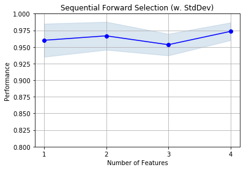


## Example 5 - Sequential Feature Selection for Regression

Similar to the classification examples above, the `SequentialFeatureSelector` also supports scikit-learn's estimators
for regression.


```python
from sklearn.linear_model import LinearRegression
from sklearn.datasets import load_boston

boston = load_boston()
X, y = boston.data, boston.target

lr = LinearRegression()

sfs = SFS(lr, 
          k_features=13, 
          forward=True, 
          floating=False, 
          scoring='neg_mean_squared_error',
          cv=10)

sfs = sfs.fit(X, y)
fig = plot_sfs(sfs.get_metric_dict(), kind='std_err')

plt.title('Sequential Forward Selection (w. StdErr)')
plt.grid()
plt.show()
```


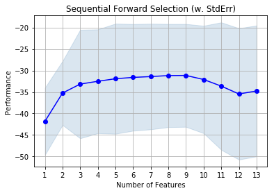


## Example 6 -- Using the Selected Feature Subset For Making New Predictions


```python
# Initialize the dataset

from sklearn.neighbors import KNeighborsClassifier
from sklearn.datasets import load_iris
from sklearn.model_selection import train_test_split

iris = load_iris()
X, y = iris.data, iris.target
X_train, X_test, y_train, y_test = train_test_split(
         X, y, test_size=0.33, random_state=1)

knn = KNeighborsClassifier(n_neighbors=4)
```


```python
# Select the "best" three features via
# 5-fold cross-validation on the training set.

from mlxtend.feature_selection import SequentialFeatureSelector as SFS

sfs1 = SFS(knn, 
           k_features=3, 
           forward=True, 
           floating=False, 
           scoring='accuracy',
           cv=5)
sfs1 = sfs1.fit(X_train, y_train)
```


```python
print('Selected features:', sfs1.k_feature_idx_)
```

    Selected features: (1, 2, 3)


```python
# Generate the new subsets based on the selected features
# Note that the transform call is equivalent to
# X_train[:, sfs1.k_feature_idx_]

X_train_sfs = sfs1.transform(X_train)
X_test_sfs = sfs1.transform(X_test)

# Fit the estimator using the new feature subset
# and make a prediction on the test data
knn.fit(X_train_sfs, y_train)
y_pred = knn.predict(X_test_sfs)

# Compute the accuracy of the prediction
acc = float((y_test == y_pred).sum()) / y_pred.shape[0]
print('Test set accuracy: %.2f %%' % (acc * 100))
```

    Test set accuracy: 96.00 %


## Example 7 -- Sequential Feature Selection and GridSearch


```python
# Initialize the dataset

from sklearn.neighbors import KNeighborsClassifier
from sklearn.datasets import load_iris
from sklearn.model_selection import train_test_split

iris = load_iris()
X, y = iris.data, iris.target
X_train, X_test, y_train, y_test = train_test_split(
         X, y, test_size=0.33, random_state=1)
```

Use scikit-learn's `GridSearch` to tune the hyperparameters inside and outside the `SequentialFeatureSelector`:


```python
from sklearn.model_selection import GridSearchCV
from sklearn.pipeline import Pipeline
from mlxtend.feature_selection import SequentialFeatureSelector as SFS
import mlxtend

knn = KNeighborsClassifier(n_neighbors=2)

sfs1 = SFS(estimator=knn, 
           k_features=3,
           forward=True, 
           floating=False, 
           scoring='accuracy',
           cv=5)

pipe = Pipeline([('sfs', sfs1), 
                 ('knn', knn)])

param_grid = [
  {'sfs__k_features': [1, 2, 3, 4],
   'sfs__estimator__n_neighbors': [1, 2, 3, 4]}
  ]
    
gs = GridSearchCV(estimator=pipe, 
                  param_grid=param_grid, 
                  scoring='accuracy', 
                  n_jobs=1, 
                  cv=5,  
                  refit=False)

# run gridearch
gs = gs.fit(X_train, y_train)
```

... and the "best" parameters determined by GridSearch are ...


```python
print("Best parameters via GridSearch", gs.best_params_)
```

    Best parameters via GridSearch {'sfs__k_features': 3, 'sfs__estimator__n_neighbors': 1}


#### Obtaining the best *k* feature indices after GridSearch

If we are interested in the best *k* feature indices via `SequentialFeatureSelection.k_feature_idx_`, we have to initialize a `GridSearchCV` object with `refit=True`. Now, the grid search object will take the complete training dataset and the best parameters, which it found via cross-validation, to train the estimator pipeline.


```python
gs = GridSearchCV(estimator=pipe, 
                  param_grid=param_grid, 
                  scoring='accuracy', 
                  n_jobs=1, 
                  cv=5, 
                  refit=True)
gs = gs.fit(X_train, y_train)
```

After running the grid search, we can access the individual pipeline objects of the `best_estimator_` via the `steps` attribute.


```python
gs.best_estimator_.steps
```


    [('sfs', SequentialFeatureSelector(clone_estimator=True, cv=5,
                   estimator=KNeighborsClassifier(algorithm='auto', leaf_size=30, metric='minkowski',
                 metric_params=None, n_jobs=1, n_neighbors=1, p=2,
                 weights='uniform'),
                   floating=False, forward=True, k_features=3, n_jobs=1,
                   pre_dispatch='2*n_jobs', scoring='accuracy',
                   skip_if_stuck=True, verbose=0)),
     ('knn',
      KNeighborsClassifier(algorithm='auto', leaf_size=30, metric='minkowski',
                 metric_params=None, n_jobs=1, n_neighbors=2, p=2,
                 weights='uniform'))]


Via sub-indexing, we can then obtain the best-selected feature subset:


```python
print('Best features:', gs.best_estimator_.steps[0][1].k_feature_idx_)
```

    Best features: (0, 1, 3)


During cross-validation, this feature combination had a CV accuracy of:


```python
print('Best score:', gs.best_score_)
```

    Best score: 0.94


```python
gs.best_params_
```


    {'sfs__estimator__n_neighbors': 1, 'sfs__k_features': 3}


**Alternatively**, if we can set the "best grid search parameters" in our pipeline manually if we ran `GridSearchCV` with `refit=False`. It should yield the same results:


```python
pipe.set_params(**gs.best_params_).fit(X_train, y_train)
print('Best features:', pipe.steps[0][1].k_feature_idx_)
```

    Best features: (0, 1, 3)


## Example 8 -- Selecting the "best"  feature combination in a k-range

If `k_features` is set to to a tuple `(min_k, max_k)` (new in 0.4.2), the SFS will now select the best feature combination that it discovered by iterating from `k=1` to `max_k` (forward), or `max_k` to `min_k` (backward). The size of the returned feature subset is then within `max_k` to `min_k`, depending on which combination scored best during cross validation.


```python
X.shape
```


    (150, 4)


```python
from mlxtend.feature_selection import SequentialFeatureSelector as SFS
from sklearn.neighbors import KNeighborsClassifier
from mlxtend.data import wine_data
from sklearn.model_selection import train_test_split
from sklearn.preprocessing import StandardScaler
from sklearn.pipeline import make_pipeline

X, y = wine_data()
X_train, X_test, y_train, y_test= train_test_split(X, y, 
                                                   stratify=y,
                                                   test_size=0.3,
                                                   random_state=1)

knn = KNeighborsClassifier(n_neighbors=2)

sfs1 = SFS(estimator=knn, 
           k_features=(3, 10),
           forward=True, 
           floating=False, 
           scoring='accuracy',
           cv=5)

pipe = make_pipeline(StandardScaler(), sfs1)

pipe.fit(X_train, y_train)

print('best combination (ACC: %.3f): %s\n' % (sfs1.k_score_, sfs1.k_feature_idx_))
print('all subsets:\n', sfs1.subsets_)
plot_sfs(sfs1.get_metric_dict(), kind='std_err');
```

    best combination (ACC: 0.992): (0, 1, 2, 3, 6, 8, 9, 10, 11, 12)
    
    all subsets:
     {1: {'avg_score': 0.7985641025641026, 'cv_scores': array([ 0.84615385,  0.6       ,  0.88      ,  0.79166667,  0.875     ]), 'feature_idx': (6,)}, 2: {'avg_score': 0.93561538461538463, 'cv_scores': array([ 0.92307692,  0.88      ,  1.        ,  0.95833333,  0.91666667]), 'feature_idx': (9, 6)}, 3: {'avg_score': 0.95228205128205123, 'cv_scores': array([ 0.92307692,  0.92      ,  0.96      ,  1.        ,  0.95833333]), 'feature_idx': (9, 12, 6)}, 4: {'avg_score': 0.96797435897435891, 'cv_scores': array([ 0.96153846,  0.96      ,  0.96      ,  1.        ,  0.95833333]), 'feature_idx': (9, 3, 12, 6)}, 5: {'avg_score': 0.97661538461538466, 'cv_scores': array([ 0.92307692,  0.96      ,  1.        ,  1.        ,  1.        ]), 'feature_idx': (9, 10, 3, 12, 6)}, 6: {'avg_score': 0.96828205128205125, 'cv_scores': array([ 0.92307692,  0.96      ,  1.        ,  0.95833333,  1.        ]), 'feature_idx': (2, 3, 6, 9, 10, 12)}, 7: {'avg_score': 0.96861538461538466, 'cv_scores': array([ 0.92307692,  0.92      ,  1.        ,  1.        ,  1.        ]), 'feature_idx': (0, 2, 3, 6, 9, 10, 12)}, 8: {'avg_score': 0.98399999999999999, 'cv_scores': array([ 1.  ,  0.92,  1.  ,  1.  ,  1.  ]), 'feature_idx': (0, 2, 3, 6, 8, 9, 10, 12)}, 9: {'avg_score': 0.98399999999999999, 'cv_scores': array([ 1.  ,  0.92,  1.  ,  1.  ,  1.  ]), 'feature_idx': (0, 2, 3, 6, 8, 9, 10, 11, 12)}, 10: {'avg_score': 0.99199999999999999, 'cv_scores': array([ 1.  ,  0.96,  1.  ,  1.  ,  1.  ]), 'feature_idx': (0, 1, 2, 3, 6, 8, 9, 10, 11, 12)}}


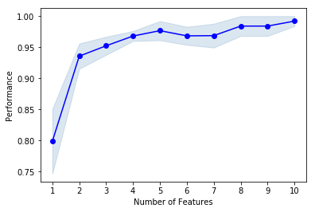


# API


*SequentialFeatureSelector(estimator, k_features=1, forward=True, floating=False, verbose=0, scoring=None, cv=5, skip_if_stuck=True, n_jobs=1, pre_dispatch='2*n_jobs', clone_estimator=True)*

Sequential Feature Selection for Classification and Regression.

**Parameters**

- `estimator` : scikit-learn classifier or regressor


- `k_features` : int or tuple (new in 0.4.2) (default: 1)

    Number of features to select,
    where k_features < the full feature set.
    New in 0.4.2: A tuple containing a min and max value can be provided,
    and the SFS will consider return any feature combination between
    min and max that scored highest in cross-validtion. For example,
    the tuple (1, 4) will return any combination from
    1 up to 4 features instead of a fixed number of features k.

- `forward` : bool (default: True)

    Forward selection if True,
    backward selection otherwise

- `floating` : bool (default: False)

    Adds a conditional exclusion/inclusion if True.

- `verbose` : int (default: 0), level of verbosity to use in logging.

    If 0, no output,
    if 1 number of features in current set, if 2 detailed logging i
    ncluding timestamp and cv scores at step.

- `scoring` : str, callable, or None (default: None)

    If None (default), uses 'accuracy' for sklearn classifiers
    and 'r2' for sklearn regressors.
    If str, uses a sklearn scoring metric string identifier, for example
    {accuracy, f1, precision, recall, roc_auc} for classifiers,
    {'mean_absolute_error', 'mean_squared_error'/'neg_mean_squared_error',
    'median_absolute_error', 'r2'} for regressors.
    If a callable object or function is provided, it has to be conform with
    sklearn's signature ``scorer(estimator, X, y)``; see
    http://scikit-learn.org/stable/modules/generated/sklearn.metrics.make_scorer.html
    for more information.

- `cv` : int (default: 5)

    Scikit-learn cross-validation generator or `int`.
    If estimator is a classifier (or y consists of integer class labels),
    stratified k-fold is performed, and regular k-fold cross-validation
    otherwise.
    No cross-validation if cv is None, False, or 0.
    skip_if_stuck: bool (default: True)
    Set to True to skip conditional
    exclusion/inclusion if floating=True and
    algorithm gets stuck in cycles.

- `n_jobs` : int (default: 1)

    The number of CPUs to use for evaluating different feature subsets
    in parallel. -1 means 'all CPUs'.

- `pre_dispatch` : int, or string (default: '2*n_jobs')

    Controls the number of jobs that get dispatched
    during parallel execution if `n_jobs > 1` or `n_jobs=-1`.
    Reducing this number can be useful to avoid an explosion of
    memory consumption when more jobs get dispatched than CPUs can process.
    This parameter can be:
    None, in which case all the jobs are immediately created and spawned.
    Use this for lightweight and fast-running jobs,
    to avoid delays due to on-demand spawning of the jobs
    An int, giving the exact number of total jobs that are spawned
    A string, giving an expression as a function
    of n_jobs, as in `2*n_jobs`

- `clone_estimator` : bool (default: True)

    Clones estimator if True; works with the original estimator instance
    if False. Set to False if the estimator doesn't
    implement scikit-learn's set_params and get_params methods.
    In addition, it is required to set cv=0, and n_jobs=1.

**Attributes**

- `k_feature_idx_` : array-like, shape = [n_predictions]

    Feature Indices of the selected feature subsets.

- `k_score_` : float

    Cross validation average score of the selected subset.

- `subsets_` : dict

    A dictionary of selected feature subsets during the
    sequential selection, where the dictionary keys are
    the lengths k of these feature subsets. The dictionary
    values are dictionaries themselves with the following
    keys: 'feature_idx' (tuple of indices of the feature subset)
    'cv_scores' (list individual cross-validation scores)
    'avg_score' (average cross-validation score)

### Methods

<hr>

*fit(X, y)*

Perform feature selection and learn model from training data.

**Parameters**

- `X` : {array-like, sparse matrix}, shape = [n_samples, n_features]

    Training vectors, where n_samples is the number of samples and
    n_features is the number of features.

- `y` : array-like, shape = [n_samples]

    Target values.

**Returns**

- `self` : object


<hr>

*fit_transform(X, y)*

Fit to training data then reduce X to its most important features.

**Parameters**

- `X` : {array-like, sparse matrix}, shape = [n_samples, n_features]

    Training vectors, where n_samples is the number of samples and
    n_features is the number of features.

**Returns**

Reduced feature subset of X, shape={n_samples, k_features}

<hr>

*get_metric_dict(confidence_interval=0.95)*

Return metric dictionary

**Parameters**

- `confidence_interval` : float (default: 0.95)

    A positive float between 0.0 and 1.0 to compute the confidence
    interval bounds of the CV score averages.

**Returns**

Dictionary with items where each dictionary value is a list
    with the number of iterations (number of feature subsets) as
    its length. The dictionary keys corresponding to these lists
    are as follows:
    'feature_idx': tuple of the indices of the feature subset
    'cv_scores': list with individual CV scores
    'avg_score': of CV average scores
    'std_dev': standard deviation of the CV score average
    'std_err': standard error of the CV score average
    'ci_bound': confidence interval bound of the CV score average

<hr>

*get_params(deep=True)*

Get parameters for this estimator.

**Parameters**

- `deep` : boolean, optional

    If True, will return the parameters for this estimator and
    contained subobjects that are estimators.

**Returns**

- `params` : mapping of string to any

    Parameter names mapped to their values.

<hr>

*set_params(**params)*

Set the parameters of this estimator.

The method works on simple estimators as well as on nested objects
(such as pipelines). The latter have parameters of the form
``<component>__<parameter>`` so that it's possible to update each
component of a nested object.

**Returns**

self

<hr>

*transform(X)*

Reduce X to its most important features.

**Parameters**

- `X` : {array-like, sparse matrix}, shape = [n_samples, n_features]

    Training vectors, where n_samples is the number of samples and
    n_features is the number of features.

**Returns**

Reduced feature subset of X, shape={n_samples, k_features}


# `feature_selection.ExhaustiveFeatureSelector`

Implementation of an *exhaustive feature selector* for sampling and evaluating all possible feature combinations in a specified range.

> from mlxtend.feature_selection import ExhaustiveFeatureSelector

## Overview

This exhaustive feature selection algorithm is a wrapper approach for brute-force evaluation of feature subsets; the best subset is selected by optimizing a specified performance metric given an arbitrary regressor or classifier. For instance, if the classifier is a logistic regression and the dataset consists of 4 features, the alogorithm will evaluate all 15 feature combinations (if `min_features=1` and `max_features=4`)

- {0}
- {1}
- {2}
- {3}
- {0, 1}
- {0, 2}
- {0, 3}
- {1, 2}
- {1, 3}
- {2, 3}
- {0, 1, 2}
- {0, 1, 3}
- {0, 2, 3}
- {1, 2, 3}
- {0, 1, 2, 3}

and select the one that results in the best performance (e.g., classification accuracy) of the logistic regression classifier.


## Example 1 - A simple Iris Example

Initializing a simple classifier from scikit-learn:


```python
from sklearn.neighbors import KNeighborsClassifier
from sklearn.datasets import load_iris
from mlxtend.feature_selection import ExhaustiveFeatureSelector as EFS

iris = load_iris()
X = iris.data
y = iris.target

knn = KNeighborsClassifier(n_neighbors=3)

efs1 = EFS(knn, 
           min_features=1,
           max_features=4,
           scoring='accuracy',
           print_progress=True,
           cv=5)

efs1 = efs1.fit(X, y)

print('Best accuracy score: %.2f' % efs1.best_score_)
print('Best subset:', efs1.best_idx_)
```

    Features: 15/15

    Best accuracy score: 0.97
    Best subset: (0, 2, 3)


Via the `subsets_` attribute, we can take a look at the selected feature indices at each step:


```python
efs1.subsets_
```


    {0: {'avg_score': 0.65999999999999992,
      'cv_scores': array([ 0.53333333,  0.63333333,  0.73333333,  0.76666667,  0.63333333]),
      'feature_idx': (0,)},
     1: {'avg_score': 0.56666666666666665,
      'cv_scores': array([ 0.53333333,  0.63333333,  0.6       ,  0.5       ,  0.56666667]),
      'feature_idx': (1,)},
     2: {'avg_score': 0.95333333333333337,
      'cv_scores': array([ 0.93333333,  1.        ,  0.9       ,  0.93333333,  1.        ]),
      'feature_idx': (2,)},
     3: {'avg_score': 0.94666666666666666,
      'cv_scores': array([ 0.96666667,  0.96666667,  0.93333333,  0.86666667,  1.        ]),
      'feature_idx': (3,)},
     4: {'avg_score': 0.72666666666666668,
      'cv_scores': array([ 0.66666667,  0.8       ,  0.63333333,  0.86666667,  0.66666667]),
      'feature_idx': (0, 1)},
     5: {'avg_score': 0.94666666666666666,
      'cv_scores': array([ 0.96666667,  1.        ,  0.86666667,  0.93333333,  0.96666667]),
      'feature_idx': (0, 2)},
     6: {'avg_score': 0.95333333333333337,
      'cv_scores': array([ 0.96666667,  0.96666667,  0.9       ,  0.93333333,  1.        ]),
      'feature_idx': (0, 3)},
     7: {'avg_score': 0.94666666666666666,
      'cv_scores': array([ 0.96666667,  1.        ,  0.9       ,  0.93333333,  0.93333333]),
      'feature_idx': (1, 2)},
     8: {'avg_score': 0.94000000000000006,
      'cv_scores': array([ 0.96666667,  0.96666667,  0.86666667,  0.93333333,  0.96666667]),
      'feature_idx': (1, 3)},
     9: {'avg_score': 0.95333333333333337,
      'cv_scores': array([ 0.96666667,  0.96666667,  0.9       ,  0.93333333,  1.        ]),
      'feature_idx': (2, 3)},
     10: {'avg_score': 0.94000000000000006,
      'cv_scores': array([ 0.96666667,  0.96666667,  0.86666667,  0.93333333,  0.96666667]),
      'feature_idx': (0, 1, 2)},
     11: {'avg_score': 0.94666666666666666,
      'cv_scores': array([ 0.93333333,  0.96666667,  0.9       ,  0.93333333,  1.        ]),
      'feature_idx': (0, 1, 3)},
     12: {'avg_score': 0.97333333333333338,
      'cv_scores': array([ 0.96666667,  0.96666667,  0.96666667,  0.96666667,  1.        ]),
      'feature_idx': (0, 2, 3)},
     13: {'avg_score': 0.95999999999999996,
      'cv_scores': array([ 0.96666667,  0.96666667,  0.93333333,  0.93333333,  1.        ]),
      'feature_idx': (1, 2, 3)},
     14: {'avg_score': 0.96666666666666679,
      'cv_scores': array([ 0.96666667,  0.96666667,  0.93333333,  0.96666667,  1.        ]),
      'feature_idx': (0, 1, 2, 3)}}


## Example 2 - Visualizing the feature selection results

 For our convenience, we can visualize the output from the feature selection in a pandas DataFrame format using the `get_metric_dict` method of the `ExhaustiveFeatureSelector` object. The columns `std_dev` and `std_err` represent the standard deviation and standard errors of the cross-validation scores, respectively.

Below, we see the DataFrame of the Sequential Forward Selector from Example 2:


```python
import pandas as pd

iris = load_iris()
X = iris.data
y = iris.target

knn = KNeighborsClassifier(n_neighbors=3)

efs1 = EFS(knn, 
           min_features=1,
           max_features=4,
           scoring='accuracy',
           print_progress=True,
           cv=5)

efs1 = efs1.fit(X, y)

df = pd.DataFrame.from_dict(efs1.get_metric_dict()).T
df.sort_values('avg_score', inplace=True, ascending=False)
df
```

    Features: 15/15


<div>
<table border="1" class="dataframe">
  <thead>
    <tr style="text-align: right;">
      <th></th>
      <th>avg_score</th>
      <th>ci_bound</th>
      <th>cv_scores</th>
      <th>feature_idx</th>
      <th>std_dev</th>
      <th>std_err</th>
    </tr>
  </thead>
  <tbody>
    <tr>
      <th>12</th>
      <td>0.973333</td>
      <td>0.0171372</td>
      <td>[0.966666666667, 0.966666666667, 0.96666666666...</td>
      <td>(0, 2, 3)</td>
      <td>0.0133333</td>
      <td>0.00666667</td>
    </tr>
    <tr>
      <th>14</th>
      <td>0.966667</td>
      <td>0.0270963</td>
      <td>[0.966666666667, 0.966666666667, 0.93333333333...</td>
      <td>(0, 1, 2, 3)</td>
      <td>0.0210819</td>
      <td>0.0105409</td>
    </tr>
    <tr>
      <th>13</th>
      <td>0.96</td>
      <td>0.0320608</td>
      <td>[0.966666666667, 0.966666666667, 0.93333333333...</td>
      <td>(1, 2, 3)</td>
      <td>0.0249444</td>
      <td>0.0124722</td>
    </tr>
    <tr>
      <th>2</th>
      <td>0.953333</td>
      <td>0.0514116</td>
      <td>[0.933333333333, 1.0, 0.9, 0.933333333333, 1.0]</td>
      <td>(2,)</td>
      <td>0.04</td>
      <td>0.02</td>
    </tr>
    <tr>
      <th>6</th>
      <td>0.953333</td>
      <td>0.0436915</td>
      <td>[0.966666666667, 0.966666666667, 0.9, 0.933333...</td>
      <td>(0, 3)</td>
      <td>0.0339935</td>
      <td>0.0169967</td>
    </tr>
    <tr>
      <th>9</th>
      <td>0.953333</td>
      <td>0.0436915</td>
      <td>[0.966666666667, 0.966666666667, 0.9, 0.933333...</td>
      <td>(2, 3)</td>
      <td>0.0339935</td>
      <td>0.0169967</td>
    </tr>
    <tr>
      <th>3</th>
      <td>0.946667</td>
      <td>0.0581151</td>
      <td>[0.966666666667, 0.966666666667, 0.93333333333...</td>
      <td>(3,)</td>
      <td>0.0452155</td>
      <td>0.0226078</td>
    </tr>
    <tr>
      <th>5</th>
      <td>0.946667</td>
      <td>0.0581151</td>
      <td>[0.966666666667, 1.0, 0.866666666667, 0.933333...</td>
      <td>(0, 2)</td>
      <td>0.0452155</td>
      <td>0.0226078</td>
    </tr>
    <tr>
      <th>7</th>
      <td>0.946667</td>
      <td>0.0436915</td>
      <td>[0.966666666667, 1.0, 0.9, 0.933333333333, 0.9...</td>
      <td>(1, 2)</td>
      <td>0.0339935</td>
      <td>0.0169967</td>
    </tr>
    <tr>
      <th>11</th>
      <td>0.946667</td>
      <td>0.0436915</td>
      <td>[0.933333333333, 0.966666666667, 0.9, 0.933333...</td>
      <td>(0, 1, 3)</td>
      <td>0.0339935</td>
      <td>0.0169967</td>
    </tr>
    <tr>
      <th>8</th>
      <td>0.94</td>
      <td>0.0499631</td>
      <td>[0.966666666667, 0.966666666667, 0.86666666666...</td>
      <td>(1, 3)</td>
      <td>0.038873</td>
      <td>0.0194365</td>
    </tr>
    <tr>
      <th>10</th>
      <td>0.94</td>
      <td>0.0499631</td>
      <td>[0.966666666667, 0.966666666667, 0.86666666666...</td>
      <td>(0, 1, 2)</td>
      <td>0.038873</td>
      <td>0.0194365</td>
    </tr>
    <tr>
      <th>4</th>
      <td>0.726667</td>
      <td>0.11623</td>
      <td>[0.666666666667, 0.8, 0.633333333333, 0.866666...</td>
      <td>(0, 1)</td>
      <td>0.0904311</td>
      <td>0.0452155</td>
    </tr>
    <tr>
      <th>0</th>
      <td>0.66</td>
      <td>0.106334</td>
      <td>[0.533333333333, 0.633333333333, 0.73333333333...</td>
      <td>(0,)</td>
      <td>0.0827312</td>
      <td>0.0413656</td>
    </tr>
    <tr>
      <th>1</th>
      <td>0.566667</td>
      <td>0.0605892</td>
      <td>[0.533333333333, 0.633333333333, 0.6, 0.5, 0.5...</td>
      <td>(1,)</td>
      <td>0.0471405</td>
      <td>0.0235702</td>
    </tr>
  </tbody>
</table>
</div>


```python
import matplotlib.pyplot as plt

metric_dict = efs1.get_metric_dict()

fig = plt.figure()
k_feat = sorted(metric_dict.keys())
avg = [metric_dict[k]['avg_score'] for k in k_feat]

upper, lower = [], []
for k in k_feat:
    upper.append(metric_dict[k]['avg_score'] +
                 metric_dict[k]['std_dev'])
    lower.append(metric_dict[k]['avg_score'] -
                 metric_dict[k]['std_dev'])
    
plt.fill_between(k_feat,
                 upper,
                 lower,
                 alpha=0.2,
                 color='blue',
                 lw=1)

plt.plot(k_feat, avg, color='blue', marker='o')
plt.ylabel('Accuracy +/- Standard Deviation')
plt.xlabel('Number of Features')
feature_min = len(metric_dict[k_feat[0]]['feature_idx'])
feature_max = len(metric_dict[k_feat[-1]]['feature_idx'])
plt.xticks(k_feat, 
           [str(metric_dict[k]['feature_idx']) for k in k_feat], 
           rotation=90)
plt.show()
```


## Example 3 - Exhaustive Feature Selection for Regression

Similar to the classification examples above, the `SequentialFeatureSelector` also supports scikit-learn's estimators
for regression.


```python
from sklearn.linear_model import LinearRegression
from sklearn.datasets import load_boston

boston = load_boston()
X, y = boston.data, boston.target

lr = LinearRegression()

efs = EFS(lr, 
          min_features=10,
          max_features=12,
          scoring='neg_mean_squared_error',
          cv=10)

efs.fit(X, y)

print('Best MSE score: %.2f' % efs.best_score_ * (-1))
print('Best subset:', efs.best_idx_)
```

    Features: 377/377

    
    Best subset: (0, 1, 4, 6, 7, 8, 9, 10, 11, 12)


## Example 4 - Using the Selected Feature Subset For Making New Predictions


```python
# Initialize the dataset

from sklearn.neighbors import KNeighborsClassifier
from sklearn.datasets import load_iris
from sklearn.model_selection import train_test_split

iris = load_iris()
X, y = iris.data, iris.target
X_train, X_test, y_train, y_test = train_test_split(
         X, y, test_size=0.33, random_state=1)

knn = KNeighborsClassifier(n_neighbors=3)
```


```python
# Select the "best" three features via
# 5-fold cross-validation on the training set.

from mlxtend.feature_selection import ExhaustiveFeatureSelector as EFS

efs1 = EFS(knn, 
           min_features=1,
           max_features=4,
           scoring='accuracy',
           cv=5)
efs1 = efs1.fit(X_train, y_train)
```

    Features: 15/15


```python
print('Selected features:', efs1.best_idx_)
```

    Selected features: (2, 3)


```python
# Generate the new subsets based on the selected features
# Note that the transform call is equivalent to
# X_train[:, efs1.k_feature_idx_]

X_train_efs = efs1.transform(X_train)
X_test_efs = efs1.transform(X_test)

# Fit the estimator using the new feature subset
# and make a prediction on the test data
knn.fit(X_train_efs, y_train)
y_pred = knn.predict(X_test_efs)

# Compute the accuracy of the prediction
acc = float((y_test == y_pred).sum()) / y_pred.shape[0]
print('Test set accuracy: %.2f %%' % (acc*100))
```

    Test set accuracy: 96.00 %


## Example 5 - Exhaustive Feature Selection and GridSearch


```python
# Initialize the dataset

from sklearn.datasets import load_iris
from sklearn.model_selection import train_test_split

iris = load_iris()
X, y = iris.data, iris.target
X_train, X_test, y_train, y_test = train_test_split(
         X, y, test_size=0.33, random_state=1)
```

Use scikit-learn's `GridSearch` to tune the hyperparameters of the `LogisticRegression` estimator inside the `ExhaustiveFeatureSelector` and use it for prediction in the pipeline. **Note that the `clone_estimator` attribute needs to be set to `False`.**


```python
from sklearn.model_selection import GridSearchCV
from sklearn.pipeline import make_pipeline
from sklearn.linear_model import LogisticRegression
from mlxtend.feature_selection import ExhaustiveFeatureSelector as EFS

lr = LogisticRegression(multi_class='multinomial', 
                        solver='lbfgs', 
                        random_state=123)

efs1 = EFS(estimator=lr, 
           min_features=2,
           max_features=3,
           scoring='accuracy',
           print_progress=False,
           clone_estimator=False,
           cv=5,
           n_jobs=1)

pipe = make_pipeline(efs1, lr)

param_grid = {'exhaustivefeatureselector__estimator__C': [0.1, 1.0, 10.0]}
    
gs = GridSearchCV(estimator=pipe, 
                  param_grid=param_grid, 
                  scoring='accuracy', 
                  n_jobs=1, 
                  cv=2, 
                  verbose=1, 
                  refit=False)

# run gridearch
gs = gs.fit(X_train, y_train)
```

    Fitting 2 folds for each of 3 candidates, totalling 6 fits


    [Parallel(n_jobs=1)]: Done   6 out of   6 | elapsed:    2.7s finished


... and the "best" parameters determined by GridSearch are ...


```python
print("Best parameters via GridSearch", gs.best_params_)
```

    Best parameters via GridSearch {'exhaustivefeatureselector__estimator__C': 1.0}


#### Obtaining the best *k* feature indices after GridSearch

If we are interested in the best *k* best feature indices via `SequentialFeatureSelection.best_idx_`, we have to initialize a `GridSearchCV` object with `refit=True`. Now, the grid search object will take the complete training dataset and the best parameters, which it found via cross-validation, to train the estimator pipeline.


```python
gs = GridSearchCV(estimator=pipe, 
                  param_grid=param_grid, 
                  scoring='accuracy', 
                  n_jobs=2, 
                  cv=2, 
                  verbose=1, 
                  refit=True)
```

After running the grid search, we can access the individual pipeline objects of the `best_estimator_` via the `steps` attribute.


```python
gs = gs.fit(X_train, y_train)
gs.best_estimator_.steps
```

    Fitting 2 folds for each of 3 candidates, totalling 6 fits


    /Users/Sebastian/miniconda3/lib/python3.5/site-packages/sklearn/externals/joblib/parallel.py:540: UserWarning: Multiprocessing-backed parallel loops cannot be nested, setting n_jobs=1
      **self._backend_args)
    /Users/Sebastian/miniconda3/lib/python3.5/site-packages/sklearn/externals/joblib/parallel.py:540: UserWarning: Multiprocessing-backed parallel loops cannot be nested, setting n_jobs=1
      **self._backend_args)
    /Users/Sebastian/miniconda3/lib/python3.5/site-packages/sklearn/externals/joblib/parallel.py:540: UserWarning: Multiprocessing-backed parallel loops cannot be nested, setting n_jobs=1
      **self._backend_args)
    /Users/Sebastian/miniconda3/lib/python3.5/site-packages/sklearn/externals/joblib/parallel.py:540: UserWarning: Multiprocessing-backed parallel loops cannot be nested, setting n_jobs=1
      **self._backend_args)
    /Users/Sebastian/miniconda3/lib/python3.5/site-packages/sklearn/externals/joblib/parallel.py:540: UserWarning: Multiprocessing-backed parallel loops cannot be nested, setting n_jobs=1
      **self._backend_args)
    /Users/Sebastian/miniconda3/lib/python3.5/site-packages/sklearn/externals/joblib/parallel.py:540: UserWarning: Multiprocessing-backed parallel loops cannot be nested, setting n_jobs=1
      **self._backend_args)
    /Users/Sebastian/miniconda3/lib/python3.5/site-packages/sklearn/externals/joblib/parallel.py:540: UserWarning: Multiprocessing-backed parallel loops cannot be nested, setting n_jobs=1
      **self._backend_args)
    /Users/Sebastian/miniconda3/lib/python3.5/site-packages/sklearn/externals/joblib/parallel.py:540: UserWarning: Multiprocessing-backed parallel loops cannot be nested, setting n_jobs=1
      **self._backend_args)
    /Users/Sebastian/miniconda3/lib/python3.5/site-packages/sklearn/externals/joblib/parallel.py:540: UserWarning: Multiprocessing-backed parallel loops cannot be nested, setting n_jobs=1
      **self._backend_args)
    /Users/Sebastian/miniconda3/lib/python3.5/site-packages/sklearn/externals/joblib/parallel.py:540: UserWarning: Multiprocessing-backed parallel loops cannot be nested, setting n_jobs=1
      **self._backend_args)
    /Users/Sebastian/miniconda3/lib/python3.5/site-packages/sklearn/externals/joblib/parallel.py:540: UserWarning: Multiprocessing-backed parallel loops cannot be nested, setting n_jobs=1
      **self._backend_args)
    /Users/Sebastian/miniconda3/lib/python3.5/site-packages/sklearn/externals/joblib/parallel.py:540: UserWarning: Multiprocessing-backed parallel loops cannot be nested, setting n_jobs=1
      **self._backend_args)
    /Users/Sebastian/miniconda3/lib/python3.5/site-packages/sklearn/externals/joblib/parallel.py:540: UserWarning: Multiprocessing-backed parallel loops cannot be nested, setting n_jobs=1
      **self._backend_args)
    /Users/Sebastian/miniconda3/lib/python3.5/site-packages/sklearn/externals/joblib/parallel.py:540: UserWarning: Multiprocessing-backed parallel loops cannot be nested, setting n_jobs=1
      **self._backend_args)
    /Users/Sebastian/miniconda3/lib/python3.5/site-packages/sklearn/externals/joblib/parallel.py:540: UserWarning: Multiprocessing-backed parallel loops cannot be nested, setting n_jobs=1
      **self._backend_args)
    /Users/Sebastian/miniconda3/lib/python3.5/site-packages/sklearn/externals/joblib/parallel.py:540: UserWarning: Multiprocessing-backed parallel loops cannot be nested, setting n_jobs=1
      **self._backend_args)
    /Users/Sebastian/miniconda3/lib/python3.5/site-packages/sklearn/externals/joblib/parallel.py:540: UserWarning: Multiprocessing-backed parallel loops cannot be nested, setting n_jobs=1
      **self._backend_args)
    /Users/Sebastian/miniconda3/lib/python3.5/site-packages/sklearn/externals/joblib/parallel.py:540: UserWarning: Multiprocessing-backed parallel loops cannot be nested, setting n_jobs=1
      **self._backend_args)
    /Users/Sebastian/miniconda3/lib/python3.5/site-packages/sklearn/externals/joblib/parallel.py:540: UserWarning: Multiprocessing-backed parallel loops cannot be nested, setting n_jobs=1
      **self._backend_args)
    /Users/Sebastian/miniconda3/lib/python3.5/site-packages/sklearn/externals/joblib/parallel.py:540: UserWarning: Multiprocessing-backed parallel loops cannot be nested, setting n_jobs=1
      **self._backend_args)
    /Users/Sebastian/miniconda3/lib/python3.5/site-packages/sklearn/externals/joblib/parallel.py:540: UserWarning: Multiprocessing-backed parallel loops cannot be nested, setting n_jobs=1
      **self._backend_args)
    /Users/Sebastian/miniconda3/lib/python3.5/site-packages/sklearn/externals/joblib/parallel.py:540: UserWarning: Multiprocessing-backed parallel loops cannot be nested, setting n_jobs=1
      **self._backend_args)
    /Users/Sebastian/miniconda3/lib/python3.5/site-packages/sklearn/externals/joblib/parallel.py:540: UserWarning: Multiprocessing-backed parallel loops cannot be nested, setting n_jobs=1
      **self._backend_args)
    /Users/Sebastian/miniconda3/lib/python3.5/site-packages/sklearn/externals/joblib/parallel.py:540: UserWarning: Multiprocessing-backed parallel loops cannot be nested, setting n_jobs=1
      **self._backend_args)
    /Users/Sebastian/miniconda3/lib/python3.5/site-packages/sklearn/externals/joblib/parallel.py:540: UserWarning: Multiprocessing-backed parallel loops cannot be nested, setting n_jobs=1
      **self._backend_args)
    /Users/Sebastian/miniconda3/lib/python3.5/site-packages/sklearn/externals/joblib/parallel.py:540: UserWarning: Multiprocessing-backed parallel loops cannot be nested, setting n_jobs=1
      **self._backend_args)
    /Users/Sebastian/miniconda3/lib/python3.5/site-packages/sklearn/externals/joblib/parallel.py:540: UserWarning: Multiprocessing-backed parallel loops cannot be nested, setting n_jobs=1
      **self._backend_args)
    /Users/Sebastian/miniconda3/lib/python3.5/site-packages/sklearn/externals/joblib/parallel.py:540: UserWarning: Multiprocessing-backed parallel loops cannot be nested, setting n_jobs=1
      **self._backend_args)
    /Users/Sebastian/miniconda3/lib/python3.5/site-packages/sklearn/externals/joblib/parallel.py:540: UserWarning: Multiprocessing-backed parallel loops cannot be nested, setting n_jobs=1
      **self._backend_args)
    /Users/Sebastian/miniconda3/lib/python3.5/site-packages/sklearn/externals/joblib/parallel.py:540: UserWarning: Multiprocessing-backed parallel loops cannot be nested, setting n_jobs=1
      **self._backend_args)
    /Users/Sebastian/miniconda3/lib/python3.5/site-packages/sklearn/externals/joblib/parallel.py:540: UserWarning: Multiprocessing-backed parallel loops cannot be nested, setting n_jobs=1
      **self._backend_args)
    /Users/Sebastian/miniconda3/lib/python3.5/site-packages/sklearn/externals/joblib/parallel.py:540: UserWarning: Multiprocessing-backed parallel loops cannot be nested, setting n_jobs=1
      **self._backend_args)
    /Users/Sebastian/miniconda3/lib/python3.5/site-packages/sklearn/externals/joblib/parallel.py:540: UserWarning: Multiprocessing-backed parallel loops cannot be nested, setting n_jobs=1
      **self._backend_args)
    /Users/Sebastian/miniconda3/lib/python3.5/site-packages/sklearn/externals/joblib/parallel.py:540: UserWarning: Multiprocessing-backed parallel loops cannot be nested, setting n_jobs=1
      **self._backend_args)
    /Users/Sebastian/miniconda3/lib/python3.5/site-packages/sklearn/externals/joblib/parallel.py:540: UserWarning: Multiprocessing-backed parallel loops cannot be nested, setting n_jobs=1
      **self._backend_args)
    /Users/Sebastian/miniconda3/lib/python3.5/site-packages/sklearn/externals/joblib/parallel.py:540: UserWarning: Multiprocessing-backed parallel loops cannot be nested, setting n_jobs=1
      **self._backend_args)
    /Users/Sebastian/miniconda3/lib/python3.5/site-packages/sklearn/externals/joblib/parallel.py:540: UserWarning: Multiprocessing-backed parallel loops cannot be nested, setting n_jobs=1
      **self._backend_args)
    /Users/Sebastian/miniconda3/lib/python3.5/site-packages/sklearn/externals/joblib/parallel.py:540: UserWarning: Multiprocessing-backed parallel loops cannot be nested, setting n_jobs=1
      **self._backend_args)
    /Users/Sebastian/miniconda3/lib/python3.5/site-packages/sklearn/externals/joblib/parallel.py:540: UserWarning: Multiprocessing-backed parallel loops cannot be nested, setting n_jobs=1
      **self._backend_args)
    /Users/Sebastian/miniconda3/lib/python3.5/site-packages/sklearn/externals/joblib/parallel.py:540: UserWarning: Multiprocessing-backed parallel loops cannot be nested, setting n_jobs=1
      **self._backend_args)
    /Users/Sebastian/miniconda3/lib/python3.5/site-packages/sklearn/externals/joblib/parallel.py:540: UserWarning: Multiprocessing-backed parallel loops cannot be nested, setting n_jobs=1
      **self._backend_args)
    /Users/Sebastian/miniconda3/lib/python3.5/site-packages/sklearn/externals/joblib/parallel.py:540: UserWarning: Multiprocessing-backed parallel loops cannot be nested, setting n_jobs=1
      **self._backend_args)
    /Users/Sebastian/miniconda3/lib/python3.5/site-packages/sklearn/externals/joblib/parallel.py:540: UserWarning: Multiprocessing-backed parallel loops cannot be nested, setting n_jobs=1
      **self._backend_args)
    /Users/Sebastian/miniconda3/lib/python3.5/site-packages/sklearn/externals/joblib/parallel.py:540: UserWarning: Multiprocessing-backed parallel loops cannot be nested, setting n_jobs=1
      **self._backend_args)
    /Users/Sebastian/miniconda3/lib/python3.5/site-packages/sklearn/externals/joblib/parallel.py:540: UserWarning: Multiprocessing-backed parallel loops cannot be nested, setting n_jobs=1
      **self._backend_args)
    /Users/Sebastian/miniconda3/lib/python3.5/site-packages/sklearn/externals/joblib/parallel.py:540: UserWarning: Multiprocessing-backed parallel loops cannot be nested, setting n_jobs=1
      **self._backend_args)
    /Users/Sebastian/miniconda3/lib/python3.5/site-packages/sklearn/externals/joblib/parallel.py:540: UserWarning: Multiprocessing-backed parallel loops cannot be nested, setting n_jobs=1
      **self._backend_args)
    /Users/Sebastian/miniconda3/lib/python3.5/site-packages/sklearn/externals/joblib/parallel.py:540: UserWarning: Multiprocessing-backed parallel loops cannot be nested, setting n_jobs=1
      **self._backend_args)
    /Users/Sebastian/miniconda3/lib/python3.5/site-packages/sklearn/externals/joblib/parallel.py:540: UserWarning: Multiprocessing-backed parallel loops cannot be nested, setting n_jobs=1
      **self._backend_args)
    /Users/Sebastian/miniconda3/lib/python3.5/site-packages/sklearn/externals/joblib/parallel.py:540: UserWarning: Multiprocessing-backed parallel loops cannot be nested, setting n_jobs=1
      **self._backend_args)
    /Users/Sebastian/miniconda3/lib/python3.5/site-packages/sklearn/externals/joblib/parallel.py:540: UserWarning: Multiprocessing-backed parallel loops cannot be nested, setting n_jobs=1
      **self._backend_args)
    /Users/Sebastian/miniconda3/lib/python3.5/site-packages/sklearn/externals/joblib/parallel.py:540: UserWarning: Multiprocessing-backed parallel loops cannot be nested, setting n_jobs=1
      **self._backend_args)
    /Users/Sebastian/miniconda3/lib/python3.5/site-packages/sklearn/externals/joblib/parallel.py:540: UserWarning: Multiprocessing-backed parallel loops cannot be nested, setting n_jobs=1
      **self._backend_args)
    /Users/Sebastian/miniconda3/lib/python3.5/site-packages/sklearn/externals/joblib/parallel.py:540: UserWarning: Multiprocessing-backed parallel loops cannot be nested, setting n_jobs=1
      **self._backend_args)
    /Users/Sebastian/miniconda3/lib/python3.5/site-packages/sklearn/externals/joblib/parallel.py:540: UserWarning: Multiprocessing-backed parallel loops cannot be nested, setting n_jobs=1
      **self._backend_args)
    /Users/Sebastian/miniconda3/lib/python3.5/site-packages/sklearn/externals/joblib/parallel.py:540: UserWarning: Multiprocessing-backed parallel loops cannot be nested, setting n_jobs=1
      **self._backend_args)
    /Users/Sebastian/miniconda3/lib/python3.5/site-packages/sklearn/externals/joblib/parallel.py:540: UserWarning: Multiprocessing-backed parallel loops cannot be nested, setting n_jobs=1
      **self._backend_args)
    /Users/Sebastian/miniconda3/lib/python3.5/site-packages/sklearn/externals/joblib/parallel.py:540: UserWarning: Multiprocessing-backed parallel loops cannot be nested, setting n_jobs=1
      **self._backend_args)
    /Users/Sebastian/miniconda3/lib/python3.5/site-packages/sklearn/externals/joblib/parallel.py:540: UserWarning: Multiprocessing-backed parallel loops cannot be nested, setting n_jobs=1
      **self._backend_args)
    /Users/Sebastian/miniconda3/lib/python3.5/site-packages/sklearn/externals/joblib/parallel.py:540: UserWarning: Multiprocessing-backed parallel loops cannot be nested, setting n_jobs=1
      **self._backend_args)
    /Users/Sebastian/miniconda3/lib/python3.5/site-packages/sklearn/externals/joblib/parallel.py:540: UserWarning: Multiprocessing-backed parallel loops cannot be nested, setting n_jobs=1
      **self._backend_args)
    /Users/Sebastian/miniconda3/lib/python3.5/site-packages/sklearn/externals/joblib/parallel.py:540: UserWarning: Multiprocessing-backed parallel loops cannot be nested, setting n_jobs=1
      **self._backend_args)
    /Users/Sebastian/miniconda3/lib/python3.5/site-packages/sklearn/externals/joblib/parallel.py:540: UserWarning: Multiprocessing-backed parallel loops cannot be nested, setting n_jobs=1
      **self._backend_args)
    /Users/Sebastian/miniconda3/lib/python3.5/site-packages/sklearn/externals/joblib/parallel.py:540: UserWarning: Multiprocessing-backed parallel loops cannot be nested, setting n_jobs=1
      **self._backend_args)
    /Users/Sebastian/miniconda3/lib/python3.5/site-packages/sklearn/externals/joblib/parallel.py:540: UserWarning: Multiprocessing-backed parallel loops cannot be nested, setting n_jobs=1
      **self._backend_args)
    /Users/Sebastian/miniconda3/lib/python3.5/site-packages/sklearn/externals/joblib/parallel.py:540: UserWarning: Multiprocessing-backed parallel loops cannot be nested, setting n_jobs=1
      **self._backend_args)
    /Users/Sebastian/miniconda3/lib/python3.5/site-packages/sklearn/externals/joblib/parallel.py:540: UserWarning: Multiprocessing-backed parallel loops cannot be nested, setting n_jobs=1
      **self._backend_args)
    /Users/Sebastian/miniconda3/lib/python3.5/site-packages/sklearn/externals/joblib/parallel.py:540: UserWarning: Multiprocessing-backed parallel loops cannot be nested, setting n_jobs=1
      **self._backend_args)
    /Users/Sebastian/miniconda3/lib/python3.5/site-packages/sklearn/externals/joblib/parallel.py:540: UserWarning: Multiprocessing-backed parallel loops cannot be nested, setting n_jobs=1
      **self._backend_args)
    /Users/Sebastian/miniconda3/lib/python3.5/site-packages/sklearn/externals/joblib/parallel.py:540: UserWarning: Multiprocessing-backed parallel loops cannot be nested, setting n_jobs=1
      **self._backend_args)
    /Users/Sebastian/miniconda3/lib/python3.5/site-packages/sklearn/externals/joblib/parallel.py:540: UserWarning: Multiprocessing-backed parallel loops cannot be nested, setting n_jobs=1
      **self._backend_args)
    /Users/Sebastian/miniconda3/lib/python3.5/site-packages/sklearn/externals/joblib/parallel.py:540: UserWarning: Multiprocessing-backed parallel loops cannot be nested, setting n_jobs=1
      **self._backend_args)
    /Users/Sebastian/miniconda3/lib/python3.5/site-packages/sklearn/externals/joblib/parallel.py:540: UserWarning: Multiprocessing-backed parallel loops cannot be nested, setting n_jobs=1
      **self._backend_args)
    /Users/Sebastian/miniconda3/lib/python3.5/site-packages/sklearn/externals/joblib/parallel.py:540: UserWarning: Multiprocessing-backed parallel loops cannot be nested, setting n_jobs=1
      **self._backend_args)
    /Users/Sebastian/miniconda3/lib/python3.5/site-packages/sklearn/externals/joblib/parallel.py:540: UserWarning: Multiprocessing-backed parallel loops cannot be nested, setting n_jobs=1
      **self._backend_args)
    /Users/Sebastian/miniconda3/lib/python3.5/site-packages/sklearn/externals/joblib/parallel.py:540: UserWarning: Multiprocessing-backed parallel loops cannot be nested, setting n_jobs=1
      **self._backend_args)
    /Users/Sebastian/miniconda3/lib/python3.5/site-packages/sklearn/externals/joblib/parallel.py:540: UserWarning: Multiprocessing-backed parallel loops cannot be nested, setting n_jobs=1
      **self._backend_args)
    /Users/Sebastian/miniconda3/lib/python3.5/site-packages/sklearn/externals/joblib/parallel.py:540: UserWarning: Multiprocessing-backed parallel loops cannot be nested, setting n_jobs=1
      **self._backend_args)
    /Users/Sebastian/miniconda3/lib/python3.5/site-packages/sklearn/externals/joblib/parallel.py:540: UserWarning: Multiprocessing-backed parallel loops cannot be nested, setting n_jobs=1
      **self._backend_args)
    /Users/Sebastian/miniconda3/lib/python3.5/site-packages/sklearn/externals/joblib/parallel.py:540: UserWarning: Multiprocessing-backed parallel loops cannot be nested, setting n_jobs=1
      **self._backend_args)
    /Users/Sebastian/miniconda3/lib/python3.5/site-packages/sklearn/externals/joblib/parallel.py:540: UserWarning: Multiprocessing-backed parallel loops cannot be nested, setting n_jobs=1
      **self._backend_args)
    /Users/Sebastian/miniconda3/lib/python3.5/site-packages/sklearn/externals/joblib/parallel.py:540: UserWarning: Multiprocessing-backed parallel loops cannot be nested, setting n_jobs=1
      **self._backend_args)
    /Users/Sebastian/miniconda3/lib/python3.5/site-packages/sklearn/externals/joblib/parallel.py:540: UserWarning: Multiprocessing-backed parallel loops cannot be nested, setting n_jobs=1
      **self._backend_args)
    /Users/Sebastian/miniconda3/lib/python3.5/site-packages/sklearn/externals/joblib/parallel.py:540: UserWarning: Multiprocessing-backed parallel loops cannot be nested, setting n_jobs=1
      **self._backend_args)
    /Users/Sebastian/miniconda3/lib/python3.5/site-packages/sklearn/externals/joblib/parallel.py:540: UserWarning: Multiprocessing-backed parallel loops cannot be nested, setting n_jobs=1
      **self._backend_args)
    /Users/Sebastian/miniconda3/lib/python3.5/site-packages/sklearn/externals/joblib/parallel.py:540: UserWarning: Multiprocessing-backed parallel loops cannot be nested, setting n_jobs=1
      **self._backend_args)
    /Users/Sebastian/miniconda3/lib/python3.5/site-packages/sklearn/externals/joblib/parallel.py:540: UserWarning: Multiprocessing-backed parallel loops cannot be nested, setting n_jobs=1
      **self._backend_args)
    /Users/Sebastian/miniconda3/lib/python3.5/site-packages/sklearn/externals/joblib/parallel.py:540: UserWarning: Multiprocessing-backed parallel loops cannot be nested, setting n_jobs=1
      **self._backend_args)
    /Users/Sebastian/miniconda3/lib/python3.5/site-packages/sklearn/externals/joblib/parallel.py:540: UserWarning: Multiprocessing-backed parallel loops cannot be nested, setting n_jobs=1
      **self._backend_args)
    /Users/Sebastian/miniconda3/lib/python3.5/site-packages/sklearn/externals/joblib/parallel.py:540: UserWarning: Multiprocessing-backed parallel loops cannot be nested, setting n_jobs=1
      **self._backend_args)
    /Users/Sebastian/miniconda3/lib/python3.5/site-packages/sklearn/externals/joblib/parallel.py:540: UserWarning: Multiprocessing-backed parallel loops cannot be nested, setting n_jobs=1
      **self._backend_args)
    /Users/Sebastian/miniconda3/lib/python3.5/site-packages/sklearn/externals/joblib/parallel.py:540: UserWarning: Multiprocessing-backed parallel loops cannot be nested, setting n_jobs=1
      **self._backend_args)
    /Users/Sebastian/miniconda3/lib/python3.5/site-packages/sklearn/externals/joblib/parallel.py:540: UserWarning: Multiprocessing-backed parallel loops cannot be nested, setting n_jobs=1
      **self._backend_args)
    /Users/Sebastian/miniconda3/lib/python3.5/site-packages/sklearn/externals/joblib/parallel.py:540: UserWarning: Multiprocessing-backed parallel loops cannot be nested, setting n_jobs=1
      **self._backend_args)
    /Users/Sebastian/miniconda3/lib/python3.5/site-packages/sklearn/externals/joblib/parallel.py:540: UserWarning: Multiprocessing-backed parallel loops cannot be nested, setting n_jobs=1
      **self._backend_args)
    /Users/Sebastian/miniconda3/lib/python3.5/site-packages/sklearn/externals/joblib/parallel.py:540: UserWarning: Multiprocessing-backed parallel loops cannot be nested, setting n_jobs=1
      **self._backend_args)
    /Users/Sebastian/miniconda3/lib/python3.5/site-packages/sklearn/externals/joblib/parallel.py:540: UserWarning: Multiprocessing-backed parallel loops cannot be nested, setting n_jobs=1
      **self._backend_args)
    /Users/Sebastian/miniconda3/lib/python3.5/site-packages/sklearn/externals/joblib/parallel.py:540: UserWarning: Multiprocessing-backed parallel loops cannot be nested, setting n_jobs=1
      **self._backend_args)
    /Users/Sebastian/miniconda3/lib/python3.5/site-packages/sklearn/externals/joblib/parallel.py:540: UserWarning: Multiprocessing-backed parallel loops cannot be nested, setting n_jobs=1
      **self._backend_args)
    /Users/Sebastian/miniconda3/lib/python3.5/site-packages/sklearn/externals/joblib/parallel.py:540: UserWarning: Multiprocessing-backed parallel loops cannot be nested, setting n_jobs=1
      **self._backend_args)
    /Users/Sebastian/miniconda3/lib/python3.5/site-packages/sklearn/externals/joblib/parallel.py:540: UserWarning: Multiprocessing-backed parallel loops cannot be nested, setting n_jobs=1
      **self._backend_args)
    /Users/Sebastian/miniconda3/lib/python3.5/site-packages/sklearn/externals/joblib/parallel.py:540: UserWarning: Multiprocessing-backed parallel loops cannot be nested, setting n_jobs=1
      **self._backend_args)
    /Users/Sebastian/miniconda3/lib/python3.5/site-packages/sklearn/externals/joblib/parallel.py:540: UserWarning: Multiprocessing-backed parallel loops cannot be nested, setting n_jobs=1
      **self._backend_args)
    /Users/Sebastian/miniconda3/lib/python3.5/site-packages/sklearn/externals/joblib/parallel.py:540: UserWarning: Multiprocessing-backed parallel loops cannot be nested, setting n_jobs=1
      **self._backend_args)
    /Users/Sebastian/miniconda3/lib/python3.5/site-packages/sklearn/externals/joblib/parallel.py:540: UserWarning: Multiprocessing-backed parallel loops cannot be nested, setting n_jobs=1
      **self._backend_args)
    /Users/Sebastian/miniconda3/lib/python3.5/site-packages/sklearn/externals/joblib/parallel.py:540: UserWarning: Multiprocessing-backed parallel loops cannot be nested, setting n_jobs=1
      **self._backend_args)
    /Users/Sebastian/miniconda3/lib/python3.5/site-packages/sklearn/externals/joblib/parallel.py:540: UserWarning: Multiprocessing-backed parallel loops cannot be nested, setting n_jobs=1
      **self._backend_args)
    /Users/Sebastian/miniconda3/lib/python3.5/site-packages/sklearn/externals/joblib/parallel.py:540: UserWarning: Multiprocessing-backed parallel loops cannot be nested, setting n_jobs=1
      **self._backend_args)
    /Users/Sebastian/miniconda3/lib/python3.5/site-packages/sklearn/externals/joblib/parallel.py:540: UserWarning: Multiprocessing-backed parallel loops cannot be nested, setting n_jobs=1
      **self._backend_args)
    /Users/Sebastian/miniconda3/lib/python3.5/site-packages/sklearn/externals/joblib/parallel.py:540: UserWarning: Multiprocessing-backed parallel loops cannot be nested, setting n_jobs=1
      **self._backend_args)
    /Users/Sebastian/miniconda3/lib/python3.5/site-packages/sklearn/externals/joblib/parallel.py:540: UserWarning: Multiprocessing-backed parallel loops cannot be nested, setting n_jobs=1
      **self._backend_args)
    /Users/Sebastian/miniconda3/lib/python3.5/site-packages/sklearn/externals/joblib/parallel.py:540: UserWarning: Multiprocessing-backed parallel loops cannot be nested, setting n_jobs=1
      **self._backend_args)
    /Users/Sebastian/miniconda3/lib/python3.5/site-packages/sklearn/externals/joblib/parallel.py:540: UserWarning: Multiprocessing-backed parallel loops cannot be nested, setting n_jobs=1
      **self._backend_args)
    /Users/Sebastian/miniconda3/lib/python3.5/site-packages/sklearn/externals/joblib/parallel.py:540: UserWarning: Multiprocessing-backed parallel loops cannot be nested, setting n_jobs=1
      **self._backend_args)
    /Users/Sebastian/miniconda3/lib/python3.5/site-packages/sklearn/externals/joblib/parallel.py:540: UserWarning: Multiprocessing-backed parallel loops cannot be nested, setting n_jobs=1
      **self._backend_args)
    /Users/Sebastian/miniconda3/lib/python3.5/site-packages/sklearn/externals/joblib/parallel.py:540: UserWarning: Multiprocessing-backed parallel loops cannot be nested, setting n_jobs=1
      **self._backend_args)
    /Users/Sebastian/miniconda3/lib/python3.5/site-packages/sklearn/externals/joblib/parallel.py:540: UserWarning: Multiprocessing-backed parallel loops cannot be nested, setting n_jobs=1
      **self._backend_args)
    /Users/Sebastian/miniconda3/lib/python3.5/site-packages/sklearn/externals/joblib/parallel.py:540: UserWarning: Multiprocessing-backed parallel loops cannot be nested, setting n_jobs=1
      **self._backend_args)
    /Users/Sebastian/miniconda3/lib/python3.5/site-packages/sklearn/externals/joblib/parallel.py:540: UserWarning: Multiprocessing-backed parallel loops cannot be nested, setting n_jobs=1
      **self._backend_args)
    /Users/Sebastian/miniconda3/lib/python3.5/site-packages/sklearn/externals/joblib/parallel.py:540: UserWarning: Multiprocessing-backed parallel loops cannot be nested, setting n_jobs=1
      **self._backend_args)
    /Users/Sebastian/miniconda3/lib/python3.5/site-packages/sklearn/externals/joblib/parallel.py:540: UserWarning: Multiprocessing-backed parallel loops cannot be nested, setting n_jobs=1
      **self._backend_args)
    /Users/Sebastian/miniconda3/lib/python3.5/site-packages/sklearn/externals/joblib/parallel.py:540: UserWarning: Multiprocessing-backed parallel loops cannot be nested, setting n_jobs=1
      **self._backend_args)
    /Users/Sebastian/miniconda3/lib/python3.5/site-packages/sklearn/externals/joblib/parallel.py:540: UserWarning: Multiprocessing-backed parallel loops cannot be nested, setting n_jobs=1
      **self._backend_args)
    /Users/Sebastian/miniconda3/lib/python3.5/site-packages/sklearn/externals/joblib/parallel.py:540: UserWarning: Multiprocessing-backed parallel loops cannot be nested, setting n_jobs=1
      **self._backend_args)
    /Users/Sebastian/miniconda3/lib/python3.5/site-packages/sklearn/externals/joblib/parallel.py:540: UserWarning: Multiprocessing-backed parallel loops cannot be nested, setting n_jobs=1
      **self._backend_args)
    /Users/Sebastian/miniconda3/lib/python3.5/site-packages/sklearn/externals/joblib/parallel.py:540: UserWarning: Multiprocessing-backed parallel loops cannot be nested, setting n_jobs=1
      **self._backend_args)
    /Users/Sebastian/miniconda3/lib/python3.5/site-packages/sklearn/externals/joblib/parallel.py:540: UserWarning: Multiprocessing-backed parallel loops cannot be nested, setting n_jobs=1
      **self._backend_args)
    /Users/Sebastian/miniconda3/lib/python3.5/site-packages/sklearn/externals/joblib/parallel.py:540: UserWarning: Multiprocessing-backed parallel loops cannot be nested, setting n_jobs=1
      **self._backend_args)
    /Users/Sebastian/miniconda3/lib/python3.5/site-packages/sklearn/externals/joblib/parallel.py:540: UserWarning: Multiprocessing-backed parallel loops cannot be nested, setting n_jobs=1
      **self._backend_args)
    /Users/Sebastian/miniconda3/lib/python3.5/site-packages/sklearn/externals/joblib/parallel.py:540: UserWarning: Multiprocessing-backed parallel loops cannot be nested, setting n_jobs=1
      **self._backend_args)
    /Users/Sebastian/miniconda3/lib/python3.5/site-packages/sklearn/externals/joblib/parallel.py:540: UserWarning: Multiprocessing-backed parallel loops cannot be nested, setting n_jobs=1
      **self._backend_args)
    /Users/Sebastian/miniconda3/lib/python3.5/site-packages/sklearn/externals/joblib/parallel.py:540: UserWarning: Multiprocessing-backed parallel loops cannot be nested, setting n_jobs=1
      **self._backend_args)
    /Users/Sebastian/miniconda3/lib/python3.5/site-packages/sklearn/externals/joblib/parallel.py:540: UserWarning: Multiprocessing-backed parallel loops cannot be nested, setting n_jobs=1
      **self._backend_args)
    /Users/Sebastian/miniconda3/lib/python3.5/site-packages/sklearn/externals/joblib/parallel.py:540: UserWarning: Multiprocessing-backed parallel loops cannot be nested, setting n_jobs=1
      **self._backend_args)
    /Users/Sebastian/miniconda3/lib/python3.5/site-packages/sklearn/externals/joblib/parallel.py:540: UserWarning: Multiprocessing-backed parallel loops cannot be nested, setting n_jobs=1
      **self._backend_args)
    /Users/Sebastian/miniconda3/lib/python3.5/site-packages/sklearn/externals/joblib/parallel.py:540: UserWarning: Multiprocessing-backed parallel loops cannot be nested, setting n_jobs=1
      **self._backend_args)
    /Users/Sebastian/miniconda3/lib/python3.5/site-packages/sklearn/externals/joblib/parallel.py:540: UserWarning: Multiprocessing-backed parallel loops cannot be nested, setting n_jobs=1
      **self._backend_args)
    /Users/Sebastian/miniconda3/lib/python3.5/site-packages/sklearn/externals/joblib/parallel.py:540: UserWarning: Multiprocessing-backed parallel loops cannot be nested, setting n_jobs=1
      **self._backend_args)
    /Users/Sebastian/miniconda3/lib/python3.5/site-packages/sklearn/externals/joblib/parallel.py:540: UserWarning: Multiprocessing-backed parallel loops cannot be nested, setting n_jobs=1
      **self._backend_args)
    /Users/Sebastian/miniconda3/lib/python3.5/site-packages/sklearn/externals/joblib/parallel.py:540: UserWarning: Multiprocessing-backed parallel loops cannot be nested, setting n_jobs=1
      **self._backend_args)
    /Users/Sebastian/miniconda3/lib/python3.5/site-packages/sklearn/externals/joblib/parallel.py:540: UserWarning: Multiprocessing-backed parallel loops cannot be nested, setting n_jobs=1
      **self._backend_args)
    /Users/Sebastian/miniconda3/lib/python3.5/site-packages/sklearn/externals/joblib/parallel.py:540: UserWarning: Multiprocessing-backed parallel loops cannot be nested, setting n_jobs=1
      **self._backend_args)
    /Users/Sebastian/miniconda3/lib/python3.5/site-packages/sklearn/externals/joblib/parallel.py:540: UserWarning: Multiprocessing-backed parallel loops cannot be nested, setting n_jobs=1
      **self._backend_args)
    /Users/Sebastian/miniconda3/lib/python3.5/site-packages/sklearn/externals/joblib/parallel.py:540: UserWarning: Multiprocessing-backed parallel loops cannot be nested, setting n_jobs=1
      **self._backend_args)
    /Users/Sebastian/miniconda3/lib/python3.5/site-packages/sklearn/externals/joblib/parallel.py:540: UserWarning: Multiprocessing-backed parallel loops cannot be nested, setting n_jobs=1
      **self._backend_args)
    /Users/Sebastian/miniconda3/lib/python3.5/site-packages/sklearn/externals/joblib/parallel.py:540: UserWarning: Multiprocessing-backed parallel loops cannot be nested, setting n_jobs=1
      **self._backend_args)
    /Users/Sebastian/miniconda3/lib/python3.5/site-packages/sklearn/externals/joblib/parallel.py:540: UserWarning: Multiprocessing-backed parallel loops cannot be nested, setting n_jobs=1
      **self._backend_args)
    /Users/Sebastian/miniconda3/lib/python3.5/site-packages/sklearn/externals/joblib/parallel.py:540: UserWarning: Multiprocessing-backed parallel loops cannot be nested, setting n_jobs=1
      **self._backend_args)
    /Users/Sebastian/miniconda3/lib/python3.5/site-packages/sklearn/externals/joblib/parallel.py:540: UserWarning: Multiprocessing-backed parallel loops cannot be nested, setting n_jobs=1
      **self._backend_args)
    /Users/Sebastian/miniconda3/lib/python3.5/site-packages/sklearn/externals/joblib/parallel.py:540: UserWarning: Multiprocessing-backed parallel loops cannot be nested, setting n_jobs=1
      **self._backend_args)
    /Users/Sebastian/miniconda3/lib/python3.5/site-packages/sklearn/externals/joblib/parallel.py:540: UserWarning: Multiprocessing-backed parallel loops cannot be nested, setting n_jobs=1
      **self._backend_args)
    /Users/Sebastian/miniconda3/lib/python3.5/site-packages/sklearn/externals/joblib/parallel.py:540: UserWarning: Multiprocessing-backed parallel loops cannot be nested, setting n_jobs=1
      **self._backend_args)
    /Users/Sebastian/miniconda3/lib/python3.5/site-packages/sklearn/externals/joblib/parallel.py:540: UserWarning: Multiprocessing-backed parallel loops cannot be nested, setting n_jobs=1
      **self._backend_args)
    /Users/Sebastian/miniconda3/lib/python3.5/site-packages/sklearn/externals/joblib/parallel.py:540: UserWarning: Multiprocessing-backed parallel loops cannot be nested, setting n_jobs=1
      **self._backend_args)
    /Users/Sebastian/miniconda3/lib/python3.5/site-packages/sklearn/externals/joblib/parallel.py:540: UserWarning: Multiprocessing-backed parallel loops cannot be nested, setting n_jobs=1
      **self._backend_args)
    /Users/Sebastian/miniconda3/lib/python3.5/site-packages/sklearn/externals/joblib/parallel.py:540: UserWarning: Multiprocessing-backed parallel loops cannot be nested, setting n_jobs=1
      **self._backend_args)
    /Users/Sebastian/miniconda3/lib/python3.5/site-packages/sklearn/externals/joblib/parallel.py:540: UserWarning: Multiprocessing-backed parallel loops cannot be nested, setting n_jobs=1
      **self._backend_args)
    /Users/Sebastian/miniconda3/lib/python3.5/site-packages/sklearn/externals/joblib/parallel.py:540: UserWarning: Multiprocessing-backed parallel loops cannot be nested, setting n_jobs=1
      **self._backend_args)
    /Users/Sebastian/miniconda3/lib/python3.5/site-packages/sklearn/externals/joblib/parallel.py:540: UserWarning: Multiprocessing-backed parallel loops cannot be nested, setting n_jobs=1
      **self._backend_args)
    /Users/Sebastian/miniconda3/lib/python3.5/site-packages/sklearn/externals/joblib/parallel.py:540: UserWarning: Multiprocessing-backed parallel loops cannot be nested, setting n_jobs=1
      **self._backend_args)
    /Users/Sebastian/miniconda3/lib/python3.5/site-packages/sklearn/externals/joblib/parallel.py:540: UserWarning: Multiprocessing-backed parallel loops cannot be nested, setting n_jobs=1
      **self._backend_args)
    /Users/Sebastian/miniconda3/lib/python3.5/site-packages/sklearn/externals/joblib/parallel.py:540: UserWarning: Multiprocessing-backed parallel loops cannot be nested, setting n_jobs=1
      **self._backend_args)
    /Users/Sebastian/miniconda3/lib/python3.5/site-packages/sklearn/externals/joblib/parallel.py:540: UserWarning: Multiprocessing-backed parallel loops cannot be nested, setting n_jobs=1
      **self._backend_args)
    /Users/Sebastian/miniconda3/lib/python3.5/site-packages/sklearn/externals/joblib/parallel.py:540: UserWarning: Multiprocessing-backed parallel loops cannot be nested, setting n_jobs=1
      **self._backend_args)
    /Users/Sebastian/miniconda3/lib/python3.5/site-packages/sklearn/externals/joblib/parallel.py:540: UserWarning: Multiprocessing-backed parallel loops cannot be nested, setting n_jobs=1
      **self._backend_args)
    /Users/Sebastian/miniconda3/lib/python3.5/site-packages/sklearn/externals/joblib/parallel.py:540: UserWarning: Multiprocessing-backed parallel loops cannot be nested, setting n_jobs=1
      **self._backend_args)
    /Users/Sebastian/miniconda3/lib/python3.5/site-packages/sklearn/externals/joblib/parallel.py:540: UserWarning: Multiprocessing-backed parallel loops cannot be nested, setting n_jobs=1
      **self._backend_args)
    /Users/Sebastian/miniconda3/lib/python3.5/site-packages/sklearn/externals/joblib/parallel.py:540: UserWarning: Multiprocessing-backed parallel loops cannot be nested, setting n_jobs=1
      **self._backend_args)
    /Users/Sebastian/miniconda3/lib/python3.5/site-packages/sklearn/externals/joblib/parallel.py:540: UserWarning: Multiprocessing-backed parallel loops cannot be nested, setting n_jobs=1
      **self._backend_args)
    /Users/Sebastian/miniconda3/lib/python3.5/site-packages/sklearn/externals/joblib/parallel.py:540: UserWarning: Multiprocessing-backed parallel loops cannot be nested, setting n_jobs=1
      **self._backend_args)
    /Users/Sebastian/miniconda3/lib/python3.5/site-packages/sklearn/externals/joblib/parallel.py:540: UserWarning: Multiprocessing-backed parallel loops cannot be nested, setting n_jobs=1
      **self._backend_args)
    /Users/Sebastian/miniconda3/lib/python3.5/site-packages/sklearn/externals/joblib/parallel.py:540: UserWarning: Multiprocessing-backed parallel loops cannot be nested, setting n_jobs=1
      **self._backend_args)
    /Users/Sebastian/miniconda3/lib/python3.5/site-packages/sklearn/externals/joblib/parallel.py:540: UserWarning: Multiprocessing-backed parallel loops cannot be nested, setting n_jobs=1
      **self._backend_args)
    /Users/Sebastian/miniconda3/lib/python3.5/site-packages/sklearn/externals/joblib/parallel.py:540: UserWarning: Multiprocessing-backed parallel loops cannot be nested, setting n_jobs=1
      **self._backend_args)
    /Users/Sebastian/miniconda3/lib/python3.5/site-packages/sklearn/externals/joblib/parallel.py:540: UserWarning: Multiprocessing-backed parallel loops cannot be nested, setting n_jobs=1
      **self._backend_args)
    /Users/Sebastian/miniconda3/lib/python3.5/site-packages/sklearn/externals/joblib/parallel.py:540: UserWarning: Multiprocessing-backed parallel loops cannot be nested, setting n_jobs=1
      **self._backend_args)
    /Users/Sebastian/miniconda3/lib/python3.5/site-packages/sklearn/externals/joblib/parallel.py:540: UserWarning: Multiprocessing-backed parallel loops cannot be nested, setting n_jobs=1
      **self._backend_args)
    /Users/Sebastian/miniconda3/lib/python3.5/site-packages/sklearn/externals/joblib/parallel.py:540: UserWarning: Multiprocessing-backed parallel loops cannot be nested, setting n_jobs=1
      **self._backend_args)
    /Users/Sebastian/miniconda3/lib/python3.5/site-packages/sklearn/externals/joblib/parallel.py:540: UserWarning: Multiprocessing-backed parallel loops cannot be nested, setting n_jobs=1
      **self._backend_args)
    /Users/Sebastian/miniconda3/lib/python3.5/site-packages/sklearn/externals/joblib/parallel.py:540: UserWarning: Multiprocessing-backed parallel loops cannot be nested, setting n_jobs=1
      **self._backend_args)
    /Users/Sebastian/miniconda3/lib/python3.5/site-packages/sklearn/externals/joblib/parallel.py:540: UserWarning: Multiprocessing-backed parallel loops cannot be nested, setting n_jobs=1
      **self._backend_args)
    /Users/Sebastian/miniconda3/lib/python3.5/site-packages/sklearn/externals/joblib/parallel.py:540: UserWarning: Multiprocessing-backed parallel loops cannot be nested, setting n_jobs=1
      **self._backend_args)
    /Users/Sebastian/miniconda3/lib/python3.5/site-packages/sklearn/externals/joblib/parallel.py:540: UserWarning: Multiprocessing-backed parallel loops cannot be nested, setting n_jobs=1
      **self._backend_args)
    /Users/Sebastian/miniconda3/lib/python3.5/site-packages/sklearn/externals/joblib/parallel.py:540: UserWarning: Multiprocessing-backed parallel loops cannot be nested, setting n_jobs=1
      **self._backend_args)
    /Users/Sebastian/miniconda3/lib/python3.5/site-packages/sklearn/externals/joblib/parallel.py:540: UserWarning: Multiprocessing-backed parallel loops cannot be nested, setting n_jobs=1
      **self._backend_args)
    /Users/Sebastian/miniconda3/lib/python3.5/site-packages/sklearn/externals/joblib/parallel.py:540: UserWarning: Multiprocessing-backed parallel loops cannot be nested, setting n_jobs=1
      **self._backend_args)
    /Users/Sebastian/miniconda3/lib/python3.5/site-packages/sklearn/externals/joblib/parallel.py:540: UserWarning: Multiprocessing-backed parallel loops cannot be nested, setting n_jobs=1
      **self._backend_args)
    /Users/Sebastian/miniconda3/lib/python3.5/site-packages/sklearn/externals/joblib/parallel.py:540: UserWarning: Multiprocessing-backed parallel loops cannot be nested, setting n_jobs=1
      **self._backend_args)
    /Users/Sebastian/miniconda3/lib/python3.5/site-packages/sklearn/externals/joblib/parallel.py:540: UserWarning: Multiprocessing-backed parallel loops cannot be nested, setting n_jobs=1
      **self._backend_args)
    /Users/Sebastian/miniconda3/lib/python3.5/site-packages/sklearn/externals/joblib/parallel.py:540: UserWarning: Multiprocessing-backed parallel loops cannot be nested, setting n_jobs=1
      **self._backend_args)
    /Users/Sebastian/miniconda3/lib/python3.5/site-packages/sklearn/externals/joblib/parallel.py:540: UserWarning: Multiprocessing-backed parallel loops cannot be nested, setting n_jobs=1
      **self._backend_args)
    /Users/Sebastian/miniconda3/lib/python3.5/site-packages/sklearn/externals/joblib/parallel.py:540: UserWarning: Multiprocessing-backed parallel loops cannot be nested, setting n_jobs=1
      **self._backend_args)
    /Users/Sebastian/miniconda3/lib/python3.5/site-packages/sklearn/externals/joblib/parallel.py:540: UserWarning: Multiprocessing-backed parallel loops cannot be nested, setting n_jobs=1
      **self._backend_args)
    /Users/Sebastian/miniconda3/lib/python3.5/site-packages/sklearn/externals/joblib/parallel.py:540: UserWarning: Multiprocessing-backed parallel loops cannot be nested, setting n_jobs=1
      **self._backend_args)
    /Users/Sebastian/miniconda3/lib/python3.5/site-packages/sklearn/externals/joblib/parallel.py:540: UserWarning: Multiprocessing-backed parallel loops cannot be nested, setting n_jobs=1
      **self._backend_args)
    /Users/Sebastian/miniconda3/lib/python3.5/site-packages/sklearn/externals/joblib/parallel.py:540: UserWarning: Multiprocessing-backed parallel loops cannot be nested, setting n_jobs=1
      **self._backend_args)
    /Users/Sebastian/miniconda3/lib/python3.5/site-packages/sklearn/externals/joblib/parallel.py:540: UserWarning: Multiprocessing-backed parallel loops cannot be nested, setting n_jobs=1
      **self._backend_args)
    /Users/Sebastian/miniconda3/lib/python3.5/site-packages/sklearn/externals/joblib/parallel.py:540: UserWarning: Multiprocessing-backed parallel loops cannot be nested, setting n_jobs=1
      **self._backend_args)
    /Users/Sebastian/miniconda3/lib/python3.5/site-packages/sklearn/externals/joblib/parallel.py:540: UserWarning: Multiprocessing-backed parallel loops cannot be nested, setting n_jobs=1
      **self._backend_args)
    /Users/Sebastian/miniconda3/lib/python3.5/site-packages/sklearn/externals/joblib/parallel.py:540: UserWarning: Multiprocessing-backed parallel loops cannot be nested, setting n_jobs=1
      **self._backend_args)
    /Users/Sebastian/miniconda3/lib/python3.5/site-packages/sklearn/externals/joblib/parallel.py:540: UserWarning: Multiprocessing-backed parallel loops cannot be nested, setting n_jobs=1
      **self._backend_args)
    /Users/Sebastian/miniconda3/lib/python3.5/site-packages/sklearn/externals/joblib/parallel.py:540: UserWarning: Multiprocessing-backed parallel loops cannot be nested, setting n_jobs=1
      **self._backend_args)
    /Users/Sebastian/miniconda3/lib/python3.5/site-packages/sklearn/externals/joblib/parallel.py:540: UserWarning: Multiprocessing-backed parallel loops cannot be nested, setting n_jobs=1
      **self._backend_args)
    /Users/Sebastian/miniconda3/lib/python3.5/site-packages/sklearn/externals/joblib/parallel.py:540: UserWarning: Multiprocessing-backed parallel loops cannot be nested, setting n_jobs=1
      **self._backend_args)
    /Users/Sebastian/miniconda3/lib/python3.5/site-packages/sklearn/externals/joblib/parallel.py:540: UserWarning: Multiprocessing-backed parallel loops cannot be nested, setting n_jobs=1
      **self._backend_args)
    /Users/Sebastian/miniconda3/lib/python3.5/site-packages/sklearn/externals/joblib/parallel.py:540: UserWarning: Multiprocessing-backed parallel loops cannot be nested, setting n_jobs=1
      **self._backend_args)
    /Users/Sebastian/miniconda3/lib/python3.5/site-packages/sklearn/externals/joblib/parallel.py:540: UserWarning: Multiprocessing-backed parallel loops cannot be nested, setting n_jobs=1
      **self._backend_args)
    /Users/Sebastian/miniconda3/lib/python3.5/site-packages/sklearn/externals/joblib/parallel.py:540: UserWarning: Multiprocessing-backed parallel loops cannot be nested, setting n_jobs=1
      **self._backend_args)
    /Users/Sebastian/miniconda3/lib/python3.5/site-packages/sklearn/externals/joblib/parallel.py:540: UserWarning: Multiprocessing-backed parallel loops cannot be nested, setting n_jobs=1
      **self._backend_args)
    /Users/Sebastian/miniconda3/lib/python3.5/site-packages/sklearn/externals/joblib/parallel.py:540: UserWarning: Multiprocessing-backed parallel loops cannot be nested, setting n_jobs=1
      **self._backend_args)
    /Users/Sebastian/miniconda3/lib/python3.5/site-packages/sklearn/externals/joblib/parallel.py:540: UserWarning: Multiprocessing-backed parallel loops cannot be nested, setting n_jobs=1
      **self._backend_args)
    /Users/Sebastian/miniconda3/lib/python3.5/site-packages/sklearn/externals/joblib/parallel.py:540: UserWarning: Multiprocessing-backed parallel loops cannot be nested, setting n_jobs=1
      **self._backend_args)
    /Users/Sebastian/miniconda3/lib/python3.5/site-packages/sklearn/externals/joblib/parallel.py:540: UserWarning: Multiprocessing-backed parallel loops cannot be nested, setting n_jobs=1
      **self._backend_args)
    /Users/Sebastian/miniconda3/lib/python3.5/site-packages/sklearn/externals/joblib/parallel.py:540: UserWarning: Multiprocessing-backed parallel loops cannot be nested, setting n_jobs=1
      **self._backend_args)
    /Users/Sebastian/miniconda3/lib/python3.5/site-packages/sklearn/externals/joblib/parallel.py:540: UserWarning: Multiprocessing-backed parallel loops cannot be nested, setting n_jobs=1
      **self._backend_args)
    /Users/Sebastian/miniconda3/lib/python3.5/site-packages/sklearn/externals/joblib/parallel.py:540: UserWarning: Multiprocessing-backed parallel loops cannot be nested, setting n_jobs=1
      **self._backend_args)
    /Users/Sebastian/miniconda3/lib/python3.5/site-packages/sklearn/externals/joblib/parallel.py:540: UserWarning: Multiprocessing-backed parallel loops cannot be nested, setting n_jobs=1
      **self._backend_args)
    /Users/Sebastian/miniconda3/lib/python3.5/site-packages/sklearn/externals/joblib/parallel.py:540: UserWarning: Multiprocessing-backed parallel loops cannot be nested, setting n_jobs=1
      **self._backend_args)
    /Users/Sebastian/miniconda3/lib/python3.5/site-packages/sklearn/externals/joblib/parallel.py:540: UserWarning: Multiprocessing-backed parallel loops cannot be nested, setting n_jobs=1
      **self._backend_args)
    /Users/Sebastian/miniconda3/lib/python3.5/site-packages/sklearn/externals/joblib/parallel.py:540: UserWarning: Multiprocessing-backed parallel loops cannot be nested, setting n_jobs=1
      **self._backend_args)
    /Users/Sebastian/miniconda3/lib/python3.5/site-packages/sklearn/externals/joblib/parallel.py:540: UserWarning: Multiprocessing-backed parallel loops cannot be nested, setting n_jobs=1
      **self._backend_args)
    /Users/Sebastian/miniconda3/lib/python3.5/site-packages/sklearn/externals/joblib/parallel.py:540: UserWarning: Multiprocessing-backed parallel loops cannot be nested, setting n_jobs=1
      **self._backend_args)
    /Users/Sebastian/miniconda3/lib/python3.5/site-packages/sklearn/externals/joblib/parallel.py:540: UserWarning: Multiprocessing-backed parallel loops cannot be nested, setting n_jobs=1
      **self._backend_args)
    /Users/Sebastian/miniconda3/lib/python3.5/site-packages/sklearn/externals/joblib/parallel.py:540: UserWarning: Multiprocessing-backed parallel loops cannot be nested, setting n_jobs=1
      **self._backend_args)
    /Users/Sebastian/miniconda3/lib/python3.5/site-packages/sklearn/externals/joblib/parallel.py:540: UserWarning: Multiprocessing-backed parallel loops cannot be nested, setting n_jobs=1
      **self._backend_args)
    /Users/Sebastian/miniconda3/lib/python3.5/site-packages/sklearn/externals/joblib/parallel.py:540: UserWarning: Multiprocessing-backed parallel loops cannot be nested, setting n_jobs=1
      **self._backend_args)
    /Users/Sebastian/miniconda3/lib/python3.5/site-packages/sklearn/externals/joblib/parallel.py:540: UserWarning: Multiprocessing-backed parallel loops cannot be nested, setting n_jobs=1
      **self._backend_args)
    /Users/Sebastian/miniconda3/lib/python3.5/site-packages/sklearn/externals/joblib/parallel.py:540: UserWarning: Multiprocessing-backed parallel loops cannot be nested, setting n_jobs=1
      **self._backend_args)
    /Users/Sebastian/miniconda3/lib/python3.5/site-packages/sklearn/externals/joblib/parallel.py:540: UserWarning: Multiprocessing-backed parallel loops cannot be nested, setting n_jobs=1
      **self._backend_args)
    /Users/Sebastian/miniconda3/lib/python3.5/site-packages/sklearn/externals/joblib/parallel.py:540: UserWarning: Multiprocessing-backed parallel loops cannot be nested, setting n_jobs=1
      **self._backend_args)
    /Users/Sebastian/miniconda3/lib/python3.5/site-packages/sklearn/externals/joblib/parallel.py:540: UserWarning: Multiprocessing-backed parallel loops cannot be nested, setting n_jobs=1
      **self._backend_args)
    /Users/Sebastian/miniconda3/lib/python3.5/site-packages/sklearn/externals/joblib/parallel.py:540: UserWarning: Multiprocessing-backed parallel loops cannot be nested, setting n_jobs=1
      **self._backend_args)
    /Users/Sebastian/miniconda3/lib/python3.5/site-packages/sklearn/externals/joblib/parallel.py:540: UserWarning: Multiprocessing-backed parallel loops cannot be nested, setting n_jobs=1
      **self._backend_args)
    /Users/Sebastian/miniconda3/lib/python3.5/site-packages/sklearn/externals/joblib/parallel.py:540: UserWarning: Multiprocessing-backed parallel loops cannot be nested, setting n_jobs=1
      **self._backend_args)
    /Users/Sebastian/miniconda3/lib/python3.5/site-packages/sklearn/externals/joblib/parallel.py:540: UserWarning: Multiprocessing-backed parallel loops cannot be nested, setting n_jobs=1
      **self._backend_args)
    /Users/Sebastian/miniconda3/lib/python3.5/site-packages/sklearn/externals/joblib/parallel.py:540: UserWarning: Multiprocessing-backed parallel loops cannot be nested, setting n_jobs=1
      **self._backend_args)
    /Users/Sebastian/miniconda3/lib/python3.5/site-packages/sklearn/externals/joblib/parallel.py:540: UserWarning: Multiprocessing-backed parallel loops cannot be nested, setting n_jobs=1
      **self._backend_args)
    /Users/Sebastian/miniconda3/lib/python3.5/site-packages/sklearn/externals/joblib/parallel.py:540: UserWarning: Multiprocessing-backed parallel loops cannot be nested, setting n_jobs=1
      **self._backend_args)
    /Users/Sebastian/miniconda3/lib/python3.5/site-packages/sklearn/externals/joblib/parallel.py:540: UserWarning: Multiprocessing-backed parallel loops cannot be nested, setting n_jobs=1
      **self._backend_args)
    /Users/Sebastian/miniconda3/lib/python3.5/site-packages/sklearn/externals/joblib/parallel.py:540: UserWarning: Multiprocessing-backed parallel loops cannot be nested, setting n_jobs=1
      **self._backend_args)
    /Users/Sebastian/miniconda3/lib/python3.5/site-packages/sklearn/externals/joblib/parallel.py:540: UserWarning: Multiprocessing-backed parallel loops cannot be nested, setting n_jobs=1
      **self._backend_args)
    /Users/Sebastian/miniconda3/lib/python3.5/site-packages/sklearn/externals/joblib/parallel.py:540: UserWarning: Multiprocessing-backed parallel loops cannot be nested, setting n_jobs=1
      **self._backend_args)
    /Users/Sebastian/miniconda3/lib/python3.5/site-packages/sklearn/externals/joblib/parallel.py:540: UserWarning: Multiprocessing-backed parallel loops cannot be nested, setting n_jobs=1
      **self._backend_args)
    /Users/Sebastian/miniconda3/lib/python3.5/site-packages/sklearn/externals/joblib/parallel.py:540: UserWarning: Multiprocessing-backed parallel loops cannot be nested, setting n_jobs=1
      **self._backend_args)
    /Users/Sebastian/miniconda3/lib/python3.5/site-packages/sklearn/externals/joblib/parallel.py:540: UserWarning: Multiprocessing-backed parallel loops cannot be nested, setting n_jobs=1
      **self._backend_args)
    /Users/Sebastian/miniconda3/lib/python3.5/site-packages/sklearn/externals/joblib/parallel.py:540: UserWarning: Multiprocessing-backed parallel loops cannot be nested, setting n_jobs=1
      **self._backend_args)
    /Users/Sebastian/miniconda3/lib/python3.5/site-packages/sklearn/externals/joblib/parallel.py:540: UserWarning: Multiprocessing-backed parallel loops cannot be nested, setting n_jobs=1
      **self._backend_args)
    /Users/Sebastian/miniconda3/lib/python3.5/site-packages/sklearn/externals/joblib/parallel.py:540: UserWarning: Multiprocessing-backed parallel loops cannot be nested, setting n_jobs=1
      **self._backend_args)
    /Users/Sebastian/miniconda3/lib/python3.5/site-packages/sklearn/externals/joblib/parallel.py:540: UserWarning: Multiprocessing-backed parallel loops cannot be nested, setting n_jobs=1
      **self._backend_args)
    /Users/Sebastian/miniconda3/lib/python3.5/site-packages/sklearn/externals/joblib/parallel.py:540: UserWarning: Multiprocessing-backed parallel loops cannot be nested, setting n_jobs=1
      **self._backend_args)
    /Users/Sebastian/miniconda3/lib/python3.5/site-packages/sklearn/externals/joblib/parallel.py:540: UserWarning: Multiprocessing-backed parallel loops cannot be nested, setting n_jobs=1
      **self._backend_args)
    /Users/Sebastian/miniconda3/lib/python3.5/site-packages/sklearn/externals/joblib/parallel.py:540: UserWarning: Multiprocessing-backed parallel loops cannot be nested, setting n_jobs=1
      **self._backend_args)
    /Users/Sebastian/miniconda3/lib/python3.5/site-packages/sklearn/externals/joblib/parallel.py:540: UserWarning: Multiprocessing-backed parallel loops cannot be nested, setting n_jobs=1
      **self._backend_args)
    /Users/Sebastian/miniconda3/lib/python3.5/site-packages/sklearn/externals/joblib/parallel.py:540: UserWarning: Multiprocessing-backed parallel loops cannot be nested, setting n_jobs=1
      **self._backend_args)
    /Users/Sebastian/miniconda3/lib/python3.5/site-packages/sklearn/externals/joblib/parallel.py:540: UserWarning: Multiprocessing-backed parallel loops cannot be nested, setting n_jobs=1
      **self._backend_args)
    /Users/Sebastian/miniconda3/lib/python3.5/site-packages/sklearn/externals/joblib/parallel.py:540: UserWarning: Multiprocessing-backed parallel loops cannot be nested, setting n_jobs=1
      **self._backend_args)
    /Users/Sebastian/miniconda3/lib/python3.5/site-packages/sklearn/externals/joblib/parallel.py:540: UserWarning: Multiprocessing-backed parallel loops cannot be nested, setting n_jobs=1
      **self._backend_args)
    /Users/Sebastian/miniconda3/lib/python3.5/site-packages/sklearn/externals/joblib/parallel.py:540: UserWarning: Multiprocessing-backed parallel loops cannot be nested, setting n_jobs=1
      **self._backend_args)
    /Users/Sebastian/miniconda3/lib/python3.5/site-packages/sklearn/externals/joblib/parallel.py:540: UserWarning: Multiprocessing-backed parallel loops cannot be nested, setting n_jobs=1
      **self._backend_args)
    /Users/Sebastian/miniconda3/lib/python3.5/site-packages/sklearn/externals/joblib/parallel.py:540: UserWarning: Multiprocessing-backed parallel loops cannot be nested, setting n_jobs=1
      **self._backend_args)
    /Users/Sebastian/miniconda3/lib/python3.5/site-packages/sklearn/externals/joblib/parallel.py:540: UserWarning: Multiprocessing-backed parallel loops cannot be nested, setting n_jobs=1
      **self._backend_args)
    /Users/Sebastian/miniconda3/lib/python3.5/site-packages/sklearn/externals/joblib/parallel.py:540: UserWarning: Multiprocessing-backed parallel loops cannot be nested, setting n_jobs=1
      **self._backend_args)
    /Users/Sebastian/miniconda3/lib/python3.5/site-packages/sklearn/externals/joblib/parallel.py:540: UserWarning: Multiprocessing-backed parallel loops cannot be nested, setting n_jobs=1
      **self._backend_args)
    /Users/Sebastian/miniconda3/lib/python3.5/site-packages/sklearn/externals/joblib/parallel.py:540: UserWarning: Multiprocessing-backed parallel loops cannot be nested, setting n_jobs=1
      **self._backend_args)
    /Users/Sebastian/miniconda3/lib/python3.5/site-packages/sklearn/externals/joblib/parallel.py:540: UserWarning: Multiprocessing-backed parallel loops cannot be nested, setting n_jobs=1
      **self._backend_args)
    /Users/Sebastian/miniconda3/lib/python3.5/site-packages/sklearn/externals/joblib/parallel.py:540: UserWarning: Multiprocessing-backed parallel loops cannot be nested, setting n_jobs=1
      **self._backend_args)
    /Users/Sebastian/miniconda3/lib/python3.5/site-packages/sklearn/externals/joblib/parallel.py:540: UserWarning: Multiprocessing-backed parallel loops cannot be nested, setting n_jobs=1
      **self._backend_args)
    /Users/Sebastian/miniconda3/lib/python3.5/site-packages/sklearn/externals/joblib/parallel.py:540: UserWarning: Multiprocessing-backed parallel loops cannot be nested, setting n_jobs=1
      **self._backend_args)
    /Users/Sebastian/miniconda3/lib/python3.5/site-packages/sklearn/externals/joblib/parallel.py:540: UserWarning: Multiprocessing-backed parallel loops cannot be nested, setting n_jobs=1
      **self._backend_args)
    /Users/Sebastian/miniconda3/lib/python3.5/site-packages/sklearn/externals/joblib/parallel.py:540: UserWarning: Multiprocessing-backed parallel loops cannot be nested, setting n_jobs=1
      **self._backend_args)
    /Users/Sebastian/miniconda3/lib/python3.5/site-packages/sklearn/externals/joblib/parallel.py:540: UserWarning: Multiprocessing-backed parallel loops cannot be nested, setting n_jobs=1
      **self._backend_args)
    /Users/Sebastian/miniconda3/lib/python3.5/site-packages/sklearn/externals/joblib/parallel.py:540: UserWarning: Multiprocessing-backed parallel loops cannot be nested, setting n_jobs=1
      **self._backend_args)
    /Users/Sebastian/miniconda3/lib/python3.5/site-packages/sklearn/externals/joblib/parallel.py:540: UserWarning: Multiprocessing-backed parallel loops cannot be nested, setting n_jobs=1
      **self._backend_args)
    /Users/Sebastian/miniconda3/lib/python3.5/site-packages/sklearn/externals/joblib/parallel.py:540: UserWarning: Multiprocessing-backed parallel loops cannot be nested, setting n_jobs=1
      **self._backend_args)
    /Users/Sebastian/miniconda3/lib/python3.5/site-packages/sklearn/externals/joblib/parallel.py:540: UserWarning: Multiprocessing-backed parallel loops cannot be nested, setting n_jobs=1
      **self._backend_args)
    /Users/Sebastian/miniconda3/lib/python3.5/site-packages/sklearn/externals/joblib/parallel.py:540: UserWarning: Multiprocessing-backed parallel loops cannot be nested, setting n_jobs=1
      **self._backend_args)
    /Users/Sebastian/miniconda3/lib/python3.5/site-packages/sklearn/externals/joblib/parallel.py:540: UserWarning: Multiprocessing-backed parallel loops cannot be nested, setting n_jobs=1
      **self._backend_args)
    /Users/Sebastian/miniconda3/lib/python3.5/site-packages/sklearn/externals/joblib/parallel.py:540: UserWarning: Multiprocessing-backed parallel loops cannot be nested, setting n_jobs=1
      **self._backend_args)
    /Users/Sebastian/miniconda3/lib/python3.5/site-packages/sklearn/externals/joblib/parallel.py:540: UserWarning: Multiprocessing-backed parallel loops cannot be nested, setting n_jobs=1
      **self._backend_args)
    /Users/Sebastian/miniconda3/lib/python3.5/site-packages/sklearn/externals/joblib/parallel.py:540: UserWarning: Multiprocessing-backed parallel loops cannot be nested, setting n_jobs=1
      **self._backend_args)
    /Users/Sebastian/miniconda3/lib/python3.5/site-packages/sklearn/externals/joblib/parallel.py:540: UserWarning: Multiprocessing-backed parallel loops cannot be nested, setting n_jobs=1
      **self._backend_args)
    /Users/Sebastian/miniconda3/lib/python3.5/site-packages/sklearn/externals/joblib/parallel.py:540: UserWarning: Multiprocessing-backed parallel loops cannot be nested, setting n_jobs=1
      **self._backend_args)
    /Users/Sebastian/miniconda3/lib/python3.5/site-packages/sklearn/externals/joblib/parallel.py:540: UserWarning: Multiprocessing-backed parallel loops cannot be nested, setting n_jobs=1
      **self._backend_args)
    /Users/Sebastian/miniconda3/lib/python3.5/site-packages/sklearn/externals/joblib/parallel.py:540: UserWarning: Multiprocessing-backed parallel loops cannot be nested, setting n_jobs=1
      **self._backend_args)
    /Users/Sebastian/miniconda3/lib/python3.5/site-packages/sklearn/externals/joblib/parallel.py:540: UserWarning: Multiprocessing-backed parallel loops cannot be nested, setting n_jobs=1
      **self._backend_args)
    /Users/Sebastian/miniconda3/lib/python3.5/site-packages/sklearn/externals/joblib/parallel.py:540: UserWarning: Multiprocessing-backed parallel loops cannot be nested, setting n_jobs=1
      **self._backend_args)
    /Users/Sebastian/miniconda3/lib/python3.5/site-packages/sklearn/externals/joblib/parallel.py:540: UserWarning: Multiprocessing-backed parallel loops cannot be nested, setting n_jobs=1
      **self._backend_args)
    /Users/Sebastian/miniconda3/lib/python3.5/site-packages/sklearn/externals/joblib/parallel.py:540: UserWarning: Multiprocessing-backed parallel loops cannot be nested, setting n_jobs=1
      **self._backend_args)
    /Users/Sebastian/miniconda3/lib/python3.5/site-packages/sklearn/externals/joblib/parallel.py:540: UserWarning: Multiprocessing-backed parallel loops cannot be nested, setting n_jobs=1
      **self._backend_args)
    /Users/Sebastian/miniconda3/lib/python3.5/site-packages/sklearn/externals/joblib/parallel.py:540: UserWarning: Multiprocessing-backed parallel loops cannot be nested, setting n_jobs=1
      **self._backend_args)
    /Users/Sebastian/miniconda3/lib/python3.5/site-packages/sklearn/externals/joblib/parallel.py:540: UserWarning: Multiprocessing-backed parallel loops cannot be nested, setting n_jobs=1
      **self._backend_args)
    /Users/Sebastian/miniconda3/lib/python3.5/site-packages/sklearn/externals/joblib/parallel.py:540: UserWarning: Multiprocessing-backed parallel loops cannot be nested, setting n_jobs=1
      **self._backend_args)
    /Users/Sebastian/miniconda3/lib/python3.5/site-packages/sklearn/externals/joblib/parallel.py:540: UserWarning: Multiprocessing-backed parallel loops cannot be nested, setting n_jobs=1
      **self._backend_args)
    /Users/Sebastian/miniconda3/lib/python3.5/site-packages/sklearn/externals/joblib/parallel.py:540: UserWarning: Multiprocessing-backed parallel loops cannot be nested, setting n_jobs=1
      **self._backend_args)
    /Users/Sebastian/miniconda3/lib/python3.5/site-packages/sklearn/externals/joblib/parallel.py:540: UserWarning: Multiprocessing-backed parallel loops cannot be nested, setting n_jobs=1
      **self._backend_args)
    /Users/Sebastian/miniconda3/lib/python3.5/site-packages/sklearn/externals/joblib/parallel.py:540: UserWarning: Multiprocessing-backed parallel loops cannot be nested, setting n_jobs=1
      **self._backend_args)
    /Users/Sebastian/miniconda3/lib/python3.5/site-packages/sklearn/externals/joblib/parallel.py:540: UserWarning: Multiprocessing-backed parallel loops cannot be nested, setting n_jobs=1
      **self._backend_args)
    /Users/Sebastian/miniconda3/lib/python3.5/site-packages/sklearn/externals/joblib/parallel.py:540: UserWarning: Multiprocessing-backed parallel loops cannot be nested, setting n_jobs=1
      **self._backend_args)
    /Users/Sebastian/miniconda3/lib/python3.5/site-packages/sklearn/externals/joblib/parallel.py:540: UserWarning: Multiprocessing-backed parallel loops cannot be nested, setting n_jobs=1
      **self._backend_args)
    /Users/Sebastian/miniconda3/lib/python3.5/site-packages/sklearn/externals/joblib/parallel.py:540: UserWarning: Multiprocessing-backed parallel loops cannot be nested, setting n_jobs=1
      **self._backend_args)
    /Users/Sebastian/miniconda3/lib/python3.5/site-packages/sklearn/externals/joblib/parallel.py:540: UserWarning: Multiprocessing-backed parallel loops cannot be nested, setting n_jobs=1
      **self._backend_args)
    /Users/Sebastian/miniconda3/lib/python3.5/site-packages/sklearn/externals/joblib/parallel.py:540: UserWarning: Multiprocessing-backed parallel loops cannot be nested, setting n_jobs=1
      **self._backend_args)
    /Users/Sebastian/miniconda3/lib/python3.5/site-packages/sklearn/externals/joblib/parallel.py:540: UserWarning: Multiprocessing-backed parallel loops cannot be nested, setting n_jobs=1
      **self._backend_args)
    /Users/Sebastian/miniconda3/lib/python3.5/site-packages/sklearn/externals/joblib/parallel.py:540: UserWarning: Multiprocessing-backed parallel loops cannot be nested, setting n_jobs=1
      **self._backend_args)
    /Users/Sebastian/miniconda3/lib/python3.5/site-packages/sklearn/externals/joblib/parallel.py:540: UserWarning: Multiprocessing-backed parallel loops cannot be nested, setting n_jobs=1
      **self._backend_args)
    /Users/Sebastian/miniconda3/lib/python3.5/site-packages/sklearn/externals/joblib/parallel.py:540: UserWarning: Multiprocessing-backed parallel loops cannot be nested, setting n_jobs=1
      **self._backend_args)
    [Parallel(n_jobs=2)]: Done   6 out of   6 | elapsed:    3.8s finished


    [('exhaustivefeatureselector',
      ExhaustiveFeatureSelector(clone_estimator=False, cv=5,
                   estimator=LogisticRegression(C=1.0, class_weight=None, dual=False, fit_intercept=True,
                intercept_scaling=1, max_iter=100, multi_class='multinomial',
                n_jobs=1, penalty='l2', random_state=123, solver='lbfgs',
                tol=0.0001, verbose=0, warm_start=False),
                   max_features=3, min_features=2, n_jobs=1,
                   pre_dispatch='2*n_jobs', print_progress=False,
                   scoring='accuracy')),
     ('logisticregression',
      LogisticRegression(C=1.0, class_weight=None, dual=False, fit_intercept=True,
                intercept_scaling=1, max_iter=100, multi_class='multinomial',
                n_jobs=1, penalty='l2', random_state=123, solver='lbfgs',
                tol=0.0001, verbose=0, warm_start=False))]


Via sub-indexing, we can then obtain the best-selected feature subset:


```python
print('Best features:', gs.best_estimator_.steps[0][1].best_idx_)
```

    Best features: (2, 3)


During cross-validation, this feature combination had a CV accuracy of:


```python
print('Best score:', gs.best_score_)
```

    Best score: 0.97


```python
gs.best_params_
```


    {'exhaustivefeatureselector__estimator__C': 1.0}


**Alternatively**, if we can set the "best grid search parameters" in our pipeline manually if we ran `GridSearchCV` with `refit=False`. It should yield the same results:


```python
pipe.set_params(**gs.best_params_).fit(X_train, y_train)
print('Best features:', pipe.steps[0][1].best_idx_)
```

    Best features: (2, 3)


## API


*ExhaustiveFeatureSelector(estimator, min_features=1, max_features=1, print_progress=True, scoring='accuracy', cv=5, n_jobs=1, pre_dispatch='2*n_jobs', clone_estimator=True)*

Exhaustive Feature Selection for Classification and Regression.
(new in v0.4.3)

**Parameters**

- `estimator` : scikit-learn classifier or regressor


- `min_features` : int (default: 1)

    Minumum number of features to select

- `max_features` : int (default: 1)

    Maximum number of features to select

- `print_progress` : bool (default: True)

    Prints progress as the number of epochs
    to stderr.

- `scoring` : str, (default='accuracy')

    Scoring metric in {accuracy, f1, precision, recall, roc_auc}
    for classifiers,
    {'mean_absolute_error', 'mean_squared_error',
    'median_absolute_error', 'r2'} for regressors,
    or a callable object or function with
    signature ``scorer(estimator, X, y)``.

- `cv` : int (default: 5)

    Scikit-learn cross-validation generator or `int`.
    If estimator is a classifier (or y consists of integer class labels),
    stratified k-fold is performed, and regular k-fold cross-validation
    otherwise.
    No cross-validation if cv is None, False, or 0.

- `n_jobs` : int (default: 1)

    The number of CPUs to use for evaluating different feature subsets
    in parallel. -1 means 'all CPUs'.

- `pre_dispatch` : int, or string (default: '2*n_jobs')

    Controls the number of jobs that get dispatched
    during parallel execution if `n_jobs > 1` or `n_jobs=-1`.
    Reducing this number can be useful to avoid an explosion of
    memory consumption when more jobs get dispatched than CPUs can process.
    This parameter can be:
    None, in which case all the jobs are immediately created and spawned.
    Use this for lightweight and fast-running jobs,
    to avoid delays due to on-demand spawning of the jobs
    An int, giving the exact number of total jobs that are spawned
    A string, giving an expression as a function
    of n_jobs, as in `2*n_jobs`

- `clone_estimator` : bool (default: True)

    Clones estimator if True; works with the original estimator instance
    if False. Set to False if the estimator doesn't
    implement scikit-learn's set_params and get_params methods.
    In addition, it is required to set cv=0, and n_jobs=1.

**Attributes**

- `best_idx_` : array-like, shape = [n_predictions]

    Feature Indices of the selected feature subsets.

- `best_score_` : float

    Cross validation average score of the selected subset.

- `subsets_` : dict

    A dictionary of selected feature subsets during the
    sequential selection, where the dictionary keys are
    the lengths k of these feature subsets. The dictionary
    values are dictionaries themselves with the following
    keys: 'feature_idx' (tuple of indices of the feature subset)
    'cv_scores' (list individual cross-validation scores)
    'avg_score' (average cross-validation score)

### Methods

<hr>

*fit(X, y)*

Perform feature selection and learn model from training data.

**Parameters**

- `X` : {array-like, sparse matrix}, shape = [n_samples, n_features]

    Training vectors, where n_samples is the number of samples and
    n_features is the number of features.

- `y` : array-like, shape = [n_samples]

    Target values.

**Returns**

- `self` : object


<hr>

*fit_transform(X, y)*

Fit to training data and return the best selected features from X.

**Parameters**

- `X` : {array-like, sparse matrix}, shape = [n_samples, n_features]

    Training vectors, where n_samples is the number of samples and
    n_features is the number of features.

**Returns**

Feature subset of X, shape={n_samples, k_features}

<hr>

*get_metric_dict(confidence_interval=0.95)*

Return metric dictionary

**Parameters**

- `confidence_interval` : float (default: 0.95)

    A positive float between 0.0 and 1.0 to compute the confidence
    interval bounds of the CV score averages.

**Returns**

Dictionary with items where each dictionary value is a list
    with the number of iterations (number of feature subsets) as
    its length. The dictionary keys corresponding to these lists
    are as follows:
    'feature_idx': tuple of the indices of the feature subset
    'cv_scores': list with individual CV scores
    'avg_score': of CV average scores
    'std_dev': standard deviation of the CV score average
    'std_err': standard error of the CV score average
    'ci_bound': confidence interval bound of the CV score average

<hr>

*get_params(deep=True)*

Get parameters for this estimator.

**Parameters**

- `deep` : boolean, optional

    If True, will return the parameters for this estimator and
    contained subobjects that are estimators.

**Returns**

- `params` : mapping of string to any

    Parameter names mapped to their values.

<hr>

*set_params(**params)*

Set the parameters of this estimator.

The method works on simple estimators as well as on nested objects
(such as pipelines). The latter have parameters of the form
``<component>__<parameter>`` so that it's possible to update each
component of a nested object.

**Returns**

self

<hr>

*transform(X)*

Return the best selected features from X.

**Parameters**

- `X` : {array-like, sparse matrix}, shape = [n_samples, n_features]

    Training vectors, where n_samples is the number of samples and
    n_features is the number of features.

**Returns**

Feature subset of X, shape={n_samples, k_features}


# `feature_selection.ColumnSelector`

Implementation of a column selector class for scikit-learn pipelines.

> from mlxtend.feature_selection import ColumnSelector

## Overview

The `ColumnSelector` can be used for "manual" feature selection, e.g., as part of a grid search via a scikit-learn pipeline.

### References

-

## Example 1 - Feature Selection via GridSearch

Load a simple benchmark dataset:


```python
from sklearn.datasets import load_iris

iris = load_iris()
X = iris.data
y = iris.target
```

Create all possible combinations:


```python
from itertools import combinations

all_comb = []
for size in range(1, 5):
    all_comb += list(combinations(range(X.shape[1]), r=size))
print(all_comb)
```

    [(0,), (1,), (2,), (3,), (0, 1), (0, 2), (0, 3), (1, 2), (1, 3), (2, 3), (0, 1, 2), (0, 1, 3), (0, 2, 3), (1, 2, 3), (0, 1, 2, 3)]


Feature and model selection via grid search:


```python
from mlxtend.feature_selection import ColumnSelector
from sklearn.neighbors import KNeighborsClassifier
from sklearn.preprocessing import StandardScaler
from sklearn.model_selection import GridSearchCV
from sklearn.pipeline import make_pipeline

pipe = make_pipeline(StandardScaler(),
                     ColumnSelector(),
                     KNeighborsClassifier())

param_grid = {'columnselector__cols': all_comb,
              'kneighborsclassifier__n_neighbors': list(range(1, 11))}

grid = GridSearchCV(pipe, param_grid, cv=5, n_jobs=-1)
grid.fit(X, y)
print('Best parameters:', grid.best_params_)
print('Best performance:', grid.best_score_)
```

    Best parameters: {'columnselector__cols': (2, 3), 'kneighborsclassifier__n_neighbors': 1}
    Best performance: 0.98


## API


*ColumnSelector(cols=None)*

Base class for all estimators in scikit-learn

**Notes**

All estimators should specify all the parameters that can be set
at the class level in their ``__init__`` as explicit keyword
arguments (no ``*args`` or ``**kwargs``).

### Methods

<hr>

*fit(X, y=None)*

Mock method. Does nothing.

**Parameters**

- `X` : {array-like, sparse matrix}, shape = [n_samples, n_features]

    Training vectors, where n_samples is the number of samples and
    n_features is the number of features.

- `y` : array-like, shape = [n_samples] (default: None)


**Returns**

self

<hr>

*fit_transform(X, y=None)*

Return a slice of the input array.

**Parameters**

- `X` : {array-like, sparse matrix}, shape = [n_samples, n_features]

    Training vectors, where n_samples is the number of samples and
    n_features is the number of features.

- `y` : array-like, shape = [n_samples] (default: None)


**Returns**

- `X_slice` : shape = [n_samples, k_features]

    Subset of the feature space where k_features <= n_features

<hr>

*get_params(deep=True)*

Get parameters for this estimator.

**Parameters**

- `deep` : boolean, optional

    If True, will return the parameters for this estimator and
    contained subobjects that are estimators.

**Returns**

- `params` : mapping of string to any

    Parameter names mapped to their values.

<hr>

*set_params(**params)*

Set the parameters of this estimator.

The method works on simple estimators as well as on nested objects
(such as pipelines). The latter have parameters of the form
``<component>__<parameter>`` so that it's possible to update each
component of a nested object.

**Returns**

self

<hr>

*transform(X, y=None)*

Return a slice of the input array.

**Parameters**

- `X` : {array-like, sparse matrix}, shape = [n_samples, n_features]

    Training vectors, where n_samples is the number of samples and
    n_features is the number of features.

- `y` : array-like, shape = [n_samples] (default: None)


**Returns**

- `X_slice` : shape = [n_samples, k_features]

    Subset of the feature space where k_features <= n_features

<br><br>


# `feature_extraction.PrincipalComponentAnalysis`

Implementation of Principal Component Analysis for dimensionality reduction

> from mlxtend.feature_extraction import PrincipalComponentAnalysis

## Overview

The sheer size of data in the modern age is not only a challenge for computer hardware but also a main bottleneck for the performance of many machine learning algorithms. The main goal of a PCA analysis is to identify patterns in data; PCA aims to detect the correlation between variables. If a strong correlation between variables exists, the attempt to reduce the dimensionality only makes sense. In a nutshell, this is what PCA is all about: Finding the directions of maximum variance in high-dimensional data and project it onto a smaller dimensional subspace while retaining most of the information.

### PCA and Dimensionality Reduction

Often, the desired goal is to reduce the dimensions of a $d$-dimensional dataset by projecting it onto a $(k)$-dimensional subspace (where $k\;<\;d$) in order to increase the computational efficiency while retaining most of the information. An important question is "what is the size of $k$ that represents the data 'well'?"

Later, we will compute eigenvectors (the principal components) of a dataset and collect them in a projection matrix. Each of those eigenvectors is associated with an eigenvalue which can be interpreted as the "length" or "magnitude" of the corresponding eigenvector. If some eigenvalues have a significantly larger magnitude than others that the reduction of the dataset via PCA onto a smaller dimensional subspace by dropping the "less informative" eigenpairs is reasonable.

### A Summary of the PCA Approach

-  Standardize the data.
-  Obtain the Eigenvectors and Eigenvalues from the covariance matrix or correlation matrix, or perform Singular Vector Decomposition.
-  Sort eigenvalues in descending order and choose the $k$ eigenvectors that correspond to the $k$ largest eigenvalues where $k$ is the number of dimensions of the new feature subspace ($k \le d$).
-  Construct the projection matrix $\mathbf{W}$ from the selected $k$ eigenvectors.
-  Transform the original dataset $\mathbf{X}$ via $\mathbf{W}$ to obtain a $k$-dimensional feature subspace $\mathbf{Y}$.


### References

- Pearson, Karl. "LIII. [On lines and planes of closest fit to systems of points in space.](http://www.tandfonline.com/doi/abs/10.1080/14786440109462720?journalCode=tphm17)" The London, Edinburgh, and Dublin Philosophical Magazine and Journal of Science 2.11 (1901): 559-572.

## Example 1 - PCA on Iris


```python
from mlxtend.data import iris_data
from mlxtend.preprocessing import standardize
from mlxtend.feature_extraction import PrincipalComponentAnalysis

X, y = iris_data()
X = standardize(X)

pca = PrincipalComponentAnalysis(n_components=2)
pca.fit(X)
X_pca = pca.transform(X)
```


```python
import matplotlib.pyplot as plt

with plt.style.context('seaborn-whitegrid'):
    plt.figure(figsize=(6, 4))
    for lab, col in zip((0, 1, 2),
                        ('blue', 'red', 'green')):
        plt.scatter(X_pca[y==lab, 0],
                    X_pca[y==lab, 1],
                    label=lab,
                    c=col)
    plt.xlabel('Principal Component 1')
    plt.ylabel('Principal Component 2')
    plt.legend(loc='lower center')
    plt.tight_layout()
    plt.show()
```


## Example 2 - Plotting the Variance Explained Ratio


```python
from mlxtend.data import iris_data
from mlxtend.preprocessing import standardize

X, y = iris_data()
X = standardize(X)

pca = PrincipalComponentAnalysis(n_components=None)
pca.fit(X)
X_pca = pca.transform(X)
```


```python
import numpy as np

tot = sum(pca.e_vals_)
var_exp = [(i / tot)*100 for i in sorted(pca.e_vals_, reverse=True)]
cum_var_exp = np.cumsum(var_exp)
```


```python
with plt.style.context('seaborn-whitegrid'):
    fig, ax = plt.subplots(figsize=(6, 4))
    plt.bar(range(4), var_exp, alpha=0.5, align='center',
            label='individual explained variance')
    plt.step(range(4), cum_var_exp, where='mid',
             label='cumulative explained variance')
    plt.ylabel('Explained variance ratio')
    plt.xlabel('Principal components')
    plt.xticks(range(4))
    ax.set_xticklabels(np.arange(1, X.shape[1] + 1))
    plt.legend(loc='best')
    plt.tight_layout()
```


## Example 3 - PCA via SVD

While the eigendecomposition of the covariance or correlation matrix may be more intuitiuve, most PCA implementations perform a Singular Vector Decomposition (SVD) to improve the computational efficiency. Another advantage of using SVD is that the results tend to be more numerically stable, since we can decompose the input matrix directly without the additional covariance-matrix step.


```python
from mlxtend.data import iris_data
from mlxtend.preprocessing import standardize
from mlxtend.feature_extraction import PrincipalComponentAnalysis

X, y = iris_data()
X = standardize(X)

pca = PrincipalComponentAnalysis(n_components=2,
                                 solver='svd')
pca.fit(X)
X_pca = pca.transform(X)
```


```python
import matplotlib.pyplot as plt

with plt.style.context('seaborn-whitegrid'):
    plt.figure(figsize=(6, 4))
    for lab, col in zip((0, 1, 2),
                        ('blue', 'red', 'green')):
        plt.scatter(X_pca[y==lab, 0],
                    X_pca[y==lab, 1],
                    label=lab,
                    c=col)
    plt.xlabel('Principal Component 1')
    plt.ylabel('Principal Component 2')
    plt.legend(loc='lower center')
    plt.tight_layout()
    plt.show()
```


If we compare this PCA projection to the previous plot in example 1, we notice that they are mirror images of each other. Note that this is not due to an error in any of those two implementations, but the reason for this difference is that, depending on the eigensolver, eigenvectors can have either negative or positive signs.

For instance, if $v$ is an eigenvector of a matrix $\Sigma$, we have

$$\Sigma v = \lambda v,$$

where $\lambda$ is our eigenvalue

then $-v$ is also an eigenvector that has the same eigenvalue, since

$$\Sigma(-v) = -\Sigma v = -\lambda v = \lambda(-v).$$

## API


*PrincipalComponentAnalysis(n_components=None, solver='eigen')*

Principal Component Analysis Class

**Parameters**

- `n_components` : int (default: None)

    The number of principal components for transformation.
    Keeps the original dimensions of the dataset if `None`.

- `solver` : str (default: 'eigen')

    Method for performing the matrix decomposition.
    {'eigen', 'svd'}

**Attributes**

- `w_` : array-like, shape=[n_features, n_components]

    Projection matrix

- `e_vals_` : array-like, shape=[n_features]

    Eigenvalues in sorted order.

- `e_vecs_` : array-like, shape=[n_features]

    Eigenvectors in sorted order.

### Methods

<hr>

*fit(X)*

Learn model from training data.

**Parameters**

- `X` : {array-like, sparse matrix}, shape = [n_samples, n_features]

    Training vectors, where n_samples is the number of samples and
    n_features is the number of features.

**Returns**

- `self` : object


<hr>

*transform(X)*

Apply the linear transformation on X.

**Parameters**

- `X` : {array-like, sparse matrix}, shape = [n_samples, n_features]

    Training vectors, where n_samples is the number of samples and
    n_features is the number of features.

**Returns**

- `X_projected` : np.ndarray, shape = [n_samples, n_components]

    Projected training vectors.


# `feature_extraction.LinearDiscriminantAnalysis`

Implementation of Linear Discriminant Analysis for dimensionality reduction

> from mlxtend.feature_extraction import LinearDiscriminantAnalysis

## Overview

Linear Discriminant Analysis (LDA) is most commonly used as dimensionality reduction technique in the pre-processing step for pattern-classification and machine learning applications.
The goal is to project a dataset onto a lower-dimensional space with good class-separability in order avoid overfitting ("curse of dimensionality") and also reduce computational costs.

Ronald A. Fisher formulated the *Linear Discriminant* in 1936 ([The Use of Multiple  Measurements in Taxonomic Problems](http://onlinelibrary.wiley.com/doi/10.1111/j.1469-1809.1936.tb02137.x/abstract)), and it also has some practical uses as classifier. The original Linear discriminant was described for a 2-class problem, and it was then later generalized as "multi-class Linear Discriminant Analysis" or "Multiple Discriminant Analysis" by C. R. Rao in 1948 ([The utilization of multiple measurements in problems of biological classification](http://www.jstor.org/stable/2983775))

**The general LDA approach is very similar to a Principal Component Analysis, but in addition to finding the component axes that maximize the variance of our data (PCA), we are additionally interested in the axes that maximize the separation between multiple classes (LDA).**

So, in a nutshell, often the goal of an LDA is to project a feature space (a dataset n-dimensional samples) onto a smaller subspace $k$ (where $k \leq n-1$) while maintaining the class-discriminatory information.   
In general, dimensionality reduction does not only help reducing computational costs for a given classification task, but it can also be helpful to avoid overfitting by minimizing the error in parameter estimation ("curse of dimensionality").

#### Summarizing the LDA approach in 5 steps


Listed below are the 5 general steps for performing a linear discriminant analysis.

1. Compute the $d$-dimensional mean vectors for the different classes from the dataset.
2. Compute the scatter matrices (in-between-class and within-class scatter matrix).
3. Compute the eigenvectors ($\mathbf{e_1}, \; \mathbf{e_2}, \; ..., \; \mathbf{e_d}$) and corresponding eigenvalues ($\mathbf{\lambda_1}, \; \mathbf{\lambda_2}, \; ..., \; \mathbf{\lambda_d}$) for the scatter matrices.
4. Sort the eigenvectors by decreasing eigenvalues and choose $k$ eigenvectors with the largest eigenvalues to form a $k \times d$ dimensional matrix $\mathbf{W}$ (where every column represents an eigenvector).
5. Use this $k \times d$ eigenvector matrix to transform the samples onto the new subspace. This can be summarized by the mathematical equation: $\mathbf{Y} = \mathbf{X} \times \mathbf{W}$ (where $\mathbf{X}$ is a $n \times d$-dimensional matrix representing the $n$ samples, and $\mathbf{y}$ are the transformed $n \times k$-dimensional samples in the new subspace).

### References

- Fisher, Ronald A. "[The use of multiple measurements in taxonomic problems.](http://onlinelibrary.wiley.com/doi/10.1111/j.1469-1809.1936.tb02137.x/abstract)" Annals of eugenics 7.2 (1936): 179-188.
- Rao, C. Radhakrishna. "[The utilization of multiple measurements in problems of biological classification.](http://www.jstor.org/stable/2983775)" Journal of the Royal Statistical Society. Series B (Methodological) 10.2 (1948): 159-203.

## Example 1 - LDA on Iris


```python
from mlxtend.data import iris_data
from mlxtend.preprocessing import standardize
from mlxtend.feature_extraction import LinearDiscriminantAnalysis

X, y = iris_data()
X = standardize(X)

lda = LinearDiscriminantAnalysis(n_discriminants=2)
lda.fit(X, y)
X_lda = lda.transform(X)
```


```python
import matplotlib.pyplot as plt

with plt.style.context('seaborn-whitegrid'):
    plt.figure(figsize=(6, 4))
    for lab, col in zip((0, 1, 2),
                        ('blue', 'red', 'green')):
        plt.scatter(X_lda[y == lab, 0],
                    X_lda[y == lab, 1],
                    label=lab,
                    c=col)
    plt.xlabel('Linear Discriminant 1')
    plt.ylabel('Linear Discriminant 2')
    plt.legend(loc='lower right')
    plt.tight_layout()
    plt.show()
```


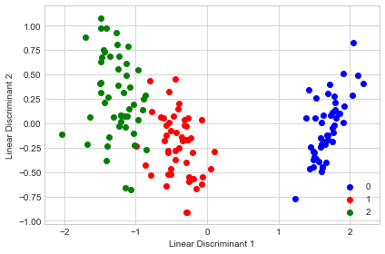


## Example 2 - Plotting the Between-Class Variance Explained Ratio


```python
from mlxtend.data import iris_data
from mlxtend.preprocessing import standardize
from mlxtend.feature_extraction import LinearDiscriminantAnalysis

X, y = iris_data()
X = standardize(X)

lda = LinearDiscriminantAnalysis(n_discriminants=None)
lda.fit(X, y)
X_lda = lda.transform(X)
```


```python
import numpy as np

tot = sum(lda.e_vals_)
var_exp = [(i / tot)*100 for i in sorted(lda.e_vals_, reverse=True)]
cum_var_exp = np.cumsum(var_exp)
```


```python
with plt.style.context('seaborn-whitegrid'):
    fig, ax = plt.subplots(figsize=(6, 4))
    plt.bar(range(4), var_exp, alpha=0.5, align='center',
            label='individual explained variance')
    plt.step(range(4), cum_var_exp, where='mid',
             label='cumulative explained variance')
    plt.ylabel('Explained variance ratio')
    plt.xlabel('Principal components')
    plt.xticks(range(4))
    ax.set_xticklabels(np.arange(1, X.shape[1] + 1))
    plt.legend(loc='best')
    plt.tight_layout()
```


## API


*LinearDiscriminantAnalysis(n_discriminants=None)*

Linear Discriminant Analysis Class

**Parameters**

- `n_discriminants` : int (default: None)

    The number of discrimants for transformation.
    Keeps the original dimensions of the dataset if `None`.

**Attributes**

- `w_` : array-like, shape=[n_features, n_discriminants]

    Projection matrix

- `e_vals_` : array-like, shape=[n_features]

    Eigenvalues in sorted order.

- `e_vecs_` : array-like, shape=[n_features]

    Eigenvectors in sorted order.

### Methods

<hr>

*fit(X, y, n_classes=None)*

Fit the LDA model with X.

**Parameters**

- `X` : {array-like, sparse matrix}, shape = [n_samples, n_features]

    Training vectors, where n_samples is the number of samples and
    n_features is the number of features.

- `y` : array-like, shape = [n_samples]

    Target values.

- `n_classes` : int (default: None)

    A positive integer to declare the number of class labels
    if not all class labels are present in a partial training set.
    Gets the number of class labels automatically if None.

**Returns**

- `self` : object


<hr>

*transform(X)*

Apply the linear transformation on X.

**Parameters**

- `X` : {array-like, sparse matrix}, shape = [n_samples, n_features]

    Training vectors, where n_samples is the number of samples and
    n_features is the number of features.

**Returns**

- `X_projected` : np.ndarray, shape = [n_samples, n_discriminants]

    Projected training vectors.


# `feature_extraction.RBFKernelPCA`
## RBF Kernel Principal Component Analysis

Implementation of RBF Kernel Principal Component Analysis for non-linear dimensionality reduction

> from mlxtend.feature_extraction import RBFKernelPCA

## Overview

Most machine learning algorithms have been developed and statistically validated for linearly separable data. Popular examples are linear classifiers like Support Vector Machines (SVMs) or the (standard) Principal Component Analysis (PCA) for dimensionality reduction. However, most real world data requires nonlinear methods in order to perform tasks that involve the analysis and discovery of patterns successfully.

The focus of this overview is to briefly introduce the idea of kernel methods and to implement a Gaussian radius basis function (RBF) kernel that is used to perform nonlinear dimensionality reduction via BF kernel principal component analysis (kPCA).

### Principal Component Analysis

The main purpose of principal component analysis (PCA) is the analysis of data to identify patterns that represent the data well. The principal components can be understood as new axes of the dataset that maximize the variance along those axes (the eigenvectors of the covariance matrix). In other words, PCA aims to find the axes with maximum variances along which the data is most spread.


For more details, please see the related article on [`mlxtend.feature_extraction.PrincipalComponentAnalysis`](./PrincipalComponentAnalysis.md).

### Nonlinear dimensionality reduction

The classic PCA approach described above is a linear projection technique that works well if the data is linearly separable. However, in the case of linearly inseparable data, a nonlinear technique is required if the task is to reduce the dimensionality of a dataset.


### Kernel functions and the kernel trick


The basic idea to deal with linearly inseparable data is to project it onto a higher dimensional space where it becomes linearly separable. Let us call this nonlinear mapping function $\phi$ so that the mapping of a sample $\mathbf{x}$ can be written as $\mathbf{x} \rightarrow \phi (\mathbf{x})$, which is called "kernel function."

Now, the term "kernel" describes a function that calculates the dot product of the images of the samples $\mathbf{x}$ under $\phi$.

$$\kappa(\mathbf{x_i, x_j}) =  \phi (\mathbf{x_i}) \phi (\mathbf{x_j})^T$$

More details about the derivation of this equation are provided in this excellent review article by Quan Wang: [Kernel Principal Component Analysis and its Applications in Face Recognition and Active Shape Models](http://arxiv.org/abs/1207.3538).[[1](#References)]

In other words, the function $\phi$ maps the original d-dimensional features into a larger, k-dimensional feature space by creating nononlinear combinations of the original features. For example, if $\mathbf{x}$ consists of 2 features:

$$
\mathbf{x} = \big[x_1 \quad x_2\big]^T \quad \quad \mathbf{x} \in I\!R^d
$$

$$
\Downarrow \phi
$$

$$
\mathbf{x}' = \big[x_1 \quad x_2 \quad x_1 x_2 \quad x_{1}^2 \quad x_1 x_{2}^3 \quad \dots \big]^T \quad \quad \mathbf{x} \in I\!R^k (k >> d)
$$


Often, the mathematical definition of the RBF kernel is written and implemented as

$$
\kappa(\mathbf{x_i, x_j}) = exp\bigg(- \gamma \; \lVert\mathbf{x_i - x_j }\rVert^{2}_{2} \bigg)
$$

where $\textstyle\gamma = \tfrac{1}{2\sigma^2}$ is a free parameter that is to be optimized.


### Gaussian radial basis function (RBF) Kernel PCA


In the linear PCA approach, we are interested in the principal components that maximize the variance in the dataset. This is done by extracting the eigenvectors (principle components) that correspond to the largest eigenvalues based on the covariance matrix:

$$\text{Cov} = \frac{1}{N} \sum_{i=1}^{N} \mathbf{x_i} \mathbf{x_i}^T$$

Bernhard Scholkopf ([Kernel Principal Component Analysis](http://dl.acm.org/citation.cfm?id=299113) [[2](#References)]) generalized this approach for data that was mapped onto the higher dimensional space via a kernel function:

$$\text{Cov} = \frac{1}{N} \sum_{i=1}^{N} \phi(\mathbf{x_i}) \phi(\mathbf{x_i})^T$$

However, in practice the the covariance matrix in the higher dimensional space is not calculated explicitly (kernel trick). Therefore, the implementation of RBF kernel PCA does not yield the principal component axes (in contrast to the standard PCA), but the obtained eigenvectors can be understood as projections of the data onto the principal components.


### RBF kernel PCA step-by-step


#### 1. Computation of the kernel (similarity) matrix.

In this first step, we need to calculate

$$\kappa(\mathbf{x_i, x_j}) = exp\bigg(- \gamma \; \lVert\mathbf{x_i - x_j }\rVert^{2}_{2} \bigg)$$

for every pair of points. E.g., if we have a dataset of 100 samples, this step would result in a symmetric 100x100 kernel matrix.

#### 2. Eigendecomposition of the kernel matrix.

Since it is not guaranteed that the kernel matrix is centered, we can apply the following equation to do so:

$$K' = K - \mathbf{1_N} K - K \mathbf{1_N} + \mathbf{1_N} K \mathbf{1_N}$$

where $\mathbf{1_N}$ is (like the kernel matrix) a $N\times N$ matrix with all values equal to $\frac{1}{N}$. [[3](#References)]

Now, we have to obtain the eigenvectors of the centered kernel matrix that correspond to the largest eigenvalues. Those eigenvectors are the data points already projected onto the respective principal components.
    

### Projecting new data

So far, so good, in the sections above, we have been projecting an dataset onto a new feature subspace. However, in a real application, we are usually interested in mapping new data points onto the same new feature subspace (e.g., if are working with a training and a test dataset in pattern classification tasks).

Remember, when we computed the eigenvectors $\mathbf{\alpha}$ of the centered kernel matrix, those values were actually already the projected datapoints onto the principal component axis $\mathbf{g}$.

If we want to project a new data point $\mathbf{x}$ onto this principal component axis, we'd need to compute $\phi(\mathbf{x})^T  \mathbf{g}$.

Fortunately, also here, we don't have to compute $\phi(\mathbf{x})^T  \mathbf{g}$ explicitely but use the kernel trick to calculate the RBF kernel between the new data point and every data point $j$ in the training dataset:

$$\phi(\mathbf{x})^T  \mathbf{g}  = \sum_j \alpha_{i} \; \phi(\mathbf{x}) \; \phi(\mathbf{x_j})^T$$

$$=  \sum_j \alpha_{i} \; \kappa(\mathbf{x}, \mathbf{x_j})$$


and the eigenvectors $\alpha$ and eigenvalues $\lambda$ of the Kernel matrix $\mathbf{K}$ satisfy the equation
$\mathbf{K} \alpha = \lambda \alpha$, we just need to normalize the eigenvector by the corresponding eigenvalue.

### References


[1] Q. Wang. [Kernel principal component analysis and its applications in face recognition and active shape models](http://arxiv.org/abs/1207.3538). CoRR, abs/1207.3538, 2012.

[2] B. Scholkopf, A. Smola, and K.-R. Muller. [Kernel principal component analysis](http://citeseerx.ist.psu.edu/viewdoc/summary?doi=10.1.1.128.7613). pages 583588, 1997.

[3] B. Scholkopf, A. Smola, and K.-R. Muller. [Nonlinear component analysis as a kernel eigenvalue problem](http://www.mitpressjournals.org/doi/abs/10.1162/089976698300017467#.VBh9QkuCFHg). Neural computation, 10(5):12991319, 1998.

## Example 1 - Half-moon shapes

We will start with a simple example of 2 half-moon shapes generated by the `make_moons` function from scikit-learn.


```python
import matplotlib.pyplot as plt
from sklearn.datasets import make_moons

X, y = make_moons(n_samples=50, random_state=1)

plt.scatter(X[y==0, 0], X[y==0, 1], 
            color='red', marker='o', alpha=0.5)
plt.scatter(X[y==1, 0], X[y==1, 1], 
            color='blue', marker='^', alpha=0.5)
plt.ylabel('y coordinate')
plt.xlabel('x coordinate')

plt.show()
```


Since the two half-moon shapes are linearly inseparable, we expect that the classic PCA will fail to give us a good representation of the data in 1D space. Let us use `PCA` class to perform the dimensionality reduction.


```python
from mlxtend.feature_extraction import PrincipalComponentAnalysis as PCA

pca = PCA(n_components=2)
X_pca = pca.fit(X).transform(X)

plt.scatter(X_pca[y==0, 0], X_pca[y==0, 1], 
            color='red', marker='o', alpha=0.5)
plt.scatter(X_pca[y==1, 0], X_pca[y==1, 1], 
            color='blue', marker='^', alpha=0.5)

plt.xlabel('PC1')
plt.ylabel('PC2')
plt.show()
```


As we can see, the resulting principal components do not yield a subspace where the data is linearly separated well. Note that PCA is a unsupervised method and does not consider class labels in order to maximize the variance in contrast to Linear Discriminant Analysis. Here, the colors blue and red are just added for visualization purposes to indicate the degree of separation.

Next, we will perform dimensionality reduction via RBF kernel PCA on our half-moon data. The choice of $\gamma$
depends on the dataset and can be obtained via hyperparameter tuning techniques like Grid Search. Hyperparameter tuning is a broad topic itself, and here I will just use a $\gamma$-value that I found to produce good results.


```python
from mlxtend.data import iris_data
from mlxtend.preprocessing import standardize
from mlxtend.feature_extraction import RBFKernelPCA as KPCA

kpca = KPCA(gamma=15.0, n_components=2)
kpca.fit(X)
X_kpca = kpca.X_projected_
```

Please note that the components of kernel methods such as RBF kernel PCA already represent the projected data points (in contrast to PCA, where the component axis are the "top k" eigenvectors thar are used to contruct a projection matrix, which is then used to transform the training samples). Thus, the projected training set is available after fitting via the `.X_projected_` attribute.


```python
plt.scatter(X_kpca[y==0, 0], X_kpca[y==0, 1], 
            color='red', marker='o', alpha=0.5)
plt.scatter(X_kpca[y==1, 0], X_kpca[y==1, 1], 
            color='blue', marker='^', alpha=0.5)

plt.title('First 2 principal components after RBF Kernel PCA')
plt.xlabel('PC1')
plt.ylabel('PC2')
plt.show()
```


The new feature space is linearly separable now. Since we are often interested in dimensionality reduction, let's have a look at the first component only.


```python
import numpy as np

plt.scatter(X_kpca[y==0, 0], np.zeros((25, 1)), 
            color='red', marker='o', alpha=0.5)
plt.scatter(X_kpca[y==1, 0], np.zeros((25, 1)), 
            color='blue', marker='^', alpha=0.5)

plt.title('First principal component after RBF Kernel PCA')
plt.xlabel('PC1')
plt.yticks([])
plt.show()
```


We can clearly see that the projection via RBF kernel PCA yielded a subspace where the classes are separated well. Such a subspace can then be used as input for generalized linear classification models, e.g.,  logistic regression.

#### Projecting new data

Finally, via the transform method, we can project new data onto the new component axes.


```python
import matplotlib.pyplot as plt
from sklearn.datasets import make_moons

X2, y2 = make_moons(n_samples=200, random_state=5)
X2_kpca = kpca.transform(X2)

plt.scatter(X_kpca[y==0, 0], X_kpca[y==0, 1], 
            color='red', marker='o', alpha=0.5, label='fit data')
plt.scatter(X_kpca[y==1, 0], X_kpca[y==1, 1], 
            color='blue', marker='^', alpha=0.5, label='fit data')

plt.scatter(X2_kpca[y2==0, 0], X2_kpca[y2==0, 1], 
            color='orange', marker='v', 
            alpha=0.2, label='new data')
plt.scatter(X2_kpca[y2==1, 0], X2_kpca[y2==1, 1], 
            color='cyan', marker='s', 
            alpha=0.2, label='new data')

plt.legend()
plt.show()
```


## Example 2 - Concentric circles

Following the concepts explained in example 1, let's have a look at another classic case: 2 concentric circles with random noise produced by scikit-learns `make_circles`.


```python
from sklearn.datasets import make_circles

X, y = make_circles(n_samples=1000, random_state=123, 
                    noise=0.1, factor=0.2)

plt.figure(figsize=(8,6))

plt.scatter(X[y==0, 0], X[y==0, 1], color='red', alpha=0.5)
plt.scatter(X[y==1, 0], X[y==1, 1], color='blue', alpha=0.5)
plt.title('Concentric circles')
plt.ylabel('y coordinate')
plt.xlabel('x coordinate')
plt.show()
```


```python
from mlxtend.data import iris_data
from mlxtend.preprocessing import standardize
from mlxtend.feature_extraction import RBFKernelPCA as KPCA

kpca = KPCA(gamma=15.0, n_components=2)
kpca.fit(X)
X_kpca = kpca.X_projected_
```


```python
plt.scatter(X_kpca[y==0, 0], X_kpca[y==0, 1], 
            color='red', marker='o', alpha=0.5)
plt.scatter(X_kpca[y==1, 0], X_kpca[y==1, 1], 
            color='blue', marker='^', alpha=0.5)

plt.title('First 2 principal components after RBF Kernel PCA')
plt.xlabel('PC1')
plt.ylabel('PC2')
plt.show()
```


```python
plt.scatter(X_kpca[y==0, 0], np.zeros((500, 1)), 
            color='red', marker='o', alpha=0.5)
plt.scatter(X_kpca[y==1, 0], np.zeros((500, 1)), 
            color='blue', marker='^', alpha=0.5)

plt.title('First principal component after RBF Kernel PCA')
plt.xlabel('PC1')
plt.yticks([])
plt.show()
```


## API


*RBFKernelPCA(gamma=15.0, n_components=None, copy_X=True)*

RBF Kernel Principal Component Analysis for dimensionality reduction.

**Parameters**

- `gamma` : float (default: 15.0)

    Free parameter (coefficient) of the RBF kernel.

- `n_components` : int (default: None)

    The number of principal components for transformation.
    Keeps the original dimensions of the dataset if `None`.

- `copy_X` : bool (default: True)

    Copies training data, which is required to compute the projection
    of new data via the transform method. Uses a reference to X if False.

**Attributes**

- `e_vals_` : array-like, shape=[n_features]

    Eigenvalues in sorted order.

- `e_vecs_` : array-like, shape=[n_features]

    Eigenvectors in sorted order.

- `X_projected_` : array-like, shape=[n_samples, n_components]

    Training samples projected along the component axes.

### Methods

<hr>

*fit(X)*

Learn model from training data.

**Parameters**

- `X` : {array-like, sparse matrix}, shape = [n_samples, n_features]

    Training vectors, where n_samples is the number of samples and
    n_features is the number of features.

**Returns**

- `self` : object


<hr>

*transform(X)*

Apply the non-linear transformation on X.

**Parameters**

- `X` : {array-like, sparse matrix}, shape = [n_samples, n_features]

    Training vectors, where n_samples is the number of samples and
    n_features is the number of features.

**Returns**

- `X_projected` : np.ndarray, shape = [n_samples, n_components]

    Projected training vectors.


# `cluster.Kmeans`

A implementation of k-means clustering.

> from mlxtend.cluster import Kmeans

## Overview

Clustering falls into the category of unsupervised learning, a subfield of machine learning where the ground truth labels are not available to us in real-world applications. In clustering, our goal is to group samples by similarity (in k-means: Euclidean distance).

The k-means algorithms can be summarized as follows:

1. Randomly pick k centroids from the sample points as initial cluster centers.
2. Assign each sample to the nearest centroid $\mu(j), \; j \in {1,...,k}$.
3. Move the centroids to the center of the samples that were assigned to it.
4. Repeat steps 2 and 3 until the cluster assignments do not change or a user-defined tolerance or a maximum number of iterations is reached.

### References


- MacQueen, J. B. (1967). [Some Methods for classification and Analysis of Multivariate Observations](http://projecteuclid.org/euclid.bsmsp/1200512992). Proceedings of 5th Berkeley Symposium on Mathematical Statistics and Probability. University of California Press. pp. 281297. MR 0214227. Zbl 0214.46201. Retrieved 2009-04-07.

## Example 1 - Three Blobs

#### Load some sample data:


```python
import matplotlib.pyplot as plt
from mlxtend.data import three_blobs_data

X, y = three_blobs_data()
plt.scatter(X[:, 0], X[:, 1], c='white')
plt.show()
```


#### Compute the cluster centroids:


```python
from mlxtend.cluster import Kmeans

km = Kmeans(k=3, 
            max_iter=50, 
            random_seed=1, 
            print_progress=3)

km.fit(X)

print('Iterations until convergence:', km.iterations_)
print('Final centroids:\n', km.centroids_)
```

    Iteration: 2/50 | Elapsed: 00:00:00 | ETA: 00:00:00

    Iterations until convergence: 2
    Final centroids:
     [[-1.5947298   2.92236966]
     [ 2.06521743  0.96137409]
     [ 0.9329651   4.35420713]]


#### Visualize the cluster memberships:


```python
y_clust = km.predict(X)

plt.scatter(X[y_clust == 0, 0],
            X[y_clust == 0, 1],
            s=50,
            c='lightgreen',
            marker='s',
            label='cluster 1')

plt.scatter(X[y_clust == 1,0],
            X[y_clust == 1,1],
            s=50,
            c='orange',
            marker='o',
            label='cluster 2')

plt.scatter(X[y_clust == 2,0],
            X[y_clust == 2,1],
            s=50,
            c='lightblue',
            marker='v',
            label='cluster 3')


plt.scatter(km.centroids_[:,0],
            km.centroids_[:,1],
            s=250,
            marker='*',
            c='red',
            label='centroids')

plt.legend(loc='lower left',
           scatterpoints=1)
plt.grid()
plt.show()
```


## API


*Kmeans(k, max_iter=10, convergence_tolerance=1e-05, random_seed=None, print_progress=0)*

K-means clustering class.

Added in 0.4.1dev

**Parameters**

- `k` : int

    Number of clusters

- `max_iter` : int (default: 10)

    Number of iterations during cluster assignment.
    Cluster re-assignment stops automatically when the algorithm
    converged.

- `convergence_tolerance` : float (default: 1e-05)

    Compares current centroids with centroids of the previous iteration
    using the given tolerance (a small positive float)to determine
    if the algorithm converged early.

- `random_seed` : int (default: None)

    Set random state for the initial centroid assignment.

- `print_progress` : int (default: 0)

    Prints progress in fitting to stderr.
    0: No output
    1: Iterations elapsed
    2: 1 plus time elapsed
    3: 2 plus estimated time until completion

**Attributes**

- `centroids_` : 2d-array, shape={k, n_features}

    Feature values of the k cluster centroids.

- `custers_` : dictionary

    The cluster assignments stored as a Python dictionary;
    the dictionary keys denote the cluster indeces and the items are
    Python lists of the sample indices that were assigned to each
    cluster.

- `iterations_` : int

    Number of iterations until convergence.

### Methods

<hr>

*fit(X, init_params=True)*

Learn model from training data.

**Parameters**

- `X` : {array-like, sparse matrix}, shape = [n_samples, n_features]

    Training vectors, where n_samples is the number of samples and
    n_features is the number of features.

- `init_params` : bool (default: True)

    Re-initializes model parameters prior to fitting.
    Set False to continue training with weights from
    a previous model fitting.

**Returns**

- `self` : object


<hr>

*predict(X)*

Predict targets from X.

**Parameters**

- `X` : {array-like, sparse matrix}, shape = [n_samples, n_features]

    Training vectors, where n_samples is the number of samples and
    n_features is the number of features.

**Returns**

- `target_values` : array-like, shape = [n_samples]

    Predicted target values.


# `evaluate.confusion_matrix`

Functions for generating confusion matrices.

> `from mlxtend.evaluate import confusion_matrix`    
> `from mlxtend.evaluate import plot_confusion_matrix`

## Overview

### Confusion Matrix

The *confusion matrix* (or *error matrix*) is one way to summarize the performance of a classifier for binary classification tasks. This square matrix consists of columns and rows that list the number of instances as absolute or relative "actual class" vs. "predicted class" ratios.


Let $P$ be the label of class 1 and $N$ be the label of a second class or the label of all classes that are *not class 1* in a multi-class setting.


### References

- -

## Example 1 - Binary classification


```python
from mlxtend.evaluate import confusion_matrix

y_target =    [0, 0, 1, 0, 0, 1, 1, 1]
y_predicted = [1, 0, 1, 0, 0, 0, 0, 1]

cm = confusion_matrix(y_target=y_target, 
                      y_predicted=y_predicted)
cm
```


    array([[3, 1],
           [2, 2]])


To visualize the confusion matrix using matplotlib, see the utility function [`mlxtend.plotting.plot_confusion_matrix`](../plotting/plot_confusion matrix):


```python
import matplotlib.pyplot as plt
from mlxtend.plotting import plot_confusion_matrix

fig, ax = plot_confusion_matrix(conf_mat=cm)
plt.show()
```


## Example 2 - Multi-class classification


```python
from mlxtend.evaluate import confusion_matrix

y_target =    [1, 1, 1, 0, 0, 2, 0, 3]
y_predicted = [1, 0, 1, 0, 0, 2, 1, 3]

cm = confusion_matrix(y_target=y_target, 
                      y_predicted=y_predicted, 
                      binary=False)
cm
```


    array([[2, 1, 0, 0],
           [1, 2, 0, 0],
           [0, 0, 1, 0],
           [0, 0, 0, 1]])


To visualize the confusion matrix using matplotlib, see the utility function [`mlxtend.plotting.plot_confusion_matrix`](../plotting/plot_confusion matrix):


```python
import matplotlib.pyplot as plt
from mlxtend.evaluate import confusion_matrix

fig, ax = plot_confusion_matrix(conf_mat=cm)
plt.show()
```


## Example 3 - Multi-class to binary

By setting `binary=True`, all class labels that are not the positive class label are being summarized to class 0. The positive class label becomes class 1.


```python
import matplotlib.pyplot as plt
from mlxtend.evaluate import confusion_matrix

y_target =    [1, 1, 1, 0, 0, 2, 0, 3]
y_predicted = [1, 0, 1, 0, 0, 2, 1, 3]

cm = confusion_matrix(y_target=y_target, 
                      y_predicted=y_predicted, 
                      binary=True, 
                      positive_label=1)
cm
```


    array([[4, 1],
           [1, 2]])


To visualize the confusion matrix using matplotlib, see the utility function [`mlxtend.plotting.plot_confusion_matrix`](../plotting/plot_confusion matrix):


```python
from mlxtend.plotting import plot_confusion_matrix

fig, ax = plot_confusion_matrix(conf_mat=cm)
plt.show()
```


## API


*confusion_matrix(y_target, y_predicted, binary=False, positive_label=1)*

Compute a confusion matrix/contingency table.

**Parameters**

- `y_target` : array-like, shape=[n_samples]

    True class labels.

- `y_predicted` : array-like, shape=[n_samples]

    Predicted class labels.

- `binary` : bool (default: False)

    Maps a multi-class problem onto a
    binary confusion matrix, where
    the positive class is 1 and
    all other classes are 0.

- `positive_label` : int (default: 1)

    Class label of the positive class.

**Returns**

- `mat` : array-like, shape=[n_classes, n_classes]


# `evaluate.mcnemar_table`

Function to compute a 2x2 contingency table for McNemar's Test

> `from mlxtend.evaluate import mcnemar_table`    

## Overview

###  Contigency Table for McNemar's Test

A 2x2 contigency table as being used in a McNemar's Test ([`mlxtend.evaluate.mcnemar`](mcnemar.md)) is a useful aid for comparing two different models. In contrast to a typical confusion matrix, this table compares two models to each other rather than showing the false positives, true positives, false negatives, and true negatives of a single model's predictions:


For instance, given that 2 models have a accuracy of with a 99.7% and 99.6% a 2x2 contigency table can provide further insights for model selection.


In both subfigure A and B, the predictive accuracies of the two models are as follows:

- model 1 accuracy: 9,960 / 10,000 = 99.6%
- model 2 accuracy: 9,970 / 10,000 = 99.7%

Now, in subfigure A, we can see that model 2 got 11 predictions right that model 1 got wrong. Vice versa, model 2 got 1 prediction right that model 2 got wrong. Thus, based on this 11:1 ratio, we may conclude that model 2 performs substantially better than model 1. However, in subfigure B, the ratio is 25:15, which is less conclusive about which model is the better one to choose.

### References

- McNemar, Quinn, 1947. "[Note on the sampling error of the difference between correlated proportions or percentages](http://link.springer.com/article/10.1007%2FBF02295996)". Psychometrika. 12 (2): 153157.
- Edwards AL: Note on the correction for continuity in testing the significance of the difference between correlated proportions. Psychometrika. 1948, 13 (3): 185-187. 10.1007/BF02289261.
- https://en.wikipedia.org/wiki/McNemar%27s_test


## Example 2 - 2x2 Contigency Table


```python
import numpy as np
from mlxtend.evaluate import mcnemar_table

y_true = np.array([0, 0, 0, 0, 0, 1, 1, 1, 1, 1])

y_mod1 = np.array([0, 1, 0, 0, 0, 1, 1, 0, 0, 0])
y_mod2 = np.array([0, 0, 1, 1, 0, 1, 1, 0, 0, 0])

tb = mcnemar_table(y_target=y_true, 
                   y_model1=y_mod1, 
                   y_model2=y_mod2)

tb
```


    array([[4, 1],
           [2, 3]])


To visualize (and better interpret) the contigency table via matplotlib, we can use the `checkerboard_plot` function:


```python
from mlxtend.plotting import checkerboard_plot
import matplotlib.pyplot as plt

brd = checkerboard_plot(tb,
                        figsize=(3, 3),
                        fmt='%d',
                        col_labels=['model 2 wrong', 'model 2 right'],
                        row_labels=['model 1 wrong', 'model 1 right'])
plt.show()
```


## API


*mcnemar_table(y_target, y_model1, y_model2)*

Compute a 2x2 contigency table for McNemar's test.

**Parameters**

- `y_target` : array-like, shape=[n_samples]

    True class labels as 1D NumPy array.

- `y_model1` : array-like, shape=[n_samples]

    Predicted class labels from model as 1D NumPy array.

- `y_model2` : array-like, shape=[n_samples]

    Predicted class labels from model 2 as 1D NumPy array.

**Returns**

- `tb` : array-like, shape=[2, 2]

    2x2 contingency table with the following contents:
    a: tb[0, 0]: # of samples that both models predicted correctly
    b: tb[0, 1]: # of samples that model 1 got right and model 2 got wrong
    c: tb[1, 0]: # of samples that model 2 got right and model 1 got wrong
    d: tb[1, 1]: # of samples that both models predicted incorrectly


# `evaluate.mcnemar`

McNemar's test for paired nominal data

> `from mlxtend.evaluate import mcnemar`    

## Overview

McNemar's Test [1] (sometimes also called "within-subjects chi-squared test") is a statistical test for paired nominal data. In context of machine learning (or statistical) models, we can use McNemar's Test to compare the predictive accuracy of two models. McNemar's test is based on a 2 times 2 contigency table of the two model's predictions.

###  McNemar's Test Statistic

In McNemar's Test, we formulate the null hypothesis that the probabilities $p(b)$ and $p(c)$ are the same, or in simplified terms: None of the two models performs better than the other. Thus, the alternative hypothesis is that the performances of the two models are not equal.


The McNemar test statistic ("chi-squared") can be computed as follows:

$$\chi^2 = \frac{(b - c)^2}{(b + c)},$$

If the sum of cell c and b is sufficiently large, the $\chi^2$ value follows a chi-squared distribution with one degree of freedom. After setting a significance threshold, e.g,. $\alpha=0.05$ we can compute the p-value -- assuming that the null hypothesis is true, the p-value is the probability of observing this empirical (or a larger) chi-squared value. If the p-value is lower than our chosen significance level, we can reject the null hypothesis that the two model's performances are equal.

### Continuity Correction

Approximately 1 year after Quinn McNemar published the McNemar Test [1], Edwards [2] proposed a continuity corrected version, which is the more commonly used variant today:

$$\chi^2 = \frac{( \mid b - c \mid - 1)^2}{(b + c)}.$$

### Exact p-values

As mentioned earlier, an exact binomial test is recommended for small sample sizes ($b + c < 25$ [3]), since the chi-squared value is may not be well-approximated by the chi-squared distribution. The exact p-value can be computed as follows:

$$p = 2 \sum^{n}_{i=b} \binom{n}{i} 0.5^i (1 - 0.5)^{n-i},$$

where $n = b + c$, and the factor $2$ is used to compute the two-sided p-value.

### Example

For instance, given that 2 models have a accuracy of with a 99.7% and 99.6% a 2x2 contigency table can provide further insights for model selection.


In both subfigure A and B, the predictive accuracies of the two models are as follows:

- model 1 accuracy: 9,960 / 10,000 = 99.6%
- model 2 accuracy: 9,970 / 10,000 = 99.7%

Now, in subfigure A, we can see that model 2 got 11 predictions right that model 1 got wrong. Vice versa, model 2 got 1 prediction right that model 2 got wrong. Thus, based on this 11:1 ratio, we may conclude that model 2 performs substantially better than model 1. However, in subfigure B, the ratio is 25:15, which is less conclusive about which model is the better one to choose.

In the following coding examples, we will use these 2 scenarios A and B to illustrate McNemar's test.

### References

- [1] McNemar, Quinn, 1947. "[Note on the sampling error of the difference between correlated proportions or percentages](http://link.springer.com/article/10.1007%2FBF02295996)". Psychometrika. 12 (2): 153157.
- [2] Edwards AL: Note on the correction for continuity in testing the significance of the difference between correlated proportions. Psychometrika. 1948, 13 (3): 185-187. 10.1007/BF02289261.
- [3] https://en.wikipedia.org/wiki/McNemar%27s_test

## Example 1 - Creating 2x2 Contigency tables

The `mcnemar` funtion expects a 2x2 contingency table as a NumPy array that is formatted as follows:
    


Such a contigency matrix can be created by using the `mcnemar_table` function from `mlxtend.evaluate`. For example:


```python
import numpy as np
from mlxtend.evaluate import mcnemar_table

# The correct target (class) labels
y_target = np.array([0, 0, 0, 0, 0, 1, 1, 1, 1, 1])

# Class labels predicted by model 1
y_model1 = np.array([0, 1, 0, 0, 0, 1, 1, 0, 0, 0])

# Class labels predicted by model 2
y_model2 = np.array([0, 0, 1, 1, 0, 1, 1, 0, 0, 0])

tb = mcnemar_table(y_target=y_target, 
                   y_model1=y_model1, 
                   y_model2=y_model2)

print(tb)
```

    [[4 1]
     [2 3]]


## Example 2 - McNemar's Test for Scenario B

No, let us continue with the example mentioned in the overview section and assume that we already computed the 2x2 contigency table:


```python
import numpy as np

tb_b = np.array([[9945, 25],
                 [15, 15]])
```

To test the null hypothesis that the predictive performance of two models are equal (using a significance level of $\alpha=0.05$), we can conduct a corrected McNemar Test for computing the chi-squared and p-value as follows:


```python
from mlxtend.evaluate import mcnemar

chi2, p = mcnemar(ary=tb_b, corrected=True)
print('chi-squared:', chi2)
print('p-value:', p)
```

    chi-squared: 2.025
    p-value: 0.154728923485


Since the p-value is larger than our assumed significance threshold ($\alpha=0.05$), we cannot reject our null hypothesis and assume that there is no significant difference between the two predictive models.

## Example 3 - McNemar's Test for Scenario A

In contrast to scenario B (Example 2), the sample size in scenario A is relatively small (b + c = 11  + 1 = 12) and smaller than the recommended 25 [3] to approximate the computed chi-square value by the chi-square distribution well.


In this case, we need to compute the exact p-value from the binomial distribution:


```python
from mlxtend.evaluate import mcnemar
import numpy as np

tb_a = np.array([[9959, 11],
                 [1, 29]])

chi2, p = mcnemar(ary=tb_a, exact=True)

print('chi-squared:', chi2)
print('p-value:', p)
```

    chi-squared: None
    p-value: 0.005859375


Assuming that we conducted this test also with a significance level of $\alpha=0.05$, we can reject the null-hypothesis that both models perform equally well on this dataset, since the p-value ($p \approx 0.006$) is smaller than $\alpha$.

## API


*mcnemar(ary, corrected=True, exact=False)*

McNemar test for paired nominal data

**Parameters**

- `ary` : array-like, shape=[2, 2]

    2 x 2 contigency table (as returned by evaluate.mcnemar_table),
    where
    a: ary[0, 0]: # of samples that both models predicted correctly
    b: ary[0, 1]: # of samples that model 1 got right and model 2 got wrong
    c: ary[1, 0]: # of samples that model 2 got right and model 1 got wrong
    d: aryCell [1, 1]: # of samples that both models predicted incorrectly

- `corrected` : array-like, shape=[n_samples] (default: True)

    Uses Edward's continuity correction for chi-squared if `True`

- `exact` : bool, (default: False)

    If `True`, uses an exact binomial test comparing b to
    a binomial distribution with n = b + c and p = 0.5.
    It is highly recommended to use `exact=True` for sample sizes < 25
    since chi-squared is not well-approximated
    by the chi-squared distribution!

**Returns**

- `chi2, p` : float or None, float

    Returns the chi-squared value and the p-value;
    if `exact=True` (default: `False`), `chi2` is `None`


# `evaluate.lift_score`

Scoring function to compute the LIFT metric, the ratio of correctly predicted positive examples and the actual positive examples in the test dataset.

> `from mlxtend.evaluate import lift_score`    

## Overview

In the context of classification, *lift* [1] compares model predictions to randomly generated predictions. Lift is often used in marketing research combined with *gain and lift* charts as a visual aid [2]. For example, assuming a 10% customer response as a baseline, a lift value of 3 would correspond to a 30% customer response when using the predictive model. Note that *lift* has the range $\lbrack 0, \infty \rbrack$.

There are many strategies to compute *lift*, and below, we will illustrate the computation of the lift score using a classic confusion matrix. For instance, let's assume the following prediction and target labels, where "1" is the positive class:

- $\text{true labels}: [0, 0, 1, 0, 0, 1, 1, 1, 1, 1]$
- $\text{prediction}: [1, 0, 1, 0, 0, 0, 0, 1, 0, 0]$

Then, our confusion matrix would look as follows:


Based on the confusion matrix above, with "1" as positive label, we compute *lift* as follows:

$$
\text{lift} = \frac{(TP/(TP+FN)}{(TP+FP)/(TP+TN+FP+FN)}
$$

Plugging in the actual values from the example above, we arrive at the following lift value:

$$
\frac{2/(2+4)}{(2+1)/(2+3+1+4)} = 1.11.
$$

An alternative way to computing lift is by using the *support* metric [3]:

$$
\text{lift} = \frac{\text{support}(\text{true labels} \cup \text{prediction})/N}{\text{support}(\text{true labels})/N \times \text{support}(\text{prediction})/N},
$$

where $N$ is the number of samples in the datset. Plugging the values from our example into the equation above, we arrive at

$$
\frac{2/10}{(6/10 \times 3/10)} = 1.11.
$$


### References

- [1]  S. Brin, R. Motwani, J. D. Ullman, and S. Tsur. [Dynamic itemset counting and implication rules for market basket data](http://dl.acm.org/citation.cfm?id=253325). In Proc. of the ACM SIGMOD Int'l Conf. on Management of Data (ACM SIGMOD '97), pages 265-276, 1997.
- [2] https://www3.nd.edu/~busiforc/Lift_chart.html
- [3] https://en.wikipedia.org/wiki/Association_rule_learning#Support

## Example 1 - Computing Lift

This examples demonstrates the basic use of the `lift_score` function using the example from the *Overview* section.


```python
import numpy as np
from mlxtend.evaluate import lift_score

y_target =    np.array([0, 0, 1, 0, 0, 1, 1, 1, 1, 1])
y_predicted = np.array([1, 0, 1, 0, 0, 0, 0, 1, 0, 0])

lift_score(y_target, y_predicted)
```


    1.1111111111111112


## Example 2 - Using `lift_score` in `GridSearch`

The `lift_score` function can also be used with scikit-learn objects, such as `GridSearch`:


```python
from sklearn.datasets import load_iris
from sklearn.model_selection import train_test_split
from sklearn.model_selection import GridSearchCV
from sklearn.svm import SVC
from sklearn.metrics import make_scorer

# make custom scorer
lift_scorer = make_scorer(lift_score)


iris = load_iris()
X, y = iris.data, iris.target

X_train, X_test, y_train, y_test = train_test_split(
    X, y, test_size=0.2, stratify=y, random_state=123)

hyperparameters = [{'kernel': ['rbf'], 'gamma': [1e-3, 1e-4],
                     'C': [1, 10, 100, 1000]},
                   {'kernel': ['linear'], 'C': [1, 10, 100, 1000]}]

clf = GridSearchCV(SVC(), hyperparameters, cv=10,
                   scoring=lift_scorer)
clf.fit(X_train, y_train)

print(clf.best_score_)
print(clf.best_params_)
```

    3.0
    {'gamma': 0.001, 'kernel': 'rbf', 'C': 1000}


## API


*lift_score(y_target, y_predicted, binary=True, positive_label=1)*

Lift measures the degree to which the predictions of a
classification model are better than randomly-generated predictions.

The in terms of True Positives (TP), True Negatives (TN),
False Positives (TP), and False Negatives (FN), the lift score is
computed as:
[ TP/(TP+FN) ] / [ (TP+FP) / (TP+TN+FP+FN) ]


**Parameters**

- `y_target` : array-like, shape=[n_samples]

    True class labels.

- `y_predicted` : array-like, shape=[n_samples]

    Predicted class labels.

- `binary` : bool (default: True)

    Maps a multi-class problem onto a
    binary, where
    the positive class is 1 and
    all other classes are 0.

- `positive_label` : int (default: 0)

    Class label of the positive class.

**Returns**

- `score` : float

    Lift score in the range [0, \infty]


# `evaluate.scoring`

A function for computing various different performance metrics.

> from mlxtend.evaluate import scoring

## Overview

### Confusion Matrix

The *confusion matrix* (or *error matrix*) is one way to summarize the performance of a classifier for binary classification tasks. This square matrix consists of columns and rows that list the number of instances as absolute or relative "actual class" vs. "predicted class" ratios.


Let $P$ be the label of class 1 and $N$ be the label of a second class or the label of all classes that are *not class 1* in a multi-class setting.


### Error and Accuracy

Both the prediction *error* (ERR) and *accuracy* (ACC) provide general information about how many samples are misclassified. The *error* can be understood as the sum of all false predictions divided by the number of total predications, and the the accuracy is calculated as the sum of correct predictions divided by the total number of predictions, respectively. 

$$ERR = \frac{FP + FN}{FP+ FN + TP + TN} = 1-ACC$$

$$ACC = \frac{TP + TN}{FP+ FN + TP + TN} = 1-ERR$$

### True and False Positive Rates

The *True Positive Rate* (TPR) and *False Positive Rate* (FPR) are performance metrics that are especially useful for imbalanced class problems. In *spam classification*, for example, we are of course primarily interested in the detection and filtering out of *spam*. However, it is also important to decrease the number of messages that were incorrectly classified as *spam* (*False Positives*): A situation where a person misses an important message is considered as "worse" than a situation where a person ends up with a few *spam* messages in his e-mail inbox. In contrast to the *FPR*, the *True Positive Rate* provides useful information about the fraction of *positive* (or *relevant*) samples that were correctly identified out of the total pool of *Positives*.

$$FPR = \frac{FP}{N} =  \frac{FP}{FP + TN}$$

$$TPR = \frac{TP}{P} =  \frac{TP}{FN + TP}$$

### Precision, Recall, and the F1-Score

*Precision* (PRE) and *Recall* (REC) are metrics that are more commonly used in *Information Technology* and related to the *False* and *True Prositive Rates*. In fact, *Recall* is synonymous to the *True Positive Rate* and also sometimes called *Sensitivity*. The F$_1$-Score can be understood as a combination of both *Precision* and *Recall*.

$$PRE = \frac{TP}{TP + FP}$$

$$REC = TPR = \frac{TP}{P} =  \frac{TP}{FN + TP}$$

$$F_1 = 2 \cdot \frac{PRE \cdot REC}{PRE + REC}$$

### Sensitivity and Specificity

*Sensitivity* (SEN) is synonymous to *Recall* and the *True Positive Rate* whereas *Specificity (SPC)* is synonymous to the *True Negative Rate* -- *Sensitivity* measures the recovery rate of the *Positives* and complimentary, the *Specificity* measures the recovery rate of the *Negatives*.

$$SEN = TPR = REC = \frac{TP}{P} =  \frac{TP}{FN + TP}$$

$$SPC = TNR =\frac{TN}{N} =  \frac{TN}{FP + TN}$$

### Matthews Correlation Coefficient

*Matthews correlation coefficient* (MCC) was first formulated by Brian W. Matthews [3] in 1975 to assess the performance of protein secondary structure predictions. The MCC can be understood as a specific case of a linear correlation coefficient (*Pearson's R*) for a binary classification setting and is considered as especially useful in unbalanced class settings.
The previous metrics take values in the range between 0 (worst) and 1 (best), whereas the MCC is bounded between the range 1 (perfect correlation between ground truth and predicted outcome) and -1 (inverse or negative correlation) -- a value of 0 denotes a random prediction. 

$$MCC = \frac{ TP \times TN - FP \times FN } {\sqrt{ (TP + FP) ( TP + FN ) ( TN + FP ) ( TN + FN ) } }$$

### Average Per-Class Accuracy

The "overall" accuracy is defined as the number of correct predictions (*true positives* TP and *true negatives* TN) over all samples *n*:

$$ACC = \frac{TP + TN}{n}$$

in a binary class setting:


In a multi-class setting, we can generalize the computation of the accuracy as the fraction of all true predictions (the diagonal) over all samples n.

$$ACC = \frac{T}{n}$$

Considering a multi-class problem with 3 classes (C0, C1, C2)


let's assume our model made the following predictions:


We compute the accuracy as:
    
$$ACC = \frac{3 + 50 + 18}{90} \approx 0.79$$

Now, in order to compute the ***average per-class accuracy***, we compute the binary accuracy for each class label separately; i.e., if class 1 is the positive class, class 0 and 2 are both considered the negative class.

$$APC\;ACC = \frac{83/90 + 71/90 + 78/90}{3} \approx 0.86$$

### References

- [1] S. Raschka. [An overview of general performance metrics of binary classifier systems](http://arxiv.org/abs/1410.5330). Computing Research Repository (CoRR), abs/1410.5330, 2014.
- [2] Cyril Goutte and Eric Gaussier. [A probabilistic interpretation of precision, recall and f-score, with implication for evaluation](http://link.springer.com/chapter/10.1007/978-3-540-31865-1_25). In Advances in Information Retrieval, pages 345359. Springer, 2005.
- [3] Brian W Matthews. [Comparison of the predicted and observed secondary structure of T4 phage lysozyme](http://www.sciencedirect.com/science/article/pii/0005279575901099). Biochimica et Biophysica Acta (BBA)- Protein Structure, 405(2):442451, 1975.

## Example 1 - Classification Error


```python
from mlxtend.evaluate import scoring

y_targ = [1, 1, 1, 0, 0, 2, 0, 3]
y_pred = [1, 0, 1, 0, 0, 2, 1, 3]
res = scoring(y_target=y_targ, y_predicted=y_pred, metric='error')

print('Error: %s%%' % (res * 100))
```

    Error: 25.0%


## API


*scoring(y_target, y_predicted, metric='error', positive_label=1, unique_labels='auto')*

Compute a scoring metric for supervised learning.

**Parameters**

- `y_target` : array-like, shape=[n_values]

    True class labels or target values.

- `y_predicted` : array-like, shape=[n_values]

    Predicted class labels or target values.

- `metric` : str (default: 'error')

    Performance metric:
    'accuracy': (TP + TN)/(FP + FN + TP + TN) = 1-ERR

    'per-class accuracy': Average per-class accuracy

    'per-class error':  Average per-class error

    'error': (TP + TN)/(FP+ FN + TP + TN) = 1-ACC

    'false_positive_rate': FP/N = FP/(FP + TN)

    'true_positive_rate': TP/P = TP/(FN + TP)

    'true_negative_rate': TN/N = TN/(FP + TN)

    'precision': TP/(TP + FP)

    'recall': equal to 'true_positive_rate'

    'sensitivity': equal to 'true_positive_rate' or 'recall'

    'specificity': equal to 'true_negative_rate'

    'f1': 2 * (PRE * REC)/(PRE + REC)

    'matthews_corr_coef':  (TP*TN - FP*FN)
    / (sqrt{(TP + FP)( TP + FN )( TN + FP )( TN + FN )})

    Where:
    [TP: True positives, TN = True negatives,

    TN: True negatives, FN = False negatives]


- `positive_label` : int (default: 1)

    Label of the positive class for binary classification
    metrics.

- `unique_labels` : str or array-like (default: 'auto')

    If 'auto', deduces the unique class labels from
    y_target

**Returns**

- `score` : float


# `preprocessing.MeanCenterer`

A transformer object that performs column-based mean centering on a NumPy array.

> from mlxtend.preprocessing import MeanCenterer

## Example 1 - Centering a NumPy Array

Use the `fit` method to fit the column means of a dataset (e.g., the training dataset) to a new `MeanCenterer` object. Then, call the `transform` method on the same dataset to center it at the sample mean.


```python
import numpy as np
from mlxtend.preprocessing import MeanCenterer
X_train = np.array(
                   [[1, 2, 3],
                    [4, 5, 6],
                    [7, 8, 9]])
mc = MeanCenterer().fit(X_train)
mc.transform(X_train)
```


    array([[-3., -3., -3.],
           [ 0.,  0.,  0.],
           [ 3.,  3.,  3.]])


## API


*MeanCenterer()*

Column centering of vectors and matrices.

**Attributes**

- `col_means` : numpy.ndarray [n_columns]

    NumPy array storing the mean values for centering after fitting
    the MeanCenterer object.

### Methods

<hr>

*fit(X)*

Gets the column means for mean centering.

**Parameters**

- `X` : {array-like, sparse matrix}, shape = [n_samples, n_features]

    Array of data vectors, where n_samples is the number of samples and
    n_features is the number of features.

**Returns**

self

<hr>

*fit_transform(X)*

Fits and transforms an arry.

**Parameters**

- `X` : {array-like, sparse matrix}, shape = [n_samples, n_features]

    Array of data vectors, where n_samples is the number of samples and
    n_features is the number of features.

**Returns**

- `X_tr` : {array-like, sparse matrix}, shape = [n_samples, n_features]

    A copy of the input array with the columns centered.

<hr>

*transform(X)*

Centers a NumPy array.

**Parameters**

- `X` : {array-like, sparse matrix}, shape = [n_samples, n_features]

    Array of data vectors, where n_samples is the number of samples and
    n_features is the number of features.

**Returns**

- `X_tr` : {array-like, sparse matrix}, shape = [n_samples, n_features]

    A copy of the input array with the columns centered.


# `preprocessing.minmax_scaling`

A function for min-max scaling of pandas DataFrames or NumPy arrays.

> from mlxtend.preprocessing import MinMaxScaling

An alternative approach to Z-score normalization (or standardization) is the so-called Min-Max scaling (often also simply called "normalization" - a common cause for ambiguities).
In this approach, the data is scaled to a fixed range - usually 0 to 1.
The cost of having this bounded range - in contrast to standardization - is that we will end up with smaller standard deviations, which can suppress the effect of outliers.

A Min-Max scaling is typically done via the following equation:

$$X_{sc} = \frac{X - X_{min}}{X_{max} - X_{min}}.$$

One family of algorithms that is scale-invariant encompasses tree-based learning algorithms. Let's take the general CART decision tree algorithm. Without going into much depth regarding information gain and impurity measures, we can think of the decision as "is feature x_i >= some_val?" Intuitively, we can see that it really doesn't matter on which scale this feature is (centimeters, Fahrenheit, a standardized scale -- it really doesn't matter).


Some examples of algorithms where feature scaling matters are:


- k-nearest neighbors with an Euclidean distance measure if want all features to contribute equally
- k-means (see k-nearest neighbors)
- logistic regression, SVMs, perceptrons, neural networks etc. if you are using gradient descent/ascent-based optimization, otherwise some weights will update much faster than others
- linear discriminant analysis, principal component analysis, kernel principal component analysis since you want to find directions of maximizing the variance (under the constraints that those directions/eigenvectors/principal components are orthogonal); you want to have features on the same scale since you'd emphasize variables on "larger measurement scales" more.


There are many more cases than I can possibly list here ... I always recommend you to think about the algorithm and what it's doing, and then it typically becomes obvious whether we want to scale your features or not.


In addition, we'd also want to think about whether we want to "standardize" or "normalize" (here: scaling to [0, 1] range) our data. Some algorithms assume that our data is centered at 0. For example, if we initialize the weights of a small multi-layer perceptron with tanh activation units to 0 or small random values centered around zero, we want to update the model weights "equally."
As a rule of thumb I'd say: When in doubt, just standardize the data, it shouldn't hurt.   


 

## Example 1 - Scaling a Pandas DataFrame


```python
import pandas as pd

s1 = pd.Series([1, 2, 3, 4, 5, 6], index=(range(6)))
s2 = pd.Series([10, 9, 8, 7, 6, 5], index=(range(6)))
df = pd.DataFrame(s1, columns=['s1'])
df['s2'] = s2
df
```


<div>
<table border="1" class="dataframe">
  <thead>
    <tr style="text-align: right;">
      <th></th>
      <th>s1</th>
      <th>s2</th>
    </tr>
  </thead>
  <tbody>
    <tr>
      <th>0</th>
      <td>1</td>
      <td>10</td>
    </tr>
    <tr>
      <th>1</th>
      <td>2</td>
      <td>9</td>
    </tr>
    <tr>
      <th>2</th>
      <td>3</td>
      <td>8</td>
    </tr>
    <tr>
      <th>3</th>
      <td>4</td>
      <td>7</td>
    </tr>
    <tr>
      <th>4</th>
      <td>5</td>
      <td>6</td>
    </tr>
    <tr>
      <th>5</th>
      <td>6</td>
      <td>5</td>
    </tr>
  </tbody>
</table>
</div>


```python
from mlxtend.preprocessing import minmax_scaling

minmax_scaling(df, columns=['s1', 's2'])
```


<div>
<table border="1" class="dataframe">
  <thead>
    <tr style="text-align: right;">
      <th></th>
      <th>s1</th>
      <th>s2</th>
    </tr>
  </thead>
  <tbody>
    <tr>
      <th>0</th>
      <td>0.0</td>
      <td>1.0</td>
    </tr>
    <tr>
      <th>1</th>
      <td>0.2</td>
      <td>0.8</td>
    </tr>
    <tr>
      <th>2</th>
      <td>0.4</td>
      <td>0.6</td>
    </tr>
    <tr>
      <th>3</th>
      <td>0.6</td>
      <td>0.4</td>
    </tr>
    <tr>
      <th>4</th>
      <td>0.8</td>
      <td>0.2</td>
    </tr>
    <tr>
      <th>5</th>
      <td>1.0</td>
      <td>0.0</td>
    </tr>
  </tbody>
</table>
</div>


## Example 2 - Scaling a NumPy Array


```python
import numpy as np

X = np.array([[1, 10], [2, 9], [3, 8], 
              [4, 7], [5, 6], [6, 5]])
X
```


    array([[ 1, 10],
           [ 2,  9],
           [ 3,  8],
           [ 4,  7],
           [ 5,  6],
           [ 6,  5]])


```python
from mlxtend.preprocessing import minmax_scaling

minmax_scaling(X, columns=[0, 1])
```


    array([[ 0. ,  1. ],
           [ 0.2,  0.8],
           [ 0.4,  0.6],
           [ 0.6,  0.4],
           [ 0.8,  0.2],
           [ 1. ,  0. ]])


## API


*minmax_scaling(array, columns, min_val=0, max_val=1)*

Min max scaling of pandas' DataFrames.

**Parameters**

- `array` : pandas DataFrame or NumPy ndarray, shape = [n_rows, n_columns].


- `columns` : array-like, shape = [n_columns]

    Array-like with column names, e.g., ['col1', 'col2', ...]
    or column indices [0, 2, 4, ...]

- `min_val` : `int` or `float`, optional (default=`0`)

    minimum value after rescaling.

- `min_val` : `int` or `float`, optional (default=`1`)

    maximum value after rescaling.

**Returns**

- `df_new` : pandas DataFrame object.

    Copy of the array or DataFrame with rescaled columns.


# `preprocessing.shuffle_arrays_unison`

A function for NumPy arrays in unison.

> from mlxtend.preprocessing import shuffle_arrays_unison

## Example 1 - Scaling a Pandas DataFrame


```python
import numpy as np
from mlxtend.preprocessing import shuffle_arrays_unison
X = np.array([[1, 2, 3], [4, 5, 6], [7, 8, 9]])
y = np.array([1, 2, 3])
print('X:\n%s' % X)
print('y:\n%s' % y)
```

    X:
    [[1 2 3]
     [4 5 6]
     [7 8 9]]
    y:
    [1 2 3]


```python
X2, y2 = shuffle_arrays_unison(arrays=[X, y], random_seed=3)
print('X2:\n%s' % X2)
print('y2:\n%s' % y2)
```

    X2:
    [[4 5 6]
     [1 2 3]
     [7 8 9]]
    y2:
    [2 1 3]


## API


*shuffle_arrays_unison(arrays, random_seed=None)*

Shuffle NumPy arrays in unison.

**Parameters**

- `arrays` : array-like, shape = [n_arrays]

    A list of NumPy arrays.

- `random_seed` : int (default: None)

    Sets the random state.

**Returns**

- `shuffled_arrays` : A list of NumPy arrays after shuffling.


**Examples**

    >>> import numpy as np
    >>> from mlxtend.preprocessing import shuffle_arrays_unison
    >>> X1 = np.array([[1, 2, 3], [4, 5, 6], [7, 8, 9]])
    >>> y1 = np.array([1, 2, 3])
    >>> X2, y2 = shuffle_arrays_unison(arrays=[X1, y1], random_seed=3)
    >>> assert(X2.all() == np.array([[4, 5, 6], [1, 2, 3], [7, 8, 9]]).all())
    >>> assert(y2.all() == np.array([2, 1, 3]).all())
    >>>


# `preprocessing.standardize`

A function that performs column-based standardization on a NumPy array.

> from mlxtend.preprocessing import standardize

## Overview

The result of standardization (or Z-score normalization) is that the features will be rescaled so that they'll have the properties of a standard normal distribution with

$\mu = 0$ and $\sigma = 1$.

where $\mu$ is the mean (average) and $\sigma$ is the standard deviation from the mean; standard scores (also called z scores) of the samples are calculated as

$$z=\frac{x-\mu}{\sigma}.$$

Standardizing the features so that they are centered around 0 with a standard deviation of 1 is not only important if we are comparing measurements that have different units, but it is also a general requirement for the optimal performance of many machine learning algorithms. 

One family of algorithms that is scale-invariant encompasses tree-based learning algorithms. Let's take the general CART decision tree algorithm. Without going into much depth regarding information gain and impurity measures, we can think of the decision as "is feature x_i >= some_val?" Intuitively, we can see that it really doesn't matter on which scale this feature is (centimeters, Fahrenheit, a standardized scale -- it really doesn't matter).


Some examples of algorithms where feature scaling matters are:


- k-nearest neighbors with an Euclidean distance measure if want all features to contribute equally
- k-means (see k-nearest neighbors)
- logistic regression, SVMs, perceptrons, neural networks etc. if you are using gradient descent/ascent-based optimization, otherwise some weights will update much faster than others
- linear discriminant analysis, principal component analysis, kernel principal component analysis since you want to find directions of maximizing the variance (under the constraints that those directions/eigenvectors/principal components are orthogonal); you want to have features on the same scale since you'd emphasize variables on "larger measurement scales" more.


There are many more cases than I can possibly list here ... I always recommend you to think about the algorithm and what it's doing, and then it typically becomes obvious whether we want to scale your features or not.


In addition, we'd also want to think about whether we want to "standardize" or "normalize" (here: scaling to [0, 1] range) our data. Some algorithms assume that our data is centered at 0. For example, if we initialize the weights of a small multi-layer perceptron with tanh activation units to 0 or small random values centered around zero, we want to update the model weights "equally."
As a rule of thumb I'd say: When in doubt, just standardize the data, it shouldn't hurt.   


 

## Example 1 - Standardize a Pandas DataFrame


```python
import pandas as pd

s1 = pd.Series([1, 2, 3, 4, 5, 6], index=(range(6)))
s2 = pd.Series([10, 9, 8, 7, 6, 5], index=(range(6)))
df = pd.DataFrame(s1, columns=['s1'])
df['s2'] = s2
df
```


<div>
<table border="1" class="dataframe">
  <thead>
    <tr style="text-align: right;">
      <th></th>
      <th>s1</th>
      <th>s2</th>
    </tr>
  </thead>
  <tbody>
    <tr>
      <th>0</th>
      <td>1</td>
      <td>10</td>
    </tr>
    <tr>
      <th>1</th>
      <td>2</td>
      <td>9</td>
    </tr>
    <tr>
      <th>2</th>
      <td>3</td>
      <td>8</td>
    </tr>
    <tr>
      <th>3</th>
      <td>4</td>
      <td>7</td>
    </tr>
    <tr>
      <th>4</th>
      <td>5</td>
      <td>6</td>
    </tr>
    <tr>
      <th>5</th>
      <td>6</td>
      <td>5</td>
    </tr>
  </tbody>
</table>
</div>


```python
from mlxtend.preprocessing import standardize
standardize(df, columns=['s1', 's2'])
```


<div>
<table border="1" class="dataframe">
  <thead>
    <tr style="text-align: right;">
      <th></th>
      <th>s1</th>
      <th>s2</th>
    </tr>
  </thead>
  <tbody>
    <tr>
      <th>0</th>
      <td>-1.46385</td>
      <td>1.46385</td>
    </tr>
    <tr>
      <th>1</th>
      <td>-0.87831</td>
      <td>0.87831</td>
    </tr>
    <tr>
      <th>2</th>
      <td>-0.29277</td>
      <td>0.29277</td>
    </tr>
    <tr>
      <th>3</th>
      <td>0.29277</td>
      <td>-0.29277</td>
    </tr>
    <tr>
      <th>4</th>
      <td>0.87831</td>
      <td>-0.87831</td>
    </tr>
    <tr>
      <th>5</th>
      <td>1.46385</td>
      <td>-1.46385</td>
    </tr>
  </tbody>
</table>
</div>


## Example 2 - Standardize a NumPy Array


```python
import numpy as np

X = np.array([[1, 10], [2, 9], [3, 8], [4, 7], [5, 6], [6, 5]])
X
```


    array([[ 1, 10],
           [ 2,  9],
           [ 3,  8],
           [ 4,  7],
           [ 5,  6],
           [ 6,  5]])


```python
from mlxtend.preprocessing import standardize
standardize(X, columns=[0, 1])
```


    array([[-1.46385011,  1.46385011],
           [-0.87831007,  0.87831007],
           [-0.29277002,  0.29277002],
           [ 0.29277002, -0.29277002],
           [ 0.87831007, -0.87831007],
           [ 1.46385011, -1.46385011]])


## Example 3 - Re-using parameters

In machine learning contexts, it is desired to re-use the parameters that have been obtained from a training set to scale new, future data (including the independent test set). By setting `return_params=True`, the `standardize` function returns a second object, a parameter dictionary containing the column means and standard deviations that can be re-used by feeding it to the `params` parameter upon function call.


```python
import numpy as np
from mlxtend.preprocessing import standardize

X_train = np.array([[1, 10], [4, 7], [3, 8]])
X_test = np.array([[1, 2], [3, 4], [5, 6]])

X_train_std, params = standardize(X_train, 
                                  columns=[0, 1], 
                                  return_params=True)
X_train_std
```


    array([[-1.33630621,  1.33630621],
           [ 1.06904497, -1.06904497],
           [ 0.26726124, -0.26726124]])


```python
params
```


    {'avgs': array([ 2.66666667,  8.33333333]),
     'stds': array([ 1.24721913,  1.24721913])}


```python
X_test_std = standardize(X_test, 
                         columns=[0, 1], 
                         params=params)
X_test_std
```


    array([[-1.33630621, -5.0779636 ],
           [ 0.26726124, -3.47439614],
           [ 1.87082869, -1.87082869]])


## API


*standardize(array, columns=None, ddof=0, return_params=False, params=None)*

Standardize columns in pandas DataFrames.

**Parameters**

- `array` : pandas DataFrame or NumPy ndarray, shape = [n_rows, n_columns].


- `columns` : array-like, shape = [n_columns] (default: None)

    Array-like with column names, e.g., ['col1', 'col2', ...]
    or column indices [0, 2, 4, ...]
    If None, standardizes all columns.

- `ddof` : int (default: 0)

    Delta Degrees of Freedom. The divisor used in calculations
    is N - ddof, where N represents the number of elements.

- `return_params` : dict (default: False)

    If set to True, a dictionary is returned in addition to the
    standardized array. The parameter dictionary contains the
    column means ('avgs') and standard deviations ('stds') of
    the individual columns.

- `params` : dict (default: None)

    A dictionary with column means and standard deviations as
    returned by the `standardize` function if `return_params`
    was set to True. If a `params` dictionary is provided, the
    `standardize` function will use these instead of computing
    them from the current array.

**Notes**

If all values in a given column are the same, these values are all
    set to `0.0`. The standard deviation in the `parameters` dictionary
    is consequently set to `1.0` to avoid dividing by zero.

**Returns**

- `df_new` : pandas DataFrame object.

    Copy of the array or DataFrame with standardized columns.


# `preprocessing.one-hot_encoding`
## One-Hot Encoding

A function that performs one-hot encoding for class labels.

> from mlxtend.preprocessing import one_hot

## Overview

Typical supervised machine learning algorithms for classifications assume that the class labels are *nominal* (a special case of *categorical* where no order is implied). A typical example of an nominal feature would be "color" since we can't say (in most applications) that "orange > blue > red".

The `one_hot` function provides a simple interface to convert class label integers into a so-called one-hot array, where each unique label is represented as a column in the new array.

For example, let's assume we have 5 data points from 3 different classes: 0, 1, and 2.

    y = [0, # sample 1, class 0 
         1, # sample 2, class 1 
         0, # sample 3, class 0
         2, # sample 4, class 2
         2] # sample 5, class 2
 
After one-hot encoding, we then obtain the following array (note that the index position of the "1" in each row denotes the class label of this sample):

    y = [[1,  0,  0], # sample 1, class 0 
         [0,  1,  0], # sample 2, class 1  
         [1,  0,  0], # sample 3, class 0
         [0,  0,  1], # sample 4, class 2
         [0,  0,  1]  # sample 5, class 2
         ]) 

## Example 1 - Defaults


```python
from mlxtend.preprocessing import one_hot
import numpy as np

y = np.array([0, 1, 2, 1, 2])
one_hot(y)
```


    array([[ 1.,  0.,  0.],
           [ 0.,  1.,  0.],
           [ 0.,  0.,  1.],
           [ 0.,  1.,  0.],
           [ 0.,  0.,  1.]])


## Example 2 - Python Lists


```python
from mlxtend.preprocessing import one_hot

y = [0, 1, 2, 1, 2]
one_hot(y)
```


    array([[ 1.,  0.,  0.],
           [ 0.,  1.,  0.],
           [ 0.,  0.,  1.],
           [ 0.,  1.,  0.],
           [ 0.,  0.,  1.]])


## Example 3 - Integer Arrays


```python
from mlxtend.preprocessing import one_hot

y = [0, 1, 2, 1, 2]
one_hot(y, dtype='int')
```


    array([[1, 0, 0],
           [0, 1, 0],
           [0, 0, 1],
           [0, 1, 0],
           [0, 0, 1]])


## Example 4 - Arbitrary Numbers of Class Labels


```python
from mlxtend.preprocessing import one_hot

y = [0, 1, 2, 1, 2]
one_hot(y, num_labels=10)
```


    array([[ 1.,  0.,  0.,  0.,  0.,  0.,  0.,  0.,  0.,  0.],
           [ 0.,  1.,  0.,  0.,  0.,  0.,  0.,  0.,  0.,  0.],
           [ 0.,  0.,  1.,  0.,  0.,  0.,  0.,  0.,  0.,  0.],
           [ 0.,  1.,  0.,  0.,  0.,  0.,  0.,  0.,  0.,  0.],
           [ 0.,  0.,  1.,  0.,  0.,  0.,  0.,  0.,  0.,  0.]])


## API


*one_hot(y, num_labels='auto', dtype='float')*

One-hot encoding of class labels

**Parameters**

- `y` : array-like, shape = [n_classlabels]

    Python list or numpy array consisting of class labels.

- `num_labels` : int or 'auto'

    Number of unique labels in the class label array. Infers the number
    of unique labels from the input array if set to 'auto'.

- `dtype` : str

    NumPy array type (float, float32, float64) of the output array.

**Returns**

- `ary` : numpy.ndarray, shape = [n_classlabels]

    One-hot encoded array, where each sample is represented as
    a row vector in the returned array.


# `preprocessing.OnehotTransactions`
## One-Hot Encoding of Transaction Data

One-hot encoder class for transaction data in Python lists

> from mlxtend.preprocessing import OnehotTransactions

## Overview

Encodes database transaction data in form of a Python list of lists into a one-hot encoded NumPy integer array.

## Example 1

Suppose we have the following transaction data:


```python
from mlxtend.preprocessing import OnehotTransactions

dataset = [['Apple', 'Beer', 'Rice', 'Chicken'],
           ['Apple', 'Beer', 'Rice'],
           ['Apple', 'Beer'],
           ['Apple', 'Bananas'],
           ['Milk', 'Beer', 'Rice', 'Chicken'],
           ['Milk', 'Beer', 'Rice'],
           ['Milk', 'Beer'],
           ['Apple', 'Bananas']]
```

Using and `OnehotTransaction` object, we can transform this dataset into a one-hot encoded format suitable for typical machine learning APIs. Via the `fit` method, the `OnehotTransaction` encoder learns the unique labels in the dataset, and via the `transform` method, it transforms the input dataset (a Python list of lists) into a one-hot encoded NumPy integer array:


```python
oht = OnehotTransactions()
oht_ary = oht.fit(dataset).transform(dataset)
oht_ary
```


    array([[1, 0, 1, 1, 0, 1],
           [1, 0, 1, 0, 0, 1],
           [1, 0, 1, 0, 0, 0],
           [1, 1, 0, 0, 0, 0],
           [0, 0, 1, 1, 1, 1],
           [0, 0, 1, 0, 1, 1],
           [0, 0, 1, 0, 1, 0],
           [1, 1, 0, 0, 0, 0]])


After fitting, the unique column names that correspond to the data array shown above can be accessed via the `columns_` attribute:


```python
oht.columns_
```


    ['Apple', 'Bananas', 'Beer', 'Chicken', 'Milk', 'Rice']


For our convenience, we can turn the one-hot encoded array into a pandas DataFrame:


```python
import pandas as pd

pd.DataFrame(oht_ary, columns=oht.columns_)
```


<div>
<table border="1" class="dataframe">
  <thead>
    <tr style="text-align: right;">
      <th></th>
      <th>Apple</th>
      <th>Bananas</th>
      <th>Beer</th>
      <th>Chicken</th>
      <th>Milk</th>
      <th>Rice</th>
    </tr>
  </thead>
  <tbody>
    <tr>
      <th>0</th>
      <td>1</td>
      <td>0</td>
      <td>1</td>
      <td>1</td>
      <td>0</td>
      <td>1</td>
    </tr>
    <tr>
      <th>1</th>
      <td>1</td>
      <td>0</td>
      <td>1</td>
      <td>0</td>
      <td>0</td>
      <td>1</td>
    </tr>
    <tr>
      <th>2</th>
      <td>1</td>
      <td>0</td>
      <td>1</td>
      <td>0</td>
      <td>0</td>
      <td>0</td>
    </tr>
    <tr>
      <th>3</th>
      <td>1</td>
      <td>1</td>
      <td>0</td>
      <td>0</td>
      <td>0</td>
      <td>0</td>
    </tr>
    <tr>
      <th>4</th>
      <td>0</td>
      <td>0</td>
      <td>1</td>
      <td>1</td>
      <td>1</td>
      <td>1</td>
    </tr>
    <tr>
      <th>5</th>
      <td>0</td>
      <td>0</td>
      <td>1</td>
      <td>0</td>
      <td>1</td>
      <td>1</td>
    </tr>
    <tr>
      <th>6</th>
      <td>0</td>
      <td>0</td>
      <td>1</td>
      <td>0</td>
      <td>1</td>
      <td>0</td>
    </tr>
    <tr>
      <th>7</th>
      <td>1</td>
      <td>1</td>
      <td>0</td>
      <td>0</td>
      <td>0</td>
      <td>0</td>
    </tr>
  </tbody>
</table>
</div>


If we desire, we can turn the one-hot encoded array back into a transaction list of lists via the `inverse_transform` function:


```python
first4 = oht_ary[:4]
oht.inverse_transform(first4)
```


    [['Apple', 'Beer', 'Chicken', 'Rice'],
     ['Apple', 'Beer', 'Rice'],
     ['Apple', 'Beer'],
     ['Apple', 'Bananas']]


## API


*OnehotTransactions()*

One-hot encoder class for transaction data in Python lists

**Parameters**

None

**Attributes**

columns_: list
List of unique names in the `X` input list of lists

### Methods

<hr>

*fit(X)*

Learn unique column names from transaction DataFrame

**Parameters**

- `X` : list of lists

    A python list of lists, where the outer list stores the
    n transactions and the inner list stores the items in each
    transaction.

    For example,
    [['Apple', 'Beer', 'Rice', 'Chicken'],
    ['Apple', 'Beer', 'Rice'],
    ['Apple', 'Beer'],
    ['Apple', 'Bananas'],
    ['Milk', 'Beer', 'Rice', 'Chicken'],
    ['Milk', 'Beer', 'Rice'],
    ['Milk', 'Beer'],
    ['Apple', 'Bananas']]

<hr>

*fit_transform(X)*

Fit a OnehotTransactions encoder and transform a dataset.

<hr>

*inverse_transform(onehot)*

Transforms a one-hot encoded NumPy array back into transactions.

**Parameters**

- `onehot` : NumPy array [n_transactions, n_unique_items]

    The NumPy one-hot encoded integer array of the input transactions,
    where the columns represent the unique items found in the input
    array in alphabetic order

    For example,
    array([[1, 0, 1, 1, 0, 1],
    [1, 0, 1, 0, 0, 1],
    [1, 0, 1, 0, 0, 0],
    [1, 1, 0, 0, 0, 0],
    [0, 0, 1, 1, 1, 1],
    [0, 0, 1, 0, 1, 1],
    [0, 0, 1, 0, 1, 0],
    [1, 1, 0, 0, 0, 0]])
    The corresponding column labels are available as self.columns_, e.g.,
    ['Apple', 'Bananas', 'Beer', 'Chicken', 'Milk', 'Rice']

**Returns**

- `X` : list of lists

    A python list of lists, where the outer list stores the
    n transactions and the inner list stores the items in each
    transaction.

    For example,
    [['Apple', 'Beer', 'Rice', 'Chicken'],
    ['Apple', 'Beer', 'Rice'],
    ['Apple', 'Beer'],
    ['Apple', 'Bananas'],
    ['Milk', 'Beer', 'Rice', 'Chicken'],
    ['Milk', 'Beer', 'Rice'],
    ['Milk', 'Beer'],
    ['Apple', 'Bananas']]

<hr>

*transform(X)*

Transform transactions into a one-hot encoded NumPy array.

**Parameters**

- `X` : list of lists

    A python list of lists, where the outer list stores the
    n transactions and the inner list stores the items in each
    transaction.

    For example,
    [['Apple', 'Beer', 'Rice', 'Chicken'],
    ['Apple', 'Beer', 'Rice'],
    ['Apple', 'Beer'],
    ['Apple', 'Bananas'],
    ['Milk', 'Beer', 'Rice', 'Chicken'],
    ['Milk', 'Beer', 'Rice'],
    ['Milk', 'Beer'],
    ['Apple', 'Bananas']]

**Returns**

- `onehot` : NumPy array [n_transactions, n_unique_items]

    The NumPy one-hot encoded integer array of the input transactions,
    where the columns represent the unique items found in the input
    array in alphabetic order

    For example,
    array([[1, 0, 1, 1, 0, 1],
    [1, 0, 1, 0, 0, 1],
    [1, 0, 1, 0, 0, 0],
    [1, 1, 0, 0, 0, 0],
    [0, 0, 1, 1, 1, 1],
    [0, 0, 1, 0, 1, 1],
    [0, 0, 1, 0, 1, 0],
    [1, 1, 0, 0, 0, 0]])
    The corresponding column labels are available as self.columns_, e.g.,
    ['Apple', 'Bananas', 'Beer', 'Chicken', 'Milk', 'Rice']


# `preprocessing.DenseTransformer`

A simple transformer that converts a sparse into a dense numpy array, e.g., required for scikit-learn's `Pipeline` when, for example, `CountVectorizers` are used in combination with estimators that are not compatible with sparse matrices.

> from mlxtend.preprocessing import DenseTransformer

## Example 1


```python
from sklearn.pipeline import Pipeline
from sklearn.model_selection import GridSearchCV
from sklearn.ensemble import RandomForestClassifier
from sklearn.feature_extraction.text import CountVectorizer
from mlxtend.preprocessing import DenseTransformer
import re
import numpy as np

X_train = np.array(['abc def ghi', 'this is a test',
                    'this is a test', 'this is a test'])
y_train = np.array([0, 0, 1, 1])

pipe_1 = Pipeline([
    ('vect', CountVectorizer()),
    ('to_dense', DenseTransformer()),
    ('clf', RandomForestClassifier())
])

parameters_1 = dict(
    clf__n_estimators=[50, 100, 200],
    clf__max_features=['sqrt', 'log2', None],)

grid_search_1 = GridSearchCV(pipe_1, 
                             parameters_1, 
                             n_jobs=1, 
                             verbose=1,
                             scoring='accuracy',
                             cv=2)


print("Performing grid search...")
print("pipeline:", [name for name, _ in pipe_1.steps])
print("parameters:")
grid_search_1.fit(X_train, y_train)
print("Best score: %0.3f" % grid_search_1.best_score_)
print("Best parameters set:")
best_parameters_1 = grid_search_1.best_estimator_.get_params()
for param_name in sorted(parameters_1.keys()):
    print("\t%s: %r" % (param_name, best_parameters_1[param_name]))
```

    Performing grid search...
    pipeline: ['vect', 'to_dense', 'clf']
    parameters:
    Fitting 2 folds for each of 9 candidates, totalling 18 fits
    Best score: 0.500
    Best parameters set:
    	clf__max_features: 'sqrt'
    	clf__n_estimators: 50


    [Parallel(n_jobs=1)]: Done  18 out of  18 | elapsed:    3.9s finished


## API


*DenseTransformer(return_copy=True)*

Convert a sparse array into a dense array.

### Methods

<hr>

*fit(X, y=None)*

Mock method. Does nothing.

**Parameters**

- `X` : {array-like, sparse matrix}, shape = [n_samples, n_features]

    Training vectors, where n_samples is the number of samples and
    n_features is the number of features.

- `y` : array-like, shape = [n_samples] (default: None)


**Returns**

self

<hr>

*fit_transform(X, y=None)*

Return a dense version of the input array.

**Parameters**

- `X` : {array-like, sparse matrix}, shape = [n_samples, n_features]

    Training vectors, where n_samples is the number of samples and
    n_features is the number of features.

- `y` : array-like, shape = [n_samples] (default: None)


**Returns**

- `X_dense` : dense version of the input X array.


<hr>

*get_params(deep=True)*

Get parameters for this estimator.

**Parameters**

- `deep` : boolean, optional

    If True, will return the parameters for this estimator and
    contained subobjects that are estimators.

**Returns**

- `params` : mapping of string to any

    Parameter names mapped to their values.

<hr>

*set_params(**params)*

Set the parameters of this estimator.

The method works on simple estimators as well as on nested objects
(such as pipelines). The latter have parameters of the form
``<component>__<parameter>`` so that it's possible to update each
component of a nested object.

**Returns**

self

<hr>

*transform(X, y=None)*

Return a dense version of the input array.

**Parameters**

- `X` : {array-like, sparse matrix}, shape = [n_samples, n_features]

    Training vectors, where n_samples is the number of samples and
    n_features is the number of features.

- `y` : array-like, shape = [n_samples] (default: None)


**Returns**

- `X_dense` : dense version of the input X array.


# `preprocessing.CopyTransformer`

A simple transformer that returns a copy of the input array, for example, as part of a scikit-learn pipeline.

> from mlxtend.preprocessing import CopyTransformer

## Example 1


```python
from sklearn.pipeline import Pipeline
from sklearn.model_selection import GridSearchCV
from sklearn.ensemble import RandomForestClassifier
from sklearn.feature_extraction.text import CountVectorizer
from mlxtend.preprocessing import CopyTransformer
import re
import numpy as np

X_train = np.array(['abc def ghi', 'this is a test',
                    'this is a test', 'this is a test'])
y_train = np.array([0, 0, 1, 1])

pipe_1 = Pipeline([
    ('vect', CountVectorizer()),
    ('to_dense', CopyTransformer()),
    ('clf', RandomForestClassifier())
])

parameters_1 = dict(
    clf__n_estimators=[50, 100, 200],
    clf__max_features=['sqrt', 'log2', None],)

grid_search_1 = GridSearchCV(pipe_1, 
                             parameters_1, 
                             n_jobs=1, 
                             verbose=1,
                             scoring='accuracy',
                             cv=2)


print("Performing grid search...")
print("pipeline:", [name for name, _ in pipe_1.steps])
print("parameters:")
grid_search_1.fit(X_train, y_train)
print("Best score: %0.3f" % grid_search_1.best_score_)
print("Best parameters set:")
best_parameters_1 = grid_search_1.best_estimator_.get_params()
for param_name in sorted(parameters_1.keys()):
    print("\t%s: %r" % (param_name, best_parameters_1[param_name]))
```

    Performing grid search...
    pipeline: ['vect', 'to_dense', 'clf']
    parameters:
    Fitting 2 folds for each of 9 candidates, totalling 18 fits
    Best score: 0.500
    Best parameters set:
    	clf__max_features: 'sqrt'
    	clf__n_estimators: 50


    [Parallel(n_jobs=1)]: Done  18 out of  18 | elapsed:    2.9s finished


## API


*CopyTransformer()*

Transformer that returns a copy of the input array

### Methods

<hr>

*fit(X, y=None)*

Mock method. Does nothing.

**Parameters**

- `X` : {array-like, sparse matrix}, shape = [n_samples, n_features]

    Training vectors, where n_samples is the number of samples and
    n_features is the number of features.

- `y` : array-like, shape = [n_samples] (default: None)


**Returns**

self

<hr>

*fit_transform(X, y=None)*

Return a copy of the input array.

**Parameters**

- `X` : {array-like, sparse matrix}, shape = [n_samples, n_features]

    Training vectors, where n_samples is the number of samples and
    n_features is the number of features.

- `y` : array-like, shape = [n_samples] (default: None)


**Returns**

- `X_copy` : copy of the input X array.


<hr>

*get_params(deep=True)*

Get parameters for this estimator.

**Parameters**

- `deep` : boolean, optional

    If True, will return the parameters for this estimator and
    contained subobjects that are estimators.

**Returns**

- `params` : mapping of string to any

    Parameter names mapped to their values.

<hr>

*set_params(**params)*

Set the parameters of this estimator.

The method works on simple estimators as well as on nested objects
(such as pipelines). The latter have parameters of the form
``<component>__<parameter>`` so that it's possible to update each
component of a nested object.

**Returns**

self

<hr>

*transform(X, y=None)*

Return a copy of the input array.

**Parameters**

- `X` : {array-like, sparse matrix}, shape = [n_samples, n_features]

    Training vectors, where n_samples is the number of samples and
    n_features is the number of features.

- `y` : array-like, shape = [n_samples] (default: None)


**Returns**

- `X_copy` : copy of the input X array.


# `data.autompg_data`

A function that loads the `autompg` dataset into NumPy arrays.

> from mlxtend.data import autompg_data

## Overview

The Auto-MPG dataset for regression analysis. The target (`y`) is defined as the miles per gallon (mpg) for 392 automobiles (6 rows containing "NaN"s have been removed. The 8 feature columns are:

**Features**

1. cylinders: multi-valued discrete 
2. displacement: continuous 
3. horsepower: continuous 
4. weight: continuous 
5. acceleration: continuous 
6. model year: multi-valued discrete 
7. origin: multi-valued discrete 
8. car name: string (unique for each instance)

- Number of samples: 392

- Target variable (continuous): mpg


### References

- Source: [https://archive.ics.uci.edu/ml/datasets/Auto+MPG](https://archive.ics.uci.edu/ml/datasets/Auto+MPG)
- Quinlan,R. (1993). Combining Instance-Based and Model-Based Learning. In Proceedings on the Tenth International Conference of Machine Learning, 236-243, University of Massachusetts, Amherst. Morgan Kaufmann.

## Example - Dataset overview


```python
from mlxtend.data import autompg_data
X, y = autompg_data()

print('Dimensions: %s x %s' % (X.shape[0], X.shape[1]))
print('\nHeader: %s' % ['cylinders', 'displacement', 
                        'horsepower', 'weight', 'acceleration',
                        'model year', 'origin', 'car name'])
print('1st row', X[0])
```

    Dimensions: 392 x 8
    
    Header: ['cylinders', 'displacement', 'horsepower', 'weight', 'acceleration', 'model year', 'origin', 'car name']
    1st row [  8.00000000e+00   3.07000000e+02   1.30000000e+02   3.50400000e+03
       1.20000000e+01   7.00000000e+01   1.00000000e+00              nan]


Note that the feature array contains a `str` column ("car name"), thus it is recommended to pick the features as needed and convert it into a `float` array for further analysis. The example below shows how to get rid of the `car name` column and cast the NumPy array as a `float` array.


```python
X[:, :-1].astype(float)
```


    array([[   8. ,  307. ,  130. , ...,   12. ,   70. ,    1. ],
           [   8. ,  350. ,  165. , ...,   11.5,   70. ,    1. ],
           [   8. ,  318. ,  150. , ...,   11. ,   70. ,    1. ],
           ..., 
           [   4. ,  135. ,   84. , ...,   11.6,   82. ,    1. ],
           [   4. ,  120. ,   79. , ...,   18.6,   82. ,    1. ],
           [   4. ,  119. ,   82. , ...,   19.4,   82. ,    1. ]])


## API


*autompg_data()*

Auto MPG dataset.


- `Source` : https://archive.ics.uci.edu/ml/datasets/Auto+MPG


- `Number of samples` : 392


- `Continuous target variable` : mpg


    Dataset Attributes:

    - 1) cylinders:  multi-valued discrete
    - 2) displacement: continuous
    - 3) horsepower: continuous
    - 4) weight: continuous
    - 5) acceleration: continuous
    - 6) model year: multi-valued discrete
    - 7) origin: multi-valued discrete
    - 8) car name: string (unique for each instance)

**Returns**

- `X, y` : [n_samples, n_features], [n_targets]

    X is the feature matrix with 392 auto samples as rows
    and 8 feature columns (6 rows with NaNs removed).
    y is a 1-dimensional array of the target MPG values.


# `data.boston_housing_data`

A function that loads the `boston_housing_data` dataset into NumPy arrays.

> from mlxtend.data import boston_housing_data

## Overview

The Boston Housing dataset for regression analysis.

**Features**

1. CRIM:      per capita crime rate by town
2. ZN:        proportion of residential land zoned for lots over 25,000 sq.ft.
3. INDUS:     proportion of non-retail business acres per town
4. CHAS:      Charles River dummy variable (= 1 if tract bounds river; 0 otherwise)
5. NOX:       nitric oxides concentration (parts per 10 million)
6. RM:        average number of rooms per dwelling
7. AGE:       proportion of owner-occupied units built prior to 1940
8. DIS:       weighted distances to five Boston employment centres
9. RAD:       index of accessibility to radial highways
10. TAX:      full-value property-tax rate per $10,000
11. PTRATIO:  pupil-teacher ratio by town
12. B:        1000(Bk - 0.63)^2 where Bk is the proportion of b. by town
13. LSTAT:    % lower status of the population
    

- Number of samples: 506

- Target variable (continuous): MEDV, Median value of owner-occupied homes in $1000's


### References

- Source: [https://archive.ics.uci.edu/ml/datasets/Wine](https://archive.ics.uci.edu/ml/datasets/Wine)
- Harrison, D. and Rubinfeld, D.L. 
'Hedonic prices and the demand for clean air', J. Environ. Economics & Management, vol.5, 81-102, 1978.

## Example 1 - Dataset overview


```python
from mlxtend.data import boston_housing_data
X, y = boston_housing_data()

print('Dimensions: %s x %s' % (X.shape[0], X.shape[1]))
print('1st row', X[0])
```

    (506, 14)
    Dimensions: 506 x 13
    1st row [  6.32000000e-03   1.80000000e+01   2.31000000e+00   0.00000000e+00
       5.38000000e-01   6.57500000e+00   6.52000000e+01   4.09000000e+00
       1.00000000e+00   2.96000000e+02   1.53000000e+01   3.96900000e+02
       4.98000000e+00]


## API


*boston_housing_data()*

Boston Housing dataset.


- `Source` : https://archive.ics.uci.edu/ml/datasets/Housing


- `Number of samples` : 506


- `Continuous target variable` : MEDV

    MEDV = Median value of owner-occupied homes in $1000's

    Dataset Attributes:

    - 1) CRIM      per capita crime rate by town
    - 2) ZN        proportion of residential land zoned for lots over
    25,000 sq.ft.
    - 3) INDUS     proportion of non-retail business acres per town
    - 4) CHAS      Charles River dummy variable (= 1 if tract bounds
    river; 0 otherwise)
    - 5) NOX       nitric oxides concentration (parts per 10 million)
    - 6) RM        average number of rooms per dwelling
    - 7) AGE       proportion of owner-occupied units built prior to 1940
    - 8) DIS       weighted distances to five Boston employment centres
    - 9) RAD       index of accessibility to radial highways
    - 10) TAX      full-value property-tax rate per $10,000
    - 11) PTRATIO  pupil-teacher ratio by town
    - 12) B        1000(Bk - 0.63)^2 where Bk is the prop. of b. by town
    - 13) LSTAT    % lower status of the population

**Returns**

- `X, y` : [n_samples, n_features], [n_class_labels]

    X is the feature matrix with 506 housing samples as rows
    and 13 feature columns.
    y is a 1-dimensional array of the continuous target variable MEDV


# `data.iris_data`

A function that loads the `iris` dataset into NumPy arrays.

> from mlxtend.data import iris_data

## Overview

The Iris dataset for classification.

**Features**

1. Sepal length
2. Sepal width
3. Petal length
4. Petal width


- Number of samples: 150


- Target variable (discrete): {50x Setosa, 50x Versicolor, 50x Virginica}


### References

- Source: [https://archive.ics.uci.edu/ml/datasets/Iris](https://archive.ics.uci.edu/ml/datasets/Iris) 
- Bache, K. & Lichman, M. (2013). UCI Machine Learning Repository. Irvine, CA: University of California, School of Information and Computer Science.


## Example 1 - Dataset overview


```python
from mlxtend.data import iris_data
X, y = iris_data()

print('Dimensions: %s x %s' % (X.shape[0], X.shape[1]))
print('\nHeader: %s' % ['sepal length', 'sepal width',
                        'petal length', 'petal width'])
print('1st row', X[0])
```

    Dimensions: 150 x 4
    
    Header: ['sepal length', 'sepal width', 'petal length', 'petal width']
    1st row [ 5.1  3.5  1.4  0.2]


```python
import numpy as np
print('Classes: Setosa, Versicolor, Virginica')
print(np.unique(y))
print('Class distribution: %s' % np.bincount(y))
```

    Classes: Setosa, Versicolor, Virginica
    [0 1 2]
    Class distribution: [50 50 50]


## API


*iris_data()*

Iris flower dataset.


- `Source` : https://archive.ics.uci.edu/ml/datasets/Iris


- `Number of samples` : 150


- `Class labels` : {0, 1, 2}, distribution: [50, 50, 50]

    0 = setosa, 1 = versicolor, 2 = virginica.

    Dataset Attributes:

    - 1) sepal length [cm]
    - 2) sepal width [cm]
    - 3) petal length [cm]
    - 4) petal width [cm]

**Returns**

- `X, y` : [n_samples, n_features], [n_class_labels]

    X is the feature matrix with 150 flower samples as rows,
    and 4 feature columns sepal length, sepal width,
    petal length, and petal width.
    y is a 1-dimensional array of the class labels {0, 1, 2}


# `data.mnist_data`

A function that loads the `MNIST` dataset into NumPy arrays.

> from mlxtend.data import mnist_data

## Overview

The MNIST dataset was constructed from two datasets of the US National Institute of Standards and Technology (NIST). The training set consists of handwritten digits from 250 different people, 50 percent high school students, and 50 percent employees from the Census Bureau. Note that the test set contains handwritten digits from different people following the same split.


**Features**

Each feature vector (row in the feature matrix) consists of 784 pixels (intensities) -- unrolled from the original 28x28 pixels images.


- Number of samples: A subset of 5000 images (the first 500 digits of each class)


- Target variable (discrete): {500x 0, ..., 500x 9}


### References

- Source: [http://yann.lecun.com/exdb/mnist/](http://yann.lecun.com/exdb/mnist/)
- Y. LeCun and C. Cortes. Mnist handwritten digit database. AT&T Labs [Online]. Available: [http://yann.lecun.com/exdb/mnist](http://yann.lecun.com/exdb/mnist), 2010.


## Example 1 - Dataset overview


```python
from mlxtend.data import mnist_data
X, y = mnist_data()

print('Dimensions: %s x %s' % (X.shape[0], X.shape[1]))
print('1st row', X[0])
```

    Dimensions: 5000 x 784
    1st row [   0.    0.    0.    0.    0.    0.    0.    0.    0.    0.    0.    0.
        0.    0.    0.    0.    0.    0.    0.    0.    0.    0.    0.    0.
        0.    0.    0.    0.    0.    0.    0.    0.    0.    0.    0.    0.
        0.    0.    0.    0.    0.    0.    0.    0.    0.    0.    0.    0.
        0.    0.    0.    0.    0.    0.    0.    0.    0.    0.    0.    0.
        0.    0.    0.    0.    0.    0.    0.    0.    0.    0.    0.    0.
        0.    0.    0.    0.    0.    0.    0.    0.    0.    0.    0.    0.
        0.    0.    0.    0.    0.    0.    0.    0.    0.    0.    0.    0.
        0.    0.    0.    0.    0.    0.    0.    0.    0.    0.    0.    0.
        0.    0.    0.    0.    0.    0.    0.    0.    0.    0.    0.    0.
        0.    0.    0.    0.    0.    0.    0.   51.  159.  253.  159.   50.
        0.    0.    0.    0.    0.    0.    0.    0.    0.    0.    0.    0.
        0.    0.    0.    0.    0.    0.    0.    0.    0.    0.   48.  238.
      252.  252.  252.  237.    0.    0.    0.    0.    0.    0.    0.    0.
        0.    0.    0.    0.    0.    0.    0.    0.    0.    0.    0.    0.
        0.   54.  227.  253.  252.  239.  233.  252.   57.    6.    0.    0.
        0.    0.    0.    0.    0.    0.    0.    0.    0.    0.    0.    0.
        0.    0.    0.   10.   60.  224.  252.  253.  252.  202.   84.  252.
      253.  122.    0.    0.    0.    0.    0.    0.    0.    0.    0.    0.
        0.    0.    0.    0.    0.    0.    0.  163.  252.  252.  252.  253.
      252.  252.   96.  189.  253.  167.    0.    0.    0.    0.    0.    0.
        0.    0.    0.    0.    0.    0.    0.    0.    0.    0.   51.  238.
      253.  253.  190.  114.  253.  228.   47.   79.  255.  168.    0.    0.
        0.    0.    0.    0.    0.    0.    0.    0.    0.    0.    0.    0.
        0.   48.  238.  252.  252.  179.   12.   75.  121.   21.    0.    0.
      253.  243.   50.    0.    0.    0.    0.    0.    0.    0.    0.    0.
        0.    0.    0.    0.   38.  165.  253.  233.  208.   84.    0.    0.
        0.    0.    0.    0.  253.  252.  165.    0.    0.    0.    0.    0.
        0.    0.    0.    0.    0.    0.    0.    7.  178.  252.  240.   71.
       19.   28.    0.    0.    0.    0.    0.    0.  253.  252.  195.    0.
        0.    0.    0.    0.    0.    0.    0.    0.    0.    0.    0.   57.
      252.  252.   63.    0.    0.    0.    0.    0.    0.    0.    0.    0.
      253.  252.  195.    0.    0.    0.    0.    0.    0.    0.    0.    0.
        0.    0.    0.  198.  253.  190.    0.    0.    0.    0.    0.    0.
        0.    0.    0.    0.  255.  253.  196.    0.    0.    0.    0.    0.
        0.    0.    0.    0.    0.    0.   76.  246.  252.  112.    0.    0.
        0.    0.    0.    0.    0.    0.    0.    0.  253.  252.  148.    0.
        0.    0.    0.    0.    0.    0.    0.    0.    0.    0.   85.  252.
      230.   25.    0.    0.    0.    0.    0.    0.    0.    0.    7.  135.
      253.  186.   12.    0.    0.    0.    0.    0.    0.    0.    0.    0.
        0.    0.   85.  252.  223.    0.    0.    0.    0.    0.    0.    0.
        0.    7.  131.  252.  225.   71.    0.    0.    0.    0.    0.    0.
        0.    0.    0.    0.    0.    0.   85.  252.  145.    0.    0.    0.
        0.    0.    0.    0.   48.  165.  252.  173.    0.    0.    0.    0.
        0.    0.    0.    0.    0.    0.    0.    0.    0.    0.   86.  253.
      225.    0.    0.    0.    0.    0.    0.  114.  238.  253.  162.    0.
        0.    0.    0.    0.    0.    0.    0.    0.    0.    0.    0.    0.
        0.    0.   85.  252.  249.  146.   48.   29.   85.  178.  225.  253.
      223.  167.   56.    0.    0.    0.    0.    0.    0.    0.    0.    0.
        0.    0.    0.    0.    0.    0.   85.  252.  252.  252.  229.  215.
      252.  252.  252.  196.  130.    0.    0.    0.    0.    0.    0.    0.
        0.    0.    0.    0.    0.    0.    0.    0.    0.    0.   28.  199.
      252.  252.  253.  252.  252.  233.  145.    0.    0.    0.    0.    0.
        0.    0.    0.    0.    0.    0.    0.    0.    0.    0.    0.    0.
        0.    0.    0.   25.  128.  252.  253.  252.  141.   37.    0.    0.
        0.    0.    0.    0.    0.    0.    0.    0.    0.    0.    0.    0.
        0.    0.    0.    0.    0.    0.    0.    0.    0.    0.    0.    0.
        0.    0.    0.    0.    0.    0.    0.    0.    0.    0.    0.    0.
        0.    0.    0.    0.    0.    0.    0.    0.    0.    0.    0.    0.
        0.    0.    0.    0.    0.    0.    0.    0.    0.    0.    0.    0.
        0.    0.    0.    0.    0.    0.    0.    0.    0.    0.    0.    0.
        0.    0.    0.    0.    0.    0.    0.    0.    0.    0.    0.    0.
        0.    0.    0.    0.    0.    0.    0.    0.    0.    0.    0.    0.
        0.    0.    0.    0.    0.    0.    0.    0.    0.    0.    0.    0.
        0.    0.    0.    0.    0.    0.    0.    0.    0.    0.    0.    0.
        0.    0.    0.    0.]


```python
import numpy as np
print('Classes: Setosa, Versicolor, Virginica')
print(np.unique(y))
print('Class distribution: %s' % np.bincount(y))
```

    Classes: Setosa, Versicolor, Virginica
    [0 1 2 3 4 5 6 7 8 9]
    Class distribution: [500 500 500 500 500 500 500 500 500 500]


## Example 2 - Visualize MNIST


```python
%matplotlib inline
import matplotlib.pyplot as plt
def plot_digit(X, y, idx):
    img = X[idx].reshape(28,28)
    plt.imshow(img, cmap='Greys',  interpolation='nearest')
    plt.title('true label: %d' % y[idx])
    plt.show()
plot_digit(X, y, 4)       
```


## API


*mnist_data()*

5000 samples from the MNIST handwritten digits dataset.


- `Data Source` : http://yann.lecun.com/exdb/mnist/


**Returns**

- `X, y` : [n_samples, n_features], [n_class_labels]

    X is the feature matrix with 5000 image samples as rows,
    each row consists of 28x28 pixels that were unrolled into
    784 pixel feature vectors.
    y contains the 10 unique class labels 0-9.


# `data.loadlocal_mnist`

A utility function that loads the `MNIST` dataset from byte-form into NumPy arrays.

> from mlxtend.data import loadlocal_mnist

## Overview

The MNIST dataset was constructed from two datasets of the US National Institute of Standards and Technology (NIST). The training set consists of handwritten digits from 250 different people, 50 percent high school students, and 50 percent employees from the Census Bureau. Note that the test set contains handwritten digits from different people following the same split.

The MNIST dataset is publicly available at http://yann.lecun.com/exdb/mnist/ and consists of the following four parts:
- Training set images: train-images-idx3-ubyte.gz (9.9 MB, 47 MB unzipped, and 60,000 samples)
- Training set labels: train-labels-idx1-ubyte.gz (29 KB, 60 KB unzipped, and 60,000 labels)
- Test set images: t10k-images-idx3-ubyte.gz (1.6 MB, 7.8 MB, unzipped and 10,000 samples)
- Test set labels: t10k-labels-idx1-ubyte.gz (5 KB, 10 KB unzipped, and 10,000 labels)


**Features**

Each feature vector (row in the feature matrix) consists of 784 pixels (intensities) -- unrolled from the original 28x28 pixels images.


- Number of samples: 50000 images


- Target variable (discrete): {50x Setosa, 50x Versicolor, 50x Virginica}


### References

- Source: [http://yann.lecun.com/exdb/mnist/](http://yann.lecun.com/exdb/mnist)
- Y. LeCun and C. Cortes. Mnist handwritten digit database. AT&T Labs [Online]. Available: http://yann. lecun. com/exdb/mnist, 2010.


## Example 1 Part 1 - Downloading the MNIST dataset

1) Download the MNIST files from Y. LeCun's website

- http://yann.lecun.com/exdb/mnist/train-images-idx3-ubyte.gz
- http://yann.lecun.com/exdb/mnist/train-labels-idx1-ubyte.gz
- http://yann.lecun.com/exdb/mnist/t10k-images-idx3-ubyte.gz
- http://yann.lecun.com/exdb/mnist/t10k-labels-idx1-ubyte.gz

for example, via

    curl -O http://yann.lecun.com/exdb/mnist/train-images-idx3-ubyte.gz
    
2) Unzip the downloaded gzip archives

for example, via

    gunzip t*-ubyte.gz

## Example 1 Part 2 - Loading MNIST into NumPy Arrays


```python
from mlxtend.data import loadlocal_mnist
```


```python


X, y = loadlocal_mnist(
        images_path='/Users/Sebastian/Desktop/train-images-idx3-ubyte', 
        labels_path='/Users/Sebastian/Desktop/train-labels-idx1-ubyte')

```


```python
print('Dimensions: %s x %s' % (X.shape[0], X.shape[1]))
print('\n1st row', X[0])
```

    Dimensions: 60000 x 784
    
    1st row [  0   0   0   0   0   0   0   0   0   0   0   0   0   0   0   0   0   0
       0   0   0   0   0   0   0   0   0   0   0   0   0   0   0   0   0   0
       0   0   0   0   0   0   0   0   0   0   0   0   0   0   0   0   0   0
       0   0   0   0   0   0   0   0   0   0   0   0   0   0   0   0   0   0
       0   0   0   0   0   0   0   0   0   0   0   0   0   0   0   0   0   0
       0   0   0   0   0   0   0   0   0   0   0   0   0   0   0   0   0   0
       0   0   0   0   0   0   0   0   0   0   0   0   0   0   0   0   0   0
       0   0   0   0   0   0   0   0   0   0   0   0   0   0   0   0   0   0
       0   0   0   0   0   0   0   0   3  18  18  18 126 136 175  26 166 255
     247 127   0   0   0   0   0   0   0   0   0   0   0   0  30  36  94 154
     170 253 253 253 253 253 225 172 253 242 195  64   0   0   0   0   0   0
       0   0   0   0   0  49 238 253 253 253 253 253 253 253 253 251  93  82
      82  56  39   0   0   0   0   0   0   0   0   0   0   0   0  18 219 253
     253 253 253 253 198 182 247 241   0   0   0   0   0   0   0   0   0   0
       0   0   0   0   0   0   0   0  80 156 107 253 253 205  11   0  43 154
       0   0   0   0   0   0   0   0   0   0   0   0   0   0   0   0   0   0
       0  14   1 154 253  90   0   0   0   0   0   0   0   0   0   0   0   0
       0   0   0   0   0   0   0   0   0   0   0   0   0 139 253 190   2   0
       0   0   0   0   0   0   0   0   0   0   0   0   0   0   0   0   0   0
       0   0   0   0   0  11 190 253  70   0   0   0   0   0   0   0   0   0
       0   0   0   0   0   0   0   0   0   0   0   0   0   0   0   0  35 241
     225 160 108   1   0   0   0   0   0   0   0   0   0   0   0   0   0   0
       0   0   0   0   0   0   0   0   0  81 240 253 253 119  25   0   0   0
       0   0   0   0   0   0   0   0   0   0   0   0   0   0   0   0   0   0
       0   0  45 186 253 253 150  27   0   0   0   0   0   0   0   0   0   0
       0   0   0   0   0   0   0   0   0   0   0   0   0  16  93 252 253 187
       0   0   0   0   0   0   0   0   0   0   0   0   0   0   0   0   0   0
       0   0   0   0   0   0   0 249 253 249  64   0   0   0   0   0   0   0
       0   0   0   0   0   0   0   0   0   0   0   0   0   0  46 130 183 253
     253 207   2   0   0   0   0   0   0   0   0   0   0   0   0   0   0   0
       0   0   0   0  39 148 229 253 253 253 250 182   0   0   0   0   0   0
       0   0   0   0   0   0   0   0   0   0   0   0  24 114 221 253 253 253
     253 201  78   0   0   0   0   0   0   0   0   0   0   0   0   0   0   0
       0   0  23  66 213 253 253 253 253 198  81   2   0   0   0   0   0   0
       0   0   0   0   0   0   0   0   0   0  18 171 219 253 253 253 253 195
      80   9   0   0   0   0   0   0   0   0   0   0   0   0   0   0   0   0
      55 172 226 253 253 253 253 244 133  11   0   0   0   0   0   0   0   0
       0   0   0   0   0   0   0   0   0   0 136 253 253 253 212 135 132  16
       0   0   0   0   0   0   0   0   0   0   0   0   0   0   0   0   0   0
       0   0   0   0   0   0   0   0   0   0   0   0   0   0   0   0   0   0
       0   0   0   0   0   0   0   0   0   0   0   0   0   0   0   0   0   0
       0   0   0   0   0   0   0   0   0   0   0   0   0   0   0   0   0   0
       0   0   0   0   0   0   0   0   0   0   0   0   0   0   0   0   0   0
       0   0   0   0   0   0   0   0   0   0]


```python
import numpy as np

print('Digits:  0 1 2 3 4 5 6 7 8 9')
print('labels: %s' % np.unique(y))
print('Class distribution: %s' % np.bincount(y))
```

    Digits:  0 1 2 3 4 5 6 7 8 9
    labels: [0 1 2 3 4 5 6 7 8 9]
    Class distribution: [5923 6742 5958 6131 5842 5421 5918 6265 5851 5949]


### Store as CSV Files


```python
np.savetxt(fname='/Users/Sebastian/Desktop/images.csv', 
           X=X, delimiter=',', fmt='%d')
np.savetxt(fname='/Users/Sebastian/Desktop/labels.csv', 
           X=y, delimiter=',', fmt='%d')
```

## API


*loadlocal_mnist(images_path, labels_path)*

Read MNIST from ubyte files.

**Parameters**

- `images_path` : str

    path to the test or train MNIST ubyte file

- `labels_path` : str

    path to the test or train MNIST class labels file

**Returns**

- `images` : [n_samples, n_pixels] numpy.array

    Pixel values of the images.

- `labels` : [n_samples] numpy array

    Target class labels


# `data.wine_data`

A function that loads the `Wine` dataset into NumPy arrays.

> from mlxtend.data import wine_data

## Overview

The Wine dataset for classification.

|				  |		  			|
|----------------------------|----------------|
| Samples                    | 178            |
| Features                   | 13             |
| Classes                    | 3              |
| Data Set Characteristics:  | Multivariate   |
| Attribute Characteristics: | Integer, Real  |
| Associated Tasks:          | Classification |
| Missing Values             | None           |

|	column| attribute	|
|-----|------------------------------|
| 1)  | Class Label                  |
| 2)  | Alcohol                      |
| 3)  | Malic acid                   |
| 4)  | Ash                          |
| 5)  | Alcalinity of ash            |
| 6)  | Magnesium                    |
| 7)  | Total phenols                |
| 8)  | Flavanoids                   |
| 9)  | Nonflavanoid phenols         |
| 10) | Proanthocyanins              |
| 11) | Color intensity              |
| 12) | Hue                          |
| 13) | OD280/OD315 of diluted wines |
| 14) | Proline                      |


| class | samples   |
|-------|----|
| 0     | 59 |
| 1     | 71 |
| 2     | 48 |


### References

- Forina, M. et al, PARVUS - 
An Extendible Package for Data Exploration, Classification and Correlation. 
Institute of Pharmaceutical and Food Analysis and Technologies, Via Brigata Salerno, 
16147 Genoa, Italy. 
- Source: [https://archive.ics.uci.edu/ml/datasets/Wine](https://archive.ics.uci.edu/ml/datasets/Wine)
- Bache, K. & Lichman, M. (2013). UCI Machine Learning Repository. Irvine, CA: University of California, School of Information and Computer Science.

## Example 1 - Dataset overview


```python
from mlxtend.data import wine_data
X, y = wine_data()

print('Dimensions: %s x %s' % (X.shape[0], X.shape[1]))
print('\nHeader: %s' % ['alcohol', 'malic acid', 'ash', 'ash alcalinity',
                        'magnesium', 'total phenols', 'flavanoids',
                        'nonflavanoid phenols', 'proanthocyanins',
                        'color intensity', 'hue', 'OD280/OD315 of diluted wines',
                        'proline'])
print('1st row', X[0])
```

    Dimensions: 178 x 13
    
    Header: ['alcohol', 'malic acid', 'ash', 'ash alcalinity', 'magnesium', 'total phenols', 'flavanoids', 'nonflavanoid phenols', 'proanthocyanins', 'color intensity', 'hue', 'OD280/OD315 of diluted wines', 'proline']
    1st row [  1.42300000e+01   1.71000000e+00   2.43000000e+00   1.56000000e+01
       1.27000000e+02   2.80000000e+00   3.06000000e+00   2.80000000e-01
       2.29000000e+00   5.64000000e+00   1.04000000e+00   3.92000000e+00
       1.06500000e+03]


```python
import numpy as np
print('Classes: %s' % np.unique(y))
print('Class distribution: %s' % np.bincount(y))
```

    Classes: [0 1 2]
    Class distribution: [59 71 48]


## API


*wine_data()*

Wine dataset.


- `Source` : https://archive.ics.uci.edu/ml/datasets/Wine


- `Number of samples` : 178


- `Class labels` : {0, 1, 2}, distribution: [59, 71, 48]


    Dataset Attributes:

    - 1) Alcohol
    - 2) Malic acid
    - 3) Ash
    - 4) Alcalinity of ash
    - 5) Magnesium
    - 6) Total phenols
    - 7) Flavanoids
    - 8) Nonflavanoid phenols
    - 9) Proanthocyanins
    - 10) Color intensity
    - 11) Hue
    - 12) OD280/OD315 of diluted wines
    - 13) Proline

**Returns**

- `X, y` : [n_samples, n_features], [n_class_labels]

    X is the feature matrix with 178 wine samples as rows
    and 13 feature columns.
    y is a 1-dimensional array of the 3 class labels 0, 1, 2


# `data.three_blobs_data`

A function that loads the `three_blobs` dataset into NumPy arrays.

> from mlxtend.data import three_blobs_data

## Overview

A random dataset of 3 2D blobs for clustering.

- Number of samples : 150
- Suggested labels $\in$ {0, 1, 2}, distribution: [50, 50, 50]

### References

- 

## Example 1 - Dataset overview


```python
from mlxtend.data import three_blobs_data
X, y = three_blobs_data()

print('Dimensions: %s x %s' % (X.shape[0], X.shape[1]))

print('1st row', X[0])
```

    Dimensions: 150 x 2
    1st row [ 2.60509732  1.22529553]


```python
import numpy as np

print('Suggested cluster labels')
print(np.unique(y))
print('Label distribution: %s' % np.bincount(y))
```

    Suggested cluster labels
    [0 1 2]
    Label distribution: [50 50 50]


```python
import matplotlib.pyplot as plt

plt.scatter(X[:,0], X[:,1],
            c='white',
            marker='o',
            s=50)

plt.grid()
plt.show()
```


```python
plt.scatter(X[y == 0, 0],
            X[y == 0, 1],
            s=50,
            c='lightgreen',
            marker='s',
            label='cluster 1')

plt.scatter(X[y == 1,0],
            X[y == 1,1],
            s=50,
            c='orange',
            marker='o',
            label='cluster 2')

plt.scatter(X[y == 2,0],
            X[y == 2,1],
            s=50,
            c='lightblue',
            marker='v',
            label='cluster 3')

plt.legend(loc='lower left')
plt.grid()
plt.show()
```


## API


*three_blobs_data()*

A random dataset of 3 2D blobs for clustering.


- `Number of samples` : 150


- `Suggested labels` : {0, 1, 2}, distribution: [50, 50, 50]


**Returns**

- `X, y` : [n_samples, n_features], [n_cluster_labels]

    X is the feature matrix with 159 samples as rows
    and 2 feature columns.
    y is a 1-dimensional array of the 3 suggested cluster labels 0, 1, 2


# `file_io.find_filegroups`

A function that finds files that belong together (i.e., differ only by file extension) in different directories and collects them in a Python dictionary for further processing tasks. 

> from mlxtend.file_io import find_filegroups

## Overview

This function finds files that are related to each other based on their file names. This can be useful for parsing collections files that have been stored in different subdirectories, for examples:

    input_dir/
        task01.txt
        task02.txt
        ...
    log_dir/
        task01.log
        task02.log
        ...
    output_dir/
        task01.dat
        task02.dat
        ...

### References

- -

## Example 1 - Grouping related files in a dictionary

Given the following directory and file structure

    dir_1/
        file_1.log
        file_2.log
        file_3.log
    dir_2/
        file_1.csv
        file_2.csv
        file_3.csv
    dir_3/
        file_1.txt
        file_2.txt
        file_3.txt
        
we can use `find_filegroups` to group related files as items of a dictionary as shown below:


```python
from mlxtend.file_io import find_filegroups

find_filegroups(paths=['./data_find_filegroups/dir_1', 
                       './data_find_filegroups/dir_2', 
                       './data_find_filegroups/dir_3'], 
                substring='file_')
```


    {'file_1': ['./data_find_filegroups/dir_1/file_1.log',
      './data_find_filegroups/dir_2/file_1.csv',
      './data_find_filegroups/dir_3/file_1.txt'],
     'file_2': ['./data_find_filegroups/dir_1/file_2.log',
      './data_find_filegroups/dir_2/file_2.csv',
      './data_find_filegroups/dir_3/file_2.txt'],
     'file_3': ['./data_find_filegroups/dir_1/file_3.log',
      './data_find_filegroups/dir_2/file_3.csv',
      './data_find_filegroups/dir_3/file_3.txt']}


## API


*find_filegroups(paths, substring='', extensions=None, validity_check=True, ignore_invisible=True, rstrip='', ignore_substring=None)*

Find and collect files from different directories in a python dictionary.

**Parameters**

- `paths` : `list`

    Paths of the directories to be searched. Dictionary keys are build from
    the first directory.

- `substring` : `str` (default: '')

    Substring that all files have to contain to be considered.

- `extensions` : `list` (default: None)

    `None` or `list` of allowed file extensions for each path.
    If provided, the number of extensions must match the number of `paths`.

- `validity_check` : `bool` (default: None)

    If `True`, checks if all dictionary values
    have the same number of file paths. Prints
    a warning and returns an empty dictionary if the validity check failed.

- `ignore_invisible` : `bool` (default: True)

    If `True`, ignores invisible files
    (i.e., files starting with a period).

- `rstrip` : `str` (default: '')

    If provided, strips characters from right side of the file
    base names after splitting the extension.
    Useful to trim different filenames to a common stem.
    E.g,. "abc_d.txt" and "abc_d_.csv" would share
    the stem "abc_d" if rstrip is set to "_".

- `ignore_substring` : `str` (default: None)

    Ignores files that contain the specified substring.

**Returns**

- `groups` : `dict`

    Dictionary of files paths. Keys are the file names
    found in the first directory listed
    in `paths` (without file extension).


# `file_io.find_files`

A function that finds files in a given directory based on substring matches and returns a list of the file names found.

> from mlxtend.file_io import find_files

## Overview

This function finds files based on substring search. This is especially useful if we want to find specific files in a directory tree and return their absolute paths for further processing in Python.

### References

- -

## Example 1 - Grouping related files in a dictionary

Given the following directory and file structure

    dir_1/
        file_1.log
        file_2.log
        file_3.log
    dir_2/
        file_1.csv
        file_2.csv
        file_3.csv
    dir_3/
        file_1.txt
        file_2.txt
        file_3.txt
        
we can use `find_files` to return the paths to all files that contain the substring `_2` as follows: 


```python
from mlxtend.file_io import find_files

find_files(substring='_2', path='./data_find_filegroups/', recursive=True)
```


    ['./data_find_filegroups/dir_1/file_2.log',
     './data_find_filegroups/dir_2/file_2.csv',
     './data_find_filegroups/dir_3/file_2.txt']


## API


*find_files(substring, path, recursive=False, check_ext=None, ignore_invisible=True, ignore_substring=None)*

Find files in a directory based on substring matching.

**Parameters**

- `substring` : `str`

    Substring of the file to be matched.

- `path` : `str`

    Path where to look.

- `recursive` : `bool`

    If true, searches subdirectories recursively.

- `check_ext` : `str`

    If string (e.g., '.txt'), only returns files that
    match the specified file extension.

- `ignore_invisible` : `bool`

    If `True`, ignores invisible files
    (i.e., files starting with a period).

- `ignore_substring` : `str`

    Ignores files that contain the specified substring.

**Returns**

- `results` : `list`

    List of the matched files.


# `plotting.plot_decision_regions`

A function for plotting decision regions of classifiers in 1 or 2 dimensions.

> from mlxtend.plotting import plot_decision_regions

### References

- 

## Example 1 - Decision regions in 2D


```python
from mlxtend.plotting import plot_decision_regions
import matplotlib.pyplot as plt
from sklearn import datasets
from sklearn.svm import SVC

# Loading some example data
iris = datasets.load_iris()
X = iris.data[:, [0, 2]]
y = iris.target

# Training a classifier
svm = SVC(C=0.5, kernel='linear')
svm.fit(X, y)


# Plotting decision regions
plot_decision_regions(X, y, clf=svm,
                      res=0.02, legend=2)

# Adding axes annotations
plt.xlabel('sepal length [cm]')
plt.ylabel('petal length [cm]')
plt.title('SVM on Iris')
plt.show()
```


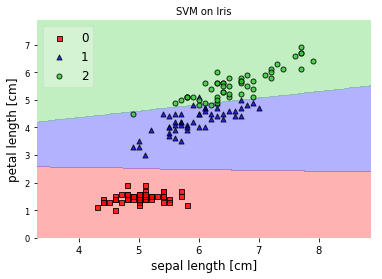


## Example 2 - Decision regions in 1D


```python
from mlxtend.plotting import plot_decision_regions
import matplotlib.pyplot as plt
from sklearn import datasets
from sklearn.svm import SVC

# Loading some example data
iris = datasets.load_iris()
X = iris.data[:, 2]
X = X[:, None]
y = iris.target

# Training a classifier
svm = SVC(C=0.5, kernel='linear')
svm.fit(X, y)

# Plotting decision regions
plot_decision_regions(X, y, clf=svm, 
                      res=0.02, legend=2)

# Adding axes annotations
plt.xlabel('sepal length [cm]')
plt.title('SVM on Iris')

plt.show()
```


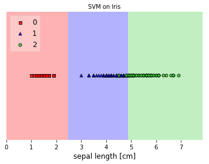


## Example 3 - Decision Region Grids


```python
from sklearn.linear_model import LogisticRegression
from sklearn.naive_bayes import GaussianNB 
from sklearn.ensemble import RandomForestClassifier
from sklearn.svm import SVC
from sklearn import datasets
import numpy as np

# Initializing Classifiers
clf1 = LogisticRegression(random_state=1)
clf2 = RandomForestClassifier(random_state=1)
clf3 = GaussianNB()
clf4 = SVC()

# Loading some example data
iris = datasets.load_iris()
X = iris.data[:, [0,2]]
y = iris.target
```


```python
import matplotlib.pyplot as plt
from mlxtend.plotting import plot_decision_regions
import matplotlib.gridspec as gridspec
import itertools
gs = gridspec.GridSpec(2, 2)

fig = plt.figure(figsize=(10,8))

labels = ['Logistic Regression', 'Random Forest', 'Naive Bayes', 'SVM']
for clf, lab, grd in zip([clf1, clf2, clf3, clf4],
                         labels,
                         itertools.product([0, 1], repeat=2)):

    clf.fit(X, y)
    ax = plt.subplot(gs[grd[0], grd[1]])
    fig = plot_decision_regions(X=X, y=y, clf=clf, legend=2)
    plt.title(lab)
    
plt.show()
```


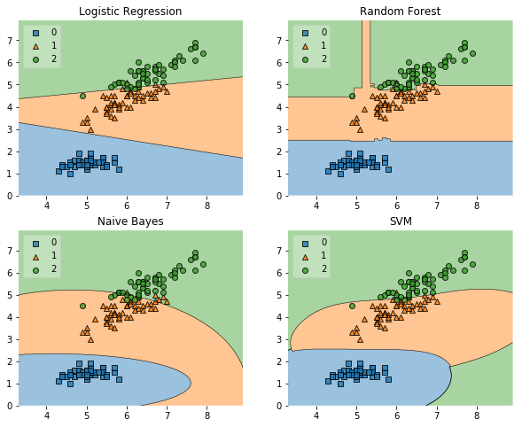


## Example 4 - Highlighting Test Data Points


```python
from mlxtend.plotting import plot_decision_regions
from mlxtend.preprocessing import shuffle_arrays_unison
import matplotlib.pyplot as plt
from sklearn import datasets
from sklearn.svm import SVC


# Loading some example data
iris = datasets.load_iris()
X, y = iris.data[:, [0,2]], iris.target
X, y = shuffle_arrays_unison(arrays=[X, y], random_seed=3)

X_train, y_train = X[:100], y[:100]
X_test, y_test = X[100:], y[100:]

# Training a classifier
svm = SVC(C=0.5, kernel='linear')
svm.fit(X_train, y_train)

# Plotting decision regions
plot_decision_regions(X, y, clf=svm, res=0.02,
                      legend=2, X_highlight=X_test)

# Adding axes annotations
plt.xlabel('sepal length [cm]')
plt.ylabel('petal length [cm]')
plt.title('SVM on Iris')
plt.show()
```


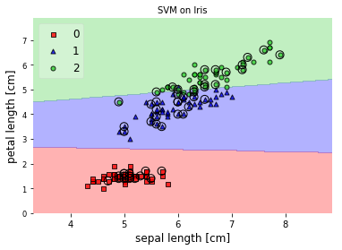


## Example 5 - Evaluating Classifier Behavior on Non-Linear Problems


```python
from sklearn.linear_model import LogisticRegression
from sklearn.naive_bayes import GaussianNB 
from sklearn.ensemble import RandomForestClassifier
from sklearn.svm import SVC

# Initializing Classifiers
clf1 = LogisticRegression(random_state=1)
clf2 = RandomForestClassifier(n_estimators=100, 
                              random_state=1)
clf3 = GaussianNB()
clf4 = SVC()
```


```python
# Loading Plotting Utilities
import matplotlib.pyplot as plt
import matplotlib.gridspec as gridspec
import itertools
from mlxtend.plotting import plot_decision_regions
import numpy as np
```

### XOR


```python
xx, yy = np.meshgrid(np.linspace(-3, 3, 50),
                     np.linspace(-3, 3, 50))
rng = np.random.RandomState(0)
X = rng.randn(300, 2)
y = np.array(np.logical_xor(X[:, 0] > 0, X[:, 1] > 0), 
             dtype=int)
```


```python
gs = gridspec.GridSpec(2, 2)

fig = plt.figure(figsize=(10,8))

labels = ['Logistic Regression', 'Random Forest', 'Naive Bayes', 'SVM']
for clf, lab, grd in zip([clf1, clf2, clf3, clf4],
                         labels,
                         itertools.product([0, 1], repeat=2)):

    clf.fit(X, y)
    ax = plt.subplot(gs[grd[0], grd[1]])
    fig = plot_decision_regions(X=X, y=y, clf=clf, legend=2)
    plt.title(lab)

plt.show()
```


### Half-Moons


```python
from sklearn.datasets import make_moons
X, y = make_moons(n_samples=100, random_state=123)

gs = gridspec.GridSpec(2, 2)

fig = plt.figure(figsize=(10,8))

labels = ['Logistic Regression', 'Random Forest', 'Naive Bayes', 'SVM']
for clf, lab, grd in zip([clf1, clf2, clf3, clf4],
                         labels,
                         itertools.product([0, 1], repeat=2)):

    clf.fit(X, y)
    ax = plt.subplot(gs[grd[0], grd[1]])
    fig = plot_decision_regions(X=X, y=y, clf=clf, legend=2)
    plt.title(lab)

plt.show()
```


### Concentric Circles


```python
from sklearn.datasets import make_circles
X, y = make_circles(n_samples=1000, random_state=123, noise=0.1, factor=0.2)

gs = gridspec.GridSpec(2, 2)

fig = plt.figure(figsize=(10,8))

labels = ['Logistic Regression', 'Random Forest', 'Naive Bayes', 'SVM']
for clf, lab, grd in zip([clf1, clf2, clf3, clf4],
                         labels,
                         itertools.product([0, 1], repeat=2)):

    clf.fit(X, y)
    ax = plt.subplot(gs[grd[0], grd[1]])
    fig = plot_decision_regions(X=X, y=y, clf=clf, legend=2)
    plt.title(lab)

plt.show()
```


## Example 6 - Working with existing axes objects using subplots


```python
import matplotlib.pyplot as plt
from mlxtend.plotting import plot_decision_regions

from sklearn.linear_model import LogisticRegression
from sklearn.naive_bayes import GaussianNB 
from sklearn import datasets
import numpy as np

# Loading some example data
iris = datasets.load_iris()
X = iris.data[:, 2]
X = X[:, None]
y = iris.target

# Initializing and fitting classifiers
clf1 = LogisticRegression(random_state=1)
clf2 = GaussianNB()
clf1.fit(X, y)
clf2.fit(X, y)

fig, axes = plt.subplots(1, 2, figsize=(10, 3))

fig = plot_decision_regions(X=X, y=y, clf=clf1, ax=axes[0], legend=2)
fig = plot_decision_regions(X=X, y=y, clf=clf2, ax=axes[1], legend=1)
    
plt.show()
```


## Example 7 - Decision regions with more than two training features


```python
from mlxtend.plotting import plot_decision_regions
import matplotlib.pyplot as plt
from sklearn import datasets
from sklearn.svm import SVC

# Loading some example data
X, y = datasets.make_blobs(n_samples=600, n_features=3,
                           centers=[[2, 2, -2],[-2, -2, 2]],
                           cluster_std=[2, 2], random_state=2)

# Training a classifier
svm = SVC()
svm.fit(X, y)

# Plotting decision regions
fig, ax = plt.subplots()
# Decision region for feature 3 = 1.5
value = 1.5
# Plot training sample with feature 3 = 1.5 +/- 0.75
width = 0.75
plot_decision_regions(X, y, clf=svm,
                      filler_feature_values={2: value},
                      filler_feature_ranges={2: width},
                      res=0.02, legend=2, ax=ax)
ax.set_xlabel('Feature 1')
ax.set_ylabel('Feature 2')
ax.set_title('Feature 3 = {}'.format(value))

# Adding axes annotations
fig.suptitle('SVM on make_blobs')
plt.show()
```


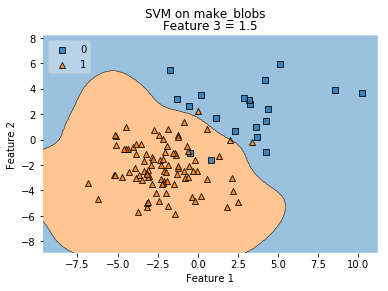


## Example 8 - Grid of decision region slices


```python
from mlxtend.plotting import plot_decision_regions
import matplotlib.pyplot as plt
from sklearn import datasets
from sklearn.svm import SVC

# Loading some example data
X, y = datasets.make_blobs(n_samples=500, n_features=3, centers=[[2, 2, -2],[-2, -2, 2]],
                           cluster_std=[2, 2], random_state=2)

# Training a classifier
svm = SVC()
svm.fit(X, y)

# Plotting decision regions
fig, axarr = plt.subplots(2, 2, figsize=(10,8), sharex=True, sharey=True)
values = [-4.0, -1.0, 1.0, 4.0]
width = 0.75
for value, ax in zip(values, axarr.flat):
    plot_decision_regions(X, y, clf=svm,
                          filler_feature_values={2: value},
                          filler_feature_ranges={2: width},
                          res=0.02, legend=2, ax=ax)
    ax.set_xlabel('Feature 1')
    ax.set_ylabel('Feature 2')
    ax.set_title('Feature 3 = {}'.format(value))

# Adding axes annotations
fig.suptitle('SVM on make_blobs')
plt.show()
```


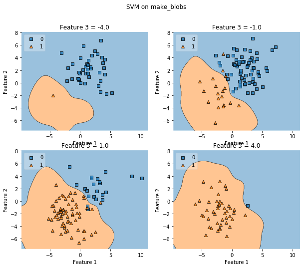


# API


*plot_decision_regions(X, y, clf, feature_index=None, filler_feature_values=None, filler_feature_ranges=None, ax=None, X_highlight=None, res=0.02, legend=1, hide_spines=True, markers='s^oxv<>', colors='red,blue,limegreen,gray,cyan')*

Plot decision regions of a classifier.

Please note that this functions assumes that class labels are
labeled consecutively, e.g,. 0, 1, 2, 3, 4, and 5. If you have class
labels with integer labels > 4, you may want to provide additional colors
and/or markers as `colors` and `markers` arguments.
See http://matplotlib.org/examples/color/named_colors.html for more
information.

**Parameters**

- `X` : array-like, shape = [n_samples, n_features]

    Feature Matrix.

- `y` : array-like, shape = [n_samples]

    True class labels.

- `clf` : Classifier object.

    Must have a .predict method.

- `feature_index` : array-like (default: (0,) for 1D, (0, 1) otherwise)

    Feature indices to use for plotting. The first index in
    `feature_index` will be on the x-axis, the second index will be
    on the y-axis.

- `filler_feature_values` : dict (default: None)

    Only needed for number features > 2. Dictionary of feature
    index-value pairs for the features not being plotted.

- `filler_feature_ranges` : dict (default: None)

    Only needed for number features > 2. Dictionary of feature
    index-value pairs for the features not being plotted. Will use the
    ranges provided to select training samples for plotting.

- `ax` : matplotlib.axes.Axes (default: None)

    An existing matplotlib Axes. Creates
    one if ax=None.

- `X_highlight` : array-like, shape = [n_samples, n_features] (default: None)

    An array with data points that are used to highlight samples in `X`.

- `res` : float or array-like, shape = (2,) (default: 0.02)

    Grid width. If float, same resolution is used for both the x- and
    y-axis. If array-like, the first item is used on the x-axis, the
    second is used on the y-axis. Lower values increase the resolution but
    slow down the plotting.

- `hide_spines` : bool (default: True)

    Hide axis spines if True.

- `legend` : int (default: 1)

    Integer to specify the legend location.
    No legend if legend is 0.

- `markers` : str (default 's^oxv<>')

    Scatterplot markers.

- `colors` : str (default 'red,blue,limegreen,gray,cyan')

    Comma separated list of colors.

**Returns**

- `ax` : matplotlib.axes.Axes object


# `plotting.plot_learning_curves`

A function to plot learning curves for classifiers. Learning curves are extremely useful to analyze if a model is suffering from over- or under-fitting (high variance or high bias). The function can be imported via


> from mlxtend.plotting import plot_learning_curves

### References

-

## Example 1


```python
from mlxtend.plotting import plot_learning_curves
import matplotlib.pyplot as plt
from mlxtend.data import iris_data
from mlxtend.preprocessing import shuffle_arrays_unison
from sklearn.neighbors import KNeighborsClassifier
import numpy as np


# Loading some example data
X, y = iris_data()
X, y = shuffle_arrays_unison(arrays=[X, y], random_seed=123)
X_train, X_test = X[:100], X[100:]
y_train, y_test = y[:100], y[100:]

clf = KNeighborsClassifier(n_neighbors=5)

plot_learning_curves(X_train, y_train, X_test, y_test, clf)
plt.show()
```


## API


*plot_learning_curves(X_train, y_train, X_test, y_test, clf, train_marker='o', test_marker='^', scoring='misclassification error', suppress_plot=False, print_model=True, style='fivethirtyeight', legend_loc='best')*

Plots learning curves of a classifier.

**Parameters**

- `X_train` : array-like, shape = [n_samples, n_features]

    Feature matrix of the training dataset.

- `y_train` : array-like, shape = [n_samples]

    True class labels of the training dataset.

- `X_test` : array-like, shape = [n_samples, n_features]

    Feature matrix of the test dataset.

- `y_test` : array-like, shape = [n_samples]

    True class labels of the test dataset.

- `clf` : Classifier object. Must have a .predict .fit method.


- `train_marker` : str (default: 'o')

    Marker for the training set line plot.

- `test_marker` : str (default: '^')

    Marker for the test set line plot.

- `scoring` : str (default: 'misclassification error')

    If not 'misclassification error', accepts the following metrics
    (from scikit-learn):
    {'accuracy', 'average_precision', 'f1_micro', 'f1_macro',
    'f1_weighted', 'f1_samples', 'log_loss',
    'precision', 'recall', 'roc_auc',
    'adjusted_rand_score', 'mean_absolute_error', 'mean_squared_error',
    'median_absolute_error', 'r2'}

- `suppress_plot=False` : bool (default: False)

    Suppress matplotlib plots if True. Recommended
    for testing purposes.

- `print_model` : bool (default: True)

    Print model parameters in plot title if True.

- `style` : str (default: 'fivethirtyeight')

    Matplotlib style

- `legend_loc` : str (default: 'best')

    Where to place the plot legend:
    {'best', 'upper left', 'upper right', 'lower left', 'lower right'}

**Returns**

- `errors` : (training_error, test_error): tuple of lists


# `plotting.plot_sequential_feature_selection`

A matplotlib utility function for visualizing results from [`feature_selection.SequentialFeatureSelector`](`../feature_selection/SequentialFeatureSelector.md`).

> from mlxtend.plotting import plot_sequential_feature_selection

# Overview

for more information on sequential feature selection, please see [`feature_selection.SequentialFeatureSelector`](`../feature_selection/SequentialFeatureSelector.md`).

## Example 1 - Plotting the results from SequentialFeatureSelector


```python
from mlxtend.plotting import plot_sequential_feature_selection as plot_sfs
from mlxtend.feature_selection import SequentialFeatureSelector as SFS
import matplotlib.pyplot as plt
from sklearn.neighbors import KNeighborsClassifier
from sklearn.datasets import load_iris

iris = load_iris()
X = iris.data
y = iris.target
knn = KNeighborsClassifier(n_neighbors=4)

sfs = SFS(knn, 
          k_features=4, 
          forward=True, 
          floating=False, 
          scoring='accuracy',
          cv=5)

sfs = sfs.fit(X, y)

fig1 = plot_sfs(sfs.get_metric_dict(), kind='std_dev')

plt.ylim([0.8, 1])
plt.title('Sequential Forward Selection (w. StdDev)')
plt.grid()
plt.show()
```

    Features: 4/4


# API


*plot_sequential_feature_selection(metric_dict, kind='std_dev', color='blue', bcolor='steelblue', marker='o', alpha=0.2, ylabel='Performance', confidence_interval=0.95)*

Plot feature selection results.

**Parameters**

- `metric_dict` : mlxtend.SequentialFeatureSelector.get_metric_dict() object


- `kind` : str (default: "std_dev")

    The kind of error bar or confidence interval in
    {'std_dev', 'std_err', 'ci', None}.

- `color` : str (default: "blue")

    Color of the lineplot (accepts any matplotlib color name)

- `bcolor` : str (default: "steelblue").

    Color of the error bars / confidence intervals
    (accepts any matplotlib color name).

- `marker` : str (default: "o")

    Marker of the line plot
    (accepts any matplotlib marker name).

- `alpha` : float in [0, 1] (default: 0.2)

    Transparency of the error bars / confidence intervals.

- `ylabel` : str (default: "Performance")

    Y-axis label.

- `confidence_interval` : float (default: 0.95)

    Confidence level if `kind='ci'`.

**Returns**

- `fig` : matplotlib.pyplot.figure() object


# `plotting.plot_confusion_matrix`

Utility function for visualizing confusion matrices via matplotlib

> `from mlxtend.plotting import plot_confusion_matrix`

## Overview

### Confusion Matrix

For more information on confusion matrices, please see [`mlxtend.evaluate.confusion_matrix`](../evaluate/confusion_matrix.md).

### References

- -

## Example 1 - Binary and Multi-Class


```python
from mlxtend.plotting import plot_confusion_matrix
import matplotlib.pyplot as plt
import numpy as np

binary = np.array([[4, 1],
                   [1, 2]])

fig, ax = plot_confusion_matrix(conf_mat=binary)
plt.show()
```


```python
multiclass = np.array([[2, 1, 0, 0],
                       [1, 2, 0, 0],
                       [0, 0, 1, 0],
                       [0, 0, 0, 1]])

fig, ax = plot_confusion_matrix(conf_mat=multiclass)
plt.show()
```


## API


*plot_confusion_matrix(conf_mat, hide_spines=False, hide_ticks=False, figsize=(2.5, 2.5), cmap=None, alpha=0.3)*

Plot a confusion matrix via matplotlib.

**Parameters**

- `conf_mat` : array-like, shape = [n_classes, n_classes]

    Confusion matrix from evaluate.confusion matrix.

- `hide_spines` : bool (default: False)

    Hides axis spines if True.

- `hide_ticks` : bool (default: False)

    Hides axis ticks if True

- `figsize` : tuple (default: (2.5, 2.5))

    Height and width of the figure

- `cmap` : matplotlib colormap (default: `None`)

    Uses matplotlib.pyplot.cm.Blues if `None`

**Returns**

- `fig, ax` : matplotlib.pyplot subplot objects

    Figure and axis elements of the subplot.


# `plotting.plot_linear_regression`

A function to plot linear regression fits. 

> from mlxtend.plotting import plot_linear_regression

## Overview

The `plot_linear_regression` is a convenience function that uses scikit-learn's `linear_model.LinearRegression` to fit a linear model and SciPy's `stats.pearsonr` to calculate the correlation coefficient. 

### References

- -

## Example 1 - Ordinary Least Squares Simple Linear Regression


```python
import matplotlib.pyplot as plt
from mlxtend.plotting import plot_linear_regression
import numpy as np

X = np.array([4, 8, 13, 26, 31, 10, 8, 30, 18, 12, 20, 5, 28, 18, 6, 31, 12,
   12, 27, 11, 6, 14, 25, 7, 13,4, 15, 21, 15])

y = np.array([14, 24, 22, 59, 66, 25, 18, 60, 39, 32, 53, 18, 55, 41, 28, 61, 35,
   36, 52, 23, 19, 25, 73, 16, 32, 14, 31, 43, 34])

intercept, slope, corr_coeff = plot_linear_regression(X, y)
plt.show()
```


## API


*plot_linear_regression(X, y, model=LinearRegression(copy_X=True, fit_intercept=True, n_jobs=1, normalize=False), corr_func='pearsonr', scattercolor='blue', fit_style='k--', legend=True, xlim='auto')*

Plot a linear regression line fit.

**Parameters**

- `X` : numpy array, shape = [n_samples,]

    Samples.

- `y` : numpy array, shape (n_samples,)

    Target values
    model: object (default: sklearn.linear_model.LinearRegression)
    Estimator object for regression. Must implement
    a .fit() and .predict() method.
    corr_func: str or function (default: 'pearsonr')
    Uses `pearsonr` from scipy.stats if corr_func='pearsonr'.
    to compute the regression slope. If not 'pearsonr', the `corr_func`,
    the `corr_func` parameter expects a function of the form
    func(<x-array>, <y-array>) as inputs, which is expected to return
    a tuple `(<correlation_coefficient>, <some_unused_value>)`.
    scattercolor: string (default: blue)
    Color of scatter plot points.
    fit_style: string (default: k--)
    Style for the line fit.
    legend: bool (default: True)
    Plots legend with corr_coeff coef.,
    fit coef., and intercept values.
    xlim: array-like (x_min, x_max) or 'auto' (default: 'auto')
    X-axis limits for the linear line fit.

**Returns**

- `regression_fit` : tuple

    intercept, slope, corr_coeff (float, float, float)


# `plotting.category_scatter`

A function to quickly produce a scatter plot colored by categories from a pandas `DataFrame` or NumPy `ndarray` object.

> from mlxtend.general_plotting import category_scatter

## Overview

### References

- -

## Example 1 - Category Scatter from Pandas DataFrames


```python
import pandas as pd
from io import StringIO

csvfile = """label,x,y
class1,10.0,8.04
class1,10.5,7.30
class2,8.3,5.5
class2,8.1,5.9
class3,3.5,3.5
class3,3.8,5.1"""

df = pd.read_csv(StringIO(csvfile))
df
```


<div>
<table border="1" class="dataframe">
  <thead>
    <tr style="text-align: right;">
      <th></th>
      <th>label</th>
      <th>x</th>
      <th>y</th>
    </tr>
  </thead>
  <tbody>
    <tr>
      <th>0</th>
      <td>class1</td>
      <td>10.0</td>
      <td>8.04</td>
    </tr>
    <tr>
      <th>1</th>
      <td>class1</td>
      <td>10.5</td>
      <td>7.30</td>
    </tr>
    <tr>
      <th>2</th>
      <td>class2</td>
      <td>8.3</td>
      <td>5.50</td>
    </tr>
    <tr>
      <th>3</th>
      <td>class2</td>
      <td>8.1</td>
      <td>5.90</td>
    </tr>
    <tr>
      <th>4</th>
      <td>class3</td>
      <td>3.5</td>
      <td>3.50</td>
    </tr>
    <tr>
      <th>5</th>
      <td>class3</td>
      <td>3.8</td>
      <td>5.10</td>
    </tr>
  </tbody>
</table>
</div>


Plotting the data where the categories are determined by the unique values in the label column `label_col`. The `x` and `y` values are simply the column names of the DataFrame that we want to plot.


```python
import matplotlib.pyplot as plt
from mlxtend.plotting import category_scatter

fig = category_scatter(x='x', y='y', label_col='label', 
                       data=df, legend_loc='upper left')
```


## Example 2 - Category Scatter from NumPy Arrays


```python
import numpy as np
from io import BytesIO

csvfile = """1,10.0,8.04
1,10.5,7.30
2,8.3,5.5
2,8.1,5.9
3,3.5,3.5
3,3.8,5.1"""

ary = np.genfromtxt(BytesIO(csvfile.encode()), delimiter=',')
ary
```


    array([[  1.  ,  10.  ,   8.04],
           [  1.  ,  10.5 ,   7.3 ],
           [  2.  ,   8.3 ,   5.5 ],
           [  2.  ,   8.1 ,   5.9 ],
           [  3.  ,   3.5 ,   3.5 ],
           [  3.  ,   3.8 ,   5.1 ]])


Now, pretending that the first column represents the labels, and the second and third column represent the `x` and `y` values, respectively.


```python
import matplotlib.pyplot as plt
from mlxtend.plotting import category_scatter

fix = category_scatter(x=1, y=2, label_col=0, 
                       data=ary, legend_loc='upper left')
```


## API


*category_scatter(x, y, label_col, data, markers='sxo^v', colors=('blue', 'green', 'red', 'purple', 'gray', 'cyan'), alpha=0.7, markersize=20.0, legend_loc='best')*

Scatter plot to plot categories in different colors/markerstyles.

**Parameters**

- `x` : str or int

    DataFrame column name of the x-axis values or
    integer for the numpy ndarray column index.

- `y` : str

    DataFrame column name of the y-axis values or
    integer for the numpy ndarray column index

- `data` : Pandas DataFrame object or NumPy ndarray.


- `markers` : str

    Markers that are cycled through the label category.

- `colors` : tuple

    Colors that are cycled through the label category.

- `alpha` : float (default: 0.7)

    Parameter to control the transparency.

- `markersize` : float (default` : 20.0)

    Parameter to control the marker size.

- `legend_loc` : str (default: 'best')

    Location of the plot legend
    {best, upper left, upper right, lower left, lower right}
    No legend if legend_loc=False

**Returns**

- `fig` : matplotlig.pyplot figure object


# `plotting.enrichment_plot`

A function to plot step plots of cumulative counts.

> from mlxtend.general_plotting import category_scatter

## Overview

In enrichment plots, the y-axis can be interpreted as "how many samples are less or equal to the corresponding x-axis label."

### References

- -

## Example 1 - Enrichment Plots from Pandas DataFrames


```python
import pandas as pd
s1 = [1.1, 1.5]
s2 = [2.1, 1.8]
s3 = [3.1, 2.1]
s4 = [3.9, 2.5]
data = [s1, s2, s3, s4]
df = pd.DataFrame(data, columns=['X1', 'X2'])
df
```


<div>
<table border="1" class="dataframe">
  <thead>
    <tr style="text-align: right;">
      <th></th>
      <th>X1</th>
      <th>X2</th>
    </tr>
  </thead>
  <tbody>
    <tr>
      <th>0</th>
      <td>1.1</td>
      <td>1.5</td>
    </tr>
    <tr>
      <th>1</th>
      <td>2.1</td>
      <td>1.8</td>
    </tr>
    <tr>
      <th>2</th>
      <td>3.1</td>
      <td>2.1</td>
    </tr>
    <tr>
      <th>3</th>
      <td>3.9</td>
      <td>2.5</td>
    </tr>
  </tbody>
</table>
</div>


Plotting the data where the categories are determined by the unique values in the label column `label_col`. The `x` and `y` values are simply the column names of the DataFrame that we want to plot.


```python
import matplotlib.pyplot as plt
from mlxtend.plotting import enrichment_plot

ax = enrichment_plot(df, legend_loc='upper left')
```


## API


*enrichment_plot(df, colors='bgrkcy', markers=' ', linestyles='-', alpha=0.5, lw=2, where='post', grid=True, count_label='Count', xlim='auto', ylim='auto', invert_axes=False, legend_loc='best', ax=None)*

Plot stacked barplots

**Parameters**

- `df` : pandas.DataFrame

    A pandas DataFrame where columns represent the different categories.
    colors: str (default: 'bgrcky')
    The colors of the bars.

- `markers` : str (default: ' ')

    Matplotlib markerstyles, e.g,
    'sov' for square,circle, and triangle markers.

- `linestyles` : str (default: '-')

    Matplotlib linestyles, e.g.,
    '-,--' to cycle normal and dashed lines. Note
    that the different linestyles need to be separated by commas.

- `alpha` : float (default: 0.5)

    Transparency level from 0.0 to 1.0.

- `lw` : int or float (default: 2)

    Linewidth parameter.

- `where` : {'post', 'pre', 'mid'} (default: 'post')

    Starting location of the steps.

- `grid` : bool (default: `True`)

    Plots a grid if True.

- `count_label` : str (default: 'Count')

    Label for the "Count"-axis.

- `xlim` : 'auto' or array-like [min, max] (default: 'auto')

    Min and maximum position of the x-axis range.

- `ylim` : 'auto' or array-like [min, max] (default: 'auto')

    Min and maximum position of the y-axis range.

- `invert_axes` : bool (default: False)

    Plots count on the x-axis if True.

- `legend_loc` : str (default: 'best')

    Location of the plot legend
    {best, upper left, upper right, lower left, lower right}
    No legend if legend_loc=False

- `ax` : matplotlib axis, optional (default: None)

    Use this axis for plotting or make a new one otherwise

**Returns**

- `ax` : matplotlib axis


# `plotting.stacked_barplot`

A function to conveniently plot stacked bar plots in matplotlib using pandas `DataFrame`s. 

> from mlxtend.general_plotting import category_scatter

## Overview

A matplotlib convenience function for creating barplots from DataFrames where each sample is associated with several categories.

### References

- -

## Example 1 - Stacked Barplot from Pandas DataFrames


```python
import pandas as pd

s1 = [1.0, 2.0, 3.0, 4.0]
s2 = [1.4, 2.1, 2.9, 5.1]
s3 = [1.9, 2.2, 3.5, 4.1]
s4 = [1.4, 2.5, 3.5, 4.2]
data = [s1, s2, s3, s4]

df = pd.DataFrame(data, columns=['X1', 'X2', 'X3', 'X4'])
df.columns = ['X1', 'X2', 'X3', 'X4']
df.index = ['Sample1', 'Sample2', 'Sample3', 'Sample4']
df
```


<div>
<table border="1" class="dataframe">
  <thead>
    <tr style="text-align: right;">
      <th></th>
      <th>X1</th>
      <th>X2</th>
      <th>X3</th>
      <th>X4</th>
    </tr>
  </thead>
  <tbody>
    <tr>
      <th>Sample1</th>
      <td>1.0</td>
      <td>2.0</td>
      <td>3.0</td>
      <td>4.0</td>
    </tr>
    <tr>
      <th>Sample2</th>
      <td>1.4</td>
      <td>2.1</td>
      <td>2.9</td>
      <td>5.1</td>
    </tr>
    <tr>
      <th>Sample3</th>
      <td>1.9</td>
      <td>2.2</td>
      <td>3.5</td>
      <td>4.1</td>
    </tr>
    <tr>
      <th>Sample4</th>
      <td>1.4</td>
      <td>2.5</td>
      <td>3.5</td>
      <td>4.2</td>
    </tr>
  </tbody>
</table>
</div>


By default, the index of the `DataFrame` is used as column labels, and the `DataFrame` columns are used for the plot legend.


```python
import matplotlib.pyplot as plt
from mlxtend.plotting import stacked_barplot

fig = stacked_barplot(df, rotation=45, legend_loc='best')
```


## API


*stacked_barplot(df, bar_width='auto', colors='bgrcky', labels='index', rotation=90, legend_loc='best')*

Function to plot stacked barplots

**Parameters**

- `df` : pandas.DataFrame

    A pandas DataFrame where the index denotes the
    x-axis labels, and the columns contain the different
    measurements for each row.
    bar_width: 'auto' or float (default: 'auto')
    Parameter to set the widths of the bars. if
    'auto', the width is automatically determined by
    the number of columns in the dataset.
    colors: str (default: 'bgrcky')
    The colors of the bars.
    labels: 'index' or iterable (default: 'index')
    If 'index', the DataFrame index will be used as
    x-tick labels.
    rotation: int (default: 90)
    Parameter to rotate the x-axis labels.

- `legend_loc` : str (default: 'best')

    Location of the plot legend
    {best, upper left, upper right, lower left, lower right}
    No legend if legend_loc=False

**Returns**

- `fig` : matplotlib.pyplot figure object


# `plotting.checkerboard_plot`

Function to plot a checkerboard plot / heat map via matplotlib

> `from mlxtend.plotting import checkerboard plot`

## Overview

Function to plot a checkerboard plot / heat map via matplotlib.

### References

- -

## Example 1 - Default


```python
from mlxtend.plotting import checkerboard_plot
import matplotlib.pyplot as plt
import numpy as np

ary = np.random.random((5, 4))

brd = checkerboard_plot(ary)
plt.show()
```


## Example 2 - Changing colors and labels


```python
from mlxtend.plotting import checkerboard_plot
import matplotlib.pyplot as plt
import numpy as np

checkerboard_plot(ary, 
                  col_labels=['abc', 'def', 'ghi', 'jkl'],
                  row_labels=['sample %d' % i for i in range(1, 6)],
                  cell_colors=['skyblue', 'whitesmoke'],
                  font_colors=['black', 'black'],
                  figsize=(4.5, 5))
plt.show()
```


## API


*checkerboard_plot(ary, cell_colors=('white', 'black'), font_colors=('black', 'white'), fmt='%.1f', figsize=None, row_labels=None, col_labels=None, fontsize=None)*

Plot a checkerboard table / heatmap via matplotlib.

**Parameters**

- `ary` : array-like, shape = [n, m]

    A 2D Nnumpy array.

- `cell_colors` : tuple or list (default: ('white', 'black'))

    Tuple or list containing the two colors of the
    checkerboard pattern.

- `font_colors` : tuple or list (default: ('black', 'white'))

    Font colors corresponding to the cell colors.

- `figsize` : tuple (default: (2.5, 2.5))

    Height and width of the figure

- `fmt` : str (default: '%.1f')

    Python string formatter for cell values.
    The default '%.1f' results in floats with 1 digit after
    the decimal point. Use '%d' to show numbers as integers.

- `row_labels` : list (default: None)

    List of the row labels. Uses the array row
    indices 0 to n by default.

- `col_labels` : list (default: None)

    List of the column labels. Uses the array column
    indices 0 to m by default.

- `fontsize` : int (default: None)

    Specifies the font size of the checkerboard table.
    Uses matplotlib's default if None.

**Returns**

- `fig` : matplotlib Figure object.


# `plotting.ecdf`

A function to conveniently plot an empirical cumulative distribution function. 

> from mlxtend.ecdf import ecdf

## Overview

A function to conveniently plot an empirical cumulative distribution function (ECDF) and adding percentile thresholds for exploratory data analysis.

### References

- -

## Example 1 - ECDF


```python
from mlxtend.data import iris_data
from mlxtend.plotting import ecdf
import matplotlib.pyplot as plt

X, y = iris_data()

ax, _, _ = ecdf(x=X[:, 0], x_label='sepal length (cm)')
plt.show()
```


## Example 2 - Multiple ECDFs


```python
from mlxtend.data import iris_data
from mlxtend.plotting import ecdf
import matplotlib.pyplot as plt

X, y = iris_data()

# first ecdf
x1 = X[:, 0]
ax, _, _ = ecdf(x1, x_label='cm')

# second ecdf
x2 = X[:, 1]
ax, _, _ = ecdf(x2, ax=ax)

plt.legend(['sepal length', 'sepal width'])
plt.show()
```


## Example 3 - ECDF with Percentile Thresholds


```python
from mlxtend.data import iris_data
from mlxtend.plotting import ecdf
import matplotlib.pyplot as plt

X, y = iris_data()

ax, threshold, count = ecdf(x=X[:, 0], 
                            x_label='sepal length (cm)',
                            percentile=0.8)

plt.show()

print('Feature threshold at the 80th percentile:', threshold)
print('Number of samples below the threshold:', count)
```


    Feature threshold at the 80th percentile: 6.5
    Number of samples below the threshold: 120


## API


*ecdf(x, y_label='ECDF', x_label=None, ax=None, percentile=None, ecdf_color=None, ecdf_marker='o', percentile_color='black', percentile_linestyle='--')*

Plots an Empirical Cumulative Distribution Function

**Parameters**

- `x` : array or list, shape=[n_samples,]

    Array-like object containing the feature values

- `y_label` : str (default='ECDF')

    Text label for the y-axis

- `x_label` : str (default=None)

    Text label for the x-axis

- `ax` : matplotlib.axes.Axes (default: None)

    An existing matplotlib Axes. Creates
    one if ax=None

- `percentile` : float (default=None)

    Float between 0 and 1 for plotting a percentile
    threshold line

- `ecdf_color` : matplotlib color (default=None)

    Color for the ECDF plot; uses matplotlib defaults
    if None

- `ecdf_marker` : matplotlib marker (default='o')

    Marker style for the ECDF plot

- `percentile_color` : matplotlib color (default='black')

    Color for the percentile threshold if percentile is not None

- `percentile_linestyle` : matplotlib linestyle (default='--')

    Line style for the percentile threshold if percentile is not None

**Returns**

- `ax` : matplotlib.axes.Axes object


- `percentile_threshold` : float

    Feature threshold at the percentile or None if `percentile=None`

- `percentile_count` : Number of if percentile is not None

    Number of samples that have a feature less or equal than
    the feature threshold at a percentile threshold
    or None if `percentile=None`


# `math.num_combinations`

A function to calculate the number of combinations for creating subsequences of *k* elements out of a sequence with *n* elements.

> from mlxtend.math import num_combinations

## Overview

Combinations are selections of items from a collection regardless of the order in which they appear (in contrast to permutations). For example, let's consider a combination of 3 elements (k=3) from a collection of 5 elements (n=5): 

- collection: {1, 2, 3, 4, 5}
- combination 1a: {1, 3, 5} 
- combination 1b: {1, 5, 3}
- combination 1c: {3, 5, 1}
- ...
- combination 2: {1, 3, 4}

In the example above the combinations 1a, 1b, and 1c, are the "same combination" and counted as "1 possible way to combine items 1, 3, and 5" -- in combinations, the order does not matter.


The number of ways to combine elements (**without replacement**)  from a collection with size *n* into subsets of size *k* is computed via the binomial coefficient ("*n* choose *k*"):

$$
\begin{pmatrix} 
n  \\
k 
\end{pmatrix} = \frac{n(n-1)\ldots(n-k+1)}{k(k-1)\dots1} = \frac{n!}{k!(n-k)!}
$$

To compute the number of combinations **with replacement**, the following, alternative equation 
is used ("*n* multichoose *k*"):

$$\begin{pmatrix} 
n  \\
k 
\end{pmatrix} = \begin{pmatrix} 
n + k -1  \\
k 
\end{pmatrix}$$

### References

- [https://en.wikipedia.org/wiki/Combination](https://en.wikipedia.org/wiki/Combination)

## Example 1 - Compute the number of combinations


```python
from mlxtend.math import num_combinations

c = num_combinations(n=20, k=8, with_replacement=False)
print('Number of ways to combine 20 elements'
      ' into 8 subelements: %d' % c)
```

    Number of ways to combine 20 elements into 8 subelements: 125970


```python
from mlxtend.math import num_combinations

c = num_combinations(n=20, k=8, with_replacement=True)
print('Number of ways to combine 20 elements'
      ' into 8 subelements (with replacement): %d' % c)
```

    Number of ways to combine 20 elements into 8 subelements (with replacement): 2220075


## Example 2 - A progress tracking use-case

It is often quite useful to track the progress of a computational expensive tasks to estimate its runtime. Here, the `num_combination` function can be used to compute the maximum number of loops of a `combinations` iterable from itertools:


```python
import itertools
import sys
import time
from mlxtend.math import num_combinations

items = {1, 2, 3, 4, 5, 6, 7, 8}
max_iter = num_combinations(n=len(items), k=3, 
                            with_replacement=False)

for idx, i in enumerate(itertools.combinations(items, r=3)):
    # do some computation with itemset i
    time.sleep(0.1)
    sys.stdout.write('\rProgress: %d/%d' % (idx + 1, max_iter))
    sys.stdout.flush()
```

    Progress: 56/56

## API


*num_combinations(n, k, with_replacement=False)*

Function to calculate the number of possible combinations.

**Parameters**

- `n` : `int`

    Total number of items.

- `k` : `int`

    Number of elements of the target itemset.

- `with_replacement` : `bool` (default: False)

    Allows repeated elements if True.

**Returns**

- `comb` : `int`

    Number of possible combinations.


# `math.num_permutations`

A function to calculate the number of permutations for creating subsequences of *k* elements out of a sequence with *n* elements.

> from mlxtend.math import num_permutations

## Overview

Permutations are selections of items from a collection with regard to the order in which they appear (in contrast to combinations). For example, let's consider a permutation of 3 elements (k=3) from a collection of 5 elements (n=5): 

- collection: {1, 2, 3, 4, 5}
- combination 1a: {1, 3, 5} 
- combination 1b: {1, 5, 3}
- combination 1c: {3, 5, 1}
- ...
- combination 2: {1, 3, 4}

In the example above the permutations 1a, 1b, and 1c, are the "same combination" but distinct permutations -- in combinations, the order does not matter, but in permutation it does matter.


The number of ways to combine elements (**without replacement**) from a collection with size *n* into subsets of size *k* is computed via the binomial coefficient ("*n* choose *k*"):

$$
k!\begin{pmatrix} 
n  \\
k 
\end{pmatrix} = k! \cdot \frac{n!}{k!(n-k)!} = \frac{n!}{(n-k)!}
$$

To compute the number of permutations **with replacement**, we simply need to compute $n^k$.

### References

- [https://en.wikipedia.org/wiki/Permutation](https://en.wikipedia.org/wiki/Permutation)

## Example 1 - Compute the number of permutations


```python
from mlxtend.math import num_permutations

c = num_permutations(n=20, k=8, with_replacement=False)
print('Number of ways to permute 20 elements'
      ' into 8 subelements: %d' % c)
```

    Number of ways to permute 20 elements into 8 subelements: 5079110400


```python
from mlxtend.math import num_permutations

c = num_permutations(n=20, k=8, with_replacement=True)
print('Number of ways to combine 20 elements'
      ' into 8 subelements (with replacement): %d' % c)
```

    Number of ways to combine 20 elements into 8 subelements (with replacement): 25600000000


## Example 2 - A progress tracking use-case

It is often quite useful to track the progress of a computational expensive tasks to estimate its runtime. Here, the `num_combination` function can be used to compute the maximum number of loops of a `permutations` iterable from itertools:


```python
import itertools
import sys
import time
from mlxtend.math import num_permutations

items = {1, 2, 3, 4, 5, 6, 7, 8}
max_iter = num_permutations(n=len(items), k=3, 
                            with_replacement=False)

for idx, i in enumerate(itertools.permutations(items, r=3)):
    # do some computation with itemset i
    time.sleep(0.01)
    sys.stdout.write('\rProgress: %d/%d' % (idx + 1, max_iter))
    sys.stdout.flush()
```

    Progress: 336/336

## API


*num_permutations(n, k, with_replacement=False)*

Function to calculate the number of possible permutations.

**Parameters**

- `n` : `int`

    Total number of items.

- `k` : `int`

    Number of elements of the target itemset.

- `with_replacement` : `bool`

    Allows repeated elements if True.

**Returns**

- `permut` : `int`

    Number of possible permutations.


# `text.generalize_names`

A function that converts a name into a general format ` <last_name><separator><firstname letter(s)> (all lowercase)`.

> from mlxtend.text import generalize_names

## Overview


A function that converts a name into a general format ` <last_name><separator><firstname letter(s)> (all lowercase)`, which is useful if data is collected from different sources and is supposed to be compared or merged based on name identifiers. E.g., if names are stored in a pandas `DataFrame` column, the apply function can be used to generalize names: `df['name'] = df['name'].apply(generalize_names)`

### References

- -

## Example 1 - Defaults


```python
from mlxtend.text import generalize_names
```


```python
generalize_names('Pozo, Jos ngel')
```


    'pozo j'


```python
generalize_names('Jos Pozo')
```


    'pozo j'


```python
generalize_names('Jos ngel Pozo')
```


    'pozo j'


## Example 2 - Optional Parameters


```python
from mlxtend.text import generalize_names
```


```python
generalize_names("Eto'o, Samuel", firstname_output_letters=2)
```


    'etoo sa'


```python
generalize_names("Eto'o, Samuel", firstname_output_letters=0)
```


    'etoo'


```python
generalize_names("Eto'o, Samuel", output_sep=', ')
```


    'etoo, s'


## API


*generalize_names(name, output_sep=' ', firstname_output_letters=1)*

Generalize a person's first and last name.

Returns a person's name in the format
`<last_name><separator><firstname letter(s)> (all lowercase)`

**Parameters**

- `name` : `str`

    Name of the player

- `output_sep` : `str` (default: ' ')

    String for separating last name and first name in the output.

- `firstname_output_letters` : `int`

    Number of letters in the abbreviated first name.

**Returns**

- `gen_name` : `str`

    The generalized name.


# `text.generalize_names_duplcheck`

A function that converts a name into a general format ` <last_name><separator><firstname letter(s)> (all lowercase)` in a `pandas DataFrame` while avoiding duplicate entries.

> from mlxtend.text import generalize_names_duplcheck

## Overview

**Note** that using [`mlxtend.text.generalize_names`](./generalize_named.html) with few `firstname_output_letters` can result in duplicate entries. E.g., if your dataset contains the names "Adam Johnson" and "Andrew Johnson", the default setting (i.e., 1 first name letter) will produce the generalized name "johnson a" in both cases.

One solution is to increase the number of first name letters in the output by setting the parameter `firstname_output_letters` to a value larger than 1. 

An alternative solution is to use the `generalize_names_duplcheck` function if you are working with pandas DataFrames. 


By default,  `generalize_names_duplcheck` will apply  `generalize_names` to a pandas DataFrame column with the minimum number of first name letters and append as many first name letters as necessary until no duplicates are present in the given DataFrame column. An example dataset column that contains the names  

### References

- -

## Example 1 - Defaults

Reading in a CSV file that has column `Name` for which we want to generalize the names:

- Samuel Eto'o
- Adam Johnson
- Andrew Johnson


```python
import pandas as pd
from io import StringIO

simulated_csv = "name,some_value\n"\
                "Samuel Eto'o,1\n"\
                "Adam Johnson,1\n"\
                "Andrew Johnson,1\n"

df = pd.read_csv(StringIO(simulated_csv))
df
```


<div>
<table border="1" class="dataframe">
  <thead>
    <tr style="text-align: right;">
      <th></th>
      <th>name</th>
      <th>some_value</th>
    </tr>
  </thead>
  <tbody>
    <tr>
      <th>0</th>
      <td>Samuel Eto'o</td>
      <td>1</td>
    </tr>
    <tr>
      <th>1</th>
      <td>Adam Johnson</td>
      <td>1</td>
    </tr>
    <tr>
      <th>2</th>
      <td>Andrew Johnson</td>
      <td>1</td>
    </tr>
  </tbody>
</table>
</div>


Applying `generalize_names_duplcheck` to generate a new DataFrame with the generalized names without duplicates: 


```python
from mlxtend.text import generalize_names_duplcheck
df_new = generalize_names_duplcheck(df=df, col_name='name')
df_new
```


<div>
<table border="1" class="dataframe">
  <thead>
    <tr style="text-align: right;">
      <th></th>
      <th>name</th>
      <th>some_value</th>
    </tr>
  </thead>
  <tbody>
    <tr>
      <th>0</th>
      <td>etoo s</td>
      <td>1</td>
    </tr>
    <tr>
      <th>1</th>
      <td>johnson ad</td>
      <td>1</td>
    </tr>
    <tr>
      <th>2</th>
      <td>johnson an</td>
      <td>1</td>
    </tr>
  </tbody>
</table>
</div>


## API


*generalize_names_duplcheck(df, col_name)*

Generalizes names and removes duplicates.

Applies mlxtend.text.generalize_names to a DataFrame
with 1 first name letter by default
and uses more first name letters if duplicates are detected.

**Parameters**

- `df` : `pandas.DataFrame`

    DataFrame that contains a column where
    generalize_names should be applied.

- `col_name` : `str`

    Name of the DataFrame column where `generalize_names`
    function should be applied to.

**Returns**

- `df_new` : `str`

    New DataFrame object where generalize_names function has
    been applied without duplicates.


# `text.tokenizer`

Different functions to tokenize text.

> from mlxtend.text import tokenizer_[type]

## Overview

Different functions to tokenize text for natural language processing tasks, for example such as building a bag-of-words model for text classification.

### References

- -

## Example 1 - Extract Emoticons


```python
from mlxtend.text import tokenizer_emoticons
```


```python
tokenizer_emoticons('</a>This :) is :( a test :-)!')
```


    [':)', ':(', ':-)']


## Example 2 - Extract Words and Emoticons


```python
from mlxtend.text import tokenizer_words_and_emoticons
```


```python
tokenizer_words_and_emoticons('</a>This :) is :( a test :-)!')
```


    ['this', 'is', 'a', 'test', ':)', ':(', ':-)']


## API


*tokenizer_emoticons(text)*

Return emoticons from text

Example:
    >>> tokenizer_emoticons('</a>This :) is :( a test :-)!')
[':)', ':(', ':-)']

<br><br>
*tokenizer_words_and_emoticons(text)*

Convert text to lowercase words and emoticons.

Example:
    >>> tokenizer_words_and_emoticons('</a>This :) is :( a test :-)!')
['this', 'is', 'a', 'test', ':)', ':(', ':-)']


# `utils.Counter`

A simple progress counter to print the number of iterations and time elapsed in a for-loop execution.

> from mlxtend.utils import Counter

## Overview

The `Counter` class implements an object for displaying the number of iterations and time elapsed in a for-loop. Please note that the `Counter` was implemented for efficiency; thus, the `Counter` offers only very basic functionality in order to avoid relatively expensive evaluations (of if-else statements).

### References

- -

## Example 1 - Counting the iterations in a for-loop


```python
from mlxtend.utils import Counter
```


```python
import time

cnt = Counter()
for i in range(20):
    # do some computation
    time.sleep(0.1)
    cnt.update()
```

    
    20 iter | 2 sec

Note that the first number displays the current iteration, and the second number shows the time elapsed after initializing the `Counter`.

## API


*Counter(stderr=False, start_newline=True)*

Class to display the progress of for-loop iterators.

**Parameters**

- `stderr` : bool (default: True)

    Prints output to sys.stderr if True; uses sys.stdout otherwise.

- `start_newline` : bool (default: True)

    Prepends a new line to the counter, which prevents overwriting counters
    if multiple counters are printed in succession.

**Attributes**

- `curr_iter` : int

    The current iteration.

- `start_time` : int

    The system's time in seconds when the Counter was initialized.

### Methods

<hr>

*update()*

Print current iteration and time elapsed.


# `general_concepts.activation-functions`


# `general_concepts.gradient-optimization`

### Gradient Descent (GD) Optimization

Using the Gradient Decent optimization algorithm, the weights are updated incrementally after each epoch (= pass over the training dataset).

Compatible cost functions $J(\cdot)$

- Sum of squared errors (SSE) [ [mlxtend.regressor.LinearRegression](./regressor/linear_regression.html), [mlxtend.classfier.Adaline](./classifier/adaline.html) ]:
$$J(\mathbf{w}) = \frac{1}{2} \sum_i (\text{target}^{(i)} - \text{output}^{(i)})^2$$


- Logistic Cost (cross-entropy) [ [mlxtend.classfier.LogisticRegression](./classifier/logisitic_regression.html) ]:
...


The magnitude and direction of the weight update is computed by taking a step in the opposite direction of the cost gradient

$$\Delta w_j = -\eta \frac{\partial J}{\partial w_j},$$

where $\eta$ is the learning rate. The weights are then updated after each epoch via the following update rule:

$$\mathbf{w} := \mathbf{w} + \Delta\mathbf{w},$$

where $\Delta\mathbf{w}$ is a vector that contains the weight updates of each weight coefficient ${w}$, which are computed as follows:

$$\Delta w_j = -\eta \frac{\partial J}{\partial w_j}\\
= -\eta \sum_i (\text{target}^{(i)} - \text{output}^{(i)})(-x_{j}^{(i)})\\
= \eta \sum_i (\text{target}^{(i)} - \text{output}^{(i)})x_{j}^{(i)}.$$

Essentially, we can picture Gradient Descent optimization as a hiker (the weight coefficient) who wants to climb down a mountain (cost function) into valley (cost minimum), and each step is determined by the steepness of the slope (gradient) and the leg length of the hiker (learning rate). Considering a cost function with only a single weight coefficient, we can illustrate this concept as follows:


### Stochastic Gradient Descent (SGD) 

In Gradient Descent optimization, we compute the cost gradient based on the complete training set; hence, we sometimes also call it *batch gradient descent*. In case of very large datasets, using Gradient Descent can be quite costly since we are only taking a single step for one pass over the training set -- thus, the larger the training set, the slower our algorithm updates the weights and the longer it may take until it converges to the global cost minimum (note that the SSE cost function is convex).


In Stochastic Gradient Descent (sometimes also referred to as *iterative* or *on-line* gradient descent), we **don't** accumulate the weight updates as we've seen above for Gradient Descent:

- for one or more epochs:
    - for each weight $j$
        - $w_j := w + \Delta w_j$,   where:   $\Delta w_j= \eta \sum_i (\text{target}^{(i)} - \text{output}^{(i)})x_{j}^{(i)}$

Instead, we update the weights after each training sample:
    
- for one or more epochs, or until approx. cost minimum is reached:
    - for training sample $i$:
        - for each weight $j$
            - $w_j := w + \Delta w_j$,   where:   $\Delta w_j= \eta (\text{target}^{(i)} - \text{output}^{(i)})x_{j}^{(i)}$

Here, the term "stochastic" comes from the fact that the gradient based on a single training sample is a "stochastic approximation" of the "true" cost gradient. Due to its stochastic nature, the path towards the global cost minimum is not "direct" as in Gradient Descent, but may go "zig-zag" if we are visuallizing the cost surface in a 2D space. However, it has been shown that Stochastic Gradient Descent almost surely converges to the global cost minimum if the cost function is convex (or pseudo-convex)[1].

#### Stochastic Gradient Descent Shuffling

There are several different flavors of stochastic gradient descent, which can be all seen throughout the literature. Let's take a look at the three most common variants:

#### A)

- randomly shuffle samples in the training set
    - for one or more epochs, or until approx. cost minimum is reached
        - for training sample *i*
            - compute gradients and perform weight updates
            
#### B)

- for one or more epochs, or until approx. cost minimum is reached
    - randomly shuffle samples in the training set
        - for training sample *i*
            - compute gradients and perform weight updates
            
#### C)

- for iterations *t*, or until approx. cost minimum is reached:
    - draw random sample from the training set
        - compute gradients and perform weight updates

In scenario A [3], we shuffle the training set only one time in the beginning; whereas in scenario B, we shuffle the training set after each epoch to prevent repeating update cycles. In both scenario A and scenario B, each training sample is only used once per epoch to update the model weights.


In scenario C, we draw the training samples randomly with replacement from the training set [2]. If the number of iterations *t* is equal to the number of training samples, we learn the model based on a *bootstrap sample* of the training set.

### Mini-Batch Gradient Descent (MB-GD)

Mini-Batch Gradient Descent (MB-GD) a compromise between batch GD and SGD. In MB-GD, we update the model based on smaller groups of training samples; instead of computing the gradient from 1 sample (SGD) or all *n* training samples (GD), we compute the gradient from $1 < k < n$ training samples (a common mini-batch size is $k=50$).

MB-GD converges in fewer iterations than GD because we update the weights more frequently; however, MB-GD let's us utilize vectorized operation, which typically results in a computational performance gain over SGD.

### Learning Rates

- An adaptive learning rate $\eta$: Choosing a decrease constant *d* that shrinks the learning rate over time:  $\eta(t+1) := \eta(t) / (1 + t \times d)$


- Momentum learning by adding a factor of the previous gradient to the weight update for faster updates: $\Delta \mathbf{w}_{t+1} := \eta \nabla J(\mathbf{w}_{t+1}) + \alpha \Delta {w}_{t}$

### References

- [1] Bottou, Lon (1998). *"Online Algorithms and Stochastic Approximations"*. Online Learning and Neural Networks. Cambridge University Press. ISBN 978-0-521-65263-6
- [2] Bottou, Lon. *"Large-scale machine learning with stochastic gradient descent."* Proceedings of COMPSTAT'2010. Physica-Verlag HD, 2010. 177-186.
- [3] Bottou, Lon. *"Stochastic gradient descent tricks."* Neural Networks: Tricks of the Trade. Springer Berlin Heidelberg, 2012. 421-436.


# `general_concepts.linear-gradient-derivative`

Linear Regression and Adaptive Linear Neurons (Adalines) are closely related to each other. In fact, the Adaline algorithm is a identical to linear regression except for a threshold function $\phi(\cdot)_T$ that converts the continuous output into a categorical class label

$$\phi(z)_T = \begin{cases} 
      1 & if \; z \geq 0 \\
      0 & if \; z < 0 
   \end{cases},$$
   
where $z$ is the net input, which is computed as the sum of the input features $\mathbf{x}$ multiplied by the model weights $\mathbf{w}$:

$$z = w_0x_0 + w_1x_1 \dots w_mx_m = \sum_{j=0}^{m} x_j w_j = \mathbf{w}^T \mathbf{x}$$

(Note that $x_0$ refers to the bias unit so that $x_0=1$.)

In the case of linear regression and Adaline, the activation function $\phi(\cdot)_A$ is simply the identity function so that $\phi(z)_A = z$.


Now, in order to learn the optimal model weights $\mathbf{w}$, we need to define a cost function that we can optimize. Here, our cost function $J({\cdot})$ is the sum of squared errors (SSE), which we multiply by $\frac{1}{2}$ to make the derivation easier:

$$J({\mathbf{w}}) = \frac{1}{2} \sum_i \big(y^{(i)} - \phi(z)_{A}^{(i)}\big)^2,$$

where $y^{(i)}$ is the label or target label of the $i$th training point $x^{(i)}$.

(Note that the SSE cost function is convex and therefore differentiable.)

In simple words, we can summarize the gradient descent learning as follows:

1. Initialize the weights to 0 or small random numbers.
2. For $k$ epochs (passes over the training set)
    2. For each training sample $x^{(i)}$
        1. Compute the predicted output value $\hat{y}^{(i)}$
        2. Compare $\hat{y}^{(i)}$ to the actual output $y^{(i)}$ and Compute the "weight update" value
        3. Update the "weight update" value
    3. Update the weight coefficients by the accumulated "weight update" values

Which we can translate into a more mathematical notation:
    
1. Initialize the weights to 0 or small random numbers.
2. For $k$ epochs
    3. For each training sample $x^{(i)}$
        1. $\phi(z^{(i)})_A = \hat{y}^{(i)}$
        2. $\Delta w_{(t+1), \; j} = \eta (y^{(i)} - \hat{y}^{(i)}) x_{j}^{(i)}\;$  (where $\eta$ is the learning rate); 
        3. $\Delta w_{j} :=  \Delta w_j\; + \Delta w_{(t+1), \;j}$ 
    
    3. $\mathbf{w} := \mathbf{w} + \Delta \mathbf{w}$

Performing this global weight update

$$\mathbf{w} := \mathbf{w} + \Delta \mathbf{w},$$

can be understood as "updating the model weights by taking an opposite step towards the cost gradient scaled by the learning rate $\eta$" 

$$\Delta \mathbf{w} = - \eta \nabla J(\mathbf{w}),$$

where the partial derivative with respect to each $w_j$ can be written as

$$\frac{\partial J}{\partial w_j} = - \sum_i \big(y^{(i)} - \phi(z)_{A}^{(i)}\big) x_{j}^{(i)}.$$


To summarize: in order to use gradient descent to learn the model coefficients, we simply update the weights $\mathbf{w}$ by taking a step into the opposite direction of the gradient for each pass over the training set -- that's basically it. But how do we get to the equation

$$\frac{\partial J}{\partial w_j} = - \sum_i \big(y^{(i)} - \phi(z)_{A}^{(i)}\big) x_{j}^{(i)}?$$

Let's walk through the derivation step by step.

$$\begin{aligned}
& \frac{\partial J}{\partial w_j} \\
& = \frac{\partial}{\partial w_j} \frac{1}{2} \sum_i \big(y^{(i)} - \phi(z)_{A}^{(i)}\big)^2 \\
& = \frac{1}{2} \frac{\partial}{\partial w_j} \sum_i \big(y^{(i)} - \phi(z)_{A}^{(i)}\big)^2 \\
& = \frac{1}{2} \sum_i  \big(y^{(i)} - \phi(z)_{A}^{(i)}\big) \frac{\partial}{\partial w_j}  \big(y^{(i)} - \phi(z)_{A}^{(i)}\big) \\
& = \sum_i  \big(y^{(i)} - \phi(z)_{A}^{(i)}\big) \frac{\partial}{\partial w_j} \bigg(y^{(i)} - \sum_i \big(w_{j}^{(i)} x_{j}^{(i)} \big) \bigg) \\
& = \sum_i \big(y^{(i)} - \phi(z)_{A}^{(i)}\big)(-x_{j}^{(i)}) \\
& = - \sum_i \big(y^{(i)} - \phi(z)_{A}^{(i)}\big)x_{j}^{(i)} 
\end{aligned}$$


# `general_concepts.regularization-linear`

## Overview

We can understand regularization as an approach of adding an additional bias to a model to reduce the degree of overfitting in models that suffer from high variance. By adding regularization terms to the cost function, we penalize large model coefficients (weights); effectively, we are reducing the complexity of the model.

## L2 regularization

In L2 regularization, we shrink the weights by computing the Euclidean norm of the weight coefficients (the weight vector $\mathbf{w}$); $\lambda$ is the regularization parameter to be optimized.

$$L2: \lambda\; \lVert \mathbf{w} \lVert_2 = \lambda \sum_{j=1}^{m} w_j^2$$

For example, we can regularize the sum of squared errors cost function (SSE) as follows:
$$SSE =  \sum^{n}_{i=1} \big(\text{target}^{(i)} - \text{output}^{(i)}\big)^2 + L2$$


Intuitively, we can think of regression as an additional penalty term or constraint as shown in the figure below. Without regularization, our objective is to find the global cost minimum. By adding a regularization penalty, our objective becomes to minimize the cost function under the constraint that we have to stay within our "budget" (the gray-shaded ball).


In addition, we can control the regularization strength via the regularization
parameter $\lambda$. The larger the value of $\lambda$, the stronger the regularization of the model. The weight coefficients approach 0 when $\lambda$ goes towards infinity.

## L1 regularization

In L1 regularization, we shrink the weights using the absolute values of the weight coefficients (the weight vector $\mathbf{w}$); $\lambda$ is the regularization parameter to be optimized.

$$L1: \lambda \; \lVert\mathbf{w}\rVert_1 = \lambda \sum_{j=1}^{m} |w_j|$$

For example, we can regularize the sum of squared errors cost function (SSE) as follows:
$$SSE =  \sum^{n}_{i=1} \big(\text{target}^{(i)} - \text{output}^{(i)}\big)^2 + L1$$


At its core, L1-regularization is very similar to L2 regularization. However, instead of a quadratic penalty term as in L2, we penalize the model by the absolute weight coefficients. As we can see in the figure below, our "budget" has "sharp edges," which is the geometric interpretation of why the L1 model induces sparsity.


### References

- [1] M. Y. Park and T. Hastie. [*"L1-regularization path algorithm for generalized linear models"*](https://web.stanford.edu/~hastie/Papers/glmpath.pdf). Journal of the Royal Statistical Society: Series B (Statistical Methodology), 69(4):659677, 2007.
- [2] A. Y. Ng. [*"Feature selection, L1 vs. L2 regularization, and rotational invariance"*](http://dl.acm.org/citation.cfm?id=1015435). In Proceedings of the twenty-first international conference on Machine learning, page 78. ACM, 2004.


# Installing mlxtend

---

### PyPI

To install mlxtend, just execute  

```bash
pip install mlxtend  
```

Alternatively, you download the package manually from the Python Package Index [https://pypi.python.org/pypi/mlxtend](https://pypi.python.org/pypi/mlxtend), unzip it, navigate into the package, and use the command:

```bash
python setup.py install
```

##### Upgrading via `pip`

To upgrade an existing version of mlxtend from PyPI, execute

```bash
pip install mlxtend --upgrade --no-deps
```

Please note that the dependencies (NumPy and SciPy) will also be upgraded if you omit the `--no-deps` flag; use the `--no-deps` ("no dependencies") flag if you don't want this.

### Dev Version

The mlxtend version on PyPI may always one step behind; you can install the latest development version from the GitHub repository by executing

```bash
pip install git+git://github.com/rasbt/mlxtend.git
```

Or, you can fork the GitHub repository from https://github.com/rasbt/mlxtend and install mlxtend from your local drive via

```bash
python setup.py install
```


# Release Notes

---

The CHANGELOG for the current development version is available at
[https://github.com/rasbt/mlxtend/blob/master/docs/sources/CHANGELOG.md](https://github.com/rasbt/mlxtend/blob/master/docs/sources/CHANGELOG.md).

### Version 0.7.1dev (TBD)


##### Downloads

- [Source code (zip)](https://github.com/rasbt/mlxtend/archive/v0.7.1.zip)
- [Source code (tar.gz)](https://github.com/rasbt/mlxtend/archive/v0.7.1.tar.gz)

##### New Features

- /

##### Changes

- `SFS` now uses `np.nanmean` over normal mean to support scorers that may return `np.nan` 

##### Bug Fixes

- Fixed a bug where the `SequentialFeatureSelector` selected a feature subset larger than then specified via the `k_features` tuple max-value


### Version 0.7.0 (2017-06-22)


##### Downloads

- [Source code (zip)](https://github.com/rasbt/mlxtend/archive/v0.7.0.zip)
- [Source code (tar.gz)](https://github.com/rasbt/mlxtend/archive/v0.7.0.tar.gz)

##### New Features

- New [mlxtend.plotting.ecdf](http://rasbt.github.io/mlxtend/user_guide/plotting/ecdf/) function for plotting empirical cumulative distribution functions ([#196](https://github.com/rasbt/mlxtend/pull/196)).
- New [`StackingCVRegressor`](http://rasbt.github.io/mlxtend/user_guide/regressor/StackingCVRegressor/) for stacking regressors with out-of-fold predictions to prevent overfitting ([#201](https://github.com/rasbt/mlxtend/pull/201)via [Eike Dehling](https://github.com/EikeDehling)).

##### Changes

- The TensorFlow estimator have been removed from mlxtend, since TensorFlow has now very convenient ways to build on estimators, which render those implementations obsolete.
- `plot_decision_regions` now supports plotting decision regions for more than 2 training features [#189](https://github.com/rasbt/mlxtend/pull/189), via [James Bourbeau](https://github.com/jrbourbeau)).
- Parallel execution in `mlxtend.feature_selection.SequentialFeatureSelector` and `mlxtend.feature_selection.ExhaustiveFeatureSelector` is now performed over different feature subsets instead of the different cross-validation folds to better utilize machines with multiple processors if the number of features is large ([#193](https://github.com/rasbt/mlxtend/pull/193), via [@whalebot-helmsman](https://github.com/whalebot-helmsman)).
- Raise meaningful error messages if pandas `DataFrame`s or Python lists of lists are fed into the `StackingCVClassifer` as a `fit` arguments ([198](https://github.com/rasbt/mlxtend/pull/198)).
- The `n_folds` parameter of the `StackingCVClassifier` was changed to `cv` and can now accept any kind of cross validation technique that is available from scikit-learn. For example, `StackingCVClassifier(..., cv=StratifiedKFold(n_splits=3))` or `StackingCVClassifier(..., cv=GroupKFold(n_splits=3))` ([#203](https://github.com/rasbt/mlxtend/pull/203), via [Konstantinos Paliouras](https://github.com/sque)).

##### Bug Fixes

- `SequentialFeatureSelector` now correctly accepts a `None` argument for the `scoring` parameter to infer the default scoring metric from scikit-learn classifiers and regressors ([#171](https://github.com/rasbt/mlxtend/pull/171)).
- The `plot_decision_regions` function now supports pre-existing axes objects generated via matplotlib's `plt.subplots`. ([#184](https://github.com/rasbt/mlxtend/pull/184), [see example](http://rasbt.github.io/mlxtend/user_guide/plotting/plot_decision_regions/#example-6-working-with-existing-axes-objects-using-subplots))
- Made `math.num_combinations` and `math.num_permutations` numerically stable for large numbers of combinations and permutations ([#200](https://github.com/rasbt/mlxtend/pull/200)).


### Version 0.6.0 (2017-03-18)


##### Downloads

- [Source code (zip)](https://github.com/rasbt/mlxtend/archive/v0.6.0.zip)
- [Source code (tar.gz)](https://github.com/rasbt/mlxtend/archive/v0.6.0.tar.gz)

##### New Features

- An `association_rules` function is implemented that allows to generate rules based on a list of frequent itemsets (via [Joshua Goerner](https://github.com/JoshuaGoerner)).

##### Changes

- Adds a black `edgecolor` to plots via `plotting.plot_decision_regions` to make markers more distinguishable from the background in `matplotlib>=2.0`.
- The `association` submodule was renamed to `frequent_patterns`.

##### Bug Fixes

- The `DataFrame` index of `apriori` results are now unique and ordered.
- Fixed typos in autompg and wine datasets (via [James Bourbeau](https://github.com/jrbourbeau)).


### Version 0.5.1 (2017-02-14)


The CHANGELOG for the current development version is available at
[https://github.com/rasbt/mlxtend/blob/master/docs/sources/CHANGELOG.md](https://github.com/rasbt/mlxtend/blob/master/docs/sources/CHANGELOG.md).

##### Downloads

- [Source code (zip)](https://github.com/rasbt/mlxtend/archive/v0.5.1.zip)
- [Source code (tar.gz)](https://github.com/rasbt/mlxtend/archive/v0.5.1.tar.gz)

##### New Features

- The `EnsembleVoteClassifier` has a new `refit` attribute that prevents refitting classifiers if `refit=False` to save computational time.
- Added a new `lift_score` function in `evaluate` to compute lift score (via [Batuhan Bardak](https://github.com/bbardakk)).
- `StackingClassifier` and `StackingRegressor` support multivariate targets if the underlying models do (via [kernc](https://github.com/kernc)).
- `StackingClassifier` has a new `use_features_in_secondary` attribute like `StackingCVClassifier`.

##### Changes

- Changed default verbosity level in `SequentialFeatureSelector` to 0
- The `EnsembleVoteClassifier` now raises a `NotFittedError` if the estimator wasn't `fit` before calling `predict`. (via [Anton Loss](https://github.com/avloss))
- Added new TensorFlow variable initialization syntax to guarantee compatibility with TensorFlow 1.0

##### Bug Fixes

- Fixed wrong default value for `k_features` in `SequentialFeatureSelector`
- Cast selected feature subsets in the `SequentialFeautureSelector` as sets to prevent the iterator from getting stuck if the `k_idx` are different permutations of the same combination (via [Zac Wellmer](https://github.com/zacwellmer)).
- Fixed an issue with learning curves that caused the performance metrics to be reversed (via [ipashchenko](https://github.com/ipashchenko))
- Fixed a bug that could occur in the `SequentialFeatureSelector` if there are similarly-well performing subsets in the floating variants (via [Zac Wellmer](https://github.com/zacwellmer)).


### Version 0.5.0 (2016-11-09)

##### Downloads

- [Source code (zip)](https://github.com/rasbt/mlxtend/archive/v0.5.0.zip)
- [Source code (tar.gz)](https://github.com/rasbt/mlxtend/archive/v0.5.0.tar.gz)

##### New Features

- New `ExhaustiveFeatureSelector` estimator in `mlxtend.feature_selection` for evaluating all feature combinations in a specified range
- The `StackingClassifier` has a new parameter `average_probas` that is set to `True` by default to maintain the current behavior. A deprecation warning was added though, and it will default to `False` in future releases (0.6.0); `average_probas=False` will result in stacking of the level-1 predicted probabilities rather than averaging these.
- New `StackingCVClassifier` estimator in 'mlxtend.classifier' for implementing a stacking ensemble that uses cross-validation techniques for training the meta-estimator to avoid overfitting ([Reiichiro Nakano](https://github.com/reiinakano))
- New `OnehotTransactions` encoder class added to the `preprocessing` submodule for transforming transaction data into a one-hot encoded array
- The `SequentialFeatureSelector` estimator in `mlxtend.feature_selection` now is safely stoppable mid-process by control+c, and deprecated print_progress in favor of a more tunable verbose parameter ([Will McGinnis](https://github.com/wdm0006))
- New `apriori` function in `association` to extract frequent itemsets from transaction data for association rule mining
- New `checkerboard_plot` function in `plotting` to plot checkerboard tables / heat maps
- New `mcnemar_table` and `mcnemar` functions in `evaluate` to compute 2x2 contingency tables and McNemar's test

##### Changes

- All plotting functions have been moved to `mlxtend.plotting` for compatibility reasons with continuous integration services and to make the installation of `matplotlib` optional for users of `mlxtend`'s core functionality
- Added a compatibility layer for `scikit-learn 0.18` using the new `model_selection` module  while maintaining backwards compatibility to scikit-learn 0.17.

##### Bug Fixes

- `mlxtend.plotting.plot_decision_regions` now draws decision regions correctly if more than 4 class labels are present
- Raise `AttributeError` in `plot_decision_regions` when the `X_higlight` argument is a 1D array ([chkoar](https://github.com/chkoar))


### Version 0.4.2 (2016-08-24)

##### Downloads

- [Source code (zip)](https://github.com/rasbt/mlxtend/archive/v0.4.2.zip)
- [Source code (tar.gz)](https://github.com/rasbt/mlxtend/archive/v0.4.2.tar.gz)
- [PDF documentation](http://sebastianraschka.com/pdf/mlxtend-latest.pdf)

##### New Features

- Added `preprocessing.CopyTransformer`, a mock class that returns copies of
imput arrays via `transform` and `fit_transform`

##### Changes

- Added AppVeyor to CI to ensure MS Windows compatibility
- Dataset are now saved as compressed .txt or .csv files rather than being imported as Python objects
- `feature_selection.SequentialFeatureSelector` now supports the selection of `k_features` using a tuple to specify a "min-max" `k_features` range
- Added "SVD solver" option to the `PrincipalComponentAnalysis`
- Raise a `AttributeError` with "not fitted" message in `SequentialFeatureSelector` if `transform` or `get_metric_dict` are called prior to `fit`
- Use small, positive bias units in `TfMultiLayerPerceptron`'s hidden layer(s) if the activations are ReLUs in order to avoid dead neurons
- Added an optional `clone_estimator` parameter to the `SequentialFeatureSelector` that defaults to `True`, avoiding the modification of the original estimator objects
- More rigorous type and shape checks in the `evaluate.plot_decision_regions` function
- `DenseTransformer` now doesn't raise and error if the input array is *not* sparse
- API clean-up using scikit-learn's `BaseEstimator` as parent class for `feature_selection.ColumnSelector`

##### Bug Fixes

- Fixed a problem when a tuple-range was provided as argument to the `SequentialFeatureSelector`'s `k_features` parameter and the scoring metric was more negative than -1 (e.g., as in scikit-learn's MSE scoring function) (wahutch](https://github.com/wahutch))
- Fixed an `AttributeError` issue when `verbose` > 1 in `StackingClassifier`
- Fixed a bug in `classifier.SoftmaxRegression` where the mean values of the offsets were used to update the bias units rather than their sum
- Fixed rare bug in MLP `_layer_mapping` functions that caused a swap between the random number generation seed when initializing weights and biases

### Version 0.4.1 (2016-05-01)

##### Downloads

- [Source code (zip)](https://github.com/rasbt/mlxtend/archive/v0.4.1.zip)
- [Source code (tar.gz)](https://github.com/rasbt/mlxtend/archive/v0.4.1.tar.gz)
- [PDF documentation](http://sebastianraschka.com/pdf/mlxtend-0.4.1.pdf)

##### New Features

- New TensorFlow estimator for Linear Regression (`tf_regressor.TfLinearRegression`)
- New k-means clustering estimator ([`cluster.Kmeans`](./user_guide/cluster/Kmeans.md))
- New TensorFlow k-means clustering estimator (`tf_cluster.Kmeans`)

##### Changes

- Due to refactoring of the estimator classes, the `init_weights` parameter of the `fit` methods was globally renamed to `init_params`
- Overall performance improvements of estimators due to code clean-up and refactoring
- Added several additional checks for correct array types and more meaningful exception messages
- Added optional `dropout` to the `tf_classifier.TfMultiLayerPerceptron` classifier for regularization
- Added an optional `decay` parameter to the `tf_classifier.TfMultiLayerPerceptron` classifier for adaptive learning via an exponential decay of the learning rate eta
- Replaced old `NeuralNetMLP` by more streamlined `MultiLayerPerceptron` (`classifier.MultiLayerPerceptron`); now also with softmax in the output layer and categorical cross-entropy loss.
- Unified `init_params` parameter for fit functions to continue training where the algorithm left off (if supported)

### Version 0.4.0 (2016-04-09)

##### New Features


- New `TfSoftmaxRegression` classifier using Tensorflow (`tf_classifier.TfSoftmaxRegression`)
- New `SoftmaxRegression` classifier (`classifier.SoftmaxRegression`)
- New `TfMultiLayerPerceptron` classifier using Tensorflow (`tf_classifier.TfMultiLayerPerceptron`)
- New `StackingRegressor` ([`regressor.StackingRegressor`](./user_guide/regressor/StackingRegressor.md))
- New `StackingClassifier` ([`classifier.StackingClassifier`](./user_guide/classifier/StackingClassifier.md))
- New function for one-hot encoding of class labels ([`preprocessing.one_hot`](./user_guide/preprocessing/one-hot_encoding.md))
- Added `GridSearch` support to the `SequentialFeatureSelector` ([`feature_selection/.SequentialFeatureSelector`](./user_guide/feature_selection/SequentialFeatureSelector.md))
- `evaluate.plot_decision_regions` improvements:
    - Function now handles class y-class labels correctly if array is of type `float`
    - Correct handling of input arguments `markers` and `colors`
    - Accept an existing `Axes` via the `ax` argument
- New `print_progress` parameter for all generalized models and multi-layer neural networks for printing time elapsed, ETA, and the current cost of the current epoch
- Minibatch learning for `classifier.LogisticRegression`, `classifier.Adaline`, and `regressor.LinearRegression` plus streamlined API
- New Principal Component Analysis class via [`mlxtend.feature_extraction.PrincipalComponentAnalysis`](./user_guide/feature_extraction/PrincipalComponentAnalysis.md)
- New RBF Kernel Principal Component Analysis class via [`mlxtend.feature_extraction.RBFKernelPCA`](./user_guide/feature_extraction/RBFKernelPCA.md)
- New Linear Discriminant Analysis class via [`mlxtend.feature_extraction.LinearDiscriminantAnalysis`](./user_guide/feature_extraction/LinearDiscriminantAnalysis.md)

##### Changes

- The `column` parameter in `mlxtend.preprocessing.standardize` now defaults to `None` to standardize all columns more conveniently

### Version 0.3.0 (2016-01-31)

##### Downloads

- [Source code (zip)](https://github.com/rasbt/mlxtend/archive/v0.3.0.zip)
- [Source code (tar.gz)](https://github.com/rasbt/mlxtend/archive/v0.3.0.tar.gz)

##### New Features

- Added a progress bar tracker to `classifier.NeuralNetMLP`
- Added a function to score predicted vs. target class labels `evaluate.scoring`
- Added confusion matrix functions to create (`evaluate.confusion_matrix`) and plot (`evaluate.plot_confusion_matrix`) confusion matrices
- New style parameter and improved axis scaling in `mlxtend.evaluate.plot_learning_curves`
- Added `loadlocal_mnist` to `mlxtend.data` for streaming MNIST from a local byte files into numpy arrays
- New `NeuralNetMLP` parameters: `random_weights`, `shuffle_init`, `shuffle_epoch`
- New `SFS` features such as the generation of pandas `DataFrame` results tables and plotting functions (with confidence intervals, standard deviation, and standard error bars)
- Added support for regression estimators in `SFS`
- Added Boston `housing dataset`
- New `shuffle` parameter for `classifier.NeuralNetMLP`

##### Changes

- The `mlxtend.preprocessing.standardize` function now optionally returns the parameters, which are estimated from the array, for re-use. A further improvement makes the `standardize` function smarter in order to avoid zero-division errors
- Cosmetic improvements to the `evaluate.plot_decision_regions` function such as hiding plot axes
- Renaming of `classifier.EnsembleClassfier` to `classifier.EnsembleVoteClassifier`
- Improved random weight initialization in `Perceptron`, `Adaline`, `LinearRegression`, and `LogisticRegression`
- Changed `learning` parameter of `mlxtend.classifier.Adaline` to `solver` and added "normal equation" as closed-form solution solver
- Hide y-axis labels in `mlxtend.evaluate.plot_decision_regions` in 1 dimensional evaluations
- Sequential Feature Selection algorithms were unified into a single `SequentialFeatureSelector` class with parameters to enable floating selection and toggle between forward and backward selection.
- Stratified sampling of MNIST (now 500x random samples from each of the 10 digit categories)
- Renaming `mlxtend.plotting` to `mlxtend.general_plotting` in order to distinguish general plotting function from specialized utility function such as `evaluate.plot_decision_regions`

### Version 0.2.9 (2015-07-14)

##### Downloads

- [Source code (zip)](https://github.com/rasbt/mlxtend/archive/v0.2.9.zip)
- [Source code (tar.gz)](https://github.com/rasbt/mlxtend/archive/v0.2.9.tar.gz)

##### New Features

- Sequential Feature Selection algorithms: SFS, SFFS, SBS, and SFBS

##### Changes

- Changed `regularization` & `lambda` parameters in `LogisticRegression` to single parameter `l2_lambda`

### Version 0.2.8 (2015-06-27)

- API changes:
    - `mlxtend.sklearn.EnsembleClassifier` -> `mlxtend.classifier.EnsembleClassifier`
    -  `mlxtend.sklearn.ColumnSelector` -> `mlxtend.feature_selection.ColumnSelector`
    -  `mlxtend.sklearn.DenseTransformer` -> `mlxtend.preprocessing.DenseTransformer`
    - `mlxtend.pandas.standardizing` ->  `mlxtend.preprocessing.standardizing`
    - `mlxtend.pandas.minmax_scaling` ->  `mlxtend.preprocessing.minmax_scaling`
    -  `mlxtend.matplotlib` -> `mlxtend.plotting`
- Added momentum learning parameter (alpha coefficient) to `mlxtend.classifier.NeuralNetMLP`.
- Added adaptive learning rate (decrease constant) to `mlxtend.classifier.NeuralNetMLP`.
- `mlxtend.pandas.minmax_scaling` became `mlxtend.preprocessing.minmax_scaling`  and also supports NumPy arrays now
- `mlxtend.pandas.standardizing` became `mlxtend.preprocessing.standardizing` and now supports both NumPy arrays and pandas DataFrames; also, now `ddof` parameters to set the degrees of freedom when calculating the standard deviation

### Version 0.2.7 (2015-06-20)

- Added multilayer perceptron (feedforward artificial neural network) classifier as `mlxtend.classifier.NeuralNetMLP`.
- Added 5000 labeled trainingsamples from the MNIST handwritten digits dataset to `mlxtend.data`


### Version 0.2.6 (2015-05-08)

- Added ordinary least square regression using different solvers (gradient and stochastic gradient descent, and the closed form solution (normal equation)
- Added option for random weight initialization to logistic regression classifier and updated l2 regularization
- Added `wine` dataset to `mlxtend.data`
- Added `invert_axes` parameter `mlxtend.matplotlib.enrichtment_plot` to optionally plot the "Count" on the x-axis
- New `verbose` parameter for `mlxtend.sklearn.EnsembleClassifier` by [Alejandro C. Bahnsen](https://github.com/albahnsen)
- Added `mlxtend.pandas.standardizing` to standardize columns in a Pandas DataFrame
- Added parameters `linestyles` and `markers` to `mlxtend.matplotlib.enrichment_plot`
- `mlxtend.regression.lin_regplot` automatically adds np.newaxis and works w. python lists
- Added tokenizers: `mlxtend.text.extract_emoticons` and `mlxtend.text.extract_words_and_emoticons`


### Version 0.2.5 (2015-04-17)

- Added Sequential Backward Selection (mlxtend.sklearn.SBS)
- Added `X_highlight` parameter to `mlxtend.evaluate.plot_decision_regions` for highlighting test data points.
- Added mlxtend.regression.lin_regplot to plot the fitted line from linear regression.
- Added mlxtend.matplotlib.stacked_barplot to conveniently produce stacked barplots using pandas `DataFrame`s.
- Added mlxtend.matplotlib.enrichment_plot

### Version 0.2.4 (2015-03-15)

- Added `scoring` to `mlxtend.evaluate.learning_curves` (by user pfsq)
- Fixed setup.py bug caused by the missing README.html file
- matplotlib.category_scatter for pandas DataFrames and Numpy arrays

### Version 0.2.3 (2015-03-11)

- Added Logistic regression
- Gradient descent and stochastic gradient descent perceptron was changed
  to Adaline (Adaptive Linear Neuron)
- Perceptron and Adaline for {0, 1} classes
- Added `mlxtend.preprocessing.shuffle_arrays_unison` function to
  shuffle one or more NumPy arrays.
- Added shuffle and random seed parameter to stochastic gradient descent classifier.
- Added `rstrip` parameter to `mlxtend.file_io.find_filegroups` to allow trimming of base names.
- Added `ignore_substring` parameter to `mlxtend.file_io.find_filegroups` and `find_files`.
- Replaced .rstrip in `mlxtend.file_io.find_filegroups` with more robust regex.
- Gridsearch support for `mlxtend.sklearn.EnsembleClassifier`

### Version 0.2.2 (2015-03-01)

- Improved robustness of EnsembleClassifier.
- Extended plot_decision_regions() functionality for plotting 1D decision boundaries.
- Function matplotlib.plot_decision_regions was reorganized  to evaluate.plot_decision_regions .
- evaluate.plot_learning_curves() function added.
- Added Rosenblatt, gradient descent, and stochastic gradient descent perceptrons.

### Version 0.2.1 (2015-01-20)

- Added mlxtend.pandas.minmax_scaling - a function to rescale pandas DataFrame columns.
- Slight update to the EnsembleClassifier interface (additional `voting` parameter)
- Fixed EnsembleClassifier to return correct class labels if class labels are not
  integers from 0 to n.
- Added new matplotlib function to plot decision regions of classifiers.

### Version 0.2.0 (2015-01-13)

- Improved mlxtend.text.generalize_duplcheck to remove duplicates and prevent endless looping issue.
- Added `recursive` search parameter to mlxtend.file_io.find_files.
- Added `check_ext` parameter mlxtend.file_io.find_files to search based on file extensions.
- Default parameter to ignore invisible files for mlxtend.file_io.find.
- Added `transform` and `fit_transform` to the `EnsembleClassifier`.
- Added mlxtend.file_io.find_filegroups function.

### Version 0.1.9 (2015-01-10)

- Implemented scikit-learn EnsembleClassifier (majority voting rule) class.

### Version 0.1.8 (2015-01-07)

- Improvements to mlxtend.text.generalize_names to handle certain Dutch last name prefixes (van, van der, de, etc.).
- Added mlxtend.text.generalize_name_duplcheck function to apply mlxtend.text.generalize_names function to a pandas DataFrame without creating duplicates.

### Version 0.1.7 (2015-01-07)

- Added text utilities with name generalization function.
- Added  and file_io utilities.

### Version 0.1.6 (2015-01-04)

- Added combinations and permutations estimators.

### Version 0.1.5 (2014-12-11)

- Added `DenseTransformer` for pipelines and grid search.


### Version 0.1.4 (2014-08-20)

- `mean_centering` function is now a Class that creates `MeanCenterer` objects
  that can be used to fit data via the `fit` method, and center data at the column
  means via the `transform` and `fit_transform` method.


### Version 0.1.3 (2014-08-19)

- Added `preprocessing` module and `mean_centering` function.


### Version 0.1.2 (2014-08-19)

- Added `matplotlib` utilities and `remove_borders` function.


### Version 0.1.1 (2014-08-13)

- Simplified code for ColumnSelector.


# How to Contribute

---

I would be very happy about any kind of contributions that help to improve and extend the functionality of mlxtend.


## Quick Contributor Checklist

This is a quick checklist about the different steps of a typical contribution to mlxtend (and
other open source projects). Consider copying this list to a local text file (or the issue tracker)
and checking off items as you go.

1. [ ]  Open a new "issue" on GitHub to discuss the new feature / bug fix  
2. [ ]  Fork the mlxtend repository from GitHub (if not already done earlier)
3. [ ]  Create and check out a new topic branch (please don't make modifications in the master branch)
4. [ ]  Implement the new feature or apply the bug-fix  
5. [ ]  Add appropriate unit test functions in `mlxtend/*/tests`
6. [ ]  Run `nosetests ./mlxtend -sv` and make sure that all unit tests pass  
7. [ ]  Check/improve the test coverage by running `nosetests ./mlxtend --with-coverage`
8. [ ]  Check for style issues by running `flake8 ./mlxtend` (you may want to run `nosetests` again after you made modifications to the code)
8. [ ]  Add a note about the modification/contribution to the `./docs/sources/changelog.md` file  
9. [ ]  Modify documentation in the appropriate location under `mlxtend/docs/sources/`  
10. [ ]  Push the topic branch to the server and create a pull request
11. [ ]  Check the Travis-CI build passed at [https://travis-ci.org/rasbt/mlxtend](https://travis-ci.org/rasbt/mlxtend)
12. [ ]  Check/improve the unit test coverage at [https://coveralls.io/github/rasbt/mlxtend](https://coveralls.io/github/rasbt/mlxtend)
13. [ ]  Check/improve the code health at [https://landscape.io/github/rasbt/mlxtend](https://landscape.io/github/rasbt/mlxtend)

<hr>

# Tips for Contributors


## Getting Started - Creating a New Issue and Forking the Repository

- If you don't have a [GitHub](https://github.com) account, yet, please create one to contribute to this project.
- Please submit a ticket for your issue to discuss the fix or new feature before too much time and effort is spent for the implementation.


- Fork the `mlxtend` repository from the GitHub web interface.


- Clone the `mlxtend` repository to your local machine by executing
 ```git clone https://github.com/<your_username>/mlxtend.git```

## Syncing an Existing Fork

If you already forked mlxtend earlier, you can bring you "Fork" up to date
with the master branch as follows:

#### 1. Configuring a remote that points to the upstream repository on GitHub

List the current configured remote repository of your fork by executing

```bash
$ git remote -v
```

If you see something like

```bash
origin	https://github.com/<your username>/mlxtend.git (fetch)
origin	https://github.com/<your username>/mlxtend.git (push)
```
you need to specify a new remote *upstream* repository via

```bash
$ git remote add upstream https://github.com/rasbt/mlxtend.git
```

Now, verify the new upstream repository you've specified for your fork by executing

```bash
$ git remote -v
```

You should see following output if everything is configured correctly:

```bash
origin	https://github.com/<your username>/mlxtend.git (fetch)
origin	https://github.com/<your username>/mlxtend.git (push)
upstream	https://github.com/rasbt/mlxtend.git (fetch)
upstream	https://github.com/rasbt/mlxtend.git (push)
```

#### 2. Syncing your Fork

First, fetch the updates of the original project's master branch by executing:

```bash
$ git fetch upstream
```

You should see the following output

```bash
remote: Counting objects: xx, done.
remote: Compressing objects: 100% (xx/xx), done.
remote: Total xx (delta xx), reused xx (delta x)
Unpacking objects: 100% (xx/xx), done.
From https://github.com/rasbt/mlxtend
 * [new branch]      master     -> upstream/master
```

This means that the commits to the `rasbt/mlxtend` master branch are now
stored in the local branch `upstream/master`.

If you are not already on your local project's master branch, execute

```bash
$ git checkout master
```

Finally, merge the changes in upstream/master to your local master branch by
executing

```bash
$ git merge upstream/master
```

which will give you an output that looks similar to

```bash
Updating xxx...xxx
Fast-forward
SOME FILE1                    |    12 +++++++
SOME FILE2                    |    10 +++++++
2 files changed, 22 insertions(+),
```


## *The Main Workflow - Making Changes in a New Topic Branch

Listed below are the 9 typical steps of a contribution.

#### 1. Discussing the Feature or Modification

Before you start coding, please discuss the new feature, bugfix, or other modification to the project
on the project's [issue tracker](https://github.com/rasbt/mlxtend/issues). Before you open a "new issue," please
do a quick search to see if a similar issue has been submitted already.

#### 2. Creating a new feature branch

Please avoid working directly on the master branch but create a new feature branch:

```bash
$ git branch <new_feature>
```

Switch to the new feature branch by executing

```bash
$ git checkout <new_feature>
```

#### 3. Developing the new feature / bug fix

Now it's time to modify existing code or to contribute new code to the project.

#### 4. Testing your code

Add the respective unit tests and check if they pass:

```bash
$ nosetests -sv
```

Use the `--with-coverage` flag to ensure that all code is being covered in the unit tests:

```bash
$ nosetests --with-coverage
```

#### 5. Documenting changes

Please add an entry to the `mlxtend/docs/sources/changelog.md` file.
If it is a new feature, it would also be nice if you could update the documentation in appropriate location in `mlxtend/sources`.


#### 6. Committing changes

When you are ready to commit the changes, please provide a meaningful `commit` message:

```bash
$ git add <modifies_files> # or `git add .`
$ git commit -m '<meaningful commit message>'
```

#### 7. Optional: squashing commits

If you made multiple smaller commits, it would be nice if you could group them into a larger, summarizing commit. First, list your recent commit via

**Note**  
**Due to the improved GitHub UI, this is no longer necessary/encouraged.**


```bash
$ git log
```

which will list the commits from newest to oldest in the following format by default:


```bash
commit 046e3af8a9127df8eac879454f029937c8a31c41
Author: rasbt <mail@sebastianraschka.com>
Date:   Tue Nov 24 03:46:37 2015 -0500

    fixed setup.py

commit c3c00f6ba0e8f48bbe1c9081b8ae3817e57ecc5c
Author: rasbt <mail@sebastianraschka.com>
Date:   Tue Nov 24 03:04:39 2015 -0500

        documented feature x

commit d87934fe8726c46f0b166d6290a3bf38915d6e75
Author: rasbt <mail@sebastianraschka.com>
Date:   Tue Nov 24 02:44:45 2015 -0500

        added support for feature x
```

Assuming that it would make sense to group these 3 commits into one, we can execute

```bash
$ git rebase -i HEAD~3
```

which will bring our default git editor with the following contents:

```bash
pick d87934f added support for feature x
pick c3c00f6 documented feature x
pick 046e3af fixed setup.py
```

Since `c3c00f6` and `046e3af` are related to the original commit of `feature x`, let's keep the `d87934f` and squash the 2 following commits into this initial one by changes the lines to


```
pick d87934f added support for feature x
squash c3c00f6 documented feature x
squash 046e3af fixed setup.py
```

Now, save the changes in your editor. Now, quitting the editor will apply the `rebase` changes, and the editor will open a second time, prompting you to enter a new commit message. In this case, we could enter `support for feature x` to summarize the contributions.


#### 8. Uploading changes

Push your changes to a topic branch to the git server by executing:

```bash
$ git push origin <feature_branch>
```

#### 9. Submitting a `pull request`

Go to your GitHub repository online, select the new feature branch, and submit a new pull request:


<hr>

# Notes for Developers


## Building the documentation

The documentation is built via [MkDocs](http://www.mkdocs.org); to ensure that the documentation is rendered correctly, you can view the documentation locally by executing `mkdocs serve` from the `mlxtend/docs` directory.

For example,

```bash
~/github/mlxtend/docs$ mkdocs serve
```

### 1. Building the API documentation

To build the API documentation, navigate to `mlxtend/docs` and execute the `make_api.py` file from this directory via

```python
~/github/mlxtend/docs$ python make_api.py
```

This should place the API documentation into the correct directories into the two directories:

- `mlxtend/docs/sources/api_modules`
- `mlxtend/docs/sources/api_subpackes`

### 2. Editing the User Guide

The documents containing code examples for the "User Guide" are generated from IPython Notebook files. In order to convert a IPython notebook file to markdown after editing, please follow the following steps:

1. Modify or edit the existing notebook.
2. Execute all cells in the current notebook and make sure that no errors occur.
3. Convert the notebook to markdown using the `ipynb2markdown.py` converter

```python
~/github/mlxtend/docs$ python ipynb2markdown.py --ipynb_path ./sources/user_guide/subpackage/notebookname.ipynb
```

**Note**  

If you are adding a new document, please also include it in the pages section in the `mlxtend/docs/mkdocs.yml` file.


### 3. Building static HTML files of the documentation

First, please check the documenation via localhost (http://127.0.0.1:8000/):

```bash
~/github/mlxtend/docs$ mkdocs serve
```

Next, build the static HTML files of the mlxtend documentation via

```bash
~/github/mlxtend/docs$ mkdocs build --clean
```

To deploy the documentation, execute

```bash
~/github/mlxtend/docs$ mkdocs gh-deploy --clean
```

### 4. Generate a PDF of the documentation

To generate a PDF version of the documentation, simply `cd` into the `mlxtend/docs` directory and execute:

```bash
python md2pdf.py
```

## Uploading a new version to PyPI

### 1. Creating a new testing environment

Assuming we are using `conda`, create a new python environment via

```bash
$ conda create -n 'mlxtend-testing' python=3 numpy scipy pandas
```

Next, activate the environment by executing

```bash
$ source activate mlxtend-testing
```

### 2. Installing the package from local files

Test the installation by executing

```bash
$ python setup.py install --record files.txt
```

the `--record files.txt` flag will create a `files.txt` file listing the locations where these files will be installed.


Try to import the package to see if it works, for example, by executing

```bash
$ python -c 'import mlxtend; print(mlxtend.__file__)'
```

If everything seems to be fine, remove the installation via

```bash
$ cat files.txt | xargs rm -rf ; rm files.txt
```

Next, test if `pip` is able to install the packages. First, navigate to a different directory, and from there, install the package:

```bash
$ pip install mlxtend
```

and uninstall it again

```bash
$ pip uninstall mlxtend
```

### 3. Deploying the package

Consider deploying the package to the PyPI test server first. The setup instructions can be found [here](https://wiki.python.org/moin/TestPyPI).

```bash
$ python setup.py sdist bdist_wheel upload -r https://testpypi.python.org/pypi
```

Test if it can be installed from there by executing

```bash
$ pip install -i https://testpypi.python.org/pypi mlxtend
```

and uninstall it

```bash
$ pip uninstall mlxtend
```

After this dry-run succeeded, repeat this process using the "real" PyPI:

```bash
$ python setup.py sdist bdist_wheel upload
```

### 4. Removing the virtual environment

Finally, to cleanup our local drive, remove the virtual testing environment via

```bash
$ conda remove --name 'mlxtend-testing' --all
```


# Contributors

For the current list of contributors to mlxtend, please see the GitHub contributor page at [https://github.com/rasbt/mlxtend/graphs/contributors](https://github.com/rasbt/mlxtend/graphs/contributors  ).


- This project is released under a permissive new BSD open source license and commercially usable. There is no warranty; not even for merchantability or fitness for a particular purpose.

- In addition, you may use, copy, modify, and redistribute all artistic creative works (figures and images) included in this distribution under the directory 
according to the terms and conditions of the Creative Commons Attribution 4.0 International License. (Computer-generated graphics such as the plots produced by matplotlib fall under the BSD license mentioned above).


# new BSD License

---

New BSD License

Copyright (c) 2014-2017, Sebastian Raschka. All rights reserved.


Redistribution and use in source and binary forms, with or without
modification, are permitted provided that the following conditions are met:

* Redistributions of source code must retain the above copyright notice, this
  list of conditions and the following disclaimer.

* Redistributions in binary form must reproduce the above copyright notice,
  this list of conditions and the following disclaimer in the documentation
  and/or other materials provided with the distribution.

* Neither the name of mlxtend nor the names of its
  contributors may be used to endorse or promote products derived from
  this software without specific prior written permission.

THIS SOFTWARE IS PROVIDED BY THE COPYRIGHT HOLDERS AND CONTRIBUTORS "AS IS"
AND ANY EXPRESS OR IMPLIED WARRANTIES, INCLUDING, BUT NOT LIMITED TO, THE
IMPLIED WARRANTIES OF MERCHANTABILITY AND FITNESS FOR A PARTICULAR PURPOSE ARE
DISCLAIMED. IN NO EVENT SHALL THE COPYRIGHT HOLDER OR CONTRIBUTORS BE LIABLE
FOR ANY DIRECT, INDIRECT, INCIDENTAL, SPECIAL, EXEMPLARY, OR CONSEQUENTIAL
DAMAGES (INCLUDING, BUT NOT LIMITED TO, PROCUREMENT OF SUBSTITUTE GOODS OR
SERVICES; LOSS OF USE, DATA, OR PROFITS; OR BUSINESS INTERRUPTION) HOWEVER
CAUSED AND ON ANY THEORY OF LIABILITY, WHETHER IN CONTRACT, STRICT LIABILITY,
OR TORT (INCLUDING NEGLIGENCE OR OTHERWISE) ARISING IN ANY WAY OUT OF THE USE
OF THIS SOFTWARE, EVEN IF ADVISED OF THE POSSIBILITY OF SUCH DAMAGE.


# Creative Commons Attribution 4.0 International License


mlxtend documentation figures are licensed under a
Creative Commons Attribution 4.0 International License.

<http://creativecommons.org/licenses/by-sa/4.0/>.

#### You are free to:


Share  copy and redistribute the material in any medium or format
Adapt  remix, transform, and build upon the material
for any purpose, even commercially.
The licensor cannot revoke these freedoms as long as you follow the license terms.

#### Under the following terms:

Attribution  You must give appropriate credit, provide a link to the license, and indicate if changes were made. You may do so in any reasonable manner, but not in any way that suggests the licensor endorses you or your use.

No additional restrictions  You may not apply legal terms or technological measures that legally restrict others from doing anything the license permits.


# Citing mlxtend

If you use mlxtend as part of your workflow in a scientific publication, please consider citing the mlxtend repository with the following DOI:


```
@misc{raschkas_2016_594432,
  author       = {Raschka, Sebastian},
  title        = {Mlxtend},
  month        = apr,
  year         = 2016,
  doi          = {10.5281/zenodo.594432},
  url          = {http://dx.doi.org/10.5281/zenodo.594432}
}
```


# Discuss


Any questions or comments about mlxtend? Join the mlxtend mailing list on Google Groups!


